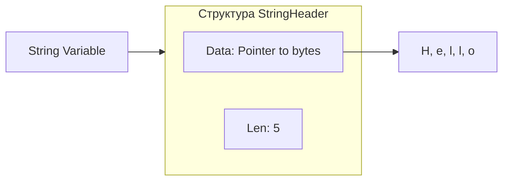

# ⚠️ Пакет unsafe: Прогулка по лезвию бритвы

## 📑 Содержание
1. [Что такое unsafe?](#что-такое-unsafe)
2. [Основные инструменты](#основные-инструменты)
3. [Pointer vs uintptr](#pointer-vs-uintptr)
4. [🔥 Опасный пример: Меняем "неизменяемую" строку](#опасный-пример-меняем-неизменяемую-строку)
5. [Зачем это нужно?](#зачем-его-использовать)

---

## ❓ Что такое unsafe?

**unsafe** — это специальный пакет в Go, который позволяет обходить типобезопасность языка. Обычно Go не дает вам обращаться к памяти напрямую или приводить один тип к другому (например, `int` к `string`), если это небезопасно. 

Пакет `unsafe` говорит компилятору: *"Я знаю, что делаю, не мешай мне работать с сырыми адресами памяти"*. 🛡️⛔

---

## 🛠️ Основные инструменты

В пакете всего несколько функций и один особый тип:

1.  **unsafe.Pointer**: Универсальный указатель. Это "мостик", через который любой указатель (например, `*int`) можно превратить в любой другой (`*string`).
2.  **unsafe.Sizeof**: Возвращает размер типа в байтах.
3.  **unsafe.Offsetof**: Возвращает отступ поля внутри структуры.
4.  **unsafe.Alignof**: Возвращает выравнивание типа.

---

## 🧠 Pointer vs uintptr

Это важно понимать для работы с памятью:

- **unsafe.Pointer**: Это все еще указатель для сборщика мусора (GC). Если GC решит переместить объект в памяти, он обновит этот указатель.
- **uintptr**: Это просто **число** (целое беззнаковое), представляющее адрес памяти. GC его "не видит". Если вы сохраните адрес в `uintptr`, а GC переместит объект — ваше число станет указывать на мусор. 🗑️

> [!CAUTION]
> **Золотое правило**: Превращайте `Pointer` в `uintptr` только для выполнения арифметики (прибавить отступ) и **сразу же** превращайте обратно в `Pointer`. Не храните `uintptr` долго!

---

## 🔥 Опасный пример: Меняем "неизменяемую" строку

В Go строки (`string`) — это read-only структуры. Но через `unsafe` мы можем залезть под капот и изменить данные.



### Как это сделать (практика):

```go
package main

import (
	"fmt"
	"unsafe"
)

func main() {
	s := "Hello"
	fmt.Println("До:", s)

	// 1. Получаем указатель на базовый массив байт строки
	// Мы интерпретируем адрес строки как адрес слайса байт.
	// Внимание: StringHeader и SliceHeader имеют разную длину, 
	// но первые два поля (Data и Len) у них одинаковые.
	b := *(*[]byte)(unsafe.Pointer(&s))

	// 2. Теперь мы можем менять байты в памяти
	// Это сработает только если строка не находится в read-only памяти (например, если она создана динамически)
	// Для литералов это скорее всего вызовет SEGFAULT.
	// b[0] = 'H' // В теории так, но лучше использовать динамические строки для тестов
	
	fmt.Printf("Указатель на данные: %v\n", unsafe.Pointer(&b[0]))
}
```

> [!WARNING]
> Редактирование строк через `unsafe` — это **Undefined Behavior**. В современных версиях Go строковые литералы обычно попадают в область памяти "только для чтения". Попытка изменить их вызовет **panic: runtime error: invalid memory address or nil pointer dereference** или **segmentation fault**.

---

## 🏗️ Как работает кастинг без копирования?

Один из самых частых "легальных" способов использования `unsafe` — конвертация `[]byte` в `string` без выделения новой памяти и копирования:

```go
func BytesToString(b []byte) string {
    return *(*string)(unsafe.Pointer(&b))
}
```
Здесь мы просто говорим Go смотреть на те же самые байты в памяти, но считать их строкой. Это экономит время и память на больших объемах данных.

---

## 🚀 Зачем его использовать?

Если это так опасно, почему пакет существует?

1.  **Высокая производительность**: Например, приведение `[]byte` к `string` без копирования данных. В стандартной библиотеке часто используется для оптимизации.
2.  **Interoperability (cgo)**: Для передачи данных в функции на языке C.
3.  **Системное программирование**: Если вы пишете свой аллокатор памяти или низкоуровневый драйвер.
4.  **Доступ к приватным полям**: Можно высчитать отступ (`Offsetof`) приватного поля структуры из другого пакета и прочитать его. 🕵️‍♂️

---

## 🏁 Резюме

- `unsafe` — это **взлом** правил Go.
- Используйте его только если вы замерили профилировщиком и поняли, что это **единственный** способ ускорить код.
- Помните про **GC**: никогда не делайте арифметику указателей вне одной строки кода с приведением типов.
- Если можно избежать `unsafe` — **избегайте его**. 🚫

---

> [!IMPORTANT]
> Программы, использующие `unsafe`, могут перестать работать при обновлении версии Go, так как внутреннее представление типов (например, структур строк или слайсов) может измениться.
