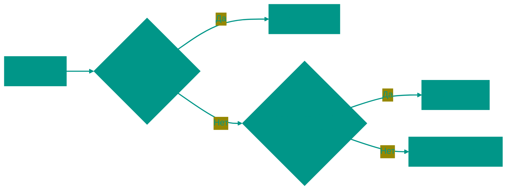

# 🧬 Generics (Дженерики) в Go


## 📑 Содержание
1. [Что такое Generics?](#что-такое-generics)
2. [Базовый синтаксис](#базовый-синтаксис)
3. [Обобщенные функции](#обобщенные-функции)
4. [Обобщенные типы](#обобщенные-типы)
5. [Ограничения (Constraints) и Type Sets](#ограничения-constraints-и-type-sets)
6. [Type Inference (Вывод типов)](#type-inference-вывод-типов)
7. [Generics vs Interfaces](#generics-vs-interfaces)
8. [Внутреннее устройство](#внутреннее-устройство)
9. [Когда НЕ использовать дженерики](#когда-не-использовать-дженерики)

---


## ❓ Что такое Generics?

**Generics** (обобщенное программирование) позволяют писать функции и структуры данных, которые работают с различными типами, сохраняя при этом строгую типизацию.

До Go 1.18 для создания универсального кода приходилось использовать `interface{}` (сейчас `any`), что приводило к необходимости приведения типов (type assertion) и потере производительности.

> [!IMPORTANT]
> Дженерики в Go — это возможность писать функции и типы с **параметрами типа** (type parameters).

---


## 🏗️ Базовый синтаксис

Параметры типа указываются в квадратных скобках `[]` после имени функции или типа.

```go
func Print[T any](s T) {
    fmt.Println(s)
}
```

Здесь:
- `T` — имя параметра типа (можно выбрать любое, обычно `T`, `K`, `V`).
- `any` — ограничение типа (constraint), указывающее, какие типы может принимать `T`.

---


## 🛠️ Обобщенные функции

Рассмотрим классический пример функции `Sum`, которая работает и с `int`, и с `float64`.

```go
func Sum[T int | float64](a, b T) T {
    return a + b
}

func main() {
    fmt.Println(Sum[int](5, 10))       // 15
    fmt.Println(Sum(5.5, 4.5))        // 10 (тип выведен автоматически)
}
```

---


## 📦 Обобщенные типы

Вы можете создавать структуры, интерфейсы и даже мапы с параметрами типа.

```go
type Stack[T any] struct {
    items []T
}

func (s *Stack[T]) Push(item T) {
    s.items = append(s.items, item)
}

func main() {
    intStack := Stack[int]{}
    intStack.Push(1)
    
    stringStack := Stack[string]{}
    stringStack.Push("Go")
}
```

---


## ⚖️ Ограничения (Constraints) и Type Sets

Ограничения определяют набор типов, которые могут заменить параметр типа.


### 1. Встроенные ограничения
- `any`: любой тип (алиас для `interface{}`).
- `comparable`: типы, которые можно сравнивать через `==` и `!=` (числа, строки, указатели, структуры из сравнимых типов).


### 2. Кастомные ограничения
Ограничения — это просто интерфейсы.

```go
type Number interface {
    int | int64 | float64
}

func Multiply[T Number](a, b T) T {
    return a * b
}
```


### 3. Аппроксимация `~`
Если мы хотим, чтобы ограничение принимало не только сам тип, но и его производные (например, `type MyInt int`), используем тильду:

```go
type Signed interface {
    ~int | ~int64
}
```

---


## 🧠 Type Inference (Вывод типов)

Компилятор Go часто сам понимает, какой тип вы используете, поэтому указывать его в скобках `[]` при вызове функции необязательно.

```go
// Можно так:
List[int]{1, 2, 3}

// Но если компилятор видит аргументы, можно и так:
func Process[T any](val T) { ... }
Process(42) // T автоматически станет int
```

---


## 🆚 Generics vs Interfaces

Когда использовать что?



- **Interfaces**: когда важны **методы** и поведение.
- **Generics**: когда важна **структура** данных и эффективность (отсутствие боксинга).

---


## 🛠️ Внутреннее устройство

Go использует гибридный подход для реализации дженериков: **GCShape Stenciling** со словарями.

1.  **Monomorphization** (как в Rust/C++): для каждого уникального типа создается своя копия функции. Быстро, но раздувает бинарный файл.
2.  **Dictionaries**: передается невидимый аргумент со спецификацией типа. Медленнее, но компактнее.

Go выбирает золотую середину: типы с одинаковой "формой" в памяти (например, все указатели) используют один и тот же бинарный код, но с разными словарями.

---


## 🚫 Когда НЕ использовать дженерики

> [!CAUTION]
> Не усложняйте код без необходимости!

1.  Если вы просто вызываете метод у аргумента — используйте интерфейс.
2.  Если реализация одинакова для всех типов и не требует знания о типе — используйте `any` или интерфейсы.
3.  Если вы используете дженерики только в одном месте — возможно, они там не нужны.

**Пример плохого использования:**
```go
// ПЛОХО: Избыточно
func Read[T io.Reader](r T) { ... }

// ХОРОШО: Проще
func Read(r io.Reader) { ... }
```

<!-- QUIZ_START 

[
    {
        "question": "В каких скобках указываются параметры типа (type parameters) в дженериках Go?",
        "options": [
            "В круглых ()",
            "В угловых <>",
            "В квадратных []",
            "В фигурных {}"
        ],
        "correctIndex": 2
    },
    {
        "question": "Какое ограничение (constraint) позволяет использовать в дженерике только типы, поддерживающие операторы == и !=?",
        "options": [
            "any",
            "comparable",
            "ordered",
            "numeric"
        ],
        "correctIndex": 1
    },
    {
        "question": "Что означает символ тильды `~` перед типом в ограничении, например `~int`?",
        "options": [
            "Тип должен быть указателем на int",
            "Ограничение включает сам int и все производные типы (например: type MyInt int)",
            "Тип должен быть срезом элементов int",
            "Это синтаксическая ошибка"
        ],
        "correctIndex": 1
    }
]

QUIZ_END -->

