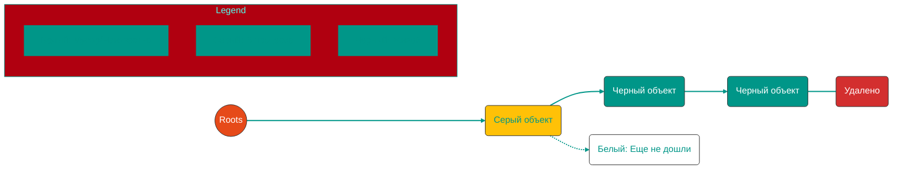

# 🗑️ Garbage Collector в Go


## 🛠️ Принципы работы, конкурентность и управление ресурсами

---


## 0. 🏁 Введение

В Go управление памятью в куче (Heap) автоматизировано. **Garbage Collector (GC)** берет на себя задачу поиска и освобождения объектов, которые больше не используются программой. Это защищает от утечек памяти и ошибок ручного управления (как в C++).

Главная цель GC в Go — **низкая задержка (low latency)**. Go жертвует абсолютной скоростью сборки ради того, чтобы паузы в работе программы (**Stop-The-World** или **STW**) были практически незаметны.

---


## 0.1. 🌍 Сравнение подходов к памяти

Управление памятью — это всегда компромисс между удобством разработки и производительностью.

| Язык | Механизм | Плюсы | Минусы |
| :--- | :--- | :--- | :--- |
| **C / C++** | **Ручное** (`malloc`/`free`) | Максимальный контроль, нет пауз. | Высокий риск утечек, сегфолтов и ошибок "use-after-free". |
| **Java / Go** | **Garbage Collector** | Безопасность, простота разработки. | Накладные расходы на CPU, паузы в работе (STW). |
| **Rust** | **Ownership & Borrowing** | Безопасность + Скорость (без GC). | Высокий порог вхождения ("борьба" с borrow checker). |


### 🛠️ Подходы подробнее:
1. **C/C++ (Manual)**: Разработчик сам решает, когда выделить память и когда её вернуть ОС. Если забыть `free()`, память "утечет". Если вызвать деструктор дважды — программа упадет.
2. **Go (Mark & Sweep)**: Среда исполнения (Runtime) сама отслеживает живые объекты и чистит мусор в фоне. Разработчик вообще не думает об освобождении памяти.
3. **Rust (Ownership - "Третья механика")**: Память освобождается автоматически в момент выхода переменной из области видимости (RAII). Компилятор на этапе сборки проверяет правила владения, гарантируя отсутствие утечек и гонок данных без использования GC.

---


## 1. 🎨 Трехцветный алгоритм (Tri-color Mark & Sweep)

Для того чтобы понимать, какие объекты "живы", а какие — "мусор", Go использует систему трех цветов.


### 1.1 Цвета объектов
- **Белый (White)**: Кандидат на удаление. GC еще не проверял этот объект.
- **Серый (Grey)**: Объект "живой", но мы еще не проверили объекты, на которые он ссылается (его детей).
- **Черный (Black)**: Объект точно "живой", и все его ссылки уже проверены.


### 1.2 Процесс раскраски
1. В начале все объекты **белые**.
2. GC берет "корни" (**Roots**: стеки, глобальные переменные) и помечает объекты, на которые они указывают, **серыми**.
> [!NOTE]
> **Roots (Корни)** — это точка отсчета для сборщика мусора. Сюда входят глобальные переменные и все переменные на стеках активных горутин. Если объект нельзя "достичь", пройдя по ссылкам от корней, значит он — мусор.
3. GC берет серый объект, переводит его в **черный**, а все его ссылки делает **серыми**.
4. Повторяем, пока серых объектов не останется.
5. Все, кто остался **белым** — мусор.



---


## 2. ⚡ Конкурентность и правило 25% CPU

Go использует **Concurrent GC**. Это значит, что сборка мусора идет параллельно с выполнением вашего кода.


### 2.1 Использование процессора
Чтобы GC не "съел" все ресурсы системы, в Go действует жесткое правило:
**На Garbage Collector выделяется ровно 25% ресурсов процессора (1/4 от GOMAXPROCS).**

Как это работает:
- Если у вас 4 логических процессора (`GOMAXPROCS=4`), Go выделит **ровно один** поток (P) чисто под нужды фонового GC-воркера.
- Остальные 75% времени процессоры заняты вашей программой.


### 2.2 Вспомогательная аллокация (Assist)
Если программа выделяет память быстрее, чем GC успевает ее чистить (25% ресурсов не хватает), Go заставляет горутины-"нарушители" помогать сборщику. Это называется **Mark Assist**. Программа немного замедляется, но память не раздувается бесконтрольно.

---


## 3. ⏳ Фазы работы GC (Жизненный цикл)

Сборка мусора проходит через несколько стадий:

1.  **Sweep Termination (STW)**: Очень короткая остановка всех горутин. Подготовка к новому циклу. **Включается Write Barrier**.
2.  **Marking Phase (Concurrent)**: Основная работа. GC красит объекты, используя те самые 25% CPU. Программа продолжает работать с активным **Write Barrier**.
3.  **Mark Termination (STW)**: Вторая короткая остановка. Завершаем покраску. **Выключается Write Barrier**.
4.  **Off/Sweeping (Concurrent)**: Освобождаем память (белые объекты) и возвращаем ее в аллокатор.

> [!NOTE]
> Суммарное время пауз STW (Stop-The-World) в современных версиях Go обычно составляет менее **100 микросекунд**. Это в тысячи раз быстрее, чем моргнуть глазом.

---


## 4. 🧱 Write Barrier (Барьер записи)

Так как GC работает **параллельно** с вашей программой (mutator), состояние объектов может измениться прямо во время их сканирования. Это создает риск удаления "живых" данных.


### 4.1. Проблема: "Потерянный объект"

Представьте ситуацию без барьера записи:
1. **GC**: Сканирует объект `A`. Помечает его **черным** (обработан).
2. **Программа**: У объекта `B` (который еще **серый**) есть ссылка на объект `C` (пока **белый**).
3. **Программа**: Выполняет две операции:
   - Копирует ссылку на `C` в черный объект `A`.
   - Удаляет ссылку на `C` из серого объекта `B`.
4. **Результат**: Теперь единственный путь к `C` ведет из черного объекта `A`. Но GC больше не будет сканировать `A`, так как он уже черный. Объект `C` останется белым и будет ошибочно удален.


### 4.2. Решение: Dijkstra Write Barrier

В Go используется вариант **Dijkstra Write Barrier**. Его логика проста:
> "При любой попытке сохранить указатель на белый объект в черный или серый объект, этот белый объект немедленно принудительно закрашивается в серый."

**Псевдокод работы барьера:**
```go
// Выполняется при каждой операции: pointer = new_ptr
func writeBarrier(pointer *Object, new_ptr *Object) {
    if gcPhase == Marking {
        shade(new_ptr) // Делает объект серым, если он был белым
    }
    *pointer = new_ptr
}
```


### 4.3. Когда он работает?
- **Включается**: На фазе `Sweep Termination`.
- **Активен**: Всю фазу `Marking Phase`.
- **Выключается**: На фазе `Mark Termination`.

> [!TIP]
> Благодаря Write Barrier, Go может позволить программе работать одновременно со сборщиком мусора, не боясь, что программа "спрячет" живой объект в уже проверенную область памяти.

---


## 5. ⚙️ Управление GC: GOGC и GOMEMLIMIT


### 5.1 GOGC (Коэффициент роста)
По умолчанию `GOGC=100`. Это значит: запустить GC, когда размер новой кучи достигнет 100% от размера живых данных после прошлой сборки.
- `GOGC=50`: сборка в 2 раза чаще, меньше памяти.
- `GOGC=off`: сборка только по лимиту памяти.


### 5.2 GOMEMLIMIT (Лимит памяти)
Добавлен в Go 1.19. Позволяет задать жесткий порог (например, 2GB). Если память подходит к пределу, GC начнет работать агрессивнее, игнорируя настройки GOGC, чтобы избежать падения по OOM (Out Of Memory).

---


## 6. Итог

| Характеристика | Описание |
| :--- | :--- |
| **Алгоритм** | Трехцветный Mark & Sweep (маркировка и очистка). |
| **Режим** | Конкурентный (работает параллельно с программой). |
| **CPU Limit** | 25% от доступных процессоров (1/4 GOMAXPROCS). |
| **Паузы (STW)** | Минимальные, обычно < 100 µs. |
| **Защита** | Write Barrier предотвращает потерю живых данных во время мутации. |

---


## 💡 Главная мысль

Garbage Collector в Go — это баланс между экономией памяти и отзывчивостью системы. Он не самый эффективный в плане использования ресурсов, но он гарантирует, что ваше приложение будет работать плавно, без длинных "замираний", типичных для старых версий Java или Python.

<!-- QUIZ_START 

[
    {
        "question": "Какой алгоритм сборки мусора лежит в основе Go?",
        "options": [
            "Reference Counting (подсчет ссылок)",
            "Tri-color Mark & Sweep (трехцветная маркировка и очистка)",
            "Generational GC (поколенческая сборка)",
            "Copying GC"
        ],
        "correctIndex": 1
    },
    {
        "question": "Что означает 'черный' цвет объекта в трехцветном алгоритме Go?",
        "options": [
            "Объект — это мусор, его можно удалять",
            "Объект точно живой, и все его внутренние ссылки уже проверены",
            "Объект живой, но его ссылки еще не проверялись",
            "Объект является корнем (root)"
        ],
        "correctIndex": 1
    },
    {
        "question": "Сколько ресурсов процессора Go по умолчанию выделяет на работу фонового сборщика мусора?",
        "options": [
            "100% (STW)",
            "50%",
            "25% (1/4 от GOMAXPROCS)",
            "1%"
        ],
        "correctIndex": 2
    }
]

QUIZ_END -->