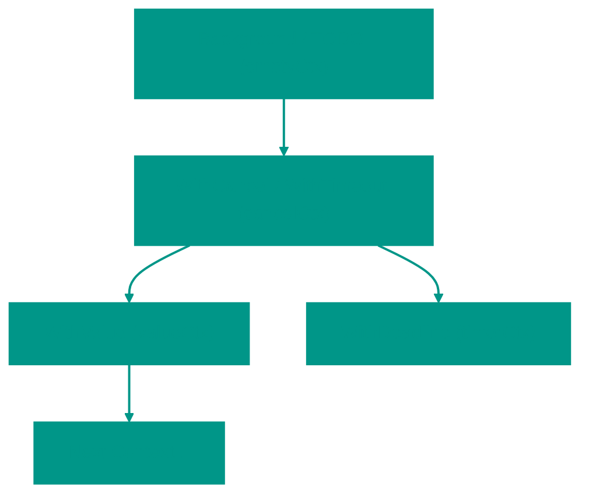
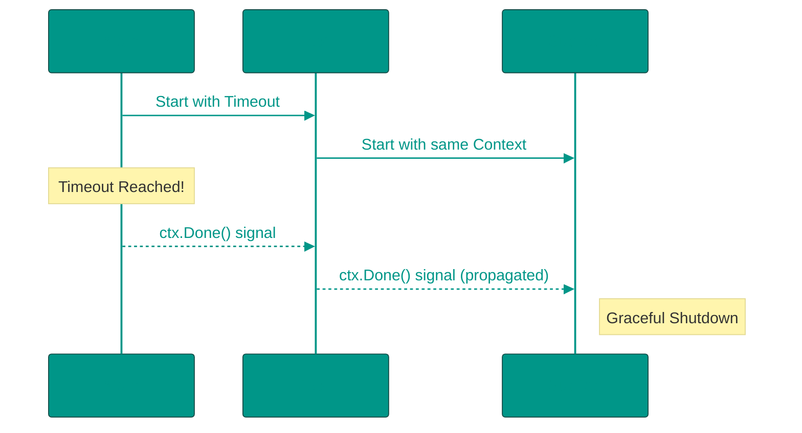

# 🧠 Что такое Context в Go?

**Контекст (context)** — это стандартный механизм в Go для передачи сигналов отмены, дедлайнов и параметров (ключ-значение) через дерево вызовов горутин. 

Основная задача контекста — управление жизненным циклом операций. Это позволяет избежать утечек горутин и лишней работы, если клиент уже отключился или операция заняла слишком много времени.

---


### 🪆 Принцип "Матрешки" (Иерархия)

Контекст в Go строится по принципу иерархического дерева. Вы всегда начинаете с "корневого" контекста и создаете дочерние, добавляя им новые свойства.



> [!IMPORTANT]
> **Контекст неизменяем (Immutable)**. Каждая функция `With...` возвращает **копию** родительского контекста с новыми возможностями. Родитель ничего не знает о своих потомках, но потомки знают о родителе.

---


### 🛠️ Основные способы создания контекста

Всегда начинайте с одного из этих двух методов:
1. `context.Background()` — используется в `main()`, тестах или в начале обработки входящего запроса.
2. `context.TODO()` — если вы еще не решили, какой контекст использовать, или планируете добавить его позже.

---


### 🔌 Управление жизненным циклом (Cancellation)


#### 1. `context.WithCancel(parent)`
Создает контекст, который можно отменить вручную. Возвращает сам контекст и функцию `cancel()`.

```go
ctx, cancel := context.WithCancel(context.Background())
defer cancel() // Всегда вызывайте cancel, чтобы освободить ресурсы!

go func() {
    // Делаем работу...
    if errorOccurred {
        cancel() // Сигнализируем об отмене
    }
}()

<-ctx.Done() // Ждем сигнала отмены
```


#### 2. `context.WithCancelCause(parent)` (Go 1.20+)
Похож на `WithCancel`, но позволяет передать **причину** отмены (ошибку). Эту причину можно получить через `context.Cause(ctx)`.

```go
ctx, cancel := context.WithCancelCause(parent)
cancel(fmt.Errorf("база данных недоступна"))

// В другом месте:
err := context.Cause(ctx) // Вернет "база данных недоступна"
```


#### 3. `context.WithTimeout(parent, duration)`
Автоматически отменяет контекст по истечении времени. Идеально для сетевых запросов.

```go
ctx, cancel := context.WithTimeout(context.Background(), 2*time.Second)
defer cancel()

req, _ := http.NewRequestWithContext(ctx, "GET", "https://api.example.com", nil)
```


#### 4. `context.WithDeadline(parent, time)`
Аналогичен `WithTimeout`, но принимает конкретный момент времени (`time.Time`), а не длительность.

---


### 📦 Передача данных: `context.WithValue()`

Позволяет прокидывать метаданные (ID запроса, токен пользователя) через слои приложения.

**Правила использования:**
- Используйте **пользовательские типы** для ключей, чтобы избежать конфликтов между разными библиотеками.
- Не передавайте через контекст необязательные параметры функции — это ухудшает читаемость кода.

```go
type key string
const requestIDKey key = "requestId"

ctx := context.WithValue(context.Background(), requestIDKey, "abc-123")

// Получение:
val := ctx.Value(requestIDKey).(string)
```

---


### ⏳ Новинки Go 1.21: `context.AfterFunc`

Позволяет зарегистрировать функцию, которая выполнится **сразу после** того, как контекст будет отменен (или выйдет таймаут).

```go
stop := context.AfterFunc(ctx, func() {
    fmt.Println("Контекст отменен, подчищаем ресурсы...")
})
// stop() можно вызвать, чтобы отменить выполнение AfterFunc, если она еще не запустилась
```

---


### 🚫 Распространение отмены (Cancellation Propagation)

Это критически важный момент. Сигнал об отмене всегда распространяется **сверху вниз**.

- Если вы отменяете родителя — **все** дети отменяются автоматически.
- Если вы отменяете ребенка — родитель продолжает работать.



---


### 🔍 Внутреннее устройство: Как работает поиск Value?

Поиск значения в контексте идет **снизу вверх** (рекурсивно к родителям). Если ключ не найден у текущего контекста, он спрашивает своего родителя, тот своего — и так до корня (`Background`).

Сложность поиска — **O(N)**, где N — глубина дерева. Поэтому не стоит создавать слишком глубокие деревья контекстов.

---


### 💡 Золотые правила работы с Context

1. **Первый аргумент**: `ctx` всегда идет первым аргументом: `func Save(ctx context.Context, data Data)`.
2. **Не храни в структурах**: Контекст должен передаваться явно. Исключение — встроенные типы вроде `http.Request`.
3. **Всегда вызывай cancel**: Даже если контекст отменится по таймауту, вызов `cancel()` освободит внутренние ресурсы таймера быстрее.
4. **Context.Background()** — это корень. Не используйте его внутри бизнес-логики, передавайте `ctx` от вызывающей стороны.

---


### 📋 Сводная таблица функций

| Функция | Когда использовать | Особенности |
| :--- | :--- | :--- |
| `WithCancel` | Ручная остановка работы | Возвращает `cancel()` |
| `WithCancelCause` | Нужно знать *почему* отменили | Go 1.20+, `context.Cause(ctx)` |
| `WithTimeout` | Ограничение времени (2 сек) | Внутри использует `WithDeadline` |
| `WithDeadline` | Ограничение до (15:00) | Для жестких временных рамок |
| `WithValue` | Метаданные (Trace ID) | O(N) поиск, риск конфликтов |
| `AfterFunc` | Коллбэк на отмену | Go 1.21+, удобно для Cleanup |

<!-- QUIZ_START 

[
    {
        "question": "Какая функция была добавлена в Go 1.21 для выполнения действий после отмены контекста?",
        "options": [
            "WithCancelCause",
            "AfterFunc",
            "OnCancel",
            "RegisterCallback"
        ],
        "correctIndex": 1
    },
    {
        "question": "Что произойдет с дочерними контекстами, если родительский контекст будет отменен?",
        "options": [
            "Они продолжат работать",
            "Они будут отменены автоматически",
            "Они перейдут в статус ожидания",
            "Их поведение зависит от настроек операционной системы"
        ],
        "correctIndex": 1
    },
    {
        "question": "В каком направлении происходит поиск значения через ctx.Value(key)?",
        "options": [
            "От родителя к детям (сверху вниз)",
            "От текущего контекста к корню (снизу вверх)",
            "Горизонтально по всем активным контекстам",
            "Значение ищется только в глобальном кэше"
        ],
        "correctIndex": 1
    }
]

QUIZ_END -->
