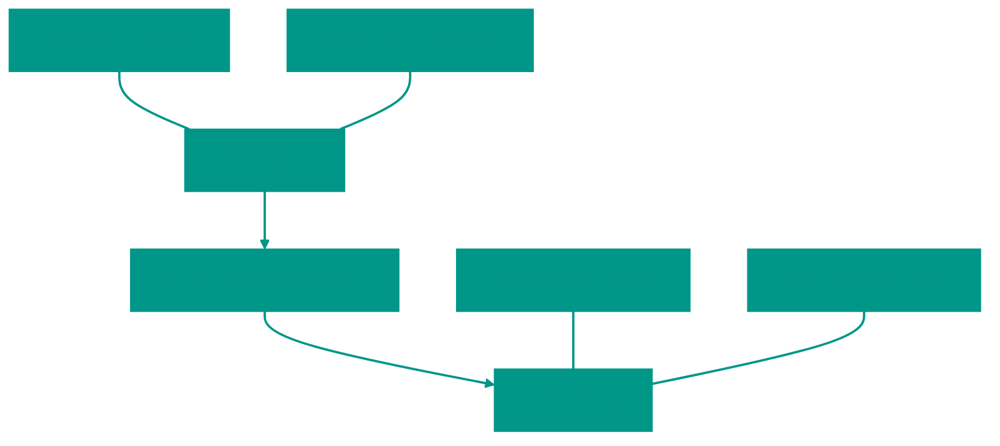

# 🗼 Пирамида тестирования (Testing Pyramid)

Пирамида тестирования — это концептуальная модель, которая помогает сбалансировать количество тестов разных уровней для создания эффективной стратегии тестирования.

# 1. 📐 Концепция пирамиды

Основная идея заключается в том, что тестов, которые выполняются быстрее и стоят дешевле, должно быть больше, чем медленных и дорогих.

### Уровни пирамиды:

1.  **Unit-тесты (Основание)**:
    *   **Количество**: Большинство ваших тестов (70-80%).
    *   **Что проверяют**: Отдельные функции, методы, небольшие блоки логики.
    *   **Плюсы**: Очень быстрые, легко найти причину ошибки, запускаются локально при каждом сохранении.
2.  **Интеграционные тесты (Середина)**:
    *   **Количество**: Среднее (15-20%).
    *   **Что проверяют**: Взаимодействие между модулями или компонентами (например, API + БД).
    *   **Плюсы**: Находят ошибки в связях, которые unit-тесты не видят.
3.  **E2E (End-to-End) тесты (Вершина)**:
    *   **Количество**: Минимум (5-10%).
    *   **Что проверяют**: Путь пользователя через все приложение целиком.
    *   **Плюсы**: Дают максимальную уверенность в работоспособности системы.

# 2. ⚖️ Баланс и компромиссы

При выборе типа теста всегда учитывайте три фактора:

| Характеристика | Unit | Интеграционные | E2E |
| :--- | :--- | :--- | :--- |
| **Скорость** | Миллисекунды | Секунды | Минуты |
| **Стоимость** | Дешево | Дороже | Очень дорого |
| **Изоляция багов** | Высокая (сразу видно где ошибка) | Средняя | Низкая (сложно отладить) |
| **Надежность (Confidence)** | Низкая (проверяет только деталь) | Средняя | Высокая (проверяет всё) |

### Почему не писать только E2E тесты?

Хотя E2E тесты дают больше всего уверенности, у них есть серьезные недостатки:
1.  **Нестабильность (Flakiness)**: Зависят от сети, состояния БД и других внешних факторов. Часто падают без реальных багов в коде.
2.  **Медленная обратная связь**: Если тесты идут час, разработчики не будут запускать их часто.
3.  **Сложность поддержки**: Любое изменение в UI или инфраструктуре ломает множество тестов.

> [!IMPORTANT]
> Цель пирамиды — не строгое соблюдение процентов, а создание надежной системы, где баги обнаруживаются как можно раньше. Начинайте с Unit-тестов и добавляйте более высокие уровни только там, где это действительно необходимо.

<!-- QUIZ_START 

[
    {
        "question": "Какой уровень пирамиды тестирования должен быть самым массовым (составлять основание)?",
        "options": [
            "E2E-тесты",
            "Интеграционные тесты",
            "Unit-тесты",
            "Ручное тестирование"
        ],
        "correctIndex": 2
    },
    {
        "question": "Какое главное преимущество Unit-тестов перед E2E-тестами?",
        "options": [
            "Они проверяют базу данных",
            "Они очень быстрые и их дешево поддерживать",
            "Они гарантируют работу всего приложения целиком",
            "Они имитируют действия реального пользователя"
        ],
        "correctIndex": 1
    },
    {
        "question": "Что такое 'Flakiness' (нестабильность) в контексте тестирования?",
        "options": [
            "Слишком высокая скорость выполнения тестов",
            "Ситуация, когда тесты падают без изменений в коде из-за внешних факторов (сеть, тайминги)",
            "Ошибка компиляции",
            "Отсутствие документации к тестам"
        ],
        "correctIndex": 1
    }
]

QUIZ_END -->

