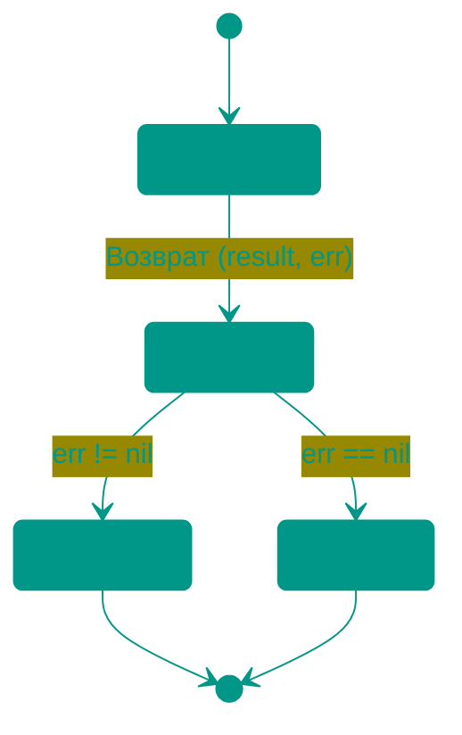
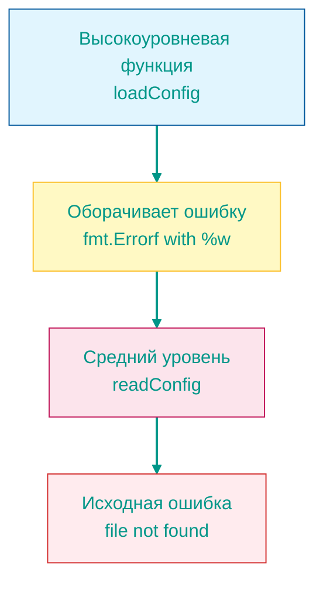
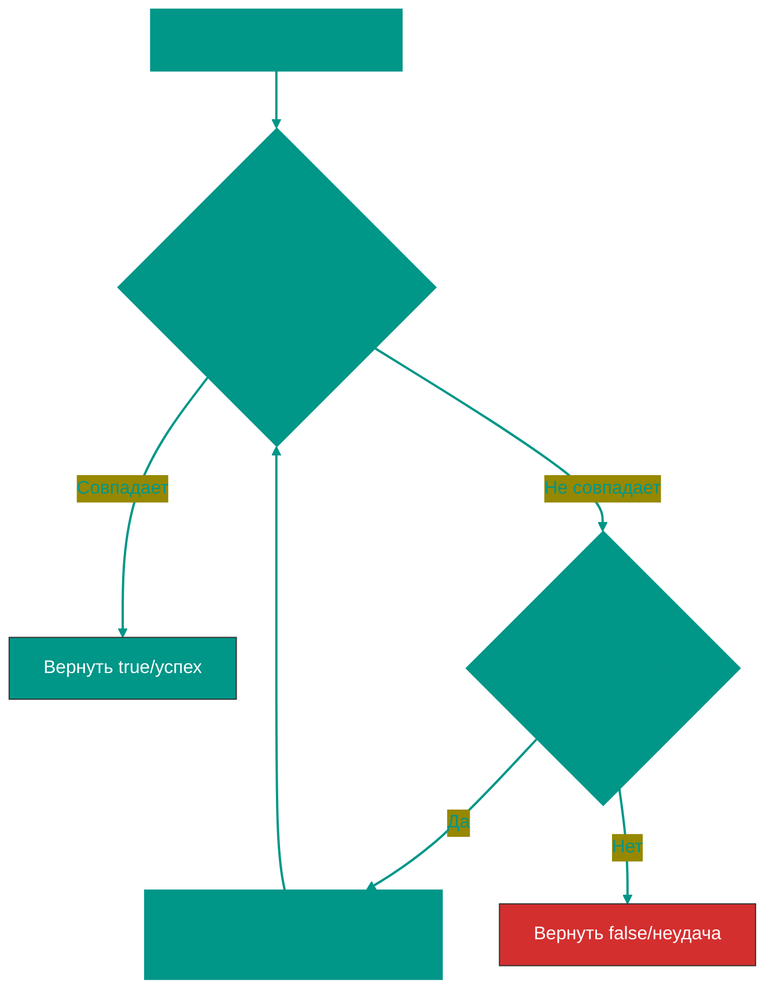

# 🚨 Ошибки в Go (Error Handling)


## 📖 Содержание
1. [Что такое ошибки в Go](#что-такое-ошибки-в-go)
2. [Интерфейс error](#интерфейс-error)
3. [Проверка ошибок](#проверка-ошибок)
4. [Почему второй возвращаемый параметр](#почему-второй-возвращаемый-параметр)
5. [Обработка ошибок vs throw/catch](#обработка-ошибок-vs-throwcatch)
6. [Создание собственных ошибок](#создание-собственных-ошибок)
7. [Оборачивание ошибок (wrapping)](#оборачивание-ошибок-wrapping)
8. [errors.Is() и errors.As()](#errorsis-и-errorsas)
9. [Лучшие практики](#лучшие-практики)

---


## Что такое ошибки в Go

В Go **ошибки — это значения**, а не исключения. Это фундаментальное отличие от многих других языков программирования.


### 🔑 Ключевые особенности:
- ❌ **Нет исключений** (exceptions) как в Java, Python, JavaScript
- ✅ **Ошибки возвращаются как обычные значения**
- ✅ **Явная обработка** — вы видите, где может произойти ошибка
- ✅ **Простота** — нет скрытого потока управления


---


## Интерфейс error

В Go `error` — это встроенный **интерфейс**:

```go
type error interface {
    Error() string
}
```


### 💡 Это означает:
- Любой тип, имеющий метод `Error() string`, реализует интерфейс `error`
- Можно создавать собственные типы ошибок
- `nil` означает отсутствие ошибки

---


## Проверка ошибок


### ✅ Правильный подход

```go
package main

import (
    "fmt"
    "os"
)

func main() {
    // Открытие файла
    file, err := os.Open("config.txt")
    if err != nil {
        // Ошибка произошла - обработать её
        fmt.Println("Ошибка:", err)
        return
    }
    defer file.Close()
    
    // Файл успешно открыт - работаем с ним
    fmt.Println("Файл открыт успешно")
}
```


### ❌ Игнорирование ошибок (плохая практика)

```go
package main

import "os"

func main() {
    // ПЛОХО: игнорируем ошибку с помощью _
    file, _ := os.Open("config.txt")
    // Если файл не открылся, file == nil → паника при использовании!
    defer file.Close() // PANIC!
}
```

---


## Почему второй возвращаемый параметр


### 🎯 Причины такого подхода:

1. **Явность**: Сразу видно, что функция может вернуть ошибку
2. **Невозможно игнорировать**: Компилятор предупредит о неиспользованных значениях
3. **Простота чтения**: Линейный поток кода, без прыжков


### Сравнение подходов

```go
// ✅ GO: Ошибка как значение
result, err := DoSomething()
if err != nil {
    // Обработка ошибки
    return err
}
// Используем result

// ❌ Другие языки: Исключения (псевдокод)
/*
try {
    result = DoSomething()
    // Используем result
} catch (error) {
    // Обработка ошибки
}
*/
```


### 📊 Визуализация потока



---


## Обработка ошибок vs throw/catch


### ⚠️ Go НЕ использует исключения!

| Язык | Подход | Поток управления |
|------|--------|------------------|
| **Go** | Ошибки как значения | Явный, линейный |
| **Java/Python/JS** | try/catch/throw | Неявный, с прыжками |


### Примеры

```go
package main

import (
    "errors"
    "fmt"
)

// Go подход: явная обработка ошибок
func divide(a, b float64) (float64, error) {
    if b == 0 {
        // Возвращаем ошибку как значение
        return 0, errors.New("деление на ноль")
    }
    return a / b, nil
}

func main() {
    result, err := divide(10, 0)
    if err != nil {
        fmt.Println("Ошибка:", err)
        return
    }
    fmt.Println("Результат:", result)
}

/* 
В других языках (псевдокод):
In other languages (pseudocode):

function divide(a, b) {
    if (b === 0) {
        throw new Error("деление на ноль") // Выброс исключения
    }
    return a / b
}

try {
    result = divide(10, 0)
    console.log("Результат:", result)
} catch (error) {
    console.log("Ошибка:", error)
}
*/
```

---


## Создание собственных ошибок


### 1️⃣ Простые ошибки: `errors.New()`

```go
package main

import (
    "errors"
    "fmt"
)

func validateAge(age int) error {
    if age < 0 {
        // Создание простой ошибки
        return errors.New("возраст не может быть отрицательным")
    }
    if age > 150 {
        return errors.New("возраст слишком большой")
    }
    return nil
}

func main() {
    err := validateAge(-5)
    if err != nil {
        fmt.Println(err) // возраст не может быть отрицательным
    }
}
```


### 2️⃣ Форматированные ошибки: `fmt.Errorf()`

```go
package main

import (
    "fmt"
)

func processUser(userID int) error {
    if userID < 0 {
        // Форматированная ошибка с подстановкой значений
        return fmt.Errorf("неверный ID пользователя: %d", userID)
    }
    return nil
}

func main() {
    err := processUser(-42)
    if err != nil {
        fmt.Println(err) // неверный ID пользователя: -42
    }
}
```


### 3️⃣ Собственные типы ошибок

```go
package main

import (
    "fmt"
)

// Определяем собственный тип ошибки
type ValidationError struct {
    Field   string
    Value   interface{}
    Message string
}

// Реализуем интерфейс error
func (e *ValidationError) Error() string {
    return fmt.Sprintf("validation failed for %s (value: %v): %s", 
        e.Field, e.Value, e.Message)
}

func validateUsername(username string) error {
    if len(username) < 3 {
        return &ValidationError{
            Field:   "username",
            Value:   username,
            Message: "must be at least 3 characters",
        }
    }
    return nil
}

func main() {
    err := validateUsername("ab")
    if err != nil {
        fmt.Println(err)
        // Output: validation failed for username (value: ab): must be at least 3 characters
    }
}
```

---


## Оборачивание ошибок (wrapping)

Оборачивание ошибок позволяет добавлять контекст, сохраняя оригинальную ошибку.


### 📦 Использование `%w`

```go
package main

import (
    "errors"
    "fmt"
)

func readConfig() error {
    // Представим, что это низкоуровневая ошибка
    return errors.New("file not found")
}

func loadConfig() error {
    err := readConfig()
    if err != nil {
        // Оборачиваем ошибку, добавляя контекст
        return fmt.Errorf("failed to load config: %w", err)
    }
    return nil
}

func main() {
    err := loadConfig()
    if err != nil {
        fmt.Println(err)
        // Output: failed to load config: file not found
    }
}
```


### 🔗 Цепочка ошибок



---


## errors.Is() и errors.As()


### 🔍 `errors.Is()` - Проверка типа ошибки

Рекурсивно проверяет, является ли ошибка (или любая обёрнутая ошибка в цепочке) определённым типом.

```go
package main

import (
    "errors"
    "fmt"
    "os"
)

var ErrNotFound = errors.New("resource not found")

func findUser(id int) error {
    // Оборачиваем предопределённую ошибку
    return fmt.Errorf("user %d: %w", id, ErrNotFound)
}

func main() {
    err := findUser(123)
    
    // errors.Is рекурсивно ищет ErrNotFound в цепочке
    if errors.Is(err, ErrNotFound) {
        fmt.Println("Пользователь не найден!")
        // Output: Пользователь не найден!
    }
    
    // Также работает с системными ошибками
    _, err = os.Open("missing.txt")
    if errors.Is(err, os.ErrNotExist) {
        fmt.Println("Файл не существует")
    }
}
```


### 🎯 `errors.As()` - Извлечение конкретного типа

Рекурсивно ищет ошибку определённого типа и присваивает её значение.

```go
package main

import (
    "errors"
    "fmt"
)

type DatabaseError struct {
    Code    int
    Message string
}

func (e *DatabaseError) Error() string {
    return fmt.Sprintf("DB Error [%d]: %s", e.Code, e.Message)
}

func queryDatabase() error {
    dbErr := &DatabaseError{Code: 500, Message: "connection timeout"}
    // Оборачиваем кастомную ошибку
    return fmt.Errorf("query failed: %w", dbErr)
}

func main() {
    err := queryDatabase()
    
    var dbErr *DatabaseError
    
    // errors.As находит DatabaseError в цепочке и присваивает dbErr
    if errors.As(err, &dbErr) {
        fmt.Printf("Database error code: %d\n", dbErr.Code)
        fmt.Printf("Message: %s\n", dbErr.Message)
        // Output:
        // Database error code: 500
        // Message: connection timeout
    }
}
```


### 🔄 Как работает рекурсивная проверка




### Пример рекурсивной цепочки

```go
package main

import (
    "errors"
    "fmt"
)

var ErrPermissionDenied = errors.New("permission denied")

func level1() error {
    return ErrPermissionDenied
}

func level2() error {
    err := level1()
    return fmt.Errorf("level2 failed: %w", err)
}

func level3() error {
    err := level2()
    return fmt.Errorf("level3 failed: %w", err)
}

func main() {
    err := level3()
    
    // Несмотря на 3 уровня оборачивания, errors.Is находит ошибку!
    if errors.Is(err, ErrPermissionDenied) {
        fmt.Println("✅ Найдена ошибка в глубине цепочки!")
        fmt.Println("Полное сообщение:", err)
        // Output: level3 failed: level2 failed: permission denied
    }
}
```

---


## Лучшие практики


### ✅ DO: Делайте так

1. **Всегда проверяйте ошибки**
```go
result, err := someFunc()
if err != nil {
    // Обработать
    return err
}
```

2. **Добавляйте контекст при оборачивании**
```go
if err != nil {
    return fmt.Errorf("failed to process user %d: %w", userID, err)
}
```

3. **Используйте предопределённые ошибки для сравнения**
```go
var ErrNotFound = errors.New("not found")

// В коде:
if errors.Is(err, ErrNotFound) {
    // Специфичная обработка
}
```

4. **Создавайте кастомные типы для сложных ошибок**
```go
type APIError struct {
    StatusCode int
    Message    string
}

func (e *APIError) Error() string {
    return fmt.Sprintf("API error %d: %s", e.StatusCode, e.Message)
}
```


### ❌ DON'T: Не делайте так

1. **Не игнорируйте ошибки**
```go
// ПЛОХО
result, _ := someFunc()
```

2. **Не паникуйте из-за обычных ошибок**
```go
// ПЛОХО
if err != nil {
    panic(err)
}
```

3. **Не теряйте оригинальную ошибку**
```go
// ПЛОХО: используйте %w вместо %v
return fmt.Errorf("operation failed: %v", err)
```

---


## 📚 Резюме

| Понятие | Описание |
|---------|----------|
| `error` | Интерфейс с методом `Error() string` |
| `errors.New()` | Создание простой ошибки |
| `fmt.Errorf()` | Создание форматированной ошибки |
| `%w` | Оборачивание ошибки (сохраняет оригинал) |
| `errors.Is()` | Рекурсивная проверка типа ошибки |
| `errors.As()` | Рекурсивное извлечение конкретного типа |
| Второй аргумент | Соглашение: `(result, error)` |

> [!IMPORTANT]
> В Go ошибки — это **значения**, а не исключения. Проверяйте их явно после каждого вызова функции!

> [!TIP]
> Используйте `%w` при оборачивании ошибок, чтобы сохранить возможность использования `errors.Is()` и `errors.As()`

<!-- QUIZ_START 

[
    {
        "question": "Что представляет собой ошибка (error) в языке Go?",
        "options": [
            "Специальное исключение, которое прерывает программу",
            "Интерфейс с единственным методом Error() string",
            "Критический сигнал операционной системы",
            "Тип данных, который нельзя изменять"
        ],
        "correctIndex": 1
    },
    {
        "question": "Какое ключевое отличие обработки ошибок в Go от Java или Python?",
        "options": [
            "В Go нет ошибок",
            "В Go ошибки — это обычные значения, которые возвращаются функциями и обрабатываются явно",
            "Go автоматически исправляет ошибки",
            "В Go используются только глобальные обработчики ошибок"
        ],
        "correctIndex": 1
    },
    {
        "question": "Зачем при оборачивании ошибки (wrapping) через fmt.Errorf использовать спецификатор %w вместо %v?",
        "options": [
            "Для ускорения вычислений",
            "Чтобы сохранить оригинальную ошибку в цепочке и иметь возможность проверить её через errors.Is() или errors.As()",
            "Чтобы сделать текст ошибки короче",
            "Это обязательное требование компилятора"
        ],
        "correctIndex": 1
    }
]

QUIZ_END -->

