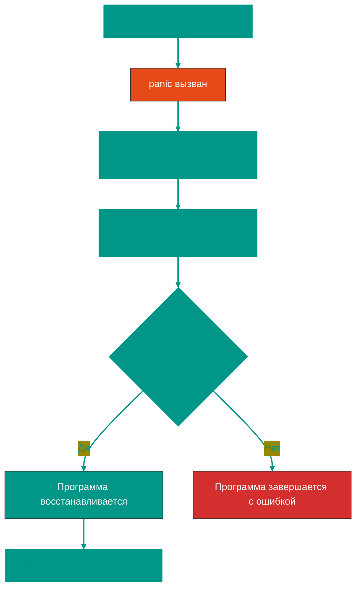
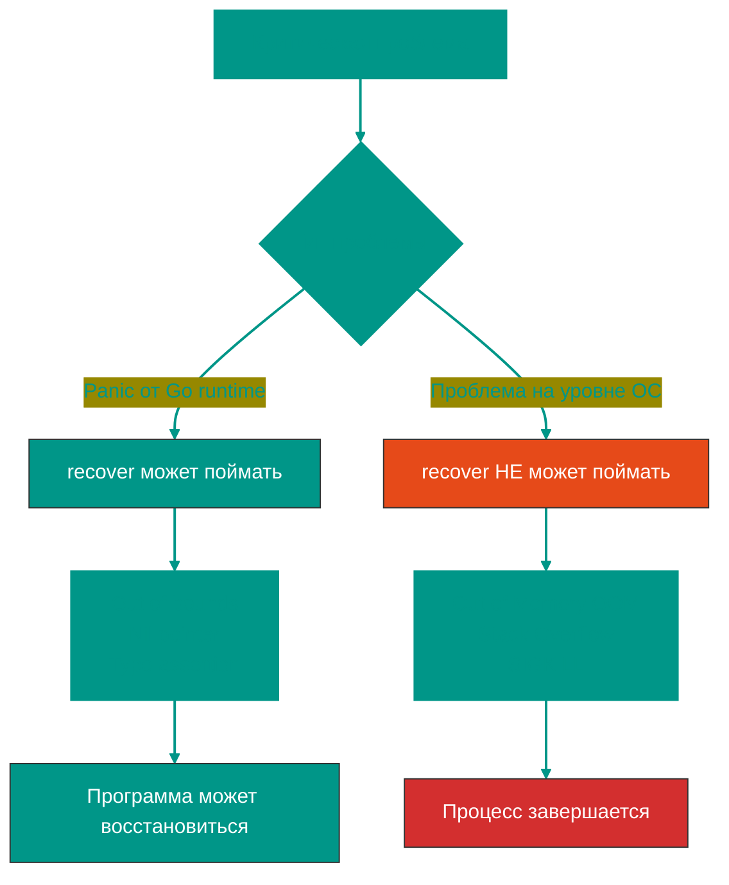

# ⚠️ Panic и Recover в Go


## 📖 Содержание
1. [Что такое panic](#что-такое-panic)
2. [Что такое recover](#что-такое-recover)
3. [Когда использовать panic](#когда-использовать-panic)
4. [Как работает recover](#как-работает-recover)
5. [Что можно и нельзя поймать](#что-можно-и-нельзя-поймать)
6. [Примеры использования](#примеры-использования)
7. [Лучшие практики](#лучшие-практики)

---


## Что такое panic

`panic` — это встроенная функция, которая **останавливает нормальное выполнение** программы.


### 🔥 Когда происходит panic:

1. **Явный вызов** `panic()`
2. **Автоматически** при критических ошибках:
   - Деление на ноль
   - Выход за границы массива/слайса
   - Запись в закрытый канал
   - Разыменование nil указателя
   - Type assertion на неправильный тип

```go
package main

import "fmt"

func main() {
    // Явный panic
    panic("Что-то пошло не так!")
    
    // Эта строка никогда не выполнится
    fmt.Println("Эта строка не напечатается")
}
// panic: Что-то пошло не так!
```


### 📊 Поток выполнения при panic



---


## Что такое recover

`recover` — это встроенная функция для **перехвата panic** и восстановления нормального выполнения.


### 🛡️ Ключевые правила:

1. ✅ `recover()` **работает только внутри `defer`**
2. ✅ Возвращает значение, переданное в `panic()`, или `nil`
3. ❌ Вне `defer` всегда возвращает `nil`

```go
package main

import "fmt"

func safeDivide(a, b int) {
    defer func() {
        // recover перехватывает panic
        if r := recover(); r != nil {
            fmt.Println("Перехвачена паника:", r)
        }
    }()
    
    // Это вызовет панику (деление на ноль)
    result := a / b
    fmt.Println("Результат:", result)
}

func main() {
    safeDivide(10, 0)
    fmt.Println("Программа продолжает работу")
}

// Перехвачена паника: runtime error: integer divide by zero
// Программа продолжает работу
```

---


## Когда использовать panic


### ✅ Допустимые случаи использования panic:

1. **Невосстановимые ошибки при инициализации**
   ```go
   func init() {
       if !criticalResourcesAvailable() {
           panic("критические ресурсы недоступны")
       }
   }
   ```

2. **Программные ошибки (bugs)**
   ```go
   func process(value string) {
       if value == "" {
           // Это не должно произойти при правильной логике
           panic("unexpected empty value")
       }
   }
   ```

3. **Библиотеки: Must-функции**
   ```go
   // regexp.MustCompile паникует, если регулярное выражение некорректно
   pattern := regexp.MustCompile(`[a-z]+`)
   ```


### ❌ НЕ используйте panic для:

1. **Обычных ошибок** (используйте `error`)
   ```go
   // ПЛОХО
   func openFile(path string) {
       file, err := os.Open(path)
       if err != nil {
           panic(err) // ❌
       }
   }
   
   // ХОРОШО
   func openFile(path string) (*os.File, error) {
       return os.Open(path) // ✅
   }
   ```

2. **Контроля потока выполнения**
3. **Валидации пользовательского ввода**

---


## Как работает recover


### 🔧 Механизм работы

```go
package main

import "fmt"

func riskyOperation() {
    defer func() {
        if r := recover(); r != nil {
            fmt.Printf("Восстановлено из паники: %v\n", r)
        }
    }()
    
    fmt.Println("Начало операции")
    panic("критическая ошибка!")
    fmt.Println("Эта строка не выполнится")
}

func main() {
    riskyOperation()
    fmt.Println("main продолжает работу")
}

// Начало операции
// Восстановлено из паники: критическая ошибка!
// main продолжает работу
```


### 📝 Важные детали:

```go
package main

import "fmt"

func incorrectRecover() {
    // ❌ НЕПРАВИЛЬНО: recover вне defer не работает
    if r := recover(); r != nil {
        fmt.Println("Это никогда не выполнится")
    }
    panic("ошибка!")
}

func correctRecover() {
    // ✅ ПРАВИЛЬНО: recover внутри defer
    defer func() {
        if r := recover(); r != nil {
            fmt.Println("Паника поймана:", r)
        }
    }()
    panic("ошибка!")
}

func main() {
    correctRecover()
    fmt.Println("Программа работает")
}
```

---


## Что можно и нельзя поймать


### ✅ Что можно поймать с recover:

| Тип паники | Можно поймать? | Пример |
|------------|----------------|--------|
| Явный `panic()` | ✅ Да | `panic("error")` |
| Out of bounds | ✅ Да | `arr[999]` |
| Nil pointer dereference | ✅ Да | `var p *int; *p = 5` |
| Type assertion | ✅ Да | `var x interface{} = 5; _ = x.(string)` |
| Запись в закрытый канал | ✅ Да | `close(ch); ch <- 1` |
| Деление на ноль | ✅ Да | `x := 5 / 0` |


### ❌ Что НЕЛЬЗЯ поймать:

| Проблема | Почему нельзя | Последствия |
|----------|---------------|-------------|
| **Out of Memory (OOM)** | Операционная система убивает процесс | Программа завершается мгновенно |
| **Stack Overflow** | Переполнение стека (бесконечная рекурсия) | Runtime завершает программу |
| **SIGKILL** | Системный сигнал принудительного завершения | ОС убивает процесс немедленно |
| **Deadlock всех goroutines** | Runtime обнаруживает тупиковую ситуацию | Программа завершается с fatal error |


### 🧪 Примеры

```go
package main

import "fmt"

// ✅ Можно поймать: выход за границы слайса
func catchOutOfBounds() {
    defer func() {
        if r := recover(); r != nil {
            fmt.Println("Поймана паника:", r)
        }
    }()
    
    arr := []int{1, 2, 3}
    _ = arr[999] // panic: index out of range
}

// ✅ Можно поймать: nil pointer
func catchNilPointer() {
    defer func() {
        if r := recover(); r != nil {
            fmt.Println("Поймана паника:", r)
        }
    }()
    
    var p *int
    *p = 42 // panic: nil pointer dereference
}

// ❌ НЕЛЬЗЯ поймать: stack overflow
func causeStackOverflow() {
    // defer + recover НЕ помогут
    defer func() {
        if r := recover(); r != nil {
            fmt.Println("Это не выполнится")
        }
    }()
    
    causeStackOverflow() // Бесконечная рекурсия
}

func main() {
    catchOutOfBounds()
    catchNilPointer()
    
    // НЕ вызывайте causeStackOverflow() - программа упадет!
}
```


### 🔬 Почему OOM и Stack Overflow не ловятся?



> [!CAUTION]
> **OOM (Out of Memory)** и **Stack Overflow** происходят на уровне операционной системы или Go runtime, а не внутри вашего кода. `recover` не может их перехватить, так как процесс уже убит ОС или runtime.

---


## Примеры использования


### 1️⃣ Веб-сервер: восстановление после паники в handler

```go
package main

import (
    "fmt"
    "net/http"
)

// Middleware для восстановления после паники
func recoverMiddleware(next http.HandlerFunc) http.HandlerFunc {
    return func(w http.ResponseWriter, r *http.Request) {
        defer func() {
            if r := recover(); r != nil {
                fmt.Printf("Паника в handler: %v\n", r)
                http.Error(w, "Internal Server Error", http.StatusInternalServerError)
            }
        }()
        next(w, r)
    }
}

func riskyHandler(w http.ResponseWriter, r *http.Request) {
    // Имитация паники
    panic("что-то пошло не так!")
}

func main() {
    http.HandleFunc("/", recoverMiddleware(riskyHandler))
    http.ListenAndServe(":8080", nil)
}
```


### 2️⃣ Worker pool: изоляция паники в goroutine

```go
package main

import (
    "fmt"
    "time"
)

func worker(id int, jobs <-chan int) {
    // Каждая goroutine защищена от паники
    defer func() {
        if r := recover(); r != nil {
            fmt.Printf("Worker %d: паника поймана: %v\n", id, r)
        }
    }()
    
    for job := range jobs {
        if job == 13 {
            // Имитация паники
            panic(fmt.Sprintf("worker %d не любит число 13", id))
        }
        fmt.Printf("Worker %d обработал задачу %d\n", id, job)
    }
}

func main() {
    jobs := make(chan int, 10)
    
    // Запускаем 3 workers
    for i := 1; i <= 3; i++ {
        go worker(i, jobs)
    }
    
    // Отправляем задачи
    for j := 1; j <= 20; j++ {
        jobs <- j
    }
    close(jobs)
    
    time.Sleep(2 * time.Second)
}

// Worker 1 обработал задачу 1
// Worker 2 обработал задачу 2
// Worker 1: паника поймана: worker 1 не любит число 13
// Worker 2 обработал задачу 14
```


### 3️⃣ Must-функция (паникует при ошибке)

```go
package main

import (
    "fmt"
    "os"
)

// Must-функция для обязательного открытия файла
func MustOpenFile(path string) *os.File {
    file, err := os.Open(path)
    if err != nil {
        // Паникуем, если файл критически важен
        panic(fmt.Sprintf("не удалось открыть критический файл %s: %v", path, err))
    }
    return file
}

func main() {
    defer func() {
        if r := recover(); r != nil {
            fmt.Println("Приложение не может запуститься:", r)
        }
    }()
    
    // Если config.yaml не существует, программа не может работать
    config := MustOpenFile("config.yaml")
    defer config.Close()
    
    fmt.Println("Приложение запущено")
}
```

---


## Лучшие практики


### ✅ DO: Делайте так

1. **Используйте recover только для действительно критических ситуаций**
   ```go
   // Веб-сервер не должен упасть из-за одного handler
   defer func() {
       if r := recover(); r != nil {
           log.Printf("Handler panic: %v", r)
       }
   }()
   ```

2. **Логируйте восстановленные паники**
   ```go
   if r := recover(); r != nil {
       log.Printf("Recovered panic: %v\nStack trace: %s", r, debug.Stack())
   }
   ```

3. **Предпочитайте errors вместо panic**
   ```go
   // ✅ ХОРОШО
   func divide(a, b int) (int, error) {
       if b == 0 {
           return 0, errors.New("division by zero")
       }
       return a / b, nil
   }
   ```


### ❌ DON'T: Не делайте так

1. **Не используйте panic для обычного контроля потока**
   ```go
   // ❌ ПЛОХО
   func validateInput(input string) {
       if input == "" {
           panic("input is empty")
       }
   }
   ```

2. **Не игнорируйте восстановленные паники**
   ```go
   // ❌ ПЛОХО: молчаливое проглатывание
   defer func() {
       recover() // Без логирования и обработки
   }()
   ```

3. **Не надейтесь на recover для системных проблем**
   ```go
   // ❌ БЕСПОЛЕЗНО: recover не поможет
   defer func() {
       if r := recover(); r != nil {
           // Это не поможет при OOM или Stack Overflow
       }
   }()
   causeMemoryExhaustion()
   ```

---


## 📚 Резюме

| Концепция | Описание |
|-----------|----------|
| `panic()` | Останавливает нормальное выполнение программы |
| `recover()` | Перехватывает panic, работает только в `defer` |
| Можно поймать | Panic от Go кода (out of bounds, nil pointer, etc.) |
| Нельзя поймать | OOM, Stack Overflow, SIGKILL, deadlock |
| Использование | Критические ошибки инициализации, Must-функции |
| Не использовать | Обычные ошибки, валидация, контроль потока |

> [!IMPORTANT]
> **Panic — это не исключения!** Используйте panic только для действительно исключительных ситуаций. Для обычных ошибок используйте тип `error`.

> [!CAUTION]
> `recover()` работает **только внутри `defer`**. Вызов `recover()` в обычном коде всегда возвращает `nil`.

> [!WARNING]
> Не все критические ситуации можно перехватить. **OOM, Stack Overflow и системные сигналы** приводят к немедленному завершению процесса.

<!-- QUIZ_START 

[
    {
        "question": "Где должен располагаться вызов функции recover(), чтобы он смог успешно перехватить панику (panic)?",
        "options": [
            "В самом начале функции main",
            "Внутри функции, вызванной через defer",
            "Сразу после строки, которая может вызвать панику",
            "В отдельной горутине"
        ],
        "correctIndex": 1
    },
    {
        "question": "Какую ситуацию НЕЛЬЗЯ перехватить с помощью recover()?",
        "options": [
            "Разыменование nil-указателя",
            "Выход за границы слайса",
            "Stack Overflow (переполнение стека) или Out of Memory (OOM)",
            "Запись в закрытый канал"
        ],
        "correctIndex": 2
    },
    {
        "question": "В каких случаях использование panic() считается оправданным?",
        "options": [
            "Для любой ошибки ввода пользователя",
            "Для невосстановимых ошибок при инициализации программы или обнаружения багов в логике (Must-функции)",
            "Вместо возврата значения error для сокращения кода",
            "В циклах для быстрого выхода"
        ],
        "correctIndex": 1
    }
]

QUIZ_END -->

