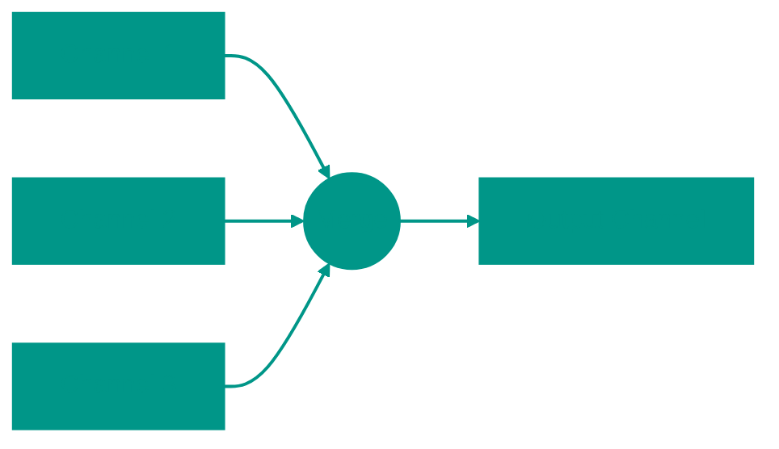

# 🌪️ Паттерн Fan-In (Веер-в)

**Fan-In** — это паттерн, который объединяет данные из нескольких каналов в один результирующий канал. Это позволяет собирать результаты параллельных вычислений или данные из разных источников в одном месте для централизованной обработки.

---


### 🧠 Концепция

Представьте несколько рек, которые впадают в одно море. Каждая река (входящий канал) несет свои воды (данные), и все они смешиваются в море (результирующий канал).



---


### 💻 Реализация

В этом примере мы создаем функцию `MergeChannels`, которая объединяет любое количество каналов в один.

```go
package main

import (
	"fmt"
	"sync"
	"time"
)

// MergeChannels объединяет несколько входящих каналов в один выходной канал
func MergeChannels(channels ...<-chan int) <-chan int {
	res := make(chan int)
	wg := sync.WaitGroup{}

	// Добавляем в счетчик количество каналов
	wg.Add(len(channels))

	// Запускаем горутину для каждого входного канала
	for _, channel := range channels {
		go func(c <-chan int) {
			defer wg.Done()
			for value := range c {
				res <- value
			}
		}(channel)
	}

	// Горутина для закрытия результирующего канала
	go func() {
		wg.Wait()
		close(res)
	}()

	return res
}

func prepareChannels() (chan int, chan int, chan int) {
	ch1 := make(chan int)
	ch2 := make(chan int)
	ch3 := make(chan int)

	go func() {
		defer func() {
			close(ch1)
			close(ch2)
			close(ch3)
		}()

		for i := 0; i < 9; i += 3 {
			ch1 <- i
			ch2 <- i + 1
			ch3 <- i + 2
			time.Sleep(100 * time.Millisecond)
		}
	}()

	return ch1, ch2, ch3
}

func runFanInDemo(channels ...<-chan int) {
	fmt.Println("Сбор данных из нескольких каналов...")

	for value := range MergeChannels(channels...) {
		fmt.Printf("Получено значение: %d\n", value)
	}
	fmt.Println("Все данные собраны.")
}

func main() {
	ch1, ch2, ch3 := prepareChannels()
	runFanInDemo(ch1, ch2, ch3)
}
```

---


### 💡 Особенности

1. **Масштабируемость**: Вы можете объединять сколь угодно много каналов.
2. **Синхронизация**: Использование `sync.WaitGroup` гарантирует, что результирующий канал закроется только тогда, когда все отправители завершат работу.
3. **Безопасность**: Функция возвращает канал только для чтения (`<-chan`), что защищает его от случайной записи извне.

> [!IMPORTANT]
> Всегда следите за тем, чтобы входящие каналы закрывались, иначе `MergeChannels` может привести к утечке горутин (из-за вечного ожидания в `wg.Wait()`).
