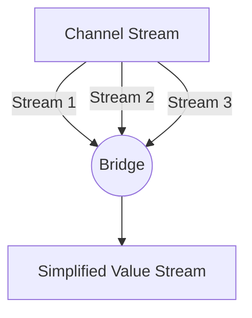

### 🌉 Паттерн Bridge-Channel

**Bridge-channel** — это паттерн, который "выравнивает" (flattening) поток каналов в один поток значений. Он используется, когда у вас есть канал, из которого приходят другие каналы (`<-chan <-chan interface{}`), и вы хотите читать данные из них последовательно, как если бы это был один обычный канал.

---

### 🧠 Концепция

Представьте пересадку в аэропорту. Пассажиры прибывают разными рейсами (входящие каналы), но все они должны пройти через один узкий коридор паспортного контроля (результирующий поток), чтобы попасть в город.



---

### 💻 Реализация

Реализация паттерна Bridge требует аккуратной обработки закрытия каналов и сигналов отмены, чтобы не допустить утечек горутин.

```go
package main

import "fmt"

// bridge объединяет поток каналов в один поток значений
// bridge flattens a stream of channels into a single value stream
func bridge(done <-chan interface{}, chanStream <-chan (<-chan interface{})) <-chan interface{} {
	valStream := make(chan interface{})
	go func() {
		defer close(valStream)
		for {
			var stream <-chan interface{}
			select {
			case maybeStream, ok := <-chanStream:
				if !ok {
					return
				}
				stream = maybeStream
			case <-done:
				return
			}

			// Читаем значения из текущего полученного канала
			// Reading values from the currently received channel
			for val := range stream {
				select {
				case valStream <- val:
				case <-done:
					return
				}
			}
		}
	}()
	return valStream
}

func main() {
	done := make(chan interface{})
	defer close(done)

	// Создаем "канал каналов"
	// Creating a "channel of channels"
	chanStream := make(chan (<-chan interface{}))

	go func() {
		defer close(chanStream)
		for i := 0; i < 3; i++ {
			stream := make(chan interface{})
			go func(v int) {
				defer close(stream)
				stream <- fmt.Sprintf("Данные из канала %d", v)
			}(i)
			chanStream <- stream
		}
	}()

	fmt.Println("Чтение через мост...")
	// Reading through the bridge...

	for val := range bridge(done, chanStream) {
		fmt.Printf("Получено: %v\n", val)
	}
}
```

---

### 💡 Особенности

1. **Последовательность**: Несмотря на то, что каналы в потоке могут создаваться параллельно, `bridge` читает из них по очереди, сохраняя порядок появления каналов.
2. **Упрощение**: Вызывающему коду не нужно знать о сложной иерархии каналов, он работает с простым потоком данных.
3. **Безопасность**: Все горутины корректно завершаются при получении сигнала `done`.

> [!NOTE]
> Этот паттерн часто используется в связке с другими паттернами, такими как Pipeline, когда один из этапов генерирует новые под-задачи в виде каналов.
