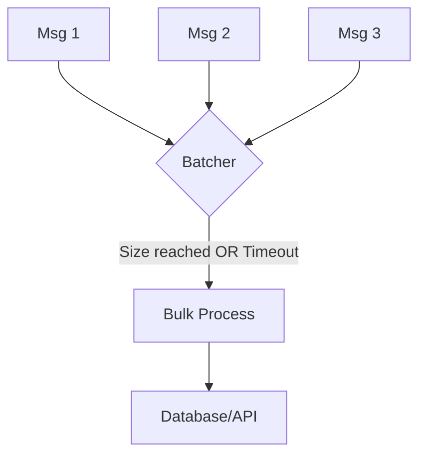

### 📦 Паттерн Batcher (Батчер)

**Batcher** — это паттерн, который объединяет несколько мелких операций в одну группу (батч) для совместной обработки. Это критически важно для оптимизации производительности при работе с базами данных, очередями сообщений или сетевыми API, так как одна групповая операция обычно гораздо эффективнее ста одиночных.

---

### 🧠 Концепция

Представьте мусоровоз. Он не приезжает к вашему дому каждый раз, когда вы выбрасываете один фантик. Вместо этого вы копите мусор в баке (батч), и мусоровоз забирает всё сразу по расписанию или когда бак полон.



---

### 💻 Реализация

Эффективный батчер должен срабатывать по двум условиям: либо накопилось нужное количество элементов, либо прошло определенное время (таймаут).

```go
package main

import (
	"fmt"
	"sync"
	"time"
)

// Batcher собирает сообщения и обрабатывает их пачками
// Batcher collects messages and processes them in batches
type Batcher struct {
	mu       sync.Mutex
	batch    []string
	limit    int
	interval time.Duration
}

func NewBatcher(limit int, interval time.Duration) *Batcher {
	b := &Batcher{
		limit:    limit,
		interval: interval,
	}
	// Запускаем фоновый процесс сброса по времени
	// Starting backround flush process by time
	go b.autoFlush()
	return b
}

func (b *Batcher) Add(msg string) {
	b.mu.Lock()
	b.batch = append(b.batch, msg)
	
	if len(b.batch) >= b.limit {
		b.flushLocked()
	}
	b.mu.Unlock()
}

func (b *Batcher) autoFlush() {
	ticker := time.NewTicker(b.interval)
	for range ticker.C {
		b.mu.Lock()
		b.flushLocked()
		b.mu.Unlock()
	}
}

func (b *Batcher) flushLocked() {
	if len(b.batch) == 0 {
		return
	}
	fmt.Printf(">>> Отправка батча из %d элементов: %v\n", len(b.batch), b.batch)
	b.batch = nil // Очищаем батч
}

func main() {
	// Батч каждые 5 элементов или каждые 2 секунды
	// Batch every 5 items or every 2 seconds
	batcher := NewBatcher(5, 2*time.Second)

	fmt.Println("Добавление сообщений...")
	// Adding messages...

	// 1. Сработает по лимиту (5 сообщений)
	// Triggers by limit
	for i := 1; i <= 5; i++ {
		batcher.Add(fmt.Sprintf("msg-%d", i))
	}

	// 2. Сработает по таймауту (2 сообщения зависнут)
	// Triggers by timeout
	batcher.Add("msg-6")
	batcher.Add("msg-7")

	time.Sleep(3 * time.Second)
	fmt.Println("Работа завершена.")
}
```

---

### 💡 Особенности

1. **Пропускная способность**: Резко увеличивает количество операций в секунду (TPS) за счет уменьшения накладных расходов на создание соединений или транзакций.
2. **Задержка (Latency)**: Обратной стороной является небольшая задержка, так как первые сообщения в батче ждут остальных или таймаута.
3. **Безопасность**: Важно предусмотреть сброс (flush) оставшихся сообщений при выключении приложения, чтобы не потерять данные.

> [!IMPORTANT]
> Батчинг — самый эффективный способ ускорить запись в SQL/NoSQL базы данных или отправку логов в системы мониторинга.
