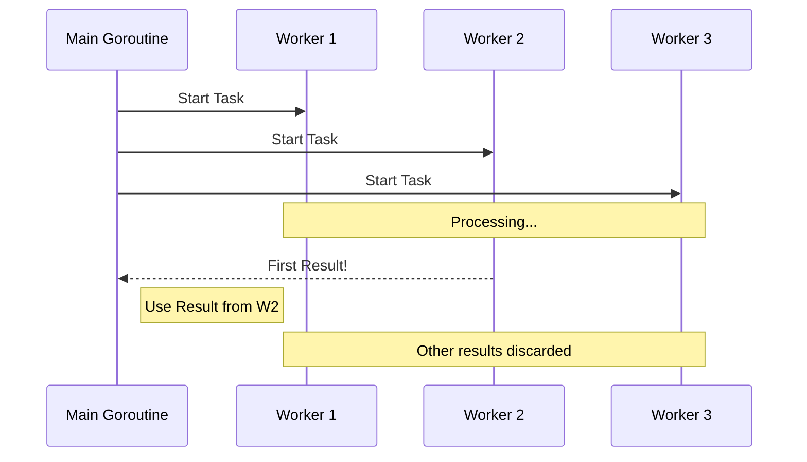

### 🏁 Паттерн Competition (Racing)

**Competition** (или *Racing*) — это паттерн конкурентности, при котором несколько горутин выполняют одну и ту же задачу, и мы используем результат той, которая завершилась **первой**. Все остальные результаты игнорируются.

Этот подход идеально подходит для систем с высокой доступностью, где мы можем отправить запрос нескольким серверам-репликам и взять ответ от самого быстрого.

---

### 🧠 Концепция

Представьте, что вы вызываете такси в трех разных приложениях. Машина, которая приедет первой, забирает вас, а остальные заказы вы просто отменяете. В Go это реализуется через каналы и конструкцию `select`.



---

### 💻 Реализация

Ниже представлен пример реализации паттерна, где мы имитируем запросы к нескольким источникам данных.

```go
package main

import (
    "fmt"
    "math/rand"
    "time"
)

// simulateSearch имитирует поиск данных с задержкой
// simulateSearch simulates data search with a delay
func simulateSearch(id int) <-chan string {
    res := make(chan string)
    go func() {
        // Рандомная задержка до 3 секунд
        // Random delay up to 3 seconds
        delay := time.Duration(rand.Intn(3000)) * time.Millisecond
        time.Sleep(delay)
        res <- fmt.Sprintf("Результат от сервера %d (заняло %v)", id, delay)
    }()
    return res
}

func main() {
    rand.Seed(time.Now().UnixNano())

    fmt.Println("Поиск запущен на 3-х серверах...")
    // Searching started on 3 servers...

    // Запускаем 3 конкурентные задачи
    // Starting 3 concurrent tasks
    c1 := simulateSearch(1)
    c2 := simulateSearch(2)
    c3 := simulateSearch(3)

    // Паттерн Competition: берем то, что пришло первым
    // Competition pattern: taking whichever result comes first
    select {
    case res := <-c1:
        fmt.Println("ПОБЕДИТЕЛЬ:", res)
    case res := <-c2:
        fmt.Println("ПОБЕДИТЕЛЬ:", res)
    case res := <-c3:
        fmt.Println("ПОБЕДИТЕЛЬ:", res)
    case <-time.After(2 * time.Second):
        // Таймаут, если никто не успел за 2 секунды
        // Timeout if no one finished within 2 seconds
        fmt.Println("ОШИБКА: Превышено время ожидания")
    }
}
```

---

### 💡 Особенности

1. **Скорость**: Общее время выполнения равно времени выполнения самого быстрого узла.
2. **Нагрузка**: Обратной стороной является избыточное потребление ресурсов, так как мы запускаем $N$ задач для получения одного ответа.
3. **Отмена**: В реальных проектах рекомендуется использовать `context.Context` для отмены "проигравших" горутин, чтобы они не продолжали тратить ресурсы после того, как победитель определен.

> [!TIP]
> Используйте этот паттерн, когда задержка (latency) критичнее, чем стоимость вычислительных ресурсов.
