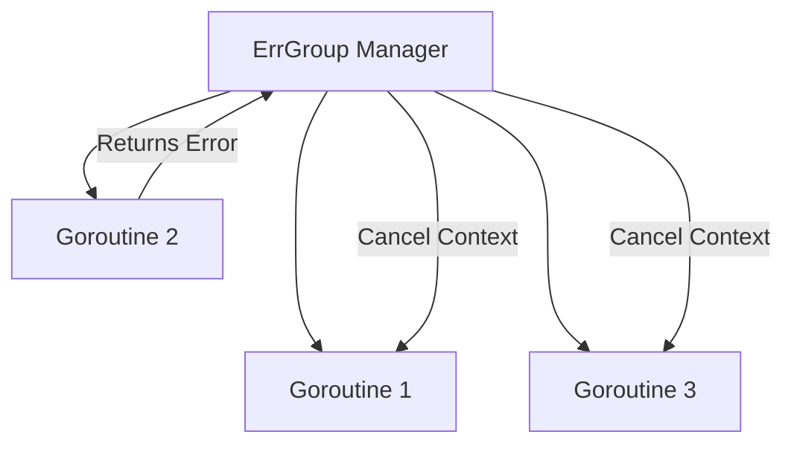

### ❌ Паттерн ErrGroup

**ErrGroup** — это расширенная версия `sync.WaitGroup`, которая не только ждет завершения группы горутин, но и перехватывает первую возникшую ошибку. Если одна из горутин возвращает ошибку, `ErrGroup` может автоматически отменить контекст для всех остальных горутин в группе.

---

### 🧠 Концепция

Это как командная работа над проектом. Если хотя бы один специалист (горутина) обнаруживает критическую проблему (ошибку), он сообщает об этом менеджеру (ErrGroup), который тут же дает команду всем остальным прекратить работу, так как проект больше не может быть завершен успешно.



---

### 💻 Реализация

Для использования `ErrGroup` необходимо импортировать пакет `golang.org/x/sync/errgroup`.

```go
package main

import (
	"context"
	"fmt"
	"time"

	"golang.org/x/sync/errgroup"
)

func main() {
	// Создаем ErrGroup и контекст, который отменится при первой ошибке
	// Creating ErrGroup and a context that cancels on the first error
	g, ctx := errgroup.WithContext(context.Background())

	urls := []string{"site1.com", "site2.com", "error-site.com", "site3.com"}

	for _, url := range urls {
		url := url // capturing variable for closure
		g.Go(func() error {
			// Имитация запроса
			// Simulating a request
			select {
			case <-time.After(500 * time.Millisecond):
				if url == "error-site.com" {
					return fmt.Errorf("ошибка при запросе к %s", url)
				}
				fmt.Printf("Успешный запрос к %s\n", url)
				return nil
			case <-ctx.Done():
				// Прерываем работу, если другая горутина вернула ошибку
				// Aborting if another goroutine returned an error
				return ctx.Err()
			}
		})
	}

	// Ждем завершения или первой ошибки
	// Waiting for completion or the first error
	if err := g.Wait(); err != nil {
		fmt.Printf("Группа завершилась с ошибкой: %v\n", err)
	} else {
		fmt.Println("Все запросы выполнены успешно!")
	}
}
```

---

### 💡 Особенности

1. **Конфиденциальность**: Возвращается только самая первая возникшая ошибка. Остальные маскируются.
2. **Управление лимитами**: С помощью метода `SetLimit(n)` можно ограничить количество одновременно работающих горутин.
3. **Автоматизация**: Больше не нужно вручную обрабатывать каналы для сбора ошибок из разных горутин.

> [!IMPORTANT]
> `ErrGroup` идеально подходит для параллельного выполнения независимых задач, результат которых обязан быть успешным для всех участников.
