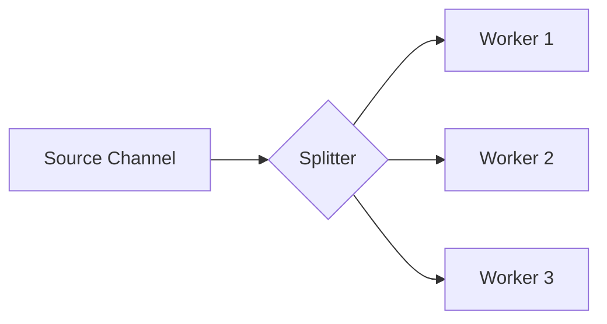

### 📣 Паттерн Fan-Out (Веер-из)

**Fan-Out** — это паттерн, при котором данные из одного канала распределяются между несколькими горутинами-обработчиками (воркерами). Это позволяет выполнять тяжелые задачи параллельно и значительно ускорять обработку больших потоков данных.

---

### 🧠 Концепция

Представьте конвейер на заводе, с которого сходят детали. Вместо одного рабочего, который делает всё сам, детали распределяются между несколькими мастерами, каждый из которых работает независимо.



---

### 💻 Реализация

В этом примере одна горутина генерирует задачи, а три воркера обрабатывают их параллельно.

```go
package main

import (
	"fmt"
	"sync"
	"time"
)

// worker обрабатывает задачи из входного канала
// worker processes tasks from the input channel
func worker(id int, input <-chan int, wg *sync.WaitGroup) {
	defer wg.Done()
	for num := range input {
		// Имитация тяжелой обработки
		// Simulating heavy processing
		fmt.Printf("Воркер %d взял задачу %d\n", id, num)
		time.Sleep(500 * time.Millisecond)
		fmt.Printf("Воркер %d завершил задачу %d. Результат: %d\n", id, num, num*2)
	}
}

func main() {
	const numWorkers = 3
	tasks := []int{1, 2, 3, 4, 5, 6, 7, 8}

	// Создаем каналы для воркеров
	// Create channels for workers
	inputs := make([]chan int, numWorkers)
	var wg sync.WaitGroup

	// Инициализируем и запускаем воркеры
	// Initialize and start workers
	for i := 0; i < numWorkers; i++ {
		inputs[i] = make(chan int)
		wg.Add(1)
		go worker(i+1, inputs[i], &wg)
	}

	// Распределение задач (Dispatcher)
	// Task distribution (Dispatcher)
	go func() {
		for i, task := range tasks {
			// Распределяем задачи по кругу (round-robin)
			// Distribute tasks in a round-robin fashion
			inputs[i%numWorkers] <- task
		}

		// Закрываем все каналы после распределения
		// Close all channels after distribution
		for _, in := range inputs {
			close(in)
		}
	}()

	fmt.Println("Запущено распределение задач по воркерам...")
	// Task distribution started...

	wg.Wait()
	fmt.Println("Все задачи успешно обработаны.")
}
```

---

### 💡 Особенности

1. **Параллелизм**: Позволяет эффективно использовать все ядра процессора для обработки данных.
2. **Балансировка**: При правильной реализации (например, использование одного общего канала для всех воркеров) задачи распределяются равномерно.
3. **Round-Robin**: В примере выше используется циклическое распределение, но в Go чаще используется схема, где все воркеры читают из **одного** канала (конкурентно), что обеспечивает автоматическую балансировку нагрузки (кто свободен, тот и взял).

> [!TIP]
> Для более простой реализации используйте общую очередь (один канал), из которого читают несколько горутин. Это избавит вас от необходимости создавать массив каналов и писать логику диспетчера.
