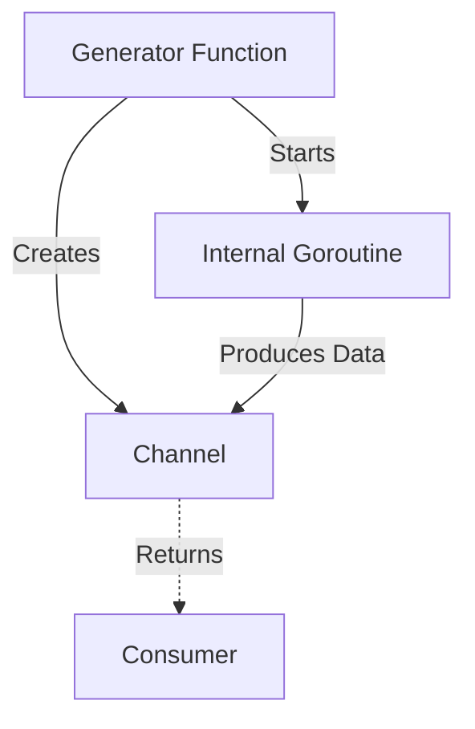

### 🏗️ Паттерн Generator (Генератор)

**Generator** — это паттерн, который инкапсулирует процесс генерации данных внутри функции, возвращающей канал для чтения этих данных. Это позволяет вызывающей стороне получать поток данных по мере их готовности, не заботясь о том, как именно они производятся.

---

### 🧠 Концепция

Представьте бесконечный кран с водой. Вам не нужно знать, откуда берется вода; вы просто открываете кран (вызываете функцию-генератор) и подставляете стакан (читаете из канала).



---

### 💻 Реализация

В этом примере функция-генератор объединяет данные из двух внутренних горутин и предоставляет их через один канал.

```go
package main

import (
	"fmt"
	"sync"
)

// writer — это генератор, который создает канал и возвращает его
// writer is a generator that creates a channel and returns it
func writer() <-chan int {
	ch := make(chan int)
	wg := &sync.WaitGroup{}

	// Добавляем 2 горутины, которые будут "производить" данные
	// Add 2 goroutines that will "produce" data
	wg.Add(2)

	// Первая горутина: числа 1-5
	// First goroutine: numbers 1-5
	go func() {
		defer wg.Done()
		for i := 1; i <= 5; i++ {
			ch <- i
		}
	}()

	// Вторая горутина: числа 11-15
	// Second goroutine: numbers 11-15
	go func() {
		defer wg.Done()
		for i := 11; i <= 15; i++ {
			ch <- i
		}
	}()

	// Горутина для закрытия канала после завершения всех производителей
	// Goroutine to close the channel after all producers finish
	go func() {
		wg.Wait()
		close(ch)
	}()

	// Возвращаем канал только для чтения
	return ch
}

func main() {
	fmt.Println("Генератор запущен...")
	// Generator started...

	// Получаем поток данных от генератора
	// Receiving data stream from the generator
	dataStream := writer()

	for v := range dataStream {
		fmt.Printf("Получено значение: %d\n", v)
	}
	fmt.Println("Генерация завершена.")
}
```

---

### 💡 Микропаттерн: Ограничение времени

Генераторы часто используются вместе с таймаутами. Если генератор работает слишком долго, мы можем прервать ожидание.

```go
// Пример ожидания с таймаутом
// Example of waiting with a timeout
select {
case v := <-ch:
    fmt.Println("Получено:", v)
case <-time.After(3 * time.Second):
    fmt.Println("Ошибка: Превышено время ожидания")
}
```

---

### 💡 Особенности

1. **Инкапсуляция**: Вся логика создания горутины и управления каналом скрыта внутри функции.
2. **Ленивые вычисления**: Данные могут генерироваться "на лету" только тогда, когда они нужны потребителю.
3. **Безопасность типов**: Использование `<-chan` явно указывает, что канал предназначен только для чтения.

> [!TIP]
> Генератор можно сделать бесконечным, если не закрывать канал и генерировать значения в цикле `for { ... }`.
