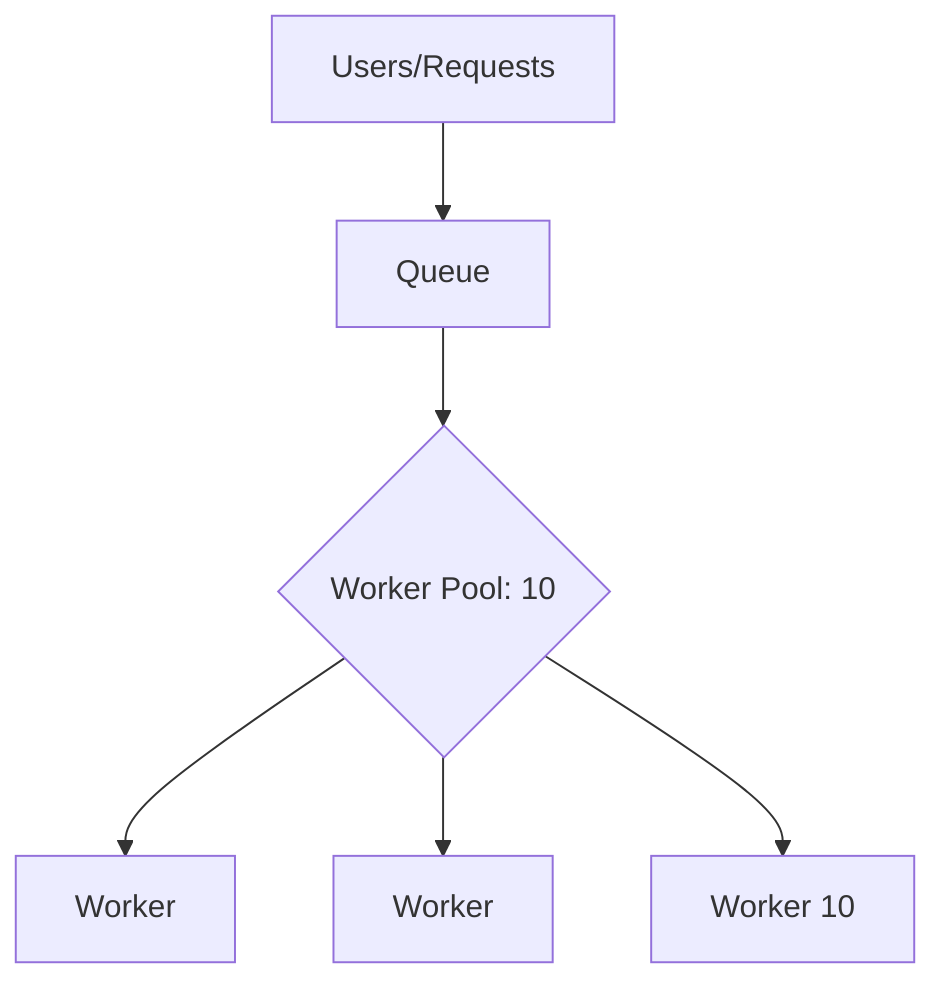

### 🛡️ Limiter: Max Connections

**Max Connections Limiter** — это вариация паттерна ограничения ресурсов, которая фокусируется на контроле количества активных сетевых соединений или воркеров. Это гарантирует, что ваша система не откроет больше сокетов или не задействует больше вычислительных ресурсов, чем может выдержать инфраструктура.

---

### 🧠 Концепция

Это похоже на работу колл-центра, где есть только 10 операторов. Даже если звонят 100 человек одновременно, только 10 смогут разговаривать, остальные будут ждать в очереди, пока не освободится линия.



---

### 💻 Реализация

В этой реализации мы ограничиваем количество одновременно работающих горутин-обработчиков (воркеров), которые читают из общего канала задач.

```go
package main

import (
	"context"
	"fmt"
	"sync"
	"time"
)

func main() {
	const maxConnections = 3 // Лимит соединений
	const totalRequests = 10

	taskCh := make(chan int, totalRequests)
	var wg sync.WaitGroup

	fmt.Printf("Запуск системы с лимитом %d соединений...\n", maxConnections)
	// Starting system with a limit of 3 connections...

	// Создаем пул воркеров, который и является нашим лимитером
	// Creating a worker pool that acts as our limiter
	for i := 1; i <= maxConnections; i++ {
		wg.Add(1)
		go func(workerID int) {
			defer wg.Done()
			for taskID := range taskCh {
				fmt.Printf("Воркер %d обрабатывает запрос %d\n", workerID, taskID)
				time.Sleep(500 * time.Millisecond) // Имитация сетевой работы
			}
		}(i)
	}

	// Отправляем запросы
	// Sending requests
	for i := 1; i <= totalRequests; i++ {
		taskCh <- i
	}
	close(taskCh)

	wg.Wait()
	fmt.Println("Все запросы обработаны.")
}
```

---

### 💡 Особенности

1. **Стабильность**: Предотвращает падение сервиса из-за нехватки файловых дескрипторов или памяти.
2. **Предсказуемость**: Вы имеете четкий контроль над пропускной способностью системы.
3. **Очередность**: Входящие запросы не отклоняются, а ставятся в очередь (буфер канала).

> [!NOTE]
> Этот подход часто называют "Пул воркеров", и он является наиболее надежным способом реализации жестких ограничений в Go.
