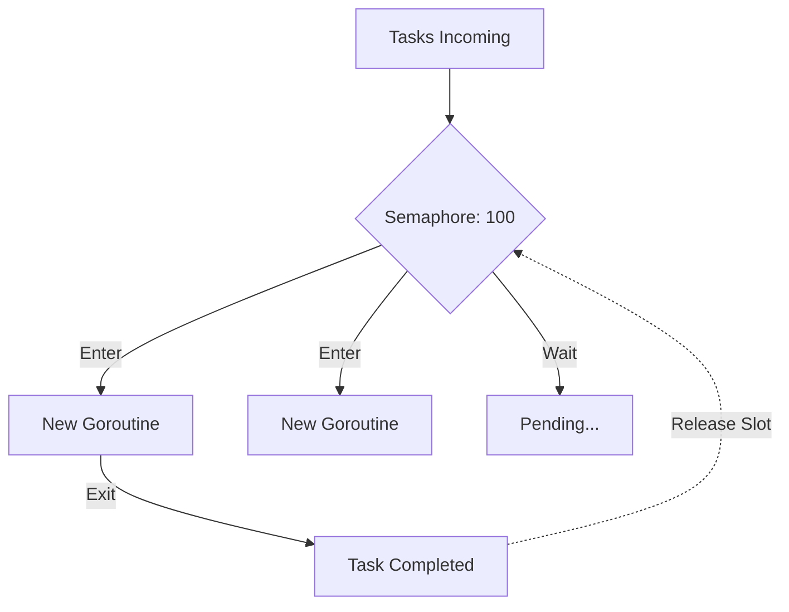

### 🧵 Limiter: Max Goroutines

**Max Goroutines Limiter** — это паттерн, ограничивающий общее количество одновременно запущенных горутин в конкретной секции кода. В отличие от пула воркеров, где горутины живут постоянно, здесь горутины создаются под каждую задачу, но их общее число строго контролируется семафором.

---

### 🧠 Концепция

Представьте ночной клуб с фейс-контролем. Охранник (семафор) пропускает внутрь только 100 человек. Как только один выходит, следующий может зайти. Внутри каждый занимается своим делом (горутина под задачу), но общее число людей в зале всегда не больше лимита.



---

### 💻 Реализация

Наиболее эффективный способ реализации этого паттерна — использование семафора на базе буферизованного канала.

```go
package main

import (
	"fmt"
	"sync"
	"time"
)

func main() {
	const maxGoroutines = 5 // Лимит горутин
	const totalTasks = 15

	// Семафор: ограничитель
	// Semaphore: the limiter
	sem := make(chan struct{}, maxGoroutines)
	var wg sync.WaitGroup

	fmt.Printf("Обработка %d задач с лимитом в %d горутин...\n", totalTasks, maxGoroutines)
	// Processing 15 tasks with a limit of 5 goroutines...

	for i := 1; i <= totalTasks; i++ {
		wg.Add(1)

		// Занимаем слот ПЕРЕД запуском горутины
		// Occupy a slot BEFORE starting the goroutine
		sem <- struct{}{}

		go func(taskID int) {
			defer wg.Done()
			// Освобождаем слот ПРИ ЗАВЕРШЕНИИ горутины
			// Release the slot ON COMPLETION of the goroutine
			defer func() { <-sem }()

			fmt.Printf("Запущена горутина для задачи %d\n", taskID)
			time.Sleep(time.Duration(200) * time.Millisecond) // Имитация работы
		}(i)
	}

	wg.Wait()
	fmt.Println("Все задачи успешно завершены.")
}
```

---

### 💡 Особенности

1. **Динамичность**: Горутины создаются и уничтожаются по требованию, что может быть более эффективно, если задачи поступают редко.
2. **Простота интеграции**: Можно легко обернуть существующий цикл запуска горутин в этот паттерн.
3. **Безопасность**: Защищает приложение от падения из-за переполнения стека (`out of memory`) при создании миллионов горутин.

> [!CAUTION]
> Всегда занимайте слот в семафоре **вне** горутины, иначе вы сначала запустите миллион горутин, и только потом они начнут пытаться занять слоты, что лишит паттерн смысла.
