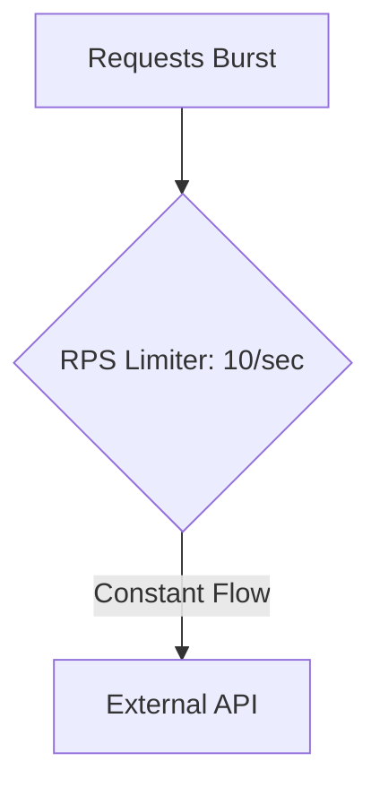

### ⏱️ Limiter: RPS (Rate Per Second)

**RPS Limiter** — это паттерн, управляющий интенсивностью выполнения операций во времени. В отличие от других лимитеров, он нацелен не на ограничение потребления ресурсов внутри системы, а на соответствие внешним требованиям (например, лимиты API — "не более 100 запросов в секунду").

---

### 🧠 Концепция

Представьте песочные часы или дозатор. Даже если у вас есть тонна песка, через узкое горлышко он проходит с постоянной фиксированной скоростью. Это гарантирует, что на приемной стороне (API) не возникнет перегрузки.



---

### 💻 Реализация

В Go этот паттерн проще всего реализовать с помощью `time.Ticker`, который задает темп выполнения.

```go
package main

import (
	"fmt"
	"time"
)

func main() {
	const rps = 5 // Лимит: 5 запросов в секунду
	const totalTasks = 15

	// Создаем тикер, который "тикает" каждые 1/rps секунды
	// Creating a ticker that "ticks" every 1/rps seconds
	ticker := time.NewTicker(time.Second / rps)
	defer ticker.Stop()

	fmt.Printf("Запуск обработки %d задач с темпом %d RPS...\n", totalTasks, rps)
	// Starting processing of 15 tasks at a rate of 5 RPS...

	start := time.Now()

	for i := 1; i <= totalTasks; i++ {
		// Ждем следующего "тика"
		// Waiting for the next tick
		<-ticker.C
		
		fmt.Printf("[%v] Обработка задачи %d\n", time.Since(start).Truncate(time.Millisecond), i)
	}

	fmt.Printf("Готово! Итоговое время: %v\n", time.Since(start))
}
```

---

### 💡 Особенности

1. **Равномерность**: Операции распределяются равномерно во времени.
2. **Точность**: Позволяет строго соблюдать лимиты сторонних сервисов (SLA).
3. **Bursty Traffic**: Если нужно разрешить кратковременные всплески нагрузки (например, 10 RPS в среднем, но до 5 одновременно), стоит использовать библиотеку `golang.org/x/time/rate`.

> [!TIP]
> Всегда используйте `defer ticker.Stop()`, чтобы избежать утечки ресурсов таймера после завершения цикла.
