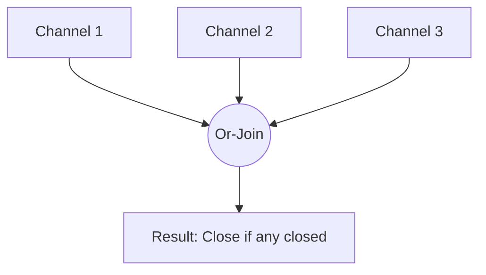

### 🚦 Паттерн Or-Channel

**Or-Channel** — это паттерн, который объединяет несколько каналов в один результирующий канал. Этот результирующий канал закрывается, как только закрывается **любой** из входящих каналов. Это полезно для объединения нескольких сигналов отмены или ожидания завершения первой из группы асинхронных задач.

---

### 🧠 Концепция

Представьте несколько аварийных кнопок в разных частях здания. Как только нажата **любая** из них, включается общая тревога.



---

### 💻 Реализация

В Go этот паттерн часто реализуется рекурсивно, что позволяет объединять неограниченное количество каналов очень лаконично.

```go
package main

import (
	"fmt"
	"time"
)

// or рекурсивно объединяет каналы в один
// or recursively combines channels into one
func or(channels ...<-chan interface{}) <-chan interface{} {
	// Базовые случаи для остановки рекурсии
	switch len(channels) {
	case 0:
		return nil
	case 1:
		return channels[0]
	}

	orDone := make(chan interface{})

	go func() {
		defer close(orDone)

		switch len(channels) {
		case 2:
			// Ожидание любого из двух
			select {
			case <-channels[0]:
			case <-channels[1]:
			}
		default:
			// Рекурсивное ожидание любого из всех остальных
			select {
			case <-channels[0]:
			case <-channels[1]:
			case <-channels[2]:
			case <-or(append(channels[3:], orDone)...):
			}
		}
	}()

	return orDone
}

func main() {
	// sig создает канал, который закроется через указанное время
	// sig creates a channel that will close after the specified duration
	sig := func(after time.Duration) <-chan interface{} {
		c := make(chan interface{})
		go func() {
			defer close(c)
			time.Sleep(after)
		}()
		return c
	}

	start := time.Now()

	fmt.Println("Ожидание завершения самого быстрого канала...")
	// Waiting for the fastest channel to close...

	// Ждем, пока закроется любой из этих каналов
	<-or(
		sig(2*time.Hour),
		sig(5*time.Minute),
		sig(1*time.Second), // Этот закроется первым
		sig(1*time.Hour),
	)

	fmt.Printf("Готово через %v\n", time.Since(start))
}
```

---

### 💡 Особенности

1. **Рекурсия**: Позволяет элегантно обрабатывать переменное количество каналов.
2. **Композиция**: Результат вызова `or` — это такой же канал, который можно снова передать в `or`.
3. **Производительность**: При очень большом количестве каналов рекурсия может создать глубокий стек горутин, но для обычных задач это не критично.

> [!TIP]
> Этот паттерн является основой для реализации сложных систем отмены задач, где нужно реагировать на сигналы из разных источников.
