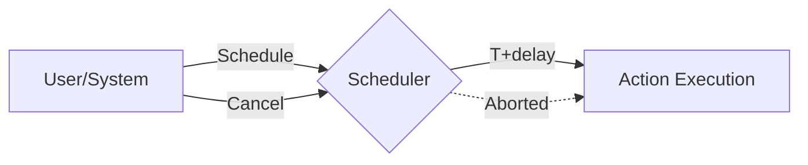

### ⏰ Паттерн Scheduler (Планировщик)

**Scheduler** — это паттерн, предназначенный для управления выполнением задач в будущем. Он позволяет запланировать запуск функции через определенный интервал времени, а также предоставляет возможность отмены запланированной задачи, если она больше не актуальна.

---

### 🧠 Концепция

Это как будильник в вашем телефоне. Вы ставите его на определенное время (задержка). Когда время приходит, будильник звонит (выполняется функция). Если вы проснулись раньше, вы можете выключить будильник до того, как он сработает (отмена таймера).



---

### 💻 Реализация

В Go планировщик часто строится вокруг `time.Timer` или `time.AfterFunc`, обернутых в структуру с мьютексом для потокобезопасности.

```go
package main

import (
	"fmt"
	"sync"
	"time"
)

// Scheduler управляет отложенным выполнением
// Scheduler manages deferred execution
type Scheduler struct {
	sync.Mutex
	timers map[string]*time.Timer
}

func NewScheduler() *Scheduler {
	return &Scheduler{
		timers: make(map[string]*time.Timer),
	}
}

// Schedule планирует выполнение функции
// Schedule schedules function execution
func (s *Scheduler) Schedule(id string, delay time.Duration, action func()) {
	s.Lock()
	defer s.Unlock()

	// Если задача с таким ID уже есть, отменяем старую
	// If a task with this ID already exists, cancel the old one
	if t, ok := s.timers[id]; ok {
		t.Stop()
	}

	// Создаем новый таймер
	// Creating a new timer
	s.timers[id] = time.AfterFunc(delay, func() {
		action()
		s.Lock()
		delete(s.timers, id)
		s.Unlock()
	})
}

// Cancel отменяет задачу
// Cancel abors a task
func (s *Scheduler) Cancel(id string) {
	s.Lock()
	defer s.Unlock()
	if t, ok := s.timers[id]; ok {
		t.Stop()
		delete(s.timers, id)
		fmt.Printf("Задача %s отменена\n", id)
	}
}

func main() {
	s := NewScheduler()

	fmt.Println("Планирование задач...")
	// Scheduling tasks...

	s.Schedule("clean-cache", 2*time.Second, func() {
		fmt.Println("--- Кэш успешно очищен! ---")
	})

	s.Schedule("send-email", 1*time.Second, func() {
		fmt.Println("--- Письмо отправлено! ---")
	})

	// Отменяем одну из задач
	// Canceling one of the tasks
	time.Sleep(500 * time.Millisecond)
	s.Cancel("clean-cache")

	time.Sleep(2 * time.Second)
	fmt.Println("Работа планировщика завершена.")
}
```

---

### 💡 Особенности

1. **Гибкость**: Позволяет динамически управлять жизненным циклом отложенных задач.
2. **Потокобезопасность**: Использование `sync.Mutex` гарантирует корректную работу при обращении из разных горутин.
3. **Реальное время**: `time.AfterFunc` работает в отдельной горутине, не блокируя основной поток выполнения.

> [!WARNING]
> Если вы создаете тысячи таймеров, не забывайте их очищать или отменять, чтобы не раздувать потребление памяти.
