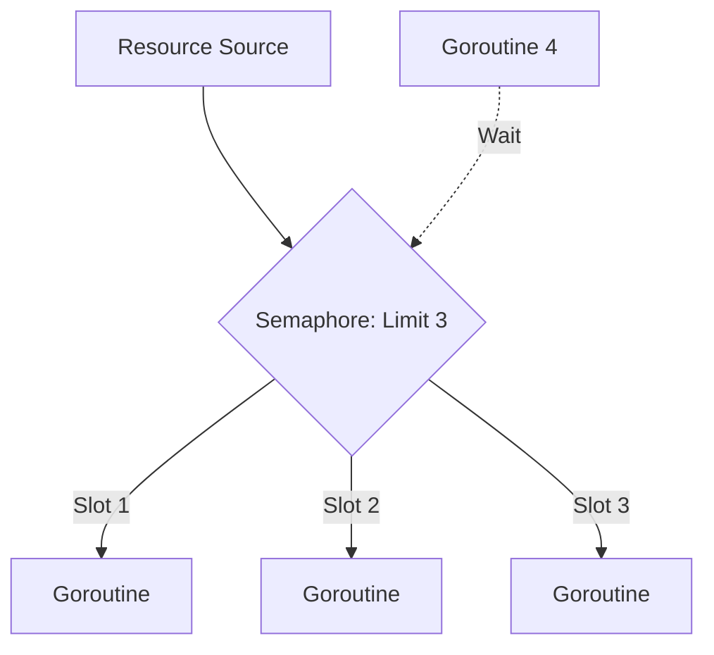

### 🚦 Паттерн Semaphore (Семафор)

**Semaphore** — это паттерн, используемый для ограничения количества одновременно выполняемых операций или доступа к ограниченному ресурсу. В Go семафор чаще всего реализуется с помощью буферизованного канала, где размер буфера определяет максимальное количество "слотов" (разрешений).

---

### 🧠 Концепция

Представьте парковку на 3 места. Когда машина заезжает, она занимает одно место (отправляет данные в канал). Если мест нет, следующая машина ждет у шлагбаума. Когда машина уезжает, место освобождается (читаем из канала), и следующая машина может заехать.



---

### 💻 Реализация

Классическая реализация семафора в Go через пустой `struct{}` в буферизованном канале.

```go
package main

import (
	"fmt"
	"sync"
	"time"
)

func main() {
	const goroutineLimit = 3
	tasks := []int{1, 2, 3, 4, 5, 6, 7}

	wg := sync.WaitGroup{}
	// Семафор: буферизованный канал на 3 элемента
	// Semaphore: buffered channel with 3 slots
	sem := make(chan struct{}, goroutineLimit)

	for _, task := range tasks {
		wg.Add(1)
		
		// Занимаем слот: если канал полон, блокируемся
		// Occupy a slot: blocks if the channel is full
		sem <- struct{}{}

		go func(id int) {
			defer wg.Done()
			// Освобождаем слот при завершении
			// Release the slot on completion
			defer func() { <-sem }()

			fmt.Printf("Воркер %d начал работу...\n", id)
			time.Sleep(1 * time.Second) // Имитация работы
			fmt.Printf("Воркер %d закончил.\n", id)
		}(task)
	}

	wg.Wait()
	fmt.Println("Все задачи выполнены.")
}
```

---

### 💡 Особенности

1. **Гибкость**: Вы можете динамически менять лимит, если используете переменную для размера буфера при создании.
2. **Простота**: Не требует сложных внешних библиотек, достаточно встроенных возможностей языка.
3. **Веса (Weighted Semaphores)**: Если задачи требуют разного "веса" (например, одна задача занимает 2 слота), лучше использовать пакет `golang.org/x/sync/semaphore`.

> [!TIP]
> Используйте Семафор, когда вам нужно ограничить нагрузку на внешнюю систему (например, не более 5 одновременных запросов к базе данных).
