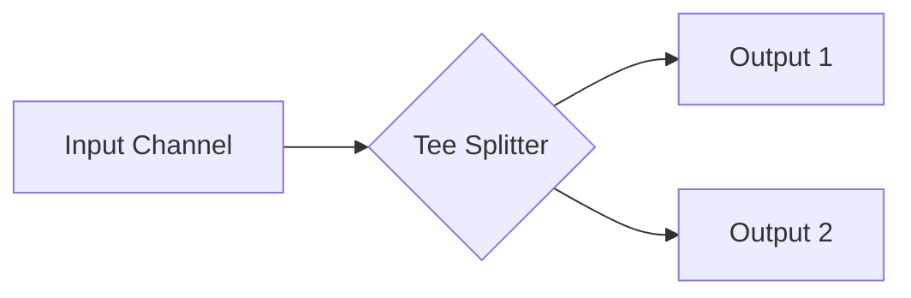

### 🍴 Паттерн Tee-Channel

**Tee-channel** — это паттерн, который разделяет один входящий канал на два (или более) независимых выходящих канала. Это похоже на сантехнический тройник (Tee): поток данных дублируется, позволяя разным частям программы получать одну и ту же информацию одновременно.

---

### 🧠 Концепция

Представьте репортаж с места событий. Одна камера (входной канал) передает видеоряд, который одновременно идет и в прямой эфир на ТВ, и записывается в архив на диск (выходящие каналы).



---

### 💻 Реализация

Важной особенностью реализации является то, что мы должны гарантировать доставку данных во **все** выходные каналы, не блокируя основной поток надолго.

```go
package main

import (
	"fmt"
)

// tee разделяет один входящий канал на два выходящих
// tee splits one input channel into two output channels
func tee(done <-chan interface{}, in <-chan interface{}) (<-chan interface{}, <-chan interface{}) {
	out1 := make(chan interface{})
	out2 := make(chan interface{})

	go func() {
		defer close(out1)
		defer close(out2)

		for val := range in {
			// Используем локальные копии для безопасного select
			// Using local copies for safe select
			var out1, out2 = out1, out2
			
			// Нам нужно отправить значение в ОБА канала
			// We need to send the value to BOTH channels
			for i := 0; i < 2; i++ {
				select {
				case <-done:
					return
				case out1 <- val:
					out1 = nil // Больше не отправляем сюда в этой итерации
				case out2 <- val:
					out2 = nil // Больше не отправляем сюда в этой итерации
				}
			}
		}
	}()

	return out1, out2
}

func main() {
	done := make(chan interface{})
	defer close(done)

	in := make(chan interface{})

	// Генератор данных
	// Data generator
	go func() {
		defer close(in)
		for i := 1; i <= 3; i++ {
			in <- i
		}
	}()

	// Разделяем поток
	// Splitting the stream
	out1, out2 := tee(done, in)

	fmt.Println("Чтение из двух независимых потоков...")
	// Reading from two independent streams...

	for val1 := range out1 {
		fmt.Printf("Поток 1: %v | ", val1)
		fmt.Printf("Поток 2: %v\n", <-out2)
	}
}
```

---

### 💡 Особенности

1. **Дублирование**: Каждый потребитель получает полную копию всех данных из источника.
2. **Параллелизм**: Чтение из выходных каналов должно быть сбалансированным. Если один потребитель перестанет читать, он заблокирует `tee`, и второй потребитель тоже перестанет получать данные.
3. **Select-блокировка**: Использование цикла из двух `select` гарантирует, что значение будет доставлено в оба канала, независимо от того, кто из них готов первым.

> [!WARNING]
> Если один из выходных каналов не читается, это приведет к зависанию всего конвейера. Используйте буферизованные каналы или убедитесь, что все потребители активны.
