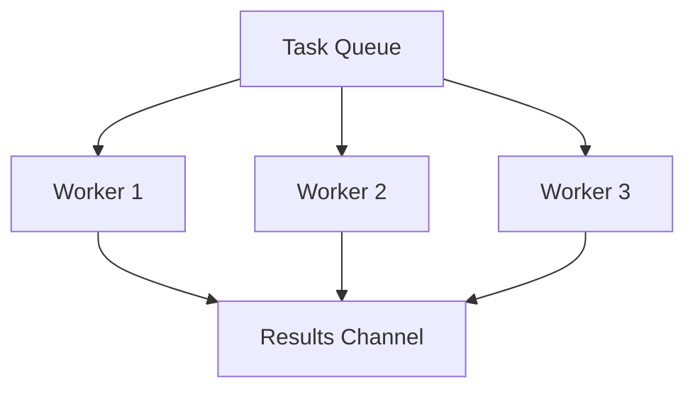

### 👷 Паттерн Worker Pool (Пул воркеров)

**Worker Pool** — это паттерн, который ограничивает количество одновременно запущенных горутин для обработки очереди задач. Это позволяет эффективно использовать ресурсы процессора и памяти, не допуская их перегрузки при большом количестве входящих заданий.

---

### 🧠 Концепция

Представьте мастерскую, где работают три мастера (воркера). На столе лежит стопка заказов (канал задач). Мастера по очереди берут заказы, выполняют их и складывают готовые изделия в коробку (канал результатов).



---

### 💻 Реализация

В этом примере мы создаем пул из нескольких воркеров для имитации обработки файлов.

```go
package main

import (
	"fmt"
	"sync"
	"time"
)

// Task представляет задачу для обработки
// Task represents a task for processing
type Task struct {
	ID       int
	Filename string
}

// Worker читает задачи из канала и обрабатывает их
// Worker reads tasks from the channel and processes them
func Worker(id int, taskCh <-chan Task, resCh chan<- string, wg *sync.WaitGroup) {
	defer wg.Done()
	for task := range taskCh {
		// Имитация обработки (1 секунда)
		// Simulating processing (1 second)
		fmt.Printf("Воркер %d начал обработку %s\n", id, task.Filename)
		time.Sleep(time.Second) 
		resCh <- fmt.Sprintf("Воркер %d завершил %s", id, task.Filename)
	}
}

func main() {
	const numWorkers = 3
	const numTasks = 5

	taskCh := make(chan Task, numTasks)
	resCh := make(chan string, numTasks)
	var wg sync.WaitGroup

	// Запускаем пул воркеров
	// Starting the worker pool
	for i := 1; i <= numWorkers; i++ {
		wg.Add(1)
		go Worker(i, taskCh, resCh, &wg)
	}

	// Отправляем задачи в пул
	// Sending tasks to the pool
	go func() {
		for i := 1; i <= numTasks; i++ {
			taskCh <- Task{ID: i, Filename: fmt.Sprintf("image_%d.jpg", i)}
		}
		close(taskCh) // Закрываем канал задач, когда всё отправили
	}()

	// Ждем завершения воркеров и закрываем канал результатов
	// Waiting for workers and closing the results channel
	go func() {
		wg.Wait()
		close(resCh)
	}()

	fmt.Println("Пул воркеров запущен...")
	// Worker pool started...

	// Читаем результаты
	// Reading results
	for res := range resCh {
		fmt.Println(res)
	}
	fmt.Println("Все задачи завершены.")
}
```

---

### 💡 Особенности

1. **Контроль ресурсов**: Вы точно знаете, сколько памяти и процессорного времени потребляет приложение, так как количество горутин фиксировано.
2. **Очередность**: Использование буферизованных каналов позволяет сглаживать пиковые нагрузки.
3. **Безопасность**: Задачи не теряются, а ждут своего воркера в очереди.

> [!IMPORTANT]
> Всегда закрывайте канал задач (`taskCh`), чтобы воркеры могли выйти из цикла `range` и завершить свою работу.
