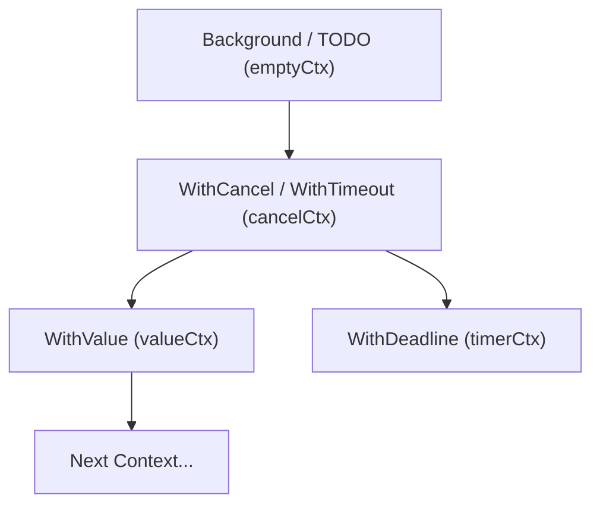
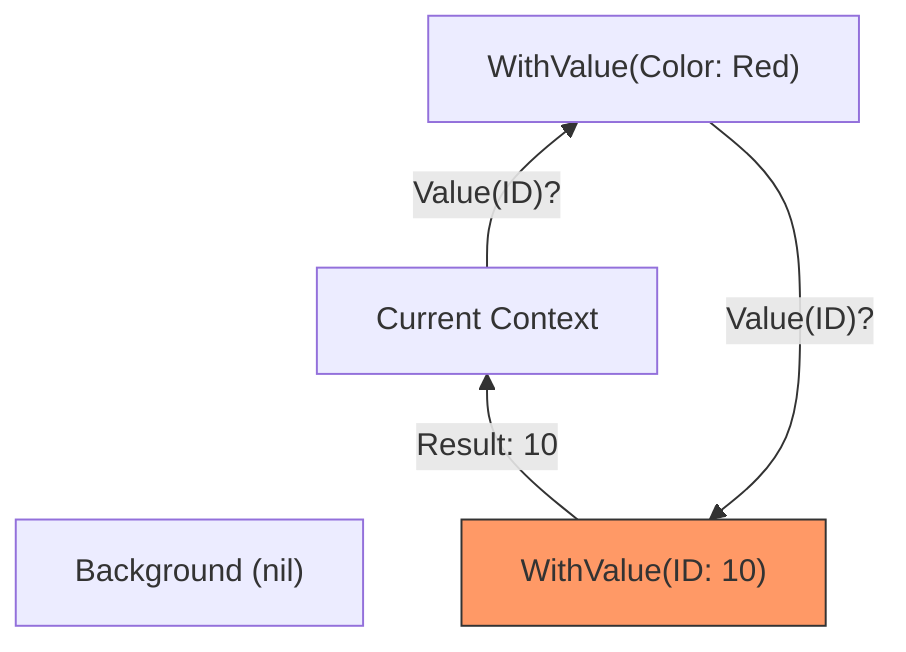

### 🧠 Что такое Context в Go?

**Контекст (context)** — это стандартный механизм в Go для передачи сигналов отмены, дедлайнов и параметров (ключ-значение) через дерево вызовов. 

Основная задача контекста — управление жизненным циклом операций, особенно тех, которые могут длиться долго или выполняться в отдельных горутинах (например, HTTP-запросы, запросы к БД).

---

### 🪆 Принцип "Матрешки" (Иерархия)

Контекст в Go строится по принципу иерархического дерева. Вы всегда начинаете с "пустого" родительского контекста и наращиваете его, создавая дочерние контексты.



> [!IMPORTANT]
> **Это неизменяемая структура**. Каждый раз, когда вы вызываете `With...` функцию, вы не меняете старый контекст, а создаете новый, который хранит ссылку на своего родителя.

---

### 🚫 Распространение отмены (Cancellation Propagation)

Это самая важная функция контекста. Сигнал об отмене всегда распространяется **сверху вниз**.

- Если вы отменяете родительский контекст, все его дочерние контексты (и их дети) также отменяются.
- Если вы отменяете дочерний контекст, это **не влияет** на родителя.

**Почему это удобно?**
Представьте HTTP-обработчик. Если клиент закрыл соединение, мы отменяем главный контекст запроса. Это автоматически сигнализирует базе данных и всем фоновым задачам, что работу можно прекратить и освободить ресурсы.

---

### 🔍 Как работает WithValue()?

`context.WithValue` позволяет прикрепить данные к контексту. Но важно понимать, как происходит поиск значения:

1. Вы запрашиваете значение по ключу через `ctx.Value(key)`.
2. Если текущий контекст содержит этот ключ, он его возвращает.
3. Если нет — он **рекурсивно** идет к своему родителю и спрашивает его.
4. Процесс продолжается до самого корня (`Background`), пока ключ не найдется или не будет достигнут конец дерева.



> [!WARNING]
> Поиск в `WithValue` имеет сложность **O(N)** по глубине дерева. Не используйте контекст для передачи сотен параметров — это медленно. Используйте его только для метаданных (ID запроса, логин пользователя, токен трассировки).

---

### 🛠️ Основные типы контекстов внутри

В исходниках Go (`context.go`) контекст — это интерфейс:
```go
type Context interface {
    Deadline() (deadline time.Time, ok bool)
    Done() <-chan struct{}
    Err() error
    Value(key any) any
}
```

**Реализации:**
1. **emptyCtx**: Тот самый `Background()` или `TODO()`. Просто пустая оболочка.
2. **cancelCtx**: Добавляет возможность отмены (метод `Done()`).
3. **timerCtx**: Добавляет дедлайн или таймаут. Внутри содержит `cancelCtx` и таймер.
4. **valueCtx**: Хранит одну пару ключ-значение и ссылку на родителя.

---

### 💡 Правила хорошего тона

1. **Первый аргумент**: Контекст всегда должен быть первым аргументом функции: `func DoWork(ctx context.Context, ...)`.
2. **Имя переменной**: Общепринятое имя — `ctx`.
3. **Не храните в структурах**: Контекст должен жить только на время выполнения функции. Не кладите его в поля структур.
4. **Context.Background()**: Используйте для основного входа (main, начало запроса).
5. **Context.TODO()**: Используйте, если вы еще не уверены, какой контекст нужен.

---

### 📋 Итог

- **Context** — это дерево.
- **Отмена** идет вниз (родитель -> дети).
- **Поиск значений** идет вверх (ребенок -> родитель) рекурсивно.
- Используется для **синхронизации и управления ресурсами**.
