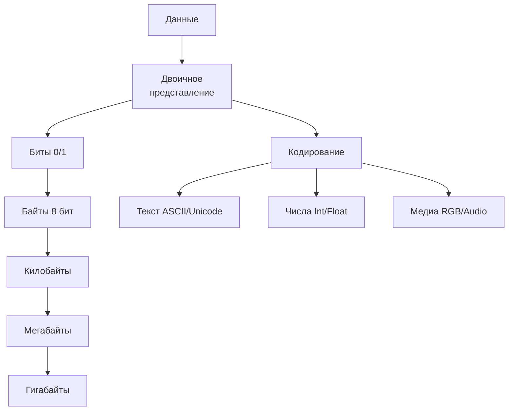
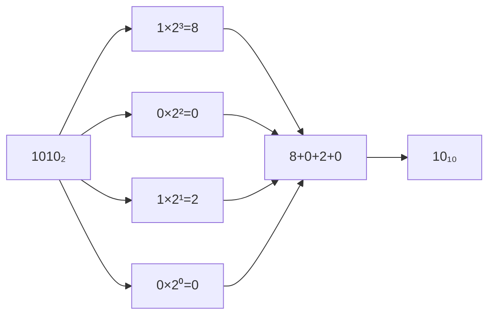
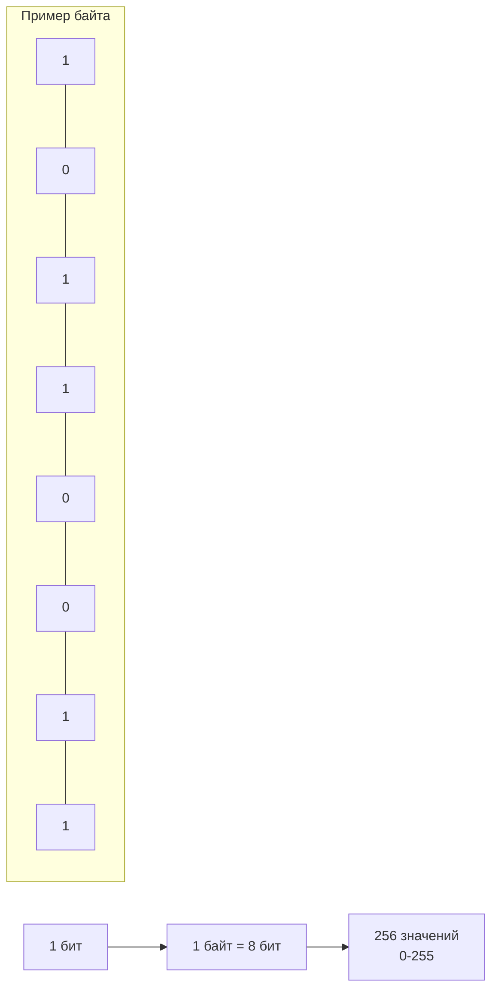
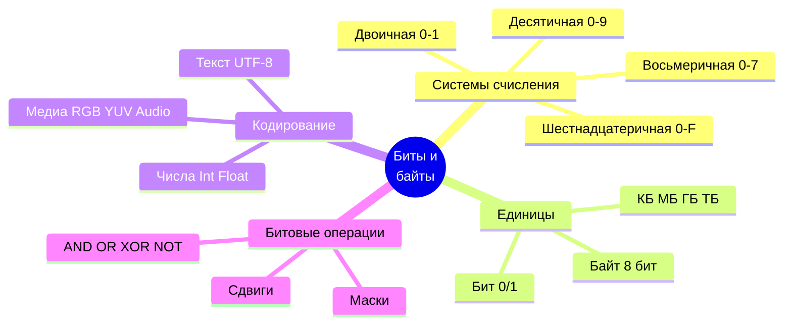

# 🔢 Биты, байты и системы счисления

## 📑 Содержание
1. [Системы счисления](#1-системы-счисления)
2. [Биты и байты](#2-биты-и-байты)
3. [Кодирование данных](#3-кодирование-данных)
4. [Логические операции с битами](#4-логические-операции-с-битами)

---

Компьютеры работают с данными, представленными в виде **битов** (двоичных цифр) и **байтов**. Этот раздел объясняет, как данные кодируются, хранятся и обрабатываются с использованием различных систем счисления.



---

## 1. 📂 Системы счисления

Система счисления — это способ представления чисел с помощью символов (цифр) и их позиций.

### Основные системы 🏛️

| Система | Основание | Цифры | Пример | Десятичное |
|:---|:---:|:---|:---:|:---:|
| **Двоичная** | 2 | 0, 1 | 1010 | 10 |
| **Восьмеричная** | 8 | 0-7 | 12 | 10 |
| **Десятичная** | 10 | 0-9 | 10 | 10 |
| **Шестнадцатеричная** | 16 | 0-9, A-F | A | 10 |

### Преобразование между системами 🔄

#### Из двоичной в десятичную

```
1010₂ = 1×2³ + 0×2² + 1×2¹ + 0×2⁰
     = 8 + 0 + 2 + 0
     = 10₁₀
```



#### Из десятичной в двоичную

Делим на 2, записываем остатки в обратном порядке:

```
10 ÷ 2 = 5 остаток 0
 5 ÷ 2 = 2 остаток 1
 2 ÷ 2 = 1 остаток 0
 1 ÷ 2 = 0 остаток 1

Читаем снизу вверх: 1010₂
```

#### Двоичная ↔ Шестнадцатеричная

Группируем по 4 бита:

```
1010 1110₂ = AE₁₆
└─┬─┘ └─┬─┘
  A     E
```

> [!TIP]
> **Пример**: Число 42 в разных системах:
> - Десятичная: `42`
> - Двоичная: `101010`
> - Шестнадцатеричная: `2A`

---

## 2. 💾 Биты и байты

Биты и байты — основные единицы информации в компьютере.

### Бит

- **Минимальная единица информации**: 0 или 1
- Соответствует электрическому сигналу (например, 0V = 0, 5V = 1)

### Байт

- **8 битов**. Пример: `10110011`
- Может представлять **256 уникальных значений** (2⁸, от `00000000` до `11111111`)



### Большие единицы 📦

| Единица | Размер | В байтах | Пример |
|:---|:---|:---:|:---|
| **Килобайт (КБ)** | 1024 байта | 2¹⁰ | Текстовый документ |
| **Мегабайт (МБ)** | 1024 КБ | 2²⁰ | MP3 песня (~3-5 МБ) |
| **Гигабайт (ГБ)** | 1024 МБ | 2³⁰ | HD видео (~1-4 ГБ) |
| **Терабайт (ТБ)** | 1024 ГБ | 2⁴⁰ | Жёсткий диск |
| **Петабайт (ПБ)** | 1024 ТБ | 2⁵⁰ | Дата-центр |

> [!NOTE]
> Символ `A` в ASCII занимает **1 байт** (`01000001` = 65 в десятичной системе).

---

## 3. 🔐 Кодирование данных

Данные в компьютере кодируются в двоичной форме для представления текста, чисел и других типов информации.

### Кодирование чисел 🔢

#### Целые числа

**Беззнаковые**:
```
1010₂ = 10₁₀
```

**Знаковые (дополнение до двух)**:
- Первый бит — знак (0 = положительное, 1 = отрицательное)
- Для получения отрицательного числа: инвертируем биты и добавляем 1

```
Пример (4 бита):
 2₁₀ = 0010₂
-2₁₀ = 1110₂ (инвертируем: 1101, добавляем 1: 1110)
```

#### Числа с плавающей точкой (IEEE 754) 🌊

Компьютеры хранят дробные числа (например, `3.14`, `0.005`) в формате **научной записи**, похожем на инженерный калькулятор.

**1. Аналогия: Научная запись**
В обычной математике мы можем записать очень большие или маленькие числа так:
- `123000` = `1.23 × 10⁵`
- `0.0045` = `4.5 × 10⁻³`
Здесь есть:
1. **Знак**: Плюс или минус
2. **Мантисса** (1.23): "Тело" числа, его точность.
3. **Экспонента** (5): "Масштаб", на сколько сдвинуть запятую.

**2. Как это в компьютере (32 бита)**
Стандарт `float` (32 бита) делает то же самое, но в двоичной системе:
`Число = (-1)^S × 1.M × 2^(E-127)`

| Часть | Бит | Описание | Аналогия |
|:---|:---|:---|:---|
| **Знак (S)** | 1 | `0` = плюс, `1` = минус | Плюс/Минус |
| **Экспонента (E)** | 8 | Сдвиг запятой (масштаб числа) | Степень $10^x$ |
| **Мантисса (M)** | 23 | Дробная часть (точность) | Цифры `1.23` |

**3. Пример: Число 9.75**
1. Переводим в двоичный: `9` = `1001`, `0.75` = `0.11` -> `1001.11`
2. Нормализуем (сдвигаем запятую, чтобы осталась одна единица):
   `1.00111 × 2³` (сдвинули на 3 знака влево).
3. **Записываем**:
   - **Знак**: `0` (плюс).
   - **Экспонента**: `3 + 127 = 130` (в двоичном `10000010`).
   - **Мантисса**: `00111...` (отбрасываем ведущую 1, пишем хвост).

> [!IMPORTANT]
> **Проблема точности**: В мантиссу влезает только 23 бита. Такие числа, как `0.1`, в двоичной системе — это бесконечная дробь (как `1/3` = `0.333...` в десятичной).
> Поэтому `0.1 + 0.2` в компьютере может стать `0.30000000000000004`!

### Текст и мультимедиа 🎭

Подробную информацию о том, как кодируется текст (UTF-8), изображения (RGB/YUV), звук и видео, вы найдете в отдельном разделе:
- [Кодирование данных и мультимедиа](./4.Кодирование_данных_и_мультимедиа.md)

---

---

## 4. ⚡ Побитовые операции и маски

Подробную информацию о манипуляциях с битами, логических побитовых операциях и масках вы можете найти в отдельном разделе:
- [Побитовые операции и маски](./3.Побитовые_операции_и_маски.md)

---

---

## 🎯 Ключевые выводы



- **Системы счисления** (двоичная, шестнадцатеричная) — основа представления данных в компьютере
- **Биты** (0/1) и **байты** (8 битов) — минимальные единицы информации
- Данные кодируются в двоичной форме: текст (ASCII, Unicode), числа (целые, с плавающей точкой), изображения, звук
- **Битовые операции** (AND, OR, XOR, сдвиги) используются для манипуляций с данными на низком уровне
- Понимание битов и байтов необходимо для работы с памятью, процессорами и оптимизации программ
