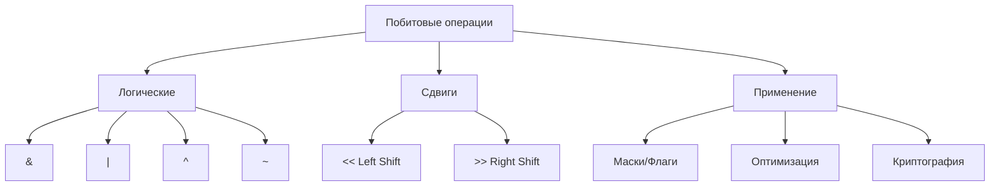
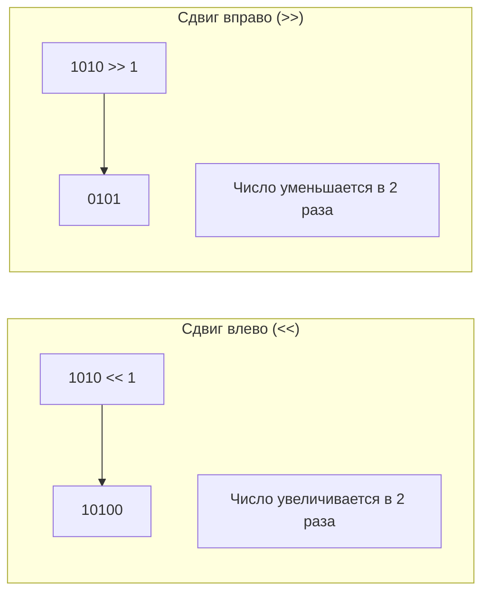
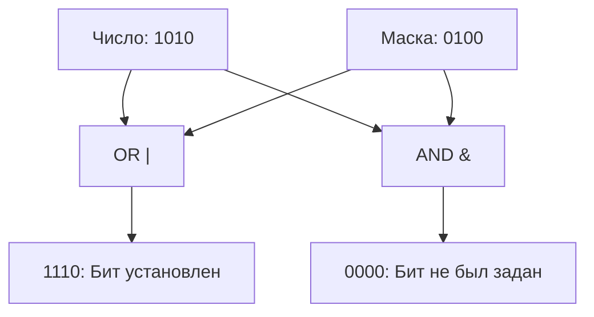
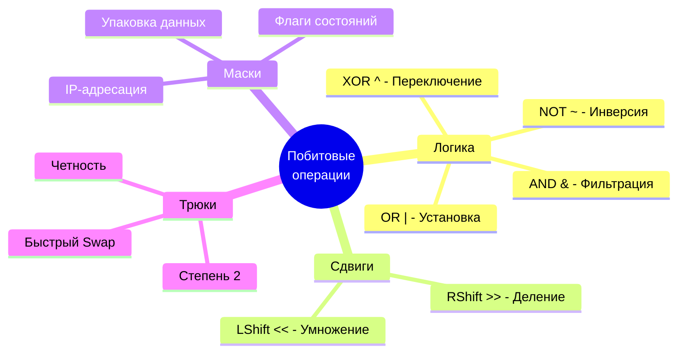

# ⚡ Побитовые операции и маски

## 📑 Содержание
1. [Что такое побитовые операции?](#1-что-такое-побитовые-операции)
2. [Основные операции](#2-основные-операции)
3. [Зачем они нужны?](#3-зачем-они-нужны)
4. [Битовые маски](#4-битовые-маски)
5. [Продвинутые приемы](#5-продвинутые-приемы)

---

Побитовые операции позволяют манипулировать данными на самом низком уровне — на уровне отдельных битов. Это фундамент оптимизации, работы с железом и сетевых протоколов.



---

## 1. 🧩 Что такое побитовые операции?

В отличие от обычных арифметических операций, которые работают с числами целиком, побитовые операции обрабатывают каждый бит числа по отдельности или сдвигают всю последовательность битов.

- **Операнды**: Обычно целые числа (int, uint, byte).
- **Принцип**: Число переводится в двоичную систему, и операция применяется к соответствующим парам битов.

> [!NOTE]
> Побитовые операции выполняются процессором за один такт, что делает их невероятно быстрыми.

---

## 2. 🛠 Основные операции

### Логические побитовые операции

| Операция | Символ | Описание | Пример (A=10, B=12) | Результат |
|:---|:---:|:---|:---|:---|
| **AND** | `&` | 1, если оба бита равны 1 | `1010 & 1100` | `1000` (8) |
| **OR** | `\|` | 1, если хотя бы один бит равен 1 | `1010 \| 1100` | `1110` (14) |
| **XOR** | `^` | 1, если биты разные | `1010 ^ 1100` | `0110` (6) |
| **NOT** | `~` | Инвертирует все биты (0→1, 1→0) | `~1010` (8 бит) | `11110101` |

### Битовые сдвиги



- **`<< n`**: Сдвигает биты влево на `n` позиций. Справа дописываются нули. Эквивалентно умножению на $2^n$.
- **`>> n`**: Сдвигает биты вправо. Слева дописывается знак (для знаковых) или нули (для беззнаковых). Эквивалентно целочисленному делению на $2^n$.

---

## 3. 🚀 Зачем они нужны?

1. **Компактное хранение данных**: Можно хранить 8 логических флагов (true/false) в одном байте вместо 8 отдельных переменных `bool`.
2. **Работа с аппаратным обеспечением**: Управление регистрами процессора, портами ввода-вывода.
3. **Сетевые протоколы**: Чтение заголовков пакетов (IP, TCP), где данные упакованы максимально плотно.
4. **Оптимизация**: Замена дорогих операций (умножение, деление, остаток от деления) на быстрые побитовые.
5. **Графика и Криптография**: Манипуляция цветами пикселей (RGB) и алгоритмы шифрования (AES, DES).

---

## 4. 👺 Битовые маски

**Битовая маска** — это число, которое используется для выделения, установки или сброса конкретных битов в другом числе.

### Основные приемы

#### 1. Проверка бита (Is bit set?)
Используем `&` с маской, где нужный бит равен 1.
```go
mask := 1 << 3 // Проверяем 3-й бит (00001000)
isSet := (value & mask) != 0
```

#### 2. Установка бита (Set bit)
Используем `|` (OR) — этот бит станет 1, остальные не изменятся.
```go
value = value | (1 << 3) 
```

#### 3. Сброс бита (Clear bit)
Используем `&` с инвертированной маской.
```go
value = value & ^(1 << 3) // В Go ^ это NOT для констант
```

#### 4. Переключение бита (Toggle bit)
Используем `^` (XOR).
```go
value = value ^ (1 << 3)
```



---

## 5. 💡 Продвинутые приемы

### Проверка на четность
Вместо `n % 2 == 0` используйте:
```go
if n & 1 == 0 {
    // Четное
}
```

### Проверка, является ли число степенью двойки
У степеней двойки установлен только один бит (например, 8 = `1000`).
```go
if n > 0 && (n & (n - 1)) == 0 {
    // Степень двойки!
}
```

### Обмен значений без временной переменной (XOR Swap)
```go
a = a ^ b
b = a ^ b
a = a ^ b
```

> [!WARNING]
> XOR Swap — это скорее забавный трюк. В современном коде лучше использовать стандартный обмен, так как компиляторы оптимизируют его лучше.

---

## 🎯 Заключение



Побитовые операции — это мощный инструмент. Хотя в повседневной веб-разработке они встречаются нечасто, они незаменимы при написании драйверов, высокопроизводительных систем, игровых движков и в любой задаче, где важен каждый байт и каждый такт процессора.
