# ⚡ Основы электроники и физические принципы

## 📑 Содержание
1. [Электричество и сигналы](#1-электричество-и-сигналы)
2. [Полупроводники](#2-полупроводники)
3. [Транзисторы](#3-транзисторы)
4. [Логические элементы](#4-логические-элементы)
5. [Интегральные схемы](#5-интегральные-схемы)

---

Электроника лежит в основе работы компьютеров. Компьютеры используют электрические сигналы для обработки и передачи данных. Этот раздел объясняет, как электричество, полупроводники и транзисторы создают фундамент для цифровых систем.

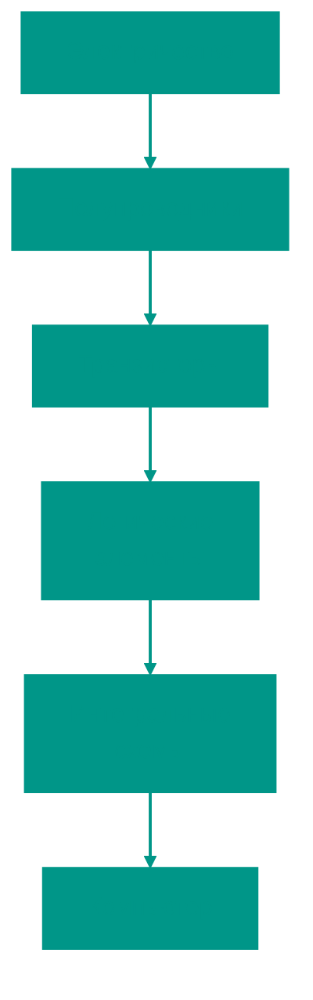

---

## 1. 🔌 Электричество и сигналы

Электричество — это движение электронов через проводник. В компьютерах оно используется для передачи сигналов.

### Основные понятия

- **Напряжение (V)**: Разность потенциалов, "давление", которое заставляет электроны двигаться (измеряется в вольтах)
- **Ток (I)**: Поток электронов (измеряется в амперах)
- **Сопротивление (R)**: Препятствие движению тока (измеряется в омах)

> [!NOTE]
> **Закон Ома**: V = I × R. Этот фундаментальный закон описывает связь между напряжением, током и сопротивлением.

### 💧 Аналогия с водопроводом

Чтобы понять электричество, представьте водопроводную систему:

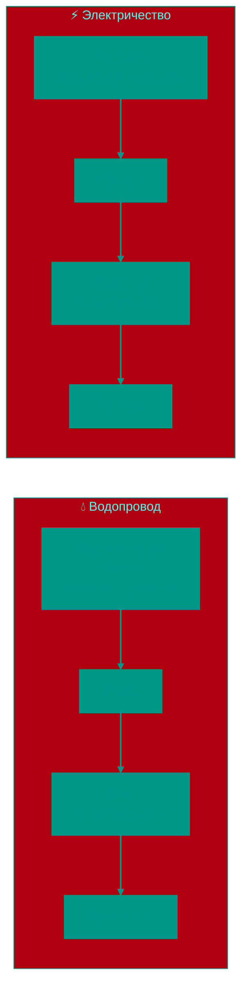

| Водопровод | Электричество | Что это значит |
|:---|:---|:---|
| **Давление воды** | **Напряжение (V)** | Сила, "толкающая" поток |
| **Поток воды** | **Ток (I)** | Количество, проходящее за секунду |
| **Узкая труба/кран** | **Сопротивление (R)** | Препятствие на пути |
| Большое давление + узкая труба | Высокое напряжение + большое сопротивление | Средний поток/ток |

> [!TIP]
> **Житейский пример**: Если вы частично закрываете кран (увеличиваете сопротивление), поток воды уменьшается, даже если давление в башне остается тем же. Точно так же резистор в электрической цепи ограничивает ток!

### Цифровые сигналы

- Компьютеры используют **двоичные сигналы**: высокий уровень напряжения (обычно 5V или 3.3V) обозначает **1**, низкий (0V) — **0**
- **Аналоговые сигналы** (непрерывные) в компьютерах преобразуются в цифровые через **АЦП** (аналого-цифровой преобразователь)

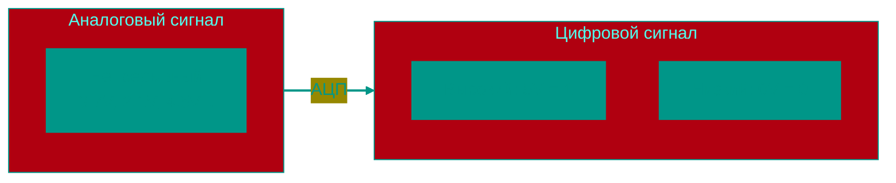

> [!TIP]
> **Пример**: В USB напряжение 5V используется для питания устройств, а данные передаются через изменения напряжения (сигналы).

---

## 2. 🧪 Полупроводники

Полупроводники — материалы, которые могут проводить ток, но не так хорошо, как металлы. Они ключевые для электроники.

### Свойства

- Основной материал — **кремний** (Si), иногда германий (Ge)
- Проводимость регулируется добавлением примесей (**легирование**):
  - **n-тип**: Добавление атомов с лишними электронами (например, фосфор)
  - **p-тип**: Добавление атомов с недостатком электронов (например, бор)

### 🅿️ Аналогия с парковкой

Представьте парковку с местами для машин:

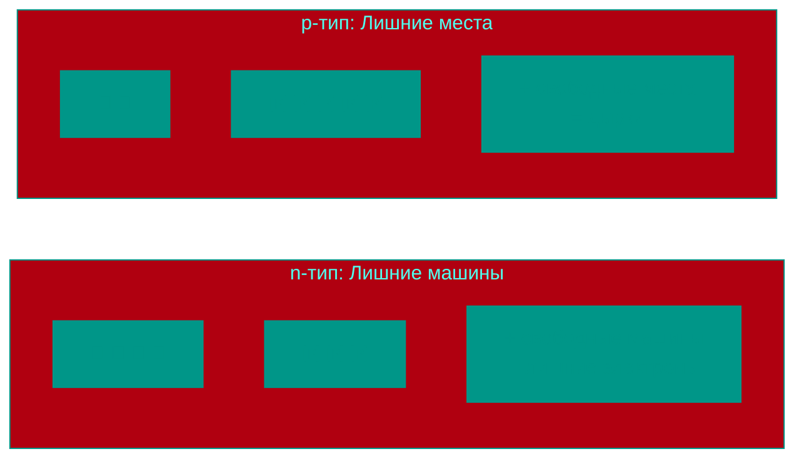

- **n-тип** = парковка с **лишними машинами** (машины могут уехать → электроны могут двигаться)
- **p-тип** = парковка с **лишними местами** (машины могут приехать → дырки могут "двигаться")

> [!NOTE]
> На самом деле в p-типе двигаются не сами "дырки", а электроны перепрыгивают с места на место, создавая эффект движения пустых мест, как в игре "пятнашки"!

### p-n переход

Соединение n-типа и p-типа создаёт **диод** — устройство, пропускающее ток только в одном направлении.

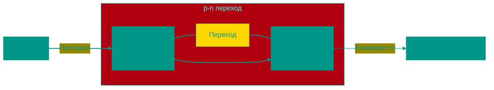

> [!NOTE]
> **Применение**: Диоды в блоке питания компьютера преобразуют переменный ток (AC) в постоянный (DC).

---

## 3. 🔳 Транзисторы

**Транзистор** — ключевой элемент компьютера, выполняющий функции переключателя или усилителя.

### Типы транзисторов

- **BJT** (биполярный): Управляется током
- **MOSFET** (полевой): Управляется напряжением, используется в большинстве современных процессоров

### Как работает MOSFET

- Имеет три вывода: **исток** (source), **сток** (drain), **затвор** (gate)
- Напряжение на затворе открывает или закрывает канал для тока между истоком и стоком
- В цифровых схемах транзистор либо "включён" (**1**), либо "выключен" (**0**)

### 🚰 Аналогия с водяным краном

| Водяной кран | MOSFET | Результат |
|:---|:---|:---|
| Ручка закрыта | Затвор: 0V | Канал закрыт, вода/ток **НЕ** течет (**бит 0**) |
| Ручка открыта | Затвор: 5V | Канал открыт, вода/ток **течет** (**бит 1**) |

> [!IMPORTANT]
> Транзистор как кран, которым можно управлять **электрически**! Подали напряжение на затвор — "открыли кран" и пустили ток. Это позволяет одному сигналу управлять другим, создавая логику.

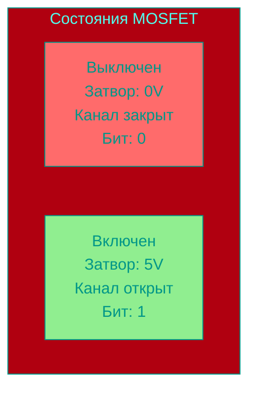

### Роль в компьютерах

- Транзисторы формируют **логические элементы** (например, AND, OR, NOT)
- В одном процессоре (например, Intel Core) — миллиарды транзисторов

> [!IMPORTANT]
> В процессоре транзисторы переключаются **миллиарды раз в секунду**, выполняя вычисления. Это основа всех современных компьютеров.

---

## 4. 🧩 Логические элементы

Логические элементы — это комбинации транзисторов, выполняющие базовые логические операции.

### Основные элементы

| Элемент | Описание | Правда, если... |
|:---|:---|:---|
| **AND** | Логическое И | Все входы 1 |
| **OR** | Логическое ИЛИ | Хотя бы один вход 1 |
| **NOT** | Логическое НЕ | Инвертирует вход (0 → 1, 1 → 0) |
| **NAND** | НЕ-И | Не все входы 1 |
| **NOR** | НЕ-ИЛИ | Все входы 0 |
| **XOR** | Исключающее ИЛИ | Только один вход 1 |

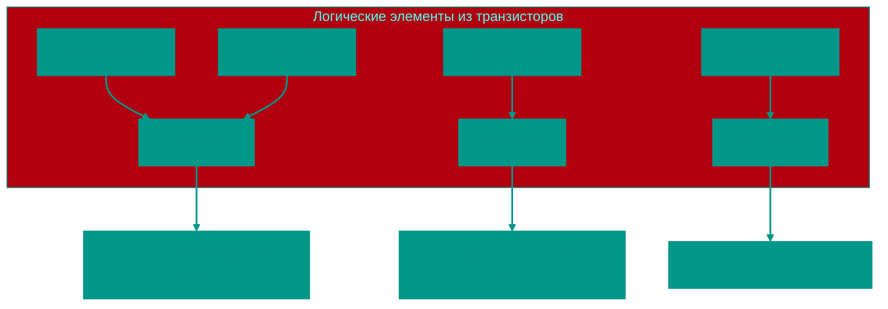

> [!TIP]
> **Пример**: Элемент XOR используется в сумматорах для сложения двоичных чисел.

### 🧮 Практический пример: Полусумматор

Давайте посмотрим, как логические элементы работают вместе для сложения двух битов:

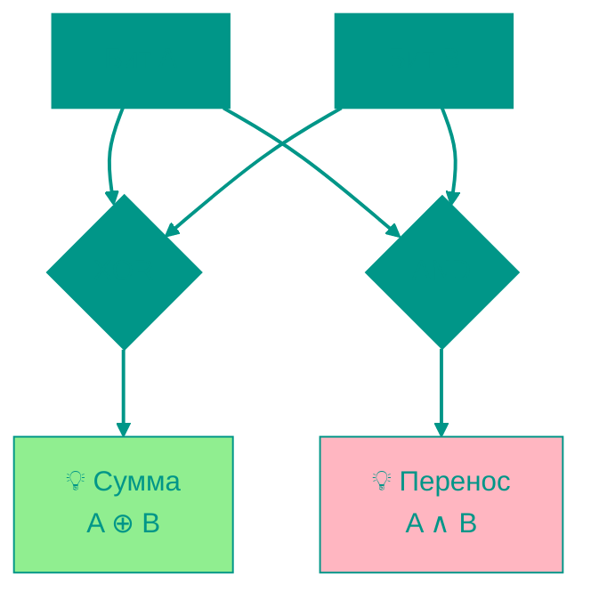

**Пример вычисления: 1 + 1 = ?**

| A | B | Сумма (XOR) | Перенос (AND) | Двоичный результат | Десятичное |
|:-:|:-:|:-----------:|:-------------:|:------------------:|:----------:|
| 0 | 0 | 0 | 0 | **00** | 0 |
| 0 | 1 | 1 | 0 | **01** | 1 |
| 1 | 0 | 1 | 0 | **01** | 1 |
| 1 | 1 | 0 | 1 | **10** | 2 |

> [!NOTE]
> Когда складываем **1 + 1**, получаем **сумму = 0** и **перенос = 1**, что дает двоичное **10** (десятичное 2). Это именно то, как работает сложение в процессоре!

---

## 5. 🏗️ Интегральные схемы

**Интегральная схема (IC)** — множество транзисторов и других компонентов на одном кристалле кремния.

### Типы

- **Аналоговые**: Усилители, фильтры
- **Цифровые**: Процессоры, память
- **Смешанные**: Например, АЦП

### Эволюция (Закон Мура)

> [!NOTE]
> **Закон Мура**: Количество транзисторов на чипе удваивается примерно каждые 2 года. Хотя сейчас этот закон замедляется, он определял развитие компьютеров десятилетиями.

### 🚀 Сравнение вычислительной мощности

| Устройство | Год | Транзисторов | Частота | Мощность |
|:---|:---:|:---:|:---:|:---|
| **Apollo 11 (компьютер)** | 1969 | ~4,000 | 2 МГц | Доставил людей на Луну |
| **Intel 8086** | 1978 | 29,000 | 5 МГц | Первый ПК |
| **Pentium** | 1993 | 3.1M | 60 МГц | Мультимедиа-компьютеры |
| **iPhone 6** | 2014 | ~2B | 1.4 ГГц | В кармане! |
| **Apple M1** | 2020 | 16B | 3.2 ГГц | Редактирование 8K-видео |
| **iPhone 15 Pro (A17)** | 2023 | ~19B | 3.7 ГГц | Мощнее компьютера 2010-х |

> [!IMPORTANT]
> Ваш современный смартфон содержит **в миллионы раз больше транзисторов**, чем компьютер, который отправил людей на Луну! Эта миниатюризация и есть суть технологического прогресса.

### Примеры

- **Микропроцессор**: Содержит ALU, регистры, управляющие блоки
- **Память**: DRAM, SRAM, Flash

> [!IMPORTANT]
> Процессор Intel Core i9 — это интегральная схема с ~10 млрд транзисторов на кристалле размером с ноготь!

---

## 🌍 Прикладные примеры в повседневной жизни

Теперь давайте посмотрим, как все эти принципы работают в реальных устройствах, которыми вы пользуетесь каждый день.

### 🔌 USB-кабель: Питание + Передача данных

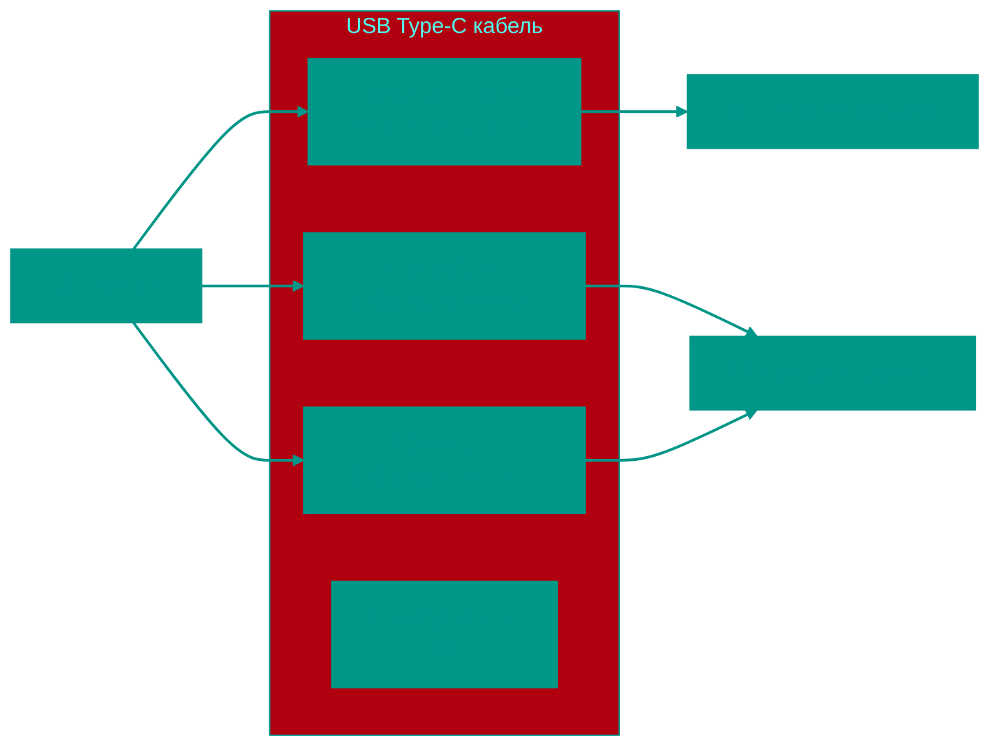

**Что происходит внутри:**
- **Провод питания (5V)**: Постоянное напряжение для зарядки батареи
- **Провода данных (D+/D-)**: Передают **цифровые сигналы** (0 = 0V, 1 = 3.3V)
  - Скорость: до 40 Гбит/с (USB 4.0) = **40 миллиардов переключений 0/1 в секунду**!

> [!TIP]
> **Житейский пример**: Когда вы подключаете телефон к компьютеру через USB, одновременно происходит **два процесса**: зарядка (постоянный ток 5V) и передача файлов (быстрые переключения 0/1 на проводах D+/D-).

### 🔋 Зарядка телефона: От розетки до батареи

**Как это работает:**

1. **Розетка**: Переменный ток (AC) 220V, 50 Гц (направление меняется 50 раз в секунду)
2. **Адаптер** содержит:
   - **Трансформатор**: Понижает 220V → 5V
   - **Диодный мост** (4 диода): Преобразует AC → DC (пульсирующий)
   - **Конденсатор**: Сглаживает пульсации → стабильные 5V DC
3. **Батарея**: Получает постоянный ток для зарядки

> [!NOTE]
> **Применение p-n перехода**: Диоды в адаптере — это именно те **p-n переходы**, которые мы обсуждали! Они пропускают ток только в одном направлении, превращая переменный ток в постоянный.

### 📺 LED-дисплей: Управление миллионами пикселей

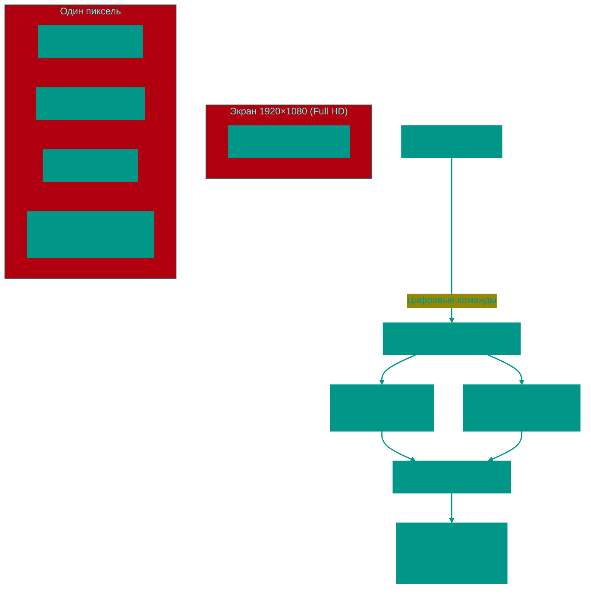

**Как зажигается один пиксель:**

1. **Видеокарта** отправляет команду: "Пиксель [500, 300] = красный (255, 0, 0)"
2. **Контроллер** через **мультиплексор** выбирает нужную строку (300) и столбец (500)
3. **Транзисторы** в этом пикселе:
   - Открывают **красный LED** на полную мощность (255/255)
   - Закрывают **зеленый** и **синий** LED (0/255)
4. Свет смешивается → мы видим **красный цвет**!

> [!IMPORTANT]
> Для экрана Full HD (1920×1080) нужно контролировать **~2 миллиона пикселей × 3 LED = 6 миллионов светодиодов**, каждый управляется транзистором! Это обновляется **60 раз в секунду** (60 Гц), создавая плавную картинку.

**Расчет количества операций:**
- 1920 × 1080 = 2,073,600 пикселей
- Каждый пиксель = 3 транзистора (RGB)
- **Всего транзисторов: ~6.2 миллиона**
- Частота обновления: 60 Гц
- **Переключений в секунду: 372 миллиона!**

> [!TIP]
> **Современные дисплеи 4K** (3840×2160) содержат **~25 миллионов транзисторов** только для управления светодиодами!

### 🎹 Клавиатура: От нажатия до символа на экране

**Детальный процесс:**

1. **Нажатие**: Физический контакт замыкается → напряжение меняется с 0V → 5V (**бит 0 → 1**)
2. **Контроллер клавиатуры** (маленький процессор!):
   - Сканирует матрицу клавиш (например, 6 строк × 18 столбцов)
   - Обнаруживает, что строка #2, столбец #5 активна
   - Определяет: это клавиша **'A'**
   - Генерирует **скан-код**: `0x1E` (двоичное: `00011110`)
3. **USB**: Передает скан-код как последовательность битов
4. **ОС**: Распознает код → выводит символ на экран через видеокарту

> [!NOTE]
> От момента нажатия клавиши до появления символа на экране проходит **~10-50 миллисекунд** (0.01-0.05 секунды) — это кажется мгновенным, но за это время процессор успевает выполнить **миллионы операций**!

---

## 🎯 Ключевые выводы

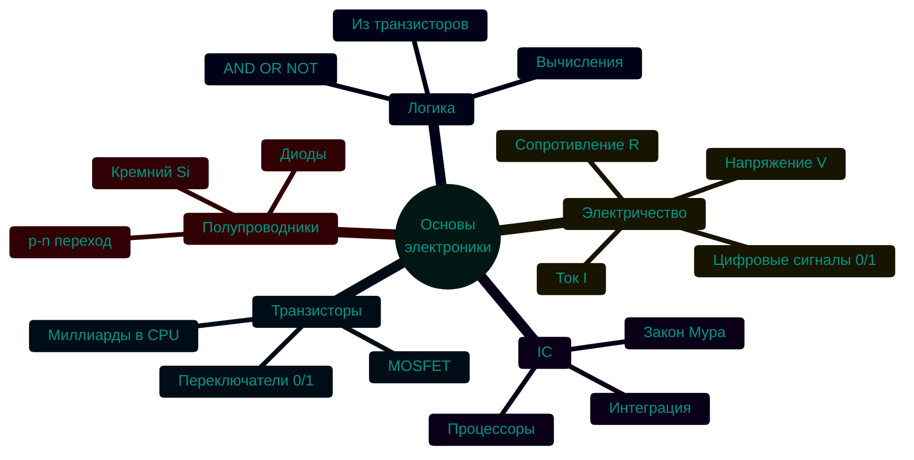

- Электричество передаёт сигналы, которые компьютеры интерпретируют как **0** и **1**
- Полупроводники (кремний) и p-n переходы — основа диодов и транзисторов
- Транзисторы — переключатели, из которых строятся логические элементы
- Логические элементы формируют интегральные схемы, такие как процессоры
- Всё это — физическая основа для работы компьютера

<!-- QUIZ_START 
[
    {
        "question": "Какой материал является основным для создания современных полупроводников?",
        "options": ["Медь", "Кремний", "Золото", "Германий"],
        "correctIndex": 1
    },
    {
        "question": "Какую роль играет транзистор в цифровой логике?",
        "options": ["Хранит энергию", "Усиливает звук", "Работает как переключатель (0/1)", "Преобразует AC в DC"],
        "correctIndex": 2
    },
    {
        "question": "Какое физическое свойство полупроводников используется для управления током в транзисторе?",
        "options": ["Наличие p-n перехода", "Магнитное поле", "Световое излучение", "Радиоактивность"],
        "correctIndex": 0
    }
]
QUIZ_END -->
