# 🧠 Цифровая логика и булева алгебра


## 📑 Содержание

1. [Булева алгебра](#1-булева-алгебра)
2. [Комбинационная логика](#2-комбинационная-логика)
3. [Последовательная логика](#3-последовательная-логика)
4. [Конечные автоматы](#4-конечные-автоматы)

---

Цифровая логика — это основа работы компьютеров, которая позволяет обрабатывать двоичные сигналы (**0** и **1**) с помощью логических операций. Булева алгебра предоставляет математическую основу для проектирования и анализа цифровых схем.

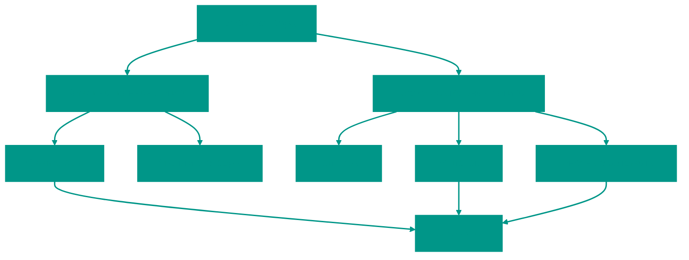

---


## 1. 📐 Булева алгебра

Булева алгебра — это раздел математики, который работает с логическими значениями (**TRUE/1** и **FALSE/0**) и операциями над ними.


### Основные операции ⚡

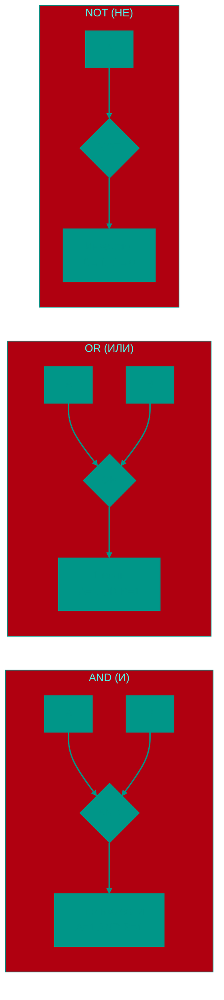

| Операция            | Обозначение | Описание        | Результат 1, если...            |
| :------------------ | :---------: | :-------------- | :------------------------------ |
| **AND (И)**         |    A ∧ B    | Логическое И    | Оба A и B равны 1               |
| **OR (ИЛИ)**        |    A ∨ B    | Логическое ИЛИ  | Хотя бы один из A или B равен 1 |
| **NOT (НЕ)**        |     ¬A      | Инверсия        | A = 0                           |
| **NAND (НЕ-И)**     |  ¬(A ∧ B)   | Инверсия AND    | Не все входы 1                  |
| **NOR (НЕ-ИЛИ)**    |  ¬(A ∨ B)   | Инверсия OR     | Все входы 0                     |
| **XOR (Искл. ИЛИ)** |    A ⊕ B    | Исключающее ИЛИ | Только один вход равен 1        |


### 🧑‍🤝‍🧑 Житейские аналогии

**Представьте принятие решений в повседневной жизни:**

```mermaid
%%{init: { 'theme': 'base', 'themeVariables': { 'lineColor': '#009688', 'primaryColor': '#009688', 'primaryTextColor': '#009688', 'attributeBkg': '#009688', 'attributeTextColor': '#009688', 'signalColor': '#009688', 'actorLineColor': '#009688', 'nodeBorder': '#009688', 'clusterBorder': '#009688', 'textColor': '#009688', 'fontSize': '16px' } } }%%
graph TD
    subgraph AND_Example["AND: Идти на пляж?"]
        Sunny[☀️ Солнечно?] --> Decision1{И}
        Weekend[🗓️ Выходной?] --> Decision1
        Decision1 -->|Оба ДА| Go[✅ Идём!]
        Decision1 -->|Хотя бы один НЕТ| Stay1[❌ Остаёмся дома]
    end
    
    subgraph OR_Example["OR: Смотреть фильм?"]
        Netflix[📺 Есть Netflix?] --> Decision2{ИЛИ}
        Cinema[🎬 Билеты в кино?] --> Decision2
        Decision2 -->|Хотя бы один ДА| Watch[✅ Смотрим!]
        Decision2 -->|Оба НЕТ| Skip[❌ Не смотрим]
    end
    
    subgraph NOT_Example["NOT: Брать зонт?"]
        Rain[🌧️ Дождь?] --> Decision3{НЕ}
        Decision3 -->|НЕТ дождя| NoUmbrella[✅ Зонт НЕ нужен]
        Decision3 -->|ДА дождь| TakeUmbrella[❌ Надо взять зонт]
    end
    linkStyle default stroke:#009688,stroke-width:2px;







```

| Логический элемент | Житейская ситуация | Пример |
|:---|:---|:---|
| **AND** | Должны выполниться ВСЕ условия | "Пойду гулять, ЕСЛИ солнечно **И** выходной" |
| **OR** | Достаточно ОДНОГО условия | "Поеду на работу на машине ИЛИ на метро" |
| **NOT** | Инверсия (противоположность) | "ЕСЛИ **НЕ** холодно, куртку не надену" |
| **XOR** | Только ОДНО, но не оба | "На ужин пицца **ЛИБО** суши (не оба сразу)" |

> [!TIP]
> **Голосование как XOR**: Представьте выборы с двумя кандидатами. Вы голосуете **либо** за A, **либо** за B, но не за обоих одновременно. Если оба голоса одновременно — это ошибка!


### Законы булевой алгебры 📚

| Закон                | Пример                                 |
| :------------------- | :------------------------------------- |
| **Коммутативность**  | A ∧ B = B ∧ A, A ∨ B = B ∨ A           |
| **Ассоциативность**  | (A ∧ B) ∧ C = A ∧ (B ∧ C)              |
| **Дистрибутивность** | A ∧ (B ∨ C) = (A ∧ B) ∨ (A ∧ C)        |
| **Закон Де Моргана** | ¬(A ∧ B) = ¬A ∨ ¬B, ¬(A ∨ B) = ¬A ∧ ¬B |
| **Идемпотентность**  | A ∧ A = A, A ∨ A = A                   |

> [!TIP]
> **Применение**: Упрощение логических выражений для оптимизации схем и проектирования цифровых устройств (например, процессоров).

> [!NOTE]
> **Пример упрощения**: Упростим выражение A ∧ (A ∨ B).
>
> По дистрибутивности: A ∧ (A ∨ B) = (A ∧ A) ∨ (A ∧ B) = A ∨ (A ∧ B)
>
> Затем: A ∨ (A ∧ B) = A (поглощение)

---


## 2. 🧩 Комбинационная логика

Комбинационная логика — это схемы, где выход зависит **только от текущих входов**, без учёта предыдущих состояний.


### Основные элементы


#### Сумматор

Складывает двоичные числа.

- **Полусумматор**: Складывает два бита, выдаёт сумму и перенос
- **Полный сумматор**: Учитывает входной перенос

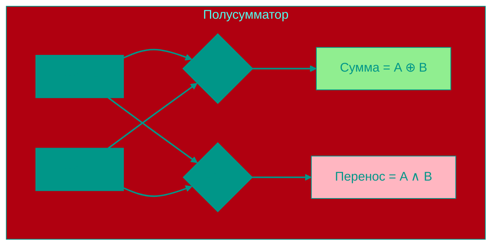

**Таблица истинности полусумматора**:

|  A  |  B  | Сумма (A ⊕ B) | Перенос (A ∧ B) |
| :-: | :-: | :-----------: | :-------------: |
|  0  |  0  |       0       |        0        |
|  0  |  1  |       1       |        0        |
|  1  |  0  |       1       |        0        |
|  1  |  1  |       0       |        1        |


#### Мультиплексор (MUX)

Выбирает один из нескольких входов по управляющему сигналу.

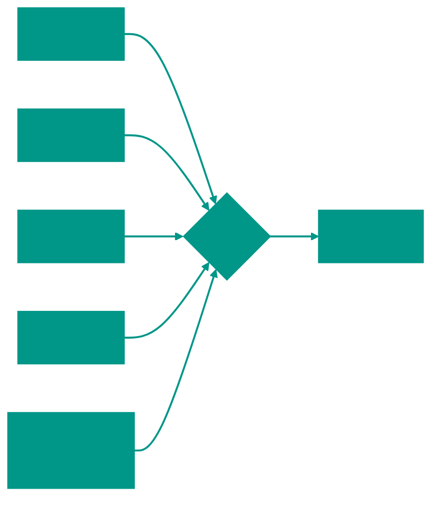


#### Демультиплексор (DEMUX)

Направляет входной сигнал на один из выходов.


#### Декодер / Энкодер

- **Декодер**: Преобразует двоичный код в сигнал на одном из выходов (например, `00` → выход 0, `01` → выход 1)
- **Энкодер**: Обратный декодеру, преобразует сигнал в двоичный код

> [!IMPORTANT]
> В процессоре сумматоры используются в **ALU** (арифметико-логическом устройстве) для выполнения операций сложения, вычитания и других арифметических операций.


#### 🧮 Практический пример: Калькулятор

**Как калькулятор складывает 25 + 17?**

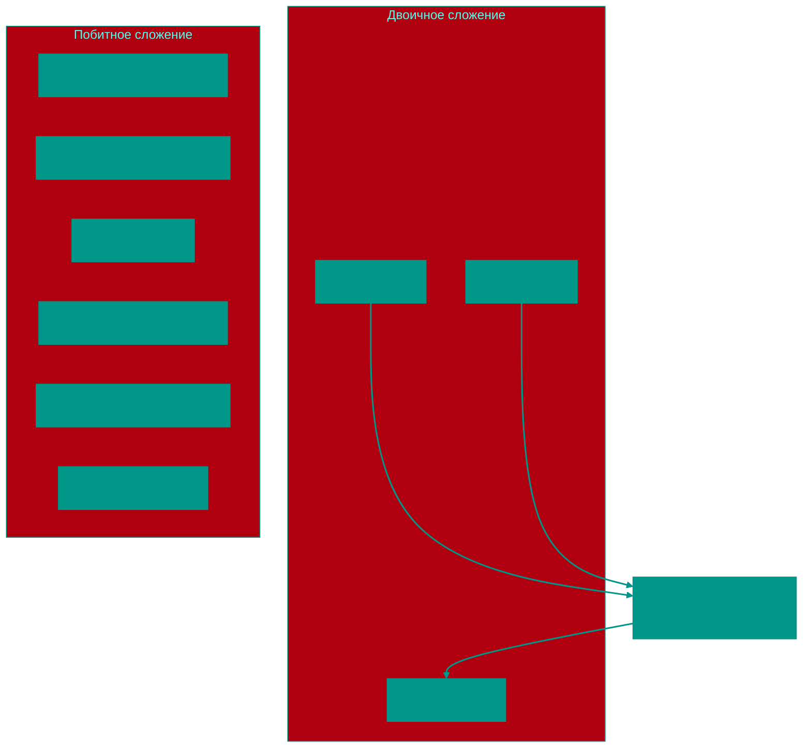

**Детальный расчет:**
```
  11001  (25)
+ 10001  (17)
-------
 101010  (42)
```

- Бит 0: `1 + 1 = 10` → сумма=0, перенос=1
- Бит 1: `0 + 0 + перенос(1) = 01` → сумма=1, перенос=0
- Бит 2: `0 + 0 = 00` → сумма=0, перенос=0
- Бит 3: `1 + 1 = 10` → сумма=0, перенос=1
- Бит 4: `1 + 1 + перенос(1) = 11` → сумма=1, перенос=1
- Бит 5: перенос(1) → сумма=1

**Результат: 101010₂ = 42₁₀** ✅

> [!NOTE]
> Процессор использует цепочку **полных сумматоров** (обычно 32 или 64 для современных процессоров), каждый из которых складывает один бит с учётом переноса. Это всё происходит за **наносекунды**!

---


## 3. ⏳ Последовательная логика

Последовательная логика — это схемы, где выход зависит от **текущих входов И предыдущих состояний** (памяти).


### Основные элементы


#### Триггеры

Хранят **1 бит** информации.

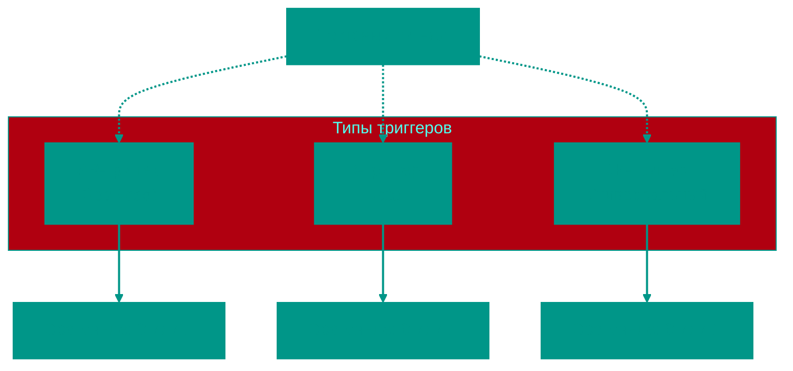

**Типы триггеров**:

- **SR-триггер**: Устанавливает (S) или сбрасывает (R) значение
- **D-триггер**: Хранит входное значение при сигнале синхронизации (тактовый сигнал)
- **JK-триггер**: Универсальный, может менять состояние по сложным условиям


#### Регистр

Группа триггеров для хранения нескольких битов (например, 32-битный регистр).

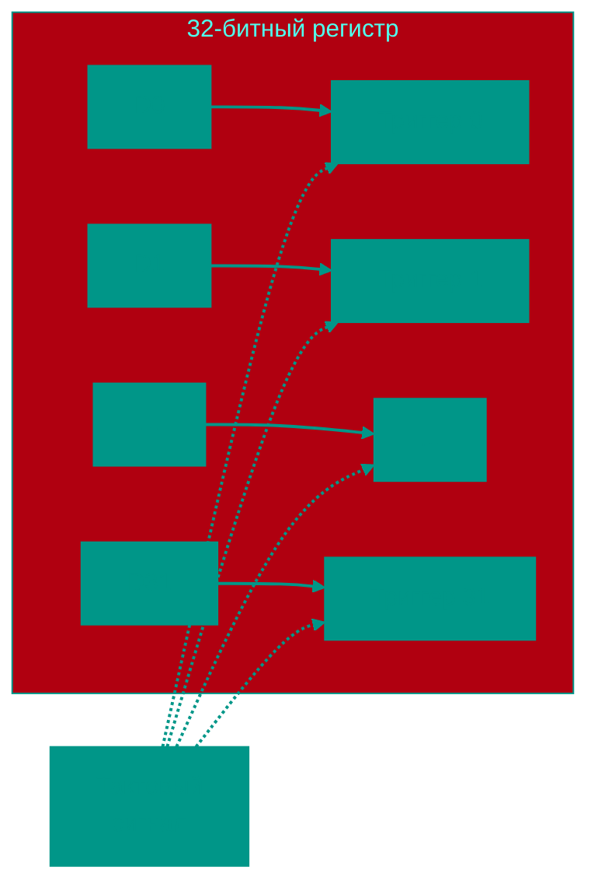


#### Счётчик

Последовательно увеличивает значение (например, от `000` до `111` в двоичной системе).


### Тактовый сигнал ⏱️

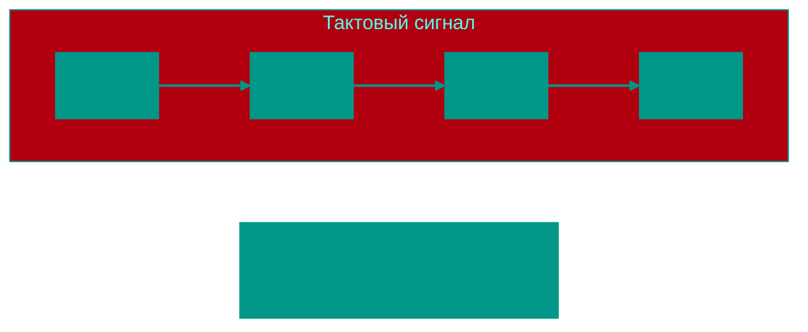

- Синхронизирует работу схем
- Частота тактового сигнала определяет, как часто обновляются состояния

> [!NOTE]
> Регистры в процессоре хранят промежуточные результаты вычислений, например, значение переменной или адрес в памяти.


#### 🎮 Практический пример: Игровой счётчик очков

**Представьте счётчик в видеоигре (0-15 очков):**

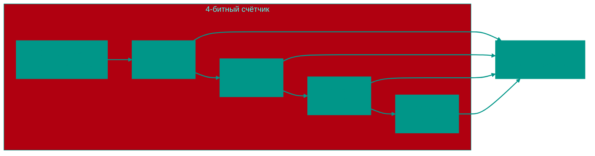

**Последовательность событий:**

| Событие | Бит 3 | Бит 2 | Бит 1 | Бит 0 | Двоичное | Очки |
|:---|:---:|:---:|:---:|:---:|:---:|:---:|
| Начало игры | 0 | 0 | 0 | 0 | `0000` | 0 |
| 🪙 Монетка #1 | 0 | 0 | 0 | 1 | `0001` | 1 |
| 🪙 Монетка #2 | 0 | 0 | 1 | 0 | `0010` | 2 |
| 🪙 Монетка #3 | 0 | 0 | 1 | 1 | `0011` | 3 |
| ... | ... | ... | ... | ... | ... | ... |
| 🪙 Монетка #15 | 1 | 1 | 1 | 1 | `1111` | 15 |
| 🪙 Монетка #16 | 0 | 0 | 0 | 0 | `0000` | 0 (переполнение!) |

**Как это работает:**
1. Каждый **триггер** хранит один бит (0 или 1)
2. При событии (собрали монетку) **тактовый сигнал** переключает триггеры
3. Биты формируют **двоичное число**, которое показывается на экране
4. При достижении максимума (15) счётчик сбрасывается в 0

> [!TIP]
> В реальных играх для счёта очков используются **32-битные регистры** (могут хранить до 4,294,967,295), поэтому переполнение счётчика очков практически невозможно!

---


## 4. 🤖 Конечные автоматы

**Конечный автомат** (Finite State Machine, FSM) — модель, описывающая поведение системы с ограниченным числом состояний.


### Компоненты 🧱

- **Состояния**: Например, \"включено\", \"выключено\"
- **Переходы**: Условия, при которых система меняет состояние (например, \"нажата кнопка\")
- **Входы**: Сигналы, влияющие на переходы
- **Выходы**: Результаты, зависящие от состояния или входов


### Визуализация: Светофор

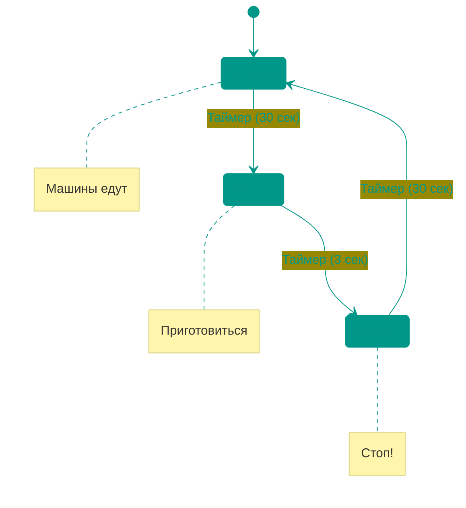


### Типы 🎨

| Тип              | Описание                                   | Выход зависит от  |
| :--------------- | :----------------------------------------- | :---------------- |
| **Автомат Мура** | Выход зависит только от текущего состояния | Только состояние  |
| **Автомат Мили** | Выход зависит от состояния и входов        | Состояние + входы |


### Применение 🚀

- Управление процессами в процессорах
- Протоколы связи (например, USB, TCP/IP)
- Игровая логика
- Управление устройствами

> [!TIP]
> **Пример**: Процессор использует конечные автоматы для управления **конвейером инструкций** (Fetch → Decode → Execute → Write Back).

---


## 🌍 Прикладные примеры в повседневной жизни

Теперь посмотрим, как цифровая логика работает в устройствах, которыми вы пользуетесь каждый день.


### ⌨️ Как работает кнопка на клавиатуре

**От физического нажатия до цифрового сигнала:**

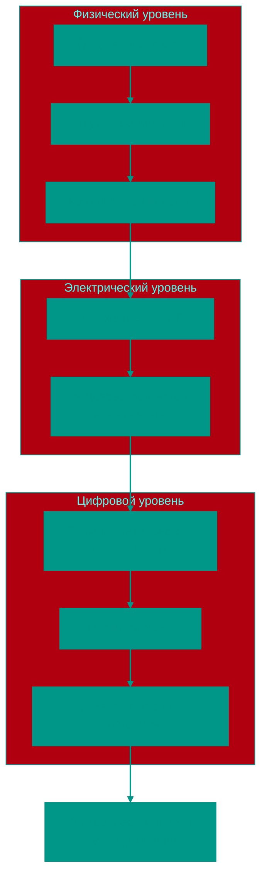

**Детальный процесс:**

1. **Физическое нажатие**:
   - Палец давит на клавишу → пружина сжимается
   - Металлические контакты соприкасаются

2. **Электрический сигнал**:
   - До нажатия: резистор «подтягивает» линию к 5V (логическая **1**)
   - После нажатия: контакт замыкается на землю → 0V (логическая **0**)
   - Или наоборот, в зависимости от схемы (активный низкий/высокий уровень)

3. **Проблема дребезга**:
   ```
   Идеальный сигнал:    _____|‾‾‾‾‾‾‾‾‾
   Реальный сигнал:     _____|‾|_|‾|_|‾‾‾  (контакты "прыгают")
   ```
   - При физическом замыкании контакты **"дребезжат"** ~1-10 мс
   - Создаются ложные переключения 0→1→0→1

4. **Решение — схема антидребезга**:
   - **Триггер Шмитта**: Имеет два порога переключения (например, 1.5V и 3.5V)
     - Переход 0→1: только когда напряжение > 3.5V
     - Переход 1→0: только когда напряжение < 1.5V
     - **Гистерезис** предотвращает ложные срабатывания
   - Или **RC-фильтр + триггер**: Конденсатор сглаживает скачки
   - Или **программный дебаунс**: Контроллер игнорирует изменения быстрее 20 мс

5. **Хранение состояния**:
   - **D-триггер** запоминает стабильный сигнал при тактовом импульсе
   - Выход триггера = «клавиша нажата» (1) или «отпущена» (0)

6. **Сканирование матрицы**:
   - Контроллер клавиатуры сканирует матрицу (например, 6 строк × 18 столбцов)
   - Определяет координаты нажатой клавиши
   - Генерирует скан-код и отправляет по USB

**Логическая схема антидребезга (SR-триггер):**

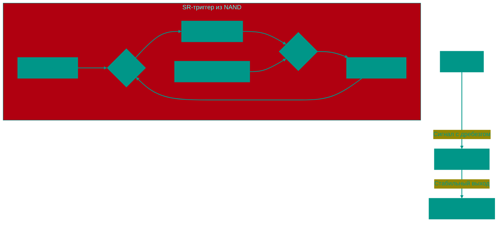

> [!IMPORTANT]
> Без схемы антидребезга одно нажатие клавиши могло бы быть воспринято как **множественные нажатия**! Попробуйте долго удерживать клавишу — символ повторяется, это **автоповтор**, реализованный программно в ОС, а не дребезг.


### 🔌 USB-протокол: Конечный автомат в действии

**USB-соединение управляется конечным автоматом:**

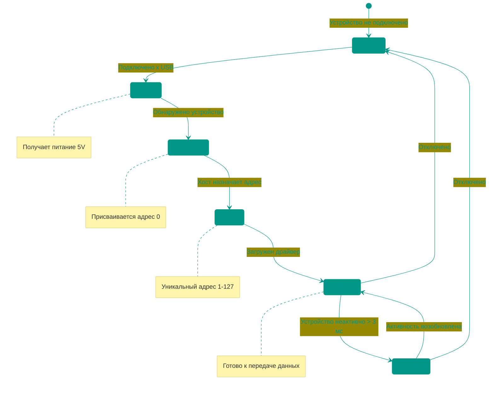

**Детальный процесс подключения флешки:**

1. **Состояние: Detached (Отключено)**
   - USB-порт мониторит линии D+/D- (оба в низком состоянии)

2. **Переход → Powered (Питание)**
   - Вы вставляете флешку → линия D+ подтягивается к 3.3V (через резистор 1.5 кОм)
   - Хост обнаруживает **изменение напряжения** → начинает подачу 5V по линии питания

3. **Переход → Default (По умолчанию)**
   - Хост отправляет **сигнал сброса** (SE0: D+ и D- = 0V в течение 10 мс)
   - Устройство получает временный адрес **0**
   - Хост запрашивает **дескриптор устройства** (кто ты? флешка, клавиатура, мышь?)

4. **Переход → Address (Адресация)**
   - Хост присваивает уникальный адрес (например, **3**)
   - Устройство отвечает подтверждением (**ACK**)

5. **Переход → Configured (Настроено)**
   - ОС загружает драйвер (для флешки: драйвер массового хранилища)
   - Устройство готово к работе: появляется в системе как диск **E:**

6. **Переход → Suspended (Приостановлено)**
   - Если нет активности > 3 мс → энергосбережение
   - Потребление снижается до 2.5 мА

7. **Переход → Detached (Отключено)**
   - Вы вытаскиваете флешку → линия D+ падает до 0V
   - Хост обнаруживает отключение

**Пакеты данных (упрощённо):**

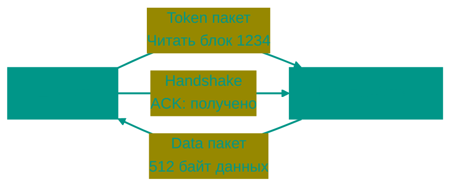

- **Token**: Команда от хоста ("прочитать", "записать")
- **Data**: Данные от/к устройству
- **Handshake**: Подтверждение (ACK) или ошибка (NAK)

> [!NOTE]
> Каждый **переход** в конечном автомате USB вызывается **событиями** (подключение, запрос, таймаут). Контроллер USB в вашем компьютере — это аппаратный **конечный автомат**, реализованный на транзисторах и триггерах!


### 🚦 Умный светофор с датчиками

**Расширенный пример: светофор реагирует на трафик**

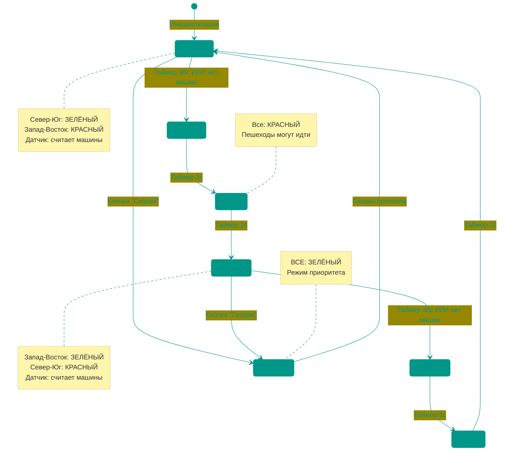

**Входы (что влияет на переходы):**
- ⏱️ **Таймеры**: 30 с (зелёный), 3 с (жёлтый), 2 с (красный)
- 🚗 **Датчики трафика**: Индукционные петли в асфальте считают машины
- 🚶 **Кнопка пешехода**: Запрос на переход
- 🚨 **Кнопка "Скорая"**: Экстренный режим

**Выходы (что делает автомат):**
- 🚦 Управление светодиодами (красный/жёлтый/зелёный на 4 направлениях)
- 📊 Отправка данных о трафике на сервер

**Логика адаптивного поведения:**

```python
# Псевдокод логики
if green_timer > 30 секунд:
    переход_к_желтому()
elif датчик_показывает_нет_машин() and green_timer > 10 секунд:
    переход_к_желтому()  # Досрочное переключение
elif кнопка_скорой_нажата():
    переход_к_экстренному_режиму()
```

> [!IMPORTANT]
> Современные **умные светофоры** используют **сложные конечные автоматы** с десятками состояний, учитывающие:
> - Время суток (ночью — мигающий жёлтый)
> - Плотность трафика (адаптивное время)
> - Приоритет общественного транспорта
> - Синхронизацию с соседними перекрёстками ("зелёная волна")

---


## 🎯 Ключевые выводы

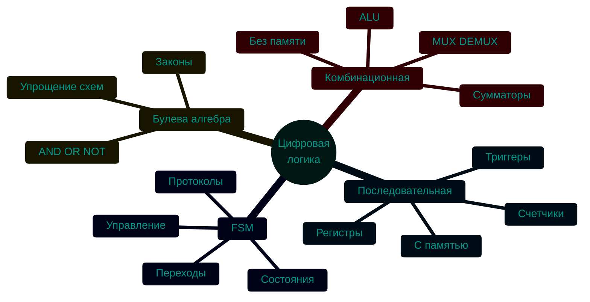

- **Булева алгебра** — математическая основа для работы с логическими операциями
- **Комбинационная логика** создаёт схемы, зависящие только от входов (сумматоры, мультиплексоры)
- **Последовательная логика** добавляет память через триггеры и регистры, синхронизируемые тактовым сигналом
- **Конечные автоматы** моделируют поведение систем с состояниями (процессоры, протоколы, устройства)
- Эти концепции — основа для проектирования процессоров и других цифровых систем

<!-- QUIZ_START 
[
    {
        "question": "Какой логический элемент выдает '1' только если ВСЕ его входы равны '1'?",
        "options": ["OR", "NAND", "XOR", "AND"],
        "correctIndex": 3
    },
    {
        "question": "Что отличает последовательную логику от комбинационной?",
        "options": ["Высокая скорость", "Наличие памяти (зависимость от прошлых состояний)", "Использование только 0 и 1", "Меньшее количество транзисторов"],
        "correctIndex": 1
    },
    {
        "question": "Какой аппаратный блок процессора отвечает за выполнение арифметических и логических операций?",
        "options": ["Регистры", "Управляющий блок (CU)", "Арифметико-логическое устройство (ALU)", "Кэш-память"],
        "correctIndex": 2
    }
]
QUIZ_END -->
