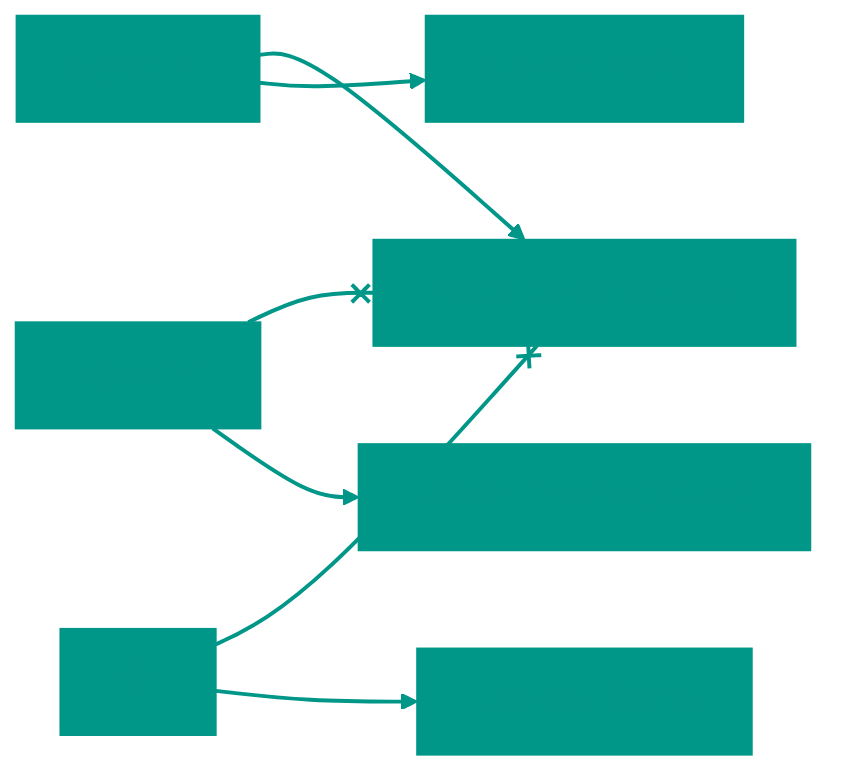

# 🎭 Кодирование данных и мультимедиа

## 📑 Содержание
1. [Введение: Аналоговый мир vs Цифровой](#введение)
2. [Кодирование текста](#1-кодирование-текста)
3. [Изображения и цвет](#2-изображения-и-цвет)
4. [Звук и аудио](#3-звук-и-аудио)
5. [Видео](#4-видео)

---

## Введение

Мы живем в **аналоговом** мире: свет плавно меняет яркость, звук скрипки перетекает из ноты в ноту.
Компьютер живет в **цифровом** мире: он понимает только "ДА" (1) и "НЕТ" (0).

**Кодирование** — это процесс превращения нашего плавного мира в четкие ступеньки из нулей и единиц.

---

## 1. ✍️ Кодирование текста

Как компьютер понимает букву 'А'? Он не видит картинку буквы. Для него 'А' — это порядковый номер в гигантском списке.

### Шаг 1: ASCII (Азбука Морзе для компьютеров)
В 60-х годах инженеры договорились:
- Число **65** — это 'A'.
- Число **97** — это 'a'.
- Число **33** — это '!'.

Всего влезло 128 символов. Этого хватило для английского, цифр и точечек.

### Шаг 2: Проблема Вавилона
Когда компьютеры появились в России, Китае и Европе, места перестало хватать.
Инженеры придумали **Unicode** — огромную таблицу, где есть место для ВСЕХ символов мира (более 140 000 знаков), включая эмодзи 🐵.

### Шаг 3: UTF-8 — Умная упаковка
**UTF-8** — это способ записать эти номера в память компьютера максимально экономно.

| Символ | Описание | Вес в памяти | В битах (упрощенно) |
|:---|:---|:---:|:---|
| **A** | Латиница | 1 байт | `01000001` |
| **Ф** | Кириллица | 2 байта | `11010000 10100100` |
| **🐵** | Эмодзи | 4 байта | `11110000 10011111 10001101 10010101` |

> [!TIP]
> **Аналогия**: Представьте, что вы пакуете чемодан.
> - Носки ('A') вы кладете в маленький кармашек (1 байт).
> - Ботинки ('Ф') — в пакет побольше (2 байта).
> - Пальто (Эмодзи) — в основной отсек (4 байта).
> UTF-8 не заставляет класть носки в огромный чемодан.

---

## 2. 🖼️ Изображения и цвет

Если посмотреть на экран через лупу, вы увидите миллионы крошечных цветных точек — **пикселей**.

### Рецепт цвета (RGB)
Каждый пиксель — это "кастрюля", в которой смешиваются три краски:
- **R** (Red) — Красный
- **G** (Green) — Зеленый
- **B** (Blue) — Синий

Компьютер хранит рецепт для каждого пикселя: "Сколько добавить красного? А зеленого?". Значения идут от **0** (нет цвета) до **255** (максимум).

**Примеры цветов:**
- `(255, 0, 0)` -> 🔴 Чистый красный
- `(0, 255, 0)` -> 🟢 Чистый зеленый
- `(0, 0, 0)` -> ⚫ Черный (свет выключен)
- `(255, 255, 255)` -> ⚪ Белый (все лампочки горят на максимум)

### YUV: Хитрость для видео
Хранить каждый кадр в RGB дорого. Инженеры заметили: **наш глаз отлично видит яркость, но плохо различает мелкие оттенки цвета.**
Мы превращаем картинку в:
- **Y** (Luma) — Черно-белая версия (контуры, яркость). Её мы храним в **отличном** качестве.
- **UV** (Chroma) — Цветная раскраска. Её мы сжимаем в 2-4 раза сильнее.

> [!NOTE]
> Это как детская раскраска: контуры четкие (Y), а цвета могут чуть-чуть вылезать за края (UV) — никто не заметит.

---

## 3. 🔊 Звук: От волны к цифре

Звук — это колебания воздуха. Как записать эти колебания в числа?

### Шаг 1: Микрофон
Микрофон превращает колебания воздуха в электрический ток. Чем громче звук — тем выше напряжение.

### Шаг 2: АЦП (Выборки)
Специальный чип (АЦП) замеряет уровень напряжения тысячи раз в секунду и записывает значения.

1. **Частота дискретизации (Sampling Rate)**: Как часто мы делаем замер.
   - **44 100 раз в сек (44.1 кГц)** — стандарт музыки.
   - **Аналогия**: Это как частота кадров в кино. Если снимать редко — движения будут дергаными.

2. **Битовая глубина (Bit Depth)**: Насколько точная у нас линейка для замера.
   - **8 бит** — линейка с делениями только по сантиметрам (звук как из старого радио).
   - **16 бит** — линейка с микронами (CD качество).

| Качество | Частота | Битность | Пример |
|:---|:---:|:---:|:---|
| 📞 Телефон | 8 кГц | 8 бит | Голос понятен, музыки нет |
| 💿 CD Диск | 44.1 кГц | 16 бит | Идеально для слуха |
| 🎬 Студия | 96 кГц | 24 бита | Для монтажа без потерь |

---

## 4. 🎬 Видео: Иллюзия движения

Видео — это просто очень быстрая последовательность картинок (кадров).

### Как сжать видео в 100 раз?
Если сохранять каждый кадр как полную картинку, фильм займет 200 Гигабайт.
Кодеки (программы для сжатия) используют хитрость: **они не сохраняют то, что не меняется**.

**Пример с мячом на траве:**
1. **Кадр 1 (I-Frame)**: Мы сохраняем фото поля и мяча целиком.
2. **Кадр 2 (P-Frame)**: Мяч сдвинулся на метр вправо. Кодек пишет: *"Возьми фон из прошлого кадра, а мяч подвинь сюда"*.
3. **Кадр 3 (P-Frame)**: Мяч еще сдвинулся. Кодек: *"Сдвинь мяч еще раз"*.

> [!IMPORTANT]
> - **I-frame (Ключевой)**: Полная картинка. Занимает много места.
> - **P-frame (Разностный)**: Хранит только отличия. Занимает **очень мало** места.
> Именно поэтому на плохом интернете картинка "рассыпается": вы потеряли I-кадр и видите "разницу" наложенную не туда.

---

## 🎯 Шпаргалка

- **Текст** = Номера букв в таблице (UTF-8).
- **Картинка** = Мозаика из пикселей (RGB рецепты).
- **Звук** = Замеры высоты волны 44000 раз в секунду.
- **Видео** = "Фон оставь, двигай только персонажа".

<!-- QUIZ_START 
[
    {
        "question": "В цветовой модели RGB какой цвет получится при смешивании (255, 255, 255)?",
        "options": ["Черный", "Красный", "Белый", "Серый"],
        "correctIndex": 2
    },
    {
        "question": "Что такое частота дискретизации (Sampling Rate) при записи звука?",
        "options": ["Громкость записи", "Количество замеров уровня сигнала в секунду", "Разрядность АЦП", "Количество каналов"],
        "correctIndex": 1
    },
    {
        "question": "Какой тип кадра в видеосжатии (кодеках) является ключевым и содержит полную картинку?",
        "options": ["P-frame", "B-frame", "I-frame", "D-frame"],
        "correctIndex": 2
    }
]
QUIZ_END -->
