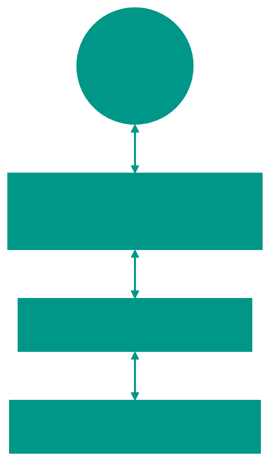
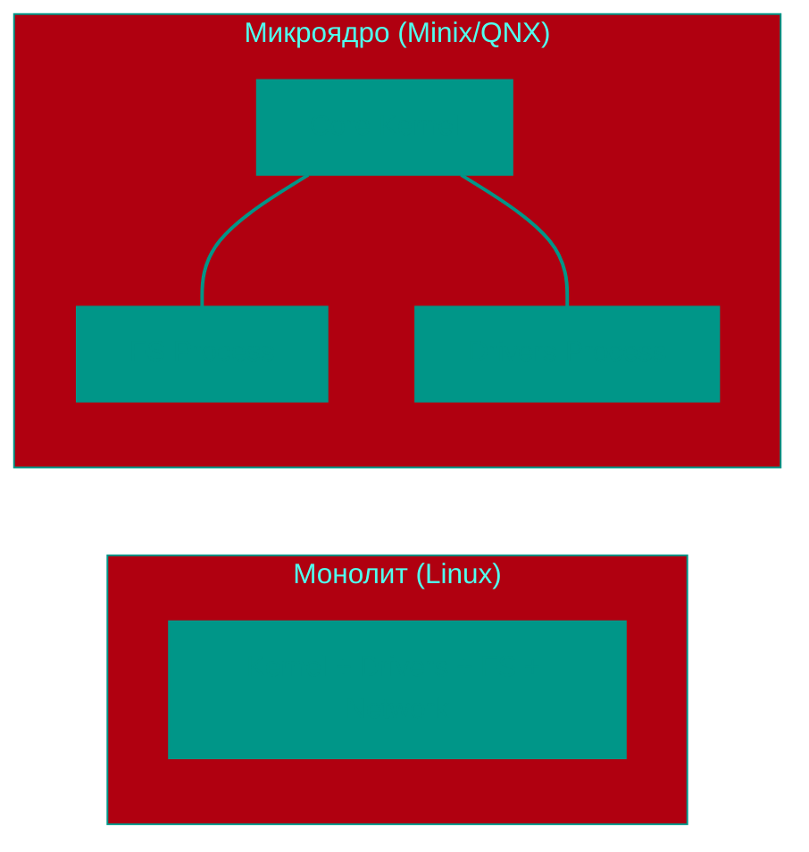
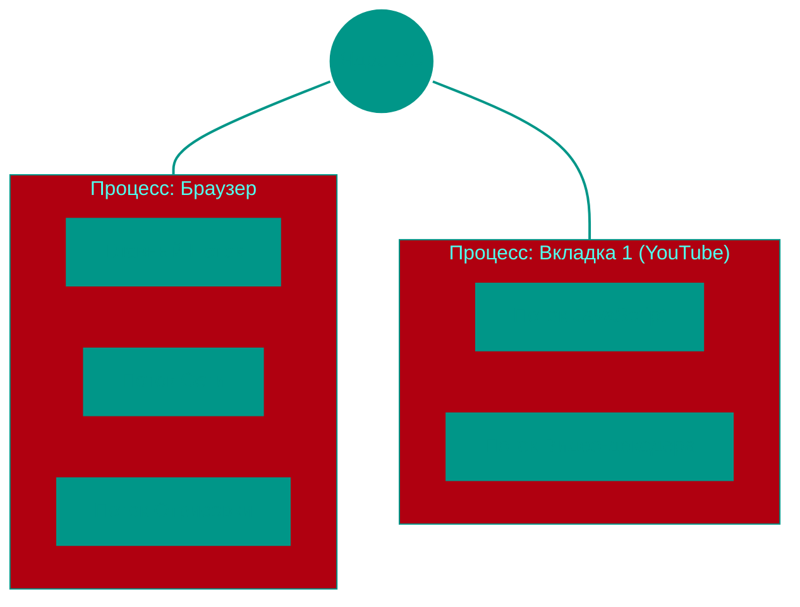
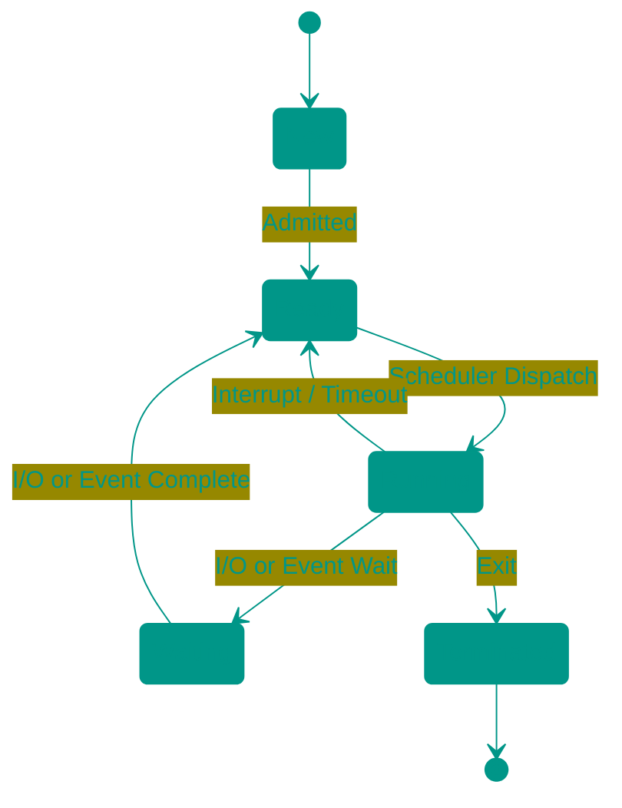
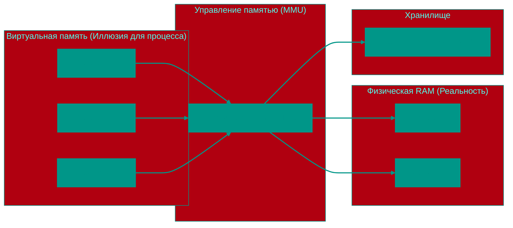

# 💻 Операционные системы (ОС)

## 📑 Содержание
1. [Роль и функции ОС](#1-что-такое-ос)
2. [Типы ОС](#2-типы-ос)
3. [Ядро ОС (Kernel)](#3-ядро-ос)
4. [Управление процессами и потоками](#31-управление-процессами)
5. [Виртуальная память](#32-управление-памятью)
6. [Файловые системы](#4-файловые-системы)
7. [Безопасность](#6-безопасность-в-ос)

---

Операционная система — это главный менеджер компьютера. Она делает так, чтобы программы могли работать с железом, не мешая друг другу.

---

## 1. 🛠️ Функции ОС

- **Абстракция**: Программисту не нужно знать, как именно записывать байты на разные модели SSD — он просто вызывает `file.Write()`.
- **Арбитраж**: Если две программы хотят напечатать документ, ОС выстраивает их в очередь.
- **Изоляция**: Если одна вкладка браузера "упадет", она не должна потянуть за собой всю систему.

---

## 2. 🧠 Ядро ОС (Kernel)

Ядро — это код, который всегда находится в памяти и имеет полный контроль над железом.

### Виды ядер:
- **Монолитное** (Linux): Все драйверы и функции внутри одного огромного бинарника. Очень быстро, но ошибка в драйвере может обрушить всё ядро.
- **Микроядро** (macOS/Darwin - частично, L4): В ядре только самое важное. Драйверы работают как обычные программы. Очень надежно, но медленнее из-за переключений контекста.

---

## 3. 🧵 Процессы и Потоки

### Процесс vs Поток

Представьте **завод**:
- **Процесс** — это целое здание завода. У него свой адрес, свои ресурсы (электричество, вода) и свои стены, которые защищают его от соседних заводов.
- **Поток (Thread)** — это рабочий внутри этого завода. Все рабочие находятся в одном здании, пользуются общими ресурсами, но каждый делает свою задачу.

| Характеристика | Процесс 🏢 | Поток 🧵 |
|:---|:---|:---|
| **Изоляция** | Полная (крах одного не затронет других) | Низкая (ошибка в одном потоке может убить весь процесс) |
| **Память** | Своя, выделенная | Общая для всех потоков процесса |
| **Ресурсы** | "Дорогие" (долго создавать и переключать) | "Дешевые" (легкие, быстро создаются) |

### Пример: Браузер и Текстовый редактор

#### 1. Современный Браузер (Chrome)
Браузер использует **многопроцессорную** архитектуру:
- **Главный процесс**: Управляет окном и кнопками.
- **Процессы вкладок**: Каждая открытая вкладка — это отдельный процесс. Если сайт на вкладке №1 зависнет, вкладка №2 продолжит работать, потому что они изолированы друг от друга ОС.
- **Внутри вкладки (Потоки)**: Один поток отрисовывает текст, другой загружает картинки, третий выполняет JavaScript. Они делят память вкладки.

#### 2. Текстовый редактор (VS Code / Word)
- **Процесс**: Сама запущенная программа.
- **Поток 1 (UI)**: Отвечает за то, чтобы буквы появлялись на экране, когда вы нажимаете клавиши.
- **Поток 2 (Автосохранение)**: Раз в минуту записывает ваш текст на диск в фоновом режиме.
- **Поток 3 (Проверка орфографии)**: Подчеркивает ошибки красным, не мешая вам печатать.

### Состояния процесса:

---

## 4. 🏔️ Виртуальная память

### Виртуальное адресное пространство

Процесс никогда не работает с реальной оперативной памятью (RAM) напрямую. Вместо этого он использует **Виртуальную память** — абстрактный слой, который создает для каждой программы образ её собственной, чистой и почти бесконечной памяти.

- **Виртуальная память**: "Карта" памяти для процесса. Она изолирует программы друг от друга.
- **Физическая память**: Реальные чипы RAM, где данные хранятся физически.

#### Страничная организация (Paging)

Для эффективного управления память делится на блоки одинакового размера — **страницы**. Стандартный размер страницы — **4 КБ**. Это "золотая середина": если делать их меньше, таблицы адресов станут слишком огромными; если больше — будет много впустую потраченного места.

1. **Таблица страниц**: Это реестр соответствий. Когда программа обращается по виртуальному адресу, ОС находит по этой таблице, где именно в физической RAM лежат нужные байты.
2. **MMU (Memory Management Unit)**: Это аппаратный блок внутри процессора, который выполняет саму работу по переводу виртуальных адресов в физические в реальном времени. Без него этот перевод был бы слишком медленным.
3. **TLB (Hardware Cache)**: Чтобы не искать в таблице при каждом запросе, MMU кеширует последние маршруты в специальном буфере (TLB), что делает перевод адресов мгновенным.
4. **Изоляция**: Поскольку адреса "ненастоящие" и переводятся под контролем ОС через MMU, процесс физически не может "перепрыгнуть" за свои стены и прочитать данные другого приложения.

#### Механизм Swap и Page Fault

Когда физическая RAM заполняется, операционная система начинает использовать диск как временное расширение памяти:

- **Swap (Подкачка)**: ОС находит страницы памяти, которые давно не использовались, и временно переносит их на медленный диск (SSD/HDD), освобождая быструю RAM для активных задач.
- **Page Fault (Страничное прерывание)**: Если программе внезапно потребуются данные, которые были "сброшены" на диск, происходит прерывание. ОС приостанавливает работу программы на миллисекунды, подкачивает нужную страницу обратно в RAM и возобновляет выполнение.

---

## 5. 📁 Файловые системы

Это способ организации данных на диске. Без неё диск — это просто куча секторов.

- **NTFS** (Windows): Сложная, надежная, с правами доступа.
- **ext4** (Linux): Быстрая, стандарт для серверов.
- **APFS** (macOS): Оптимизирована под SSD и мгновенные снимки (snapshots).

> [!NOTE]
> **Журналирование**: Перед записью данных файловая система делает пометку в журнале. Если электричество выключится в момент записи, система сможет восстановить целостность.

---

## 🎯 Ключевые выводы

- **ОС** — это прослойка между кодом и физическим миром.
- **Планировщик** ОС решает, какая программа получит CPU прямо сейчас.
- **Виртуальная память** позволяет запускать приложения, размер которых больше физической RAM.
- **Ядро** — сердце системы, работающее в привилегированном режиме (`Ring 0`).

<!-- QUIZ_START 
[
    {
        "question": "В чем заключается главное преимущество Микроядерной архитектуры ОС перед Монолитной?",
        "options": ["Более высокая скорость работы", "Максимальная простота разработки", "Высокая надежность (ошибка в драйвере не обрушивает всё ядро)", "Меньший объем занимаемой памяти"],
        "correctIndex": 2
    },
    {
        "question": "Чем поток (Thread) отличается от процесса в современных ОС?",
        "options": ["Поток — это отдельная программа на диске", "Потоки внутри одного процесса делят общую память", "Потоки изолированы друг от друга так же сильно, как процессы", "Процессы создаются быстрее, чем потоки"],
        "correctIndex": 1
    },
    {
        "question": "Какой аппаратный блок в процессоре отвечает за мгновенный перевод виртуальных адресов в физические?",
        "options": ["ALU", "CU", "MMU", "FPU"],
        "correctIndex": 2
    }
]
QUIZ_END -->
