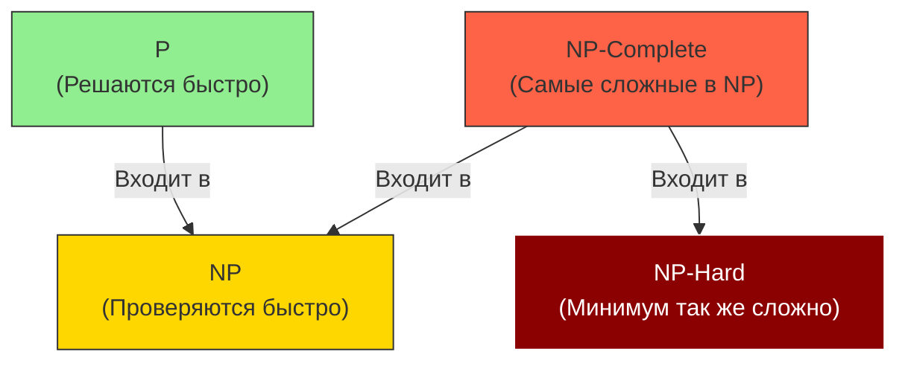

# 🤯 Computational Complexity (Вычислительная сложность)

## 📑 Содержание
1. [Что это?](#1-что-это)
2. [P vs NP](#2-p-vs-np)
3. [NP-Complete](#3-np-complete)
4. [NP-Hard](#4-np-hard)
5. [Зачем это программисту?](#5-зачем-это-программисту)

---

## 1. 🤔 Что это?

**Computational Complexity** (Вычислительная сложность) — это раздел информатики, который классифицирует задачи по тому, **насколько сложно их решить**.

Речь идет не о конкретном алгоритме, а о **самой задаче**: можно ли вообще решить ее быстро (за полиномиальное время)?

---

## 2. 🐢 P vs NP

### P (Polynomial Time) — "Решаются быстро" ✅

Задачи класса **P** можно решить за **полиномиальное время**: $O(n)$, $O(n^2)$, $O(n^3)$ и т.д.

**Примеры:**
- Сортировка массива (Merge Sort) — $O(n \log n)$
- Поиск элемента в отсортированном массиве (Binary Search) — $O(\log n)$
- Поиск кратчайшего пути (Dijkstra) — $O(E \log V)$

> [!TIP]
> Класс P — это "хорошие" задачи. Их можно решить эффективно даже для больших данных.

---

### NP (Nondeterministic Polynomial) — "Проверяются быстро" ❓

Задачи класса **NP** — это задачи, для которых решение можно **проверить** за полиномиальное время, но **найти** решение — не обязательно быстро.

**Пример:**
- **Задача**: Является ли число $N = 1234567$ простым?
  - **Решить**: Нужно проверить все делители до $\sqrt{N}$ — долго для больших N
  - **Проверить**: Если кто-то дал ответ "Нет, оно делится на 127", проверить это легко: $1234567 \div 127 = ?$

**Другой пример** — задача о рюкзаке:
- **Дано**: Рюкзак вместимостью 50 кг, предметы весом [10, 20, 30, 15, 25] с ценностями [60, 100, 120, 80, 90]
- **Вопрос**: Можно ли набрать ровно 100 кг ценности?
- **Решить**: Нужно перебрать все комбинации (долго)
- **Проверить**: Если кто-то сказал "Да, возьми предметы 2 и 3", легко проверить: $100 + 120 = 220$ — неправильно

---

### P = NP? — Величайшая проблема 🏆

> [!IMPORTANT]
> **Вопрос на миллион долларов**: P = NP?
> 
> Если **P = NP**, то любую задачу, решение которой можно быстро проверить, можно и **быстро решить**. Это перевернуло бы мир:
> - Криптография стала бы бесполезной (RSA взламывается легко)
> - Многие сложные задачи (планирование, оптимизация) решались бы мгновенно
>
> Большинство ученых считают, что **P ≠ NP**, но это **не доказано**!

---

## 3. 🐉 NP-Complete (NP-полные задачи)

**NP-Complete** — это самые **сложные задачи в NP**. Они обладают важным свойством:

> Если найти **быстрый** (полиномиальный) алгоритм для **одной** NP-Complete задачи, то **все** задачи в NP решаются быстро (P = NP).

### Свойства NP-Complete задач:

1. Они в классе NP (решение проверяется быстро)
2. Любая другая NP задача сводится к ней за полином

### Примеры NP-Complete задач

#### 1. Задача коммивояжера (Traveling Salesman Problem, TSP)

**Дано**: Города и расстояния между ними  
**Вопрос**: Можно ли пройти все города ровно один раз и вернуться назад, пройдя не более K километров?

**Решение**: Перебор всех маршрутов — $O(n!)$ (факториал!)

```go
// Наивное решение TSP - O(n!)
func tspBruteForce(cities [][]int) int {
    // cities[i][j] = расстояние от города i до города j
    n := len(cities)
    minDistance := math.MaxInt
    
    // Генерируем все перестановки городов
    permutations := generatePermutations(n)
    
    for _, perm := range permutations {
        distance := 0
        for i := 0; i < n-1; i++ {
            distance += cities[perm[i]][perm[i+1]]
        }
        distance += cities[perm[n-1]][perm[0]] // Возврат в начало
        
        if distance < minDistance {
            minDistance = distance
        }
    }
    
    return minDistance
}
```

#### 2. Задача о рюкзаке (Knapsack Problem)

**Дано**: Рюкзак вместимостью W, предметы с весами и ценностями  
**Вопрос**: Какие предметы взять, чтобы максимизировать ценность, не превысив W?

#### 3. SAT (Boolean Satisfiability)

**Дано**: Логическое выражение типа $(A \lor B) \land (\neg A \lor C)$  
**Вопрос**: Можно ли присвоить переменным значения true/false так, чтобы выражение было истинным?

**Важность**: SAT был **первой** доказанной NP-Complete задачей (теорема Кука, 1971)

#### 4. Раскраска графа (Graph Coloring)

**Дано**: Граф  
**Вопрос**: Можно ли раскрасить вершины в K цветов так, чтобы соседние вершины были разных цветов?

---

## 4. 🔥 NP-Hard (NP-трудные задачи)

**NP-Hard** — задачи **как минимум** такие же сложные, как NP-Complete, но не обязательно в NP (т.е. их решение может быть нельзя даже проверить быстро).

> [!NOTE]
> NP-Complete ⊂ NP-Hard. Все NP-Complete задачи являются NP-Hard, но не наоборот.

**Примеры:**
- Задача остановки (Halting Problem) — **неразрешима** вообще
- Оптимизационная версия TSP ("Найди **минимальный** маршрут")



---

## 5. 💼 Зачем это программисту?

### 1. Понимание ограничений

Если задача NP-Complete, не тратьте время на поиск "идеального" алгоритма. Его, скорее всего, не существует.

### 2. Практические подходы

Для NP-Complete задач используют:

- **Эвристики** — приближенные решения (не оптимальные, но достаточно хорошие)
  ```go
  // Greedy алгоритм для Knapsack (не оптимально, но быстро)
  func greedyKnapsack(weights []int, values []int, capacity int) int {
      // Берем предметы с лучшим соотношением ценность/вес
      // O(n log n) вместо O(2^n)
  }
  ```

- **Динамическое программирование** — псевдополиномиальное решение для некоторых задач
- **Метаэвристики** — генетические алгоритмы, simulated annealing

### 3. Распознавание задач

Если ваша задача сводится к NP-Complete (например, к TSP или SAT), вы сразу знаете:
- Точное решение за полином вряд ли существует
- Нужно искать приближенные методы
- Для малых входов можно использовать brute force

---

## 💡 Итог

| Класс | Решить быстро? | Проверить быстро? | Примеры |
|:---|:---:|:---:|:---|
| **P** | ✅ Да | ✅ Да | Сортировка, BFS, Binary Search |
| **NP** | ❓ Неизвестно | ✅ Да | Sudoku, Graph Coloring |
| **NP-Complete** | ❌ Нет* | ✅ Да | TSP, SAT, Knapsack |
| **NP-Hard** | ❌ Нет | ❌ Не обязательно | Halting Problem, Optimization TSP |

\* Если P ≠ NP

> [!CAUTION]
> Если кто-то говорит "Я нашел полиномиальное решение для TSP" — он либо ошибается, либо решил P vs NP и заработал миллион долларов! 💰
