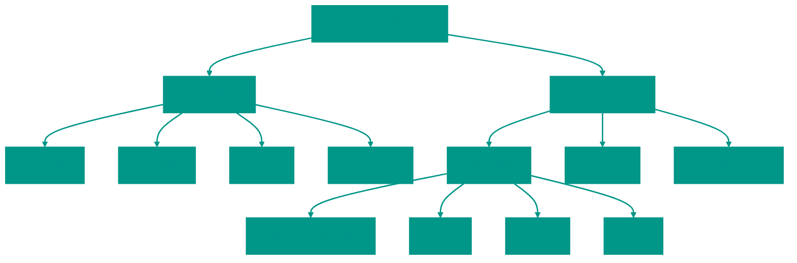

# 📂 Алгоритмы и Структуры Данных

Это оглавление со ссылками на подробные материалы по каждой теме.

## 📊 Обзор

## 📑 Содержание

### 1. 🧱 Структуры Данных

- [🧵 Строки (String)](data_struct/00_string/String.md)
- [📋 Массив (Array)](data_struct/01_array/Array.md)
- [🔗 Связный список (Linked List)](data_struct/02_linked_list/Linked_List.md)
- [🥞 Стек (Stack)](data_struct/03_stack/Stack.md)
- [🚶‍♂️ Очередь (Queue)](data_struct/04_queue/Queue.md)
- [🔑 Хэш-таблица (Hash Table)](data_struct/05_hash_table/Hash_Table.md)
- [🏔️ Куча (Heap)](data_struct/06_heap/Heap.md)
- [🌳 Двоичное дерево поиска (BST)](data_struct/07_search_tree/bst/Bst.md)
- [🔴⚫ Красно-черное дерево](data_struct/07_search_tree/red_black_tree/Red_Black_Tree.md)
- [🌲 Префиксное дерево (Trie)](data_struct/08_trie/Trie.md)
- [🕸️ Граф (Graph)](data_struct/09_graph/Graph.md)
- [⚡ Кеширование (Cache)](data_struct/10_cache/Cache.md)
- [🔄 LRU Кеш (LRU Cache)](data_struct/11_LRU/Lru.md)

### 2. ⚙️ Алгоритмы

#### 🔍 Поиск
- [Бинарный поиск](algorithms/searching/binary_search/Binary_Search.md)
- [Тернарный поиск](algorithms/searching/ternary/Ternary.md)
- [Экспоненциальный поиск](algorithms/searching/exponential_search/Exponential_Search.md)

#### 📊 Сортировка
- [🫧 Пузырьковая сортировка](algorithms/sort/bubble_sort/Bubble_Sort.md)
- [🃏 Сортировка вставками](algorithms/sort/insertion_sort/Insertion_Sort.md)
- [📘 Сортировка выбором](algorithms/sort/selected_sort/Selected_Sort.md)
- [⚡ Быстрая сортировка](algorithms/sort/quick_sort/Quick_Sort.md)
- [🤝 Сортировка слиянием](algorithms/sort/merge_sort/Merge_Sort.md)
- [📊 Сортировка подсчетом](algorithms/sort/counting_sort/Counting_Sort.md)

#### 🧠 Методы и паттерны
- [🔙 Backtracking](methods/backtracking/Backtracking.md)
- [💾 Динамическое программирование](methods/dynamic_programming/Dynamic_Programming.md)
- [🤑 Жадные алгоритмы](methods/greedy_algorithms/Greedy_Algorithms.md)
- [🌀 Рекурсия](methods/recurse/Recurse.md)
- [🪟 Скользящее окно](methods/sliding_window/Sliding_Window.md)
- [👉👈 Два указателя](methods/two_pointers/Two_Pointers.md)

---
> Каждая ссылка ведет на отдельный файл с подробной теорией, реализацией на Go и примерами кода.
