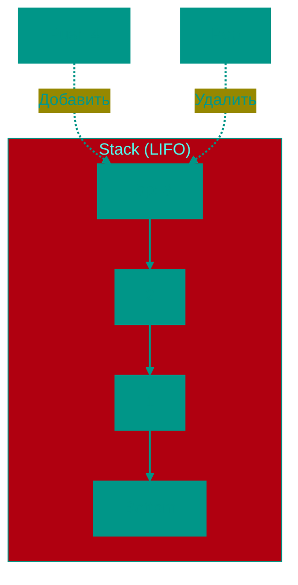

# 🥞 Стек (Stack)

**Описание**: 
Стек — это дисциплинированная структура данных, работающая по принципу **LIFO** (Last In, First Out — "последним пришел, первым ушел"). Это значит, что доступ есть только к самому верхнему элементу, который был добавлен последним.

- **Как это устроено внутри**: Стек можно реализовать на базе массива или связного списка. В любом случае, операции добавления (**Push**) и удаления (**Pop**) всегда происходят с "вершины" стека, что гарантирует скорость **O(1)**.
- **Аналогия**: Самый классический пример — стопка тарелок. Вы кладете новую тарелку наверх и берете тоже самую верхнюю. Чтобы достать самую нижнюю, вам придется сначала снять все те, что лежат выше.


### Основные операции
- **Push**: Положить элемент на вершину.
- **Pop**: Снять элемент с вершины и вернуть его.
- **Peek/Top**: Посмотреть на верхний элемент, не снимая его.


### Преимущества и недостатки
✅ **Плюсы**:
1. **Высокая скорость**: Все основные операции выполняются за константное время O(1).
2. **Простота**: Легко реализовать и использовать, практически невозможно допустить ошибку в логике доступа.
3. **Безопасность**: Структура ограничивает доступ к данным, что полезно для определенных алгоритмов (например, для контроля вложенности вызовов функций).

❌ **Минусы**:
1. **Ограниченный доступ**: Вы не можете заглянуть в середину или конец стека, не "разрушив" его (не удалив верхние элементы).
2. **Риск переполнения (Stack Overflow)**: В некоторых реализациях (например, в системном стеке вызовов) размер ограничен, и слишком глубокая рекурсия может привести к краху программы.

---


### Визуализация




### Сложность

| Операция | Временная сложность (O) | Пространственная сложность (O) |
|:---|:---:|:---:|
| Push | O(1) | O(1) |
| Pop | O(1) | O(1) |
| Peek | O(1) | O(1) |
| Проверка пустоты | O(1) | O(1) |
| Хранение | — | O(n) |

> [!TIP]
> Все операции O(1), так как работают только с вершиной. Реализуется на основе массива или связного списка.


---


## 💻 Реализация

```go
package stack

// ArrayStack - Реализация стека на основе слайса
type ArrayStack struct {
	Data []interface{}
}

func (stack *ArrayStack) Push(data interface{}) {
	stack.Data = append(stack.Data, data)
}

func (stack *ArrayStack) Pop() (interface{}, bool) {
	if len(stack.Data) == 0 {
		return nil, false
	}
	lastIndex := len(stack.Data) - 1
	lastElem := stack.Data[lastIndex]
	stack.Data = stack.Data[0:lastIndex]
	return lastElem, true
}

func (stack *ArrayStack) Peek() (interface{}, bool) {
	if len(stack.Data) == 0 {
		return nil, false
	}
	return stack.Data[len(stack.Data)-1], true
}

func (stack *ArrayStack) IsEmpty() bool {
	return len(stack.Data) == 0
}

// Node - узел для связной реализации
type Node struct {
	Value interface{}
	Next  *Node
}

type LinkedStack struct {
	Top     *Node
	SizeVal int
}

func (s *LinkedStack) Push(value interface{}) {
	newNode := &Node{Value: value, Next: s.Top}
	s.Top = newNode
	s.SizeVal++
}

func (s *LinkedStack) Pop() (interface{}, bool) {
	if s.Top == nil {
		return nil, false
	}
	val := s.Top.Value
	s.Top = s.Top.Next
	s.SizeVal--
	return val, true
}
```

```javascript
// Реализация на основе массива
class ArrayStack {
    constructor() {
        this.data = [];
    }

    push(item) {
        this.data.push(item);
    }

    pop() {
        return this.data.length === 0 ? null : this.data.pop();
    }

    peek() {
        return this.data.length === 0 ? null : this.data[this.data.length - 1];
    }

    isEmpty() {
        return this.data.length === 0;
    }
}

// Реализация на основе связного списка
class Node {
    constructor(value, next = null) {
        this.value = value;
        this.next = next;
    }
}

class LinkedStack {
    constructor() {
        this.top = null;
        this.size = 0;
    }

    push(value) {
        const newNode = new Node(value, this.top);
        this.top = newNode;
        this.size++;
    }

    pop() {
        if (!this.top) return null;
        const val = this.top.value;
        this.top = this.top.next;
        this.size--;
        return val;
    }

    isEmpty() {
        return this.top === null;
    }
}
```


## 🚀 Практические задачи

```go
package stack

// Валидные скобки
func IsValidParentheses(s string) bool {
	stack := []rune{}
	mapping := map[rune]rune{')': '(', '}': '{', ']': '['}

	for _, char := range s {
		if opening, ok := mapping[char]; ok {
			if len(stack) == 0 || stack[len(stack)-1] != opening {
				return false
			}
			stack = stack[:len(stack)-1]
		} else {
			stack = append(stack, char)
		}
	}
	return len(stack) == 0
}

// Проверка палиндрома через стек
func IsPalindrome(s string) bool {
	stack := []rune{}
	for _, r := range s {
		stack = append(stack, r)
	}
	for _, r := range s {
		top := stack[len(stack)-1]
		stack = stack[:len(stack)-1]
		if r != top {
			return false
		}
	}
	return true
}
```

```javascript
// Задача: Валидные скобки
function isValidParentheses(s) {
    const stack = [];
    const mapping = { ')': '(', '}': '{', ']': '[' };

    for (const char of s) {
        if (mapping[char]) {
            const top = stack.pop();
            if (top !== mapping[char]) return false;
        } else {
            stack.push(char);
        }
    }
    return stack.length === 0;
}

// Задача: Проверка палиндрома через стек
function isPalindrome(s) {
    const stack = [];
    for (const char of s) {
        stack.push(char);
    }
    for (const char of s) {
        if (char !== stack.pop()) return false;
    }
    return true;
}
```

<!-- QUIZ_START 
[
    {
        "question": "По какому принципу работает структура данных Стек?",
        "options": ["FIFO (First In, First Out)", "LIFO (Last In, First Out)", "SJF (Shortest Job First)", "Random Access"],
        "correctIndex": 1
    },
    {
        "question": "Что делает операция Peek в реализации Стека?",
        "options": ["Удаляет верхний элемент", "Добавляет новый элемент", "Возвращает значение верхнего элемента, не удаляя его", "Очищает весь стек"],
        "correctIndex": 2
    },
    {
        "question": "Для какой из задач Стек является наиболее подходящим инструментом?",
        "options": ["Проверка баланса скобок в выражении", "Поиск кратчайшего пути в навигаторе", "Сортировка огромной базы данных", "Хранение списка контактов в алфавитном порядке"],
        "correctIndex": 0
    }
]
QUIZ_END -->

```
