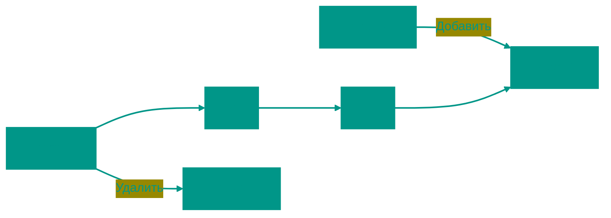

# 🚶‍♂️ Очередь (Queue)

**Описание**: 
Очередь — это фундаментальная структура данных, работающая по принципу "первым пришел — первым ушел" (**FIFO**, First In, First Out). Она обеспечивает строгий порядок обработки данных, где каждый новый элемент встает в "хвост", а обработка начинается с "головы".

- **Как это устроено внутри**: 
  - *Реализация на массиве*: Может требовать сдвига элементов при каждом удалении (O(n)), если не использовать умный подход с указателями.
  - *Кольцевой буфер (Circular Queue)*: Позволяет избежать сдвигов, "зацикливая" массив.
  - *Связный список*: Эффективная реализация за **O(1)** для всех операций.
- **Аналогия**: Обычная очередь в магазине. Тот, кто пришел первым, первым получает товар и уходит. Новые покупатели встают в конец очереди.


### Основные операции
- **Enqueue (Push)**: Добавить элемент в конец очереди.
- **Dequeue (Pop)**: Забрать первый элемент из начала.
- **Front/Peek**: Посмотреть на первый элемент без удаления.


### Преимущества и недостатки
✅ **Плюсы**:
1. **Справедливость**: Гарантирует, что данные будут обработаны в том же порядке, в котором поступили.
2. **Развязка (Decoupling)**: Идеально подходит для передачи данных между компонентами, работающими с разной скоростью (например, принтер и компьютер).
3. **Скорость**: При правильной реализации вставка и удаление занимают O(1).

❌ **Минусы**:
1. **Нет прямого доступа**: Нельзя заглянуть в середину очереди.
2. **Сложность реализации на массиве**: Обычный массив неэффективен для очереди из-за необходимости сдвига элементов, требуется более сложная логика кольцевого буфера.

---


### Визуализация




### Сложность

| Операция | Временная сложность (O) | Пространственная сложность (O) |
|:---|:---:|:---:|
| Enqueue | O(1) | O(1) |
| Dequeue | O(1) | O(1) |
| Peek | O(1) | O(1) |
| Проверка пустоты | O(1) | O(1) |
| Хранение | — | O(n) |


---


## 💻 Реализация

```go
package queue

// Очередь на связном списке (O(1) для всех операций)
type Node struct {
	Value interface{}
	Next  *Node
}

type LinkedListQueue struct {
	Head *Node
	Tail *Node
	Size int
}

func (q *LinkedListQueue) Enqueue(value interface{}) {
	newNode := &Node{Value: value}
	if q.Head == nil {
		q.Head = newNode
		q.Tail = newNode
	} else {
		q.Tail.Next = newNode
		q.Tail = newNode
	}
	q.Size++
}

func (q *LinkedListQueue) Dequeue() (interface{}, bool) {
	if q.Head == nil {
		return nil, false
	}
	val := q.Head.Value
	q.Head = q.Head.Next
	if q.Head == nil {
		q.Tail = nil
	}
	q.Size--
	return val, true
}

// CircularQueue - Кольцевой буфер
type CircularQueue struct {
	data     []int
	front    int
	rear     int
	size     int
	capacity int
}

func (cq *CircularQueue) Enqueue(value int) bool {
	if cq.size == cq.capacity { return false }
	if cq.front == -1 { cq.front = 0 }
	cq.rear = (cq.rear + 1) % cq.capacity
	cq.data[cq.rear] = value
	cq.size++
	return true
}
```

```javascript
// Очередь на связном списке (эффективная)
class Node {
    constructor(value) {
        this.value = value;
        this.next = null;
    }
}

class LinkedListQueue {
    constructor() {
        this.head = null;
        this.tail = null;
        this.size = 0;
    }

    enqueue(value) {
        const newNode = new Node(value);
        if (!this.head) {
            this.head = newNode;
            this.tail = newNode;
        } else {
            this.tail.next = newNode;
            this.tail = newNode;
        }
        this.size++;
    }

    dequeue() {
        if (!this.head) return null;
        const val = this.head.value;
        this.head = this.head.next;
        if (!this.head) this.tail = null;
        this.size--;
        return val;
    }
}

// Кольцевой буфер (Circular Queue)
class CircularQueue {
    constructor(capacity) {
        this.data = new Array(capacity);
        this.capacity = capacity;
        this.front = -1;
        this.rear = -1;
        this.size = 0;
    }

    enqueue(value) {
        if (this.size === this.capacity) return false;
        if (this.front === -1) this.front = 0;
        this.rear = (this.rear + 1) % this.capacity;
        this.data[this.rear] = value;
        this.size++;
        return true;
    }

    dequeue() {
        if (this.size === 0) return null;
        const val = this.data[this.front];
        if (this.front === this.rear) {
            this.front = -1;
            this.rear = -1;
        } else {
            this.front = (this.front + 1) % this.capacity;
        }
        this.size--;
        return val;
    }
}
```


## 🚀 Практические задачи

```go
package queue

// BFS (Breadth-First Search)
func BFS(graph map[int][]int, start int) []int {
	visited := make(map[int]bool)
	queue := []int{start}
	visited[start] = true
	result := []int{}

	for len(queue) > 0 {
		node := queue[0]
		queue = queue[1:]
		result = append(result, node)

		for _, neighbor := range graph[node] {
			if !visited[neighbor] {
				visited[neighbor] = true
				queue = append(queue, neighbor)
			}
		}
	}
	return result
}
```

```javascript
// BFS (Breadth-First Search) на JS
function bfs(graph, start) {
    const visited = new Set();
    const queue = [start];
    visited.add(start);
    const result = [];

    while (queue.length > 0) {
        const node = queue.shift();
        result.push(node);

        for (const neighbor of (graph[node] || [])) {
            if (!visited.has(neighbor)) {
                visited.add(neighbor);
                queue.push(neighbor);
            }
        }
    }
    return result;
}

// Счетчик запросов (RecentCounter)
class RecentCounter {
    constructor() {
        this.queue = [];
    }

    ping(t) {
        this.queue.push(t);
        while (this.queue[0] < t - 3000) {
            this.queue.shift();
        }
        return this.queue.length;
    }
}
```

<!-- QUIZ_START 
[
    {
        "question": "По какому принципу работает структура данных Очередь?",
        "options": ["LIFO (Last In, First Out)", "FIFO (First In, First Out)", "Random Access", "Priority Only"],
        "correctIndex": 1
    },
    {
        "question": "Как называется операция добавления элемента в конец очереди?",
        "options": ["Pop", "Push", "Enqueue", "Peek"],
        "correctIndex": 2
    },
    {
        "question": "Для какого из перечисленных алгоритмов очередь является ключевой структурой данных?",
        "options": ["Бинарный поиск", "Поиск в ширину (BFS)", "Быстрая сортировка (QuickSort)", "Поиск в глубину (DFS)"],
        "correctIndex": 1
    }
]
QUIZ_END -->

```
