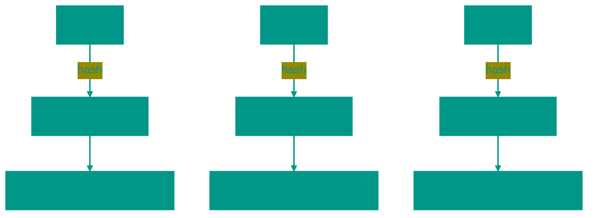

# 🔑 Хэш-таблица

**Описание**: 
Хэш-таблица — это чрезвычайно мощная структура данных, реализующая ассоциативный массив (пары "ключ-значение"). Она позволяет находить данные практически мгновенно, независимо от того, миллион там записей или миллиард.

- **Как это устроено внутри**: Всё волшебство держится на **хэш-функции**. Она берет ключ (например, имя человека) и превращает его в число — индекс в массиве (бакете). 
  - *Коллизии*: Иногда два разных ключа дают один хэш. Хорошие хэш-таблицы умеют решать это через "цепочки" (списки внутри бакета) или "открытую адресацию" (поиск соседнего свободного места).
- **Аналогия**: Представьте огромную библиотеку, где книги разложены не по алфавиту, а по специальному шифру. Вы говорите название книги, библиотекарь мгновенно вычисляет номер полки и идет прямо к ней, не просматривая все остальные книги.


### Преимущества и недостатки
✅ **Плюсы**:
1. **Невероятная скорость**: Поиск, вставка и удаление в среднем занимают **O(1)**.
2. **Универсальность**: Ключами могут быть строки, числа и даже сложные объекты.
3. **Эффективность в поиске**: Идеальна для задач, где нужно часто проверять наличие элемента или получать значение по идентификатору.

❌ **Минусы**:
1. **Плохо для упорядоченных данных**: В хэш-таблице элементы лежат "хаотично". Если вам нужно вывести данные по алфавиту, придется их отдельно сортировать.
2. **Расход памяти**: Чтобы минимизировать коллизии, таблице нужно держать много пустого места (обычно заполняется на 70%).
3. **Зависимость от хэш-функции**: Если функция плохая, все данные могут попасть в один бакет, и скорость упадет до O(n).

---


### Визуализация




### Сложность

| Операция | Временная сложность (O) | Пространственная сложность (O) |
|:---|:---:|:---:|
| Вставка | O(1) средняя, O(n) худшая | O(1) |
| Поиск | O(1) средняя, O(n) худшая | O(1) |
| Удаление | O(1) средняя, O(n) худшая | O(1) |
| Проверка ключа | O(1) средняя, O(n) худшая | O(1) |
| Хранение | — | O(n) |

> [!IMPORTANT]
> **O(1) средняя**: Хорошая хэш-функция минимизирует коллизии. **O(n) худшая**: При многих коллизиях (например, все ключи в одном бакете).


---


## 💻 Реализация
```go

package hash_table

import "fmt"

// Entry представляет одну запись в хэш-таблице (ключ-значение)
type Entry struct {
	Key   string
	Value interface{}
	Next  *Entry // Для обработки коллизий методом цепочек
}

// HashTable - хэш-таблица с обработкой коллизий методом цепочек (separate chaining)
type HashTable struct {
	buckets []*Entry // Массив бакетов (каждый бакет - это связный список)
	size    int      // Количество бакетов
	count   int      // Количество элементов в таблице
}

// NewHashTable создает новую хэш-таблицу с заданным размером
func NewHashTable(size int) *HashTable {
	return &HashTable{
		buckets: make([]*Entry, size),
		size:    size,
		count:   0,
	}
}

// hash вычисляет хэш для строкового ключа
func (ht *HashTable) hash(key string) int {
	hash := 0
	for i := 0; i < len(key); i++ {
		hash = (hash*31 + int(key[i])) % ht.size
	}
	return hash
}

// Set добавляет или обновляет значение по ключу
func (ht *HashTable) Set(key string, value interface{}) {
	index := ht.hash(key)
	entry := ht.buckets[index]

	// Если бакет пуст, создаем новую запись
	if entry == nil {
		ht.buckets[index] = &Entry{Key: key, Value: value}
		ht.count++
		return
	}

	// Ищем ключ в цепочке или добавляем в конец
	prev := entry
	for entry != nil {
		if entry.Key == key {
			// Ключ найден - обновляем значение
			entry.Value = value
			return
		}
		prev = entry
		entry = entry.Next
	}

	// Ключ не найден - добавляем в конец цепочки
	prev.Next = &Entry{Key: key, Value: value}
	ht.count++
}

// Get возвращает значение по ключу
func (ht *HashTable) Get(key string) (interface{}, bool) {
	index := ht.hash(key)
	entry := ht.buckets[index]

	// Ищем ключ в цепочке
	for entry != nil {
		if entry.Key == key {
			return entry.Value, true
		}
		entry = entry.Next
	}

	return nil, false
}

// Delete удаляет элемент по ключу
func (ht *HashTable) Delete(key string) bool {
	index := ht.hash(key)
	entry := ht.buckets[index]

	if entry == nil {
		return false
	}

	// Если удаляемый элемент - первый в цепочке
	if entry.Key == key {
		ht.buckets[index] = entry.Next
		ht.count--
		return true
	}

	// Ищем элемент в цепочке
	prev := entry
	for entry.Next != nil {
		if entry.Next.Key == key {
			entry.Next = entry.Next.Next
			ht.count--
			return true
		}
		entry = entry.Next
	}

	return false
}

// Has проверяет наличие ключа
func (ht *HashTable) Has(key string) bool {
	_, exists := ht.Get(key)
	return exists
}

// Size возвращает количество элементов
func (ht *HashTable) Size() int {
	return ht.count
}

// Keys возвращает все ключи
func (ht *HashTable) Keys() []string {
	keys := make([]string, 0, ht.count)
	for _, entry := range ht.buckets {
		for entry != nil {
			keys = append(keys, entry.Key)
			entry = entry.Next
		}
	}
	return keys
}

// Print выводит содержимое хэш-таблицы
func (ht *HashTable) Print() {
	fmt.Printf("HashTable (size=%d, count=%d):\n", ht.size, ht.count)
	for i, entry := range ht.buckets {
		if entry != nil {
			fmt.Printf("  [%d]: ", i)
			for entry != nil {
				fmt.Printf("(%s: %v) -> ", entry.Key, entry.Value)
				entry = entry.Next
			}
			fmt.Println("nil")
		}
	}
}

```

```javascript
// HashTable - реализация хэш-таблицы с обработкой коллизий
class HashTable {
  constructor(size = 53) {
    this.buckets = new Array(size); // Массив бакетов
    this.size = size;
    this.count = 0;
  }

  // Хэш-функция для строковых ключей
  hash(key) {
    let hash = 0;
    for (let i = 0; i < key.length; i++) {
      hash = (hash * 31 + key.charCodeAt(i)) % this.size;
    }
    return hash;
  }

  // Добавляет или обновляет значение по ключу
  set(key, value) {
    const index = this.hash(key);
    
    if (!this.buckets[index]) {
      this.buckets[index] = [];
    }

    // Проверяем, существует ли уже этот ключ
    const bucket = this.buckets[index];
    for (let i = 0; i < bucket.length; i++) {
      if (bucket[i][0] === key) {
        // Ключ найден - обновляем значение
        bucket[i][1] = value;
        return;
      }
    }

    // Ключ не найден - добавляем новую пару
    bucket.push([key, value]);
    this.count++;
  }

  // Возвращает значение по ключу
  get(key) {
    const index = this.hash(key);
    const bucket = this.buckets[index];

    if (!bucket) return undefined;

    // Ищем ключ в бакете
    for (let i = 0; i < bucket.length; i++) {
      if (bucket[i][0] === key) {
        return bucket[i][1];
      }
    }

    return undefined;
  }

  // Удаляет элемент по ключу
  delete(key) {
    const index = this.hash(key);
    const bucket = this.buckets[index];

    if (!bucket) return false;

    // Ищем и удаляем ключ
    for (let i = 0; i < bucket.length; i++) {
      if (bucket[i][0] === key) {
        bucket.splice(i, 1); // Удаляем элемент из массива
        this.count--;
        return true;
      }
    }

    return false;
  }

  // Проверяет наличие ключа
  has(key) {
    return this.get(key) !== undefined;
  }

  // Возвращает количество элементов
  getSize() {
    return this.count;
  }

  // Возвращает все ключи
  keys() {
    const allKeys = [];
    for (const bucket of this.buckets) {
      if (bucket) {
        for (const [key] of bucket) {
          allKeys.push(key);
        }
      }
    }
    return allKeys;
  }

  // Возвращает все значения
  values() {
    const allValues = [];
    for (const bucket of this.buckets) {
      if (bucket) {
        for (const [, value] of bucket) {
          allValues.push(value);
        }
      }
    }
    return allValues;
  }

  // Выводит содержимое
  print() {
    console.log(`HashTable (size=${this.size}, count=${this.count}):`);
    for (let i = 0; i < this.buckets.length; i++) {
      if (this.buckets[i]) {
        console.log(`  [${i}]:`, this.buckets[i]);
      }
    }
  }
}

// Пример использования
const ht = new HashTable(10);
ht.set("name", "Борис");
ht.set("age", 30);
ht.set("city", "New York");

console.log(ht.get("name")); // "Борис"
console.log(ht.has("age"));  // true
ht.print();

```


## 🚀 Практические задачи

```go
package hash_table

// Сумма двух элементов
func TwoSum(nums []int, target int) []int {
	cache := make(map[int]int)
	for i, num := range nums {
		complement := target - num
		if index, ok := cache[complement]; ok {
			return []int{index, i}
		}
		cache[num] = i
	}
	return []int{}
}

// Проверка дубликатов
func ContainsDuplicate(nums []int) bool {
	seen := make(map[int]bool)
	for _, num := range nums {
		if seen[num] {
			return true
		}
		seen[num] = true
	}
	return false
}

// Группировка анаграмм
func GroupAnagrams(strs []string) [][]string {
	groups := make(map[string][]string)
	for _, s := range strs {
		// Ключ - отсортированная строка
		r := []rune(s)
		sort.Slice(r, func(i, j int) bool { return r[i] < r[j] })
		key := string(r)
		groups[key] = append(groups[key], s)
	}
	// ... сборка результата
	return result
}
```

```javascript
// Задача 2: Сумма двух элементов
function twoSum(nums, target) {
    const cache = new Map();
    for (let i = 0; i < nums.length; i++) {
        const complement = target - nums[i];
        if (cache.has(complement)) {
            return [cache.get(complement), i];
        }
        cache.set(nums[i], i);
    }
    return [];
}

// Задача 3: Группировка анаграмм
function groupAnagrams(strs) {
    const groups = new Map();
    for (const s of strs) {
        const key = s.split('').sort().join('');
        if (!groups.has(key)) groups.set(key, []);
        groups.get(key).push(s);
    }
    return Array.from(groups.values());
}

// Задача 4: Подсчет частоты
function countFrequency(nums) {
    const freqMap = new Map();
    for (const num of nums) {
        freqMap.set(num, (freqMap.get(num) || 0) + 1);
    }
    return freqMap;
}

// Задача 5: Проверка дубликатов
function containsDuplicate(nums) {
    const seen = new Set();
    for (const num of nums) {
        if (seen.has(num)) return true;
        seen.add(num);
    }
    return false;
}
```

<!-- QUIZ_START 
[
    {
        "question": "Какую роль играет хэш-функция в работе хэш-таблицы?",
        "options": ["Она шифрует данные для безопасности", "Она преобразует произвольный ключ в индекс массива для мгновенного доступа", "Она сортирует ключи по алфавиту", "Она удаляет дубликаты"],
        "correctIndex": 1
    },
    {
        "question": "Что такое коллизия в хэш-таблице?",
        "options": ["Ситуация, когда таблица заполнена на 100%", "Ситуация, когда два разных ключа дают одинаковый хэш (индекс)", "Ошибка в коде на Go", "Удаление ключа"],
        "correctIndex": 1
    },
    {
        "question": "Почему хэш-таблицы считают неэффективными для хранения упорядоченных данных?",
        "options": ["Они занимают мало памяти", "Элементы распределяются по бакетам 'хаотично' в зависимости от хэша, и для получения порядка требуется дополнительная сортировка", "Хэш-функция всегда возвращает 0", "Они работают слишком быстро"],
        "correctIndex": 1
    }
]
QUIZ_END -->

```
