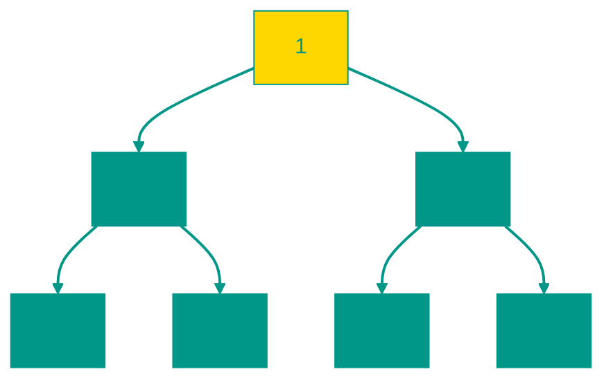

# 🏔️ Куча (Heap)

**Описание**: 
Куча — это специализированное двоичное дерево, которое поддерживает идеальный порядок для быстрого доступа к "самому-самому" элементу (наименьшему или наибольшему). В отличие от обычного дерева поиска, куча всегда стремится быть "плотной" и заполненной.

- **Как это устроено внутри**: Куча обычно хранится в виде обычного массива, что экономит память. Индексы детей вычисляются по простым формулам (2i+1 и 2i+2). Главное правило: родитель всегда "важнее" (больше или меньше) своих детей. При вставке новый элемент "всплывает" на свое место, а при удалении — "просеивается" вниз. Это гарантирует скорость **O(log n)**.
- **Аналогия**: Представьте очередь в приемном покое больницы (Приоритетная очередь). На вершине кучи всегда находится самый "тяжелый" пациент, которому помощь нужна прямо сейчас. Как только его забирают, куча перестраивается, чтобы сверху снова оказался самый срочный случай.


### Виды куч
- **Max-Heap**: В корне всегда максимальный элемент.
- **Min-Heap**: В корне всегда минимальный элемент.


### Преимущества и недостатки
✅ **Плюсы**:
1. **Мгновенный доступ к пику**: Посмотреть максимальный/минимальный элемент можно за **O(1)**.
2. **Эффективная сортировка**: На базе кучи работает HeapSort, который стабильно дает O(n log n).
3. **Экономия памяти**: Не нужно хранить указатели на детей (как в обычных деревьях), всё вычисляется через индексы в массиве.

❌ **Минусы**:
1. **Медленный поиск**: Вы знаете только кто "самый главный", но найти конкретное число в середине кучи можно только полным перебором (O(n)).
2. **Только один критерий**: Куча хороша только для работы с экстремумами (мин/макс).

---


### Визуализация Min-Heap




### Сложность

| Операция | Временная сложность (O) | Пространственная сложность (O) |
|:---|:---:|:---:|
| Вставка | O(log n) | O(1) |
| Извлечение | O(log n) | O(1) |
| Просмотр вершины | O(1) | O(1) |
| Построение кучи | O(n) | O(1) |
| Хранение | — | O(n) |


---


## 💻 Реализация
```go

package heap

// IntHeap — это наш массив чисел, который станет кучей
// Реализует интерфейс heap.Interface из стандартной библиотеки container/heap
type IntHeap []int

// Len — возвращает количество элементов
func (h IntHeap) Len() int { return len(h) }

// Less — сравнивает элементы (для min-heap: i < j)
func (h IntHeap) Less(i, j int) bool { return h[i] < h[j] }

// Swap — меняет элементы местами
func (h IntHeap) Swap(i, j int) { h[i], h[j] = h[j], h[i] }

// Push — добавляет элемент в конец
func (h *IntHeap) Push(x interface{}) {
	*h = append(*h, x.(int))
}

// Pop — убирает и возвращает последний элемент (корень уже извлечён стандартной библиотекой перед этим вызовом)
func (h *IntHeap) Pop() interface{} {
	old := *h
	n := len(old)
	x := old[n-1]
	*h = old[0 : n-1]
	return x
}

```

```javascript
// MinHeap - реализация минимальной кучи
class MinHeap {
  constructor() {
    this.heap = [];
  }

  // Добавляет элемент в кучу
  push(val) {
    this.heap.push(val);
    this.bubbleUp();
  }

  // Извлекает минимальный элемент (корень) из кучи
  pop() {
    if (this.size() === 0) return undefined;
    if (this.size() === 1) return this.heap.pop();
    const top = this.heap[0];
    this.heap[0] = this.heap.pop(); // Перемещаем последний элемент на место корня
    this.bubbleDown(); // Восстанавливаем свойство кучи
    return top;
  }

  // Просматривает минимальный элемент (корень) без удаления
  peek() {
    if (this.size() === 0) return undefined;
    return this.heap[0];
  }

  // Перемещает новый элемент вверх, чтобы сохранить свойство кучи
  bubbleUp() {
    let index = this.heap.length - 1;
    while (index > 0) {
      let parentIndex = Math.floor((index - 1) / 2);
      if (this.heap[parentIndex] <= this.heap[index]) break; // Если родитель меньше или равен, порядок верен
      [this.heap[parentIndex], this.heap[index]] = [this.heap[index], this.heap[parentIndex]]; // Меняем местами
      index = parentIndex;
    }
  }

  // Перемещает элемент вниз, чтобы сохранить свойство кучи
  bubbleDown() {
    let index = 0;
    const length = this.heap.length;
    const element = this.heap[0];

    while (true) {
      let leftChildIndex = 2 * index + 1;
      let rightChildIndex = 2 * index + 2;
      let leftChild, rightChild;
      let swap = null; // Индекс элемента, с которым нужно поменяться

      if (leftChildIndex < length) {
        leftChild = this.heap[leftChildIndex];
        if (leftChild < element) {
          swap = leftChildIndex;
        }
      }

      if (rightChildIndex < length) {
        rightChild = this.heap[rightChildIndex];
        // Если правый ребенок меньше текущего элемента И (если есть левый ребенок, то правый меньше левого)
        if ((swap === null && rightChild < element) || (swap !== null && rightChild < leftChild)) {
          swap = rightChildIndex;
        }
      }

      if (swap === null) break; // Если обмена не было, элемент на своем месте
      [this.heap[index], this.heap[swap]] = [this.heap[swap], this.heap[index]];
      index = swap;
    }
  }

  // Возвращает количество элементов в куче
  size() {
    return this.heap.length;
  }

  // Проверяет, пуста ли куча
  isEmpty() {
    return this.heap.length === 0;
  }
}
```


## 🚀 Практические задачи
```go
package heap

import (
	"container/heap"
	"fmt"
)

// Example демонстрирует использование кучи (Heap)
func Example() {
	// Задача: Найти K-й самый большой элемент в массиве
	nums := []int{3, 2, 1, 5, 6, 4}
	k := 2
	result := FindKthLargest(nums, k)
	fmt.Printf("Для массива %v, %d-й самый большой элемент: %d\n", nums, k, result)

	nums2 := []int{3, 2, 3, 1, 2, 4, 5, 5, 6}
	k2 := 4
	result2 := FindKthLargest(nums2, k2)
	fmt.Printf("Для массива %v, %d-й самый большой элемент: %d\n", nums2, k2, result2)
}

// Задача 1: K-й самый большой элемент в массиве
// Дан целочисленный массив nums и целое число k. Вернуть k-й наиболее крупный элемент в массиве.
// Обратите внимание, что это k-й самый большой элемент в отсортированном порядке, а не k-й уникальный элемент.
//
// Пример: [3,2,1,5,6,4], k = 2 => 5
// Сложность: O(N log K)
func FindKthLargest(nums []int, k int) int {
	h := &IntHeap{}
	heap.Init(h)

	for _, num := range nums {
		heap.Push(h, num)

		// Если размер кучи превышает k, удаляем минимальный элемент (root)
		// Так как IntHeap - это min-heap, мы храним K самых больших элементов
		// И корень будет самым маленьким из этих K, то есть K-м по величине
		if h.Len() > k {
			heap.Pop(h)
		}
	}

	// Возвращаем корень кучи, который является K-м самым большим элементом
	// (так как это минимальный элемент среди K самых больших)
	return (*h)[0]
}
```

```javascript
// Найти K-й самый большой элемент
// Задача 1: K-й самый большой элемент в массиве
// Дан целочисленный массив nums и целое число k. Вернуть k-й наиболее крупный элемент в массиве.
// Обратите внимание, что это k-й самый большой элемент в отсортированном порядке, а не k-й уникальный элемент.
//
// Пример: [3,2,1,5,6,4], k = 2 => 5
// Сложность: O(N log K)
function findKthLargest(nums, k) {
    const minHeap = new MinHeap(); // Используем MinHeap для хранения K самых больших элементов
    for (const num of nums) {
        minHeap.push(num);
        // Если размер кучи превышает k, удаляем минимальный элемент (root)
        // Так как minHeap - это min-heap, мы храним K самых больших элементов
        // И корень будет самым маленьким из этих K, то есть K-м по величине
        if (minHeap.size() > k) {
            minHeap.pop();
        }
    }
    // Возвращаем корень кучи, который является K-м самым большим элементом
    // (так как это минимальный элемент среди K самых больших)
    return minHeap.peek();
}

// Пример использования
function exampleJS() {
    let nums = [3, 2, 1, 5, 6, 4];
    let k = 2;
    let result = findKthLargest(nums, k);
    console.log(`Для массива [${nums}], ${k}-й самый большой элемент: ${result}`); // Ожидаем 5

    nums = [3, 2, 3, 1, 2, 4, 5, 5, 6];
    k = 4;
    result = findKthLargest(nums, k);
    console.log(`Для массива [${nums}], ${k}-й самый большой элемент: ${result}`); // Ожидаем 4
}

// Вызов примера
// exampleJS();
```

<!-- QUIZ_START 
[
    {
        "question": "Какую операцию куча (Heap) выполняет максимально эффективно (за O(1))?",
        "options": ["Поиск произвольного элемента", "Просмотр максимального или минимального элемента (вершины)", "Удаление всех элементов", "Сортировка массива"],
        "correctIndex": 1
    },
    {
        "question": "Каким образом куча обычно хранится в памяти компьютера для экономии места?",
        "options": ["В виде набора разрозненных узлов с указателями", "В виде обычного массива, где индексы детей вычисляются математически", "В текстовом файле", "В хэш-таблице"],
        "correctIndex": 1
    },
    {
        "question": "Что происходит с элементом при вставке в кучу, чтобы сохранить её свойства?",
        "options": ["Он заменяет корень", "Он 'всплывает' (bubble up) вверх по дереву, пока не займет правильную позицию согласно приоритету", "Он удаляется, если он меньше корня", "Он всегда остается в конце массива"],
        "correctIndex": 1
    }
]
QUIZ_END -->

```
