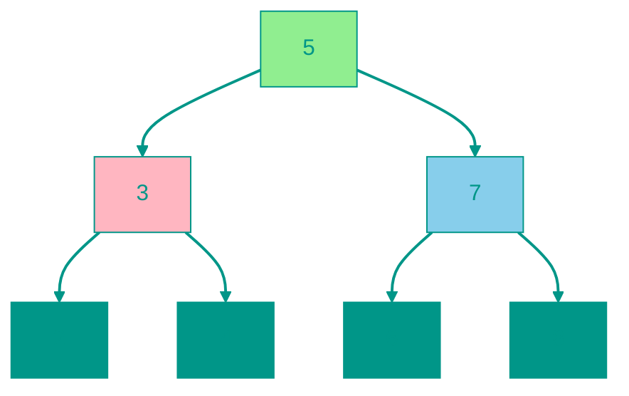

# 🌳 Двоичное дерево поиска (BST)

**Описание**: 
Двоичное дерево поиска (BST) — это иерархическая структура данных, которая объединяет в себе гибкость связного списка и скорость бинарного поиска. Она построена на простом правиле: для каждого узла всё, что слева — меньше, всё, что справа — больше.

- **Как это устроено внутри**: Каждый узел имеет до двух потомков. Благодаря правилу "меньше слева, больше справа", поиск элемента превращается в серию выборов типа "в какую сторону свернуть?", что позволяет отсекать половину дерева на каждом шаге. Это дает скорость поиска **O(log n)**.
- **Аналогия**: Представьте числовую угадайку: "Я загадал число от 1 до 100". Вы называете 50, а я говорю "больше". Теперь вам не нужно проверять числа от 1 до 50. Дерево поиска — это буквально "замороженный" процесс такой игры.


### Преимущества и недостатки
✅ **Плюсы**:
1. **Быстрый динамический поиск**: Быстрее списка для поиска и гибче массива для вставки.
2. **Всегда отсортировано**: Если обойти дерево специальным образом (In-order), мы получим элементы в строгом порядке возрастания.
3. **Эффективность диапазона**: Легко найти все элементы в интервале (например, от 10 до 50).

❌ **Минусы**:
1. **Риск разбалансировки**: Если вставлять данные по порядку (1, 2, 3, 4...), дерево превратится в длинную палку (список), и скорость упадет до O(n). Для решения этой проблемы используют сбалансированные деревья (AVL или Красно-черные).
2. **Сложность удаления**: Удаление узла из середины — непростая задача, требующая перестройки части дерева.

---


### Визуализация




### Сложность

| Операция | Временная сложность (O) | Пространственная сложность (O) |
|:---|:---:|:---:|
| Вставка | O(h) средняя O(log n), худшая O(n) | O(h) |
| Поиск | O(h) средняя O(log n), худшая O(n) | O(h) |
| Удаление | O(h) средняя O(log n), худшая O(n) | O(h) |
| Обход | O(n) | O(h) |
| Хранение | — | O(n) |

> [!WARNING]
> **h** — высота. В сбалансированном случае O(log n), в вырожденном (линейный список) — O(n).


---


## 💻 Реализация

```go
package bst

// Node представляет узел бинарного дерева поиска
type Node struct {
	Value int
	Left  *Node
	Right *Node
}

// BST - бинарное дерево поиска
type BST struct {
	Root *Node
}

// NewBST создает новое пустое дерево
func NewBST() *BST {
	return &BST{Root: nil}
}

// Insert вставляет новое значение в дерево
func (bst *BST) Insert(value int) {
	bst.Root = insertNode(bst.Root, value)
}

func insertNode(node *Node, value int) *Node {
	if node == nil {
		return &Node{Value: value}
	}

	if value < node.Value {
		node.Left = insertNode(node.Left, value)
	} else if value > node.Value {
		node.Right = insertNode(node.Right, value)
	}
	// Если значение равно, не вставляем дубликаты

	return node
}

// Search ищет значение в дереве
func (bst *BST) Search(value int) bool {
	return searchNode(bst.Root, value)
}

func searchNode(node *Node, value int) bool {
	if node == nil {
		return false
	}

	if value == node.Value {
		return true
	} else if value < node.Value {
		return searchNode(node.Left, value)
	} else {
		return searchNode(node.Right, value)
	}
}

// Delete удаляет значение из дерева
func (bst *BST) Delete(value int) {
	bst.Root = deleteNode(bst.Root, value)
}

func deleteNode(node *Node, value int) *Node {
	if node == nil {
		return nil
	}

	if value < node.Value {
		node.Left = deleteNode(node.Left, value)
	} else if value > node.Value {
		node.Right = deleteNode(node.Right, value)
	} else {
		// Нашли узел для удаления

		// Случай 1: Нет детей
		if node.Left == nil && node.Right == nil {
			return nil
		}

		// Случай 2: Один ребенок
		if node.Left == nil {
			return node.Right
		}
		if node.Right == nil {
			return node.Left
		}

		// Случай 3: Два ребенка
		// Находим минимальное значение в правом поддереве
		minRight := findMin(node.Right)
		node.Value = minRight.Value
		node.Right = deleteNode(node.Right, minRight.Value)
	}

	return node
}

// findMin находит узел с минимальным значением
func findMin(node *Node) *Node {
	for node.Left != nil {
		node = node.Left
	}
	return node
}

// MinValue возвращает минимальное значение в дереве
func (bst *BST) MinValue() (int, bool) {
	if bst.Root == nil {
		return 0, false
	}
	min := findMin(bst.Root)
	return min.Value, true
}

// MaxValue возвращает максимальное значение в дереве
func (bst *BST) MaxValue() (int, bool) {
	if bst.Root == nil {
		return 0, false
	}
	
	node := bst.Root
	for node.Right != nil {
		node = node.Right
	}
	return node.Value, true
}

// Height возвращает высоту дерева
func (bst *BST) Height() int {
	return height(bst.Root)
}

func height(node *Node) int {
	if node == nil {
		return 0
	}
	
	leftHeight := height(node.Left)
	rightHeight := height(node.Right)
	
	if leftHeight > rightHeight {
		return leftHeight + 1
	}
	return rightHeight + 1
}

// InOrderTraversal - обход дерева в порядке возрастания (Left-Root-Right)
func (bst *BST) InOrderTraversal() []int {
	result := []int{}
	inOrderHelper(bst.Root, &result)
	return result
}

func inOrderHelper(node *Node, result *[]int) {
	if node != nil {
		inOrderHelper(node.Left, result)
		*result = append(*result, node.Value)
		inOrderHelper(node.Right, result)
	}
}

// PreOrderTraversal - обход дерева (Root-Left-Right)
func (bst *BST) PreOrderTraversal() []int {
	result := []int{}
	preOrderHelper(bst.Root, &result)
	return result
}

func preOrderHelper(node *Node, result *[]int) {
	if node != nil {
		*result = append(*result, node.Value)
		preOrderHelper(node.Left, result)
		preOrderHelper(node.Right, result)
	}
}

// PostOrderTraversal - обход дерева (Left-Right-Root)
func (bst *BST) PostOrderTraversal() []int {
	result := []int{}
	postOrderHelper(bst.Root, &result)
	return result
}

func postOrderHelper(node *Node, result *[]int) {
	if node != nil {
		postOrderHelper(node.Left, result)
		postOrderHelper(node.Right, result)
		*result = append(*result, node.Value)
	}
}

// BFS - обход в ширину (Level Order)
func (bst *BST) BFS() []int {
	if bst.Root == nil {
		return []int{}
	}

	result := []int{}
	queue := []*Node{bst.Root}

	for len(queue) > 0 {
		node := queue[0]
		queue = queue[1:]
		
		result = append(result, node.Value)
		
		if node.Left != nil {
			queue = append(queue, node.Left)
		}
		if node.Right != nil {
			queue = append(queue, node.Right)
		}
	}

	return result
}

// IsValidBST проверяет, является ли дерево корректным BST
func (bst *BST) IsValidBST() bool {
	return isValidBSTHelper(bst.Root, nil, nil)
}

func isValidBSTHelper(node *Node, min, max *int) bool {
	if node == nil {
		return true
	}

	if (min != nil && node.Value <= *min) || (max != nil && node.Value >= *max) {
		return false
	}

	return isValidBSTHelper(node.Left, min, &node.Value) && 
	       isValidBSTHelper(node.Right, &node.Value, max)
}

```

```javascript
// Node - узел бинарного дерева поиска
class Node {
  constructor(value) {
    this.value = value;
    this.left = null;
    this.right = null;
  }
}

// BST - бинарное дерево поиска
class BST {
  constructor() {
    this.root = null;
  }

  // Вставка значения
  insert(value) {
    const newNode = new Node(value);
    
    if (this.root === null) {
      this.root = newNode;
      return this;
    }

    let current = this.root;
    while (true) {
      if (value === current.value) return undefined; // Дубликаты не добавляем
      
      if (value < current.value) {
        if (current.left === null) {
          current.left = newNode;
          return this;
        }
        current = current.left;
      } else {
        if (current.right === null) {
          current.right = newNode;
          return this;
        }
        current = current.right;
      }
    }
  }

  // Поиск значения
  search(value) {
    let current = this.root;
    
    while (current !== null) {
      if (value === current.value) return true;
      if (value < current.value) {
        current = current.left;
      } else {
        current = current.right;
      }
    }
    
    return false;
  }

  // Удаление значения
  delete(value) {
    this.root = this._deleteNode(this.root, value);
  }

  _deleteNode(node, value) {
    if (node === null) return null;

    if (value < node.value) {
      node.left = this._deleteNode(node.left, value);
      return node;
    } else if (value > node.value) {
      node.right = this._deleteNode(node.right, value);
      return node;
    } else {
      // Нашли узел для удаления

      // Случай 1: Нет детей
      if (node.left === null && node.right === null) {
        return null;
      }

      // Случай 2: Один ребенок
      if (node.left === null) return node.right;
      if (node.right === null) return node.left;

      // Случай 3: Два ребенка
      // Находим минимальное значение в правом поддереве
      let minRight = this._findMin(node.right);
      node.value = minRight.value;
      node.right = this._deleteNode(node.right, minRight.value);
      return node;
    }
  }

  _findMin(node) {
    while (node.left !== null) {
      node = node.left;
    }
    return node;
  }

  // Минимальное значение
  minValue() {
    if (this.root === null) return null;
    return this._findMin(this.root).value;
  }

  // Максимальное значение
  maxValue() {
    if (this.root === null) return null;
    
    let current = this.root;
    while (current.right !== null) {
      current = current.right;
    }
    return current.value;
  }

  // Высота дерева
  height(node = this.root) {
    if (node === null) return 0;
    
    const leftHeight = this.height(node.left);
    const rightHeight = this.height(node.right);
    
    return Math.max(leftHeight, rightHeight) + 1;
  }

  // InOrder обход (Left-Root-Right) - возвращает отсортированный массив
  inOrderTraversal() {
    const result = [];
    this._inOrder(this.root, result);
    return result;
  }

  _inOrder(node, result) {
    if (node) {
      this._inOrder(node.left, result);
      result.push(node.value);
      this._inOrder(node.right, result);
    }
  }

  // PreOrder обход (Root-Left-Right)
  preOrderTraversal() {
    const result = [];
    this._preOrder(this.root, result);
    return result;
  }

  _preOrder(node, result) {
    if (node) {
      result.push(node.value);
      this._preOrder(node.left, result);
      this._preOrder(node.right, result);
    }
  }

  // PostOrder обход (Left-Right-Root)
  postOrderTraversal() {
    const result = [];
    this._postOrder(this.root, result);
    return result;
  }

  _postOrder(node, result) {
    if (node) {
      this._postOrder(node.left, result);
      this._postOrder(node.right, result);
      result.push(node.value);
    }
  }

  // BFS обход (в ширину)
  levelOrder() {
    if (!this.root) return [];
    
    const result = [];
    const queue = [this.root];
    
    while (queue.length > 0) {
      const node = queue.shift();
      result.push(node.value);
      
      if (node.left) queue.push(node.left);
      if (node.right) queue.push(node.right);
    }
    
    return result;
  }

  // Проверка на корректность BST
  isValidBST() {
    return this._isValidBSTHelper(this.root, null, null);
  }

  _isValidBSTHelper(node, min, max) {
    if (node === null) return true;

    if ((min !== null && node.value <= min) || 
        (max !== null && node.value >= max)) {
      return false;
    }

    return this._isValidBSTHelper(node.left, min, node.value) && 
           this._isValidBSTHelper(node.right, node.value, max);
  }
}

// Пример использования
const bst = new BST();
[5, 3, 7, 2, 4, 6, 8].forEach(val => bst.insert(val));

console.log("InOrder:", bst.inOrderTraversal());  // [2, 3, 4, 5, 6, 7, 8]
console.log("Search 4:", bst.search(4));          // true
console.log("Height:", bst.height());             // 3
console.log("Min:", bst.minValue());              // 2
console.log("Max:", bst.maxValue());              // 8

```


## 🚀 Практические задачи
```go
package bst

import "fmt"

// Example демонстрирует использование бинарного дерева поиска (BST)
func Example() {
	bst := NewBST()

	// Вставляем значения
	values := []int{5, 3, 8, 2, 4, 7, 9}
	for _, v := range values {
		bst.Insert(v)
	}

	fmt.Println("Обход In-order (отсортированный):", bst.InOrderTraversal())
	fmt.Println("Обход BFS (в ширину):", bst.BFS())
	fmt.Println("Высота дерева:", bst.Height())
	fmt.Println("Валидное ли BST:", bst.IsValidBST())

	// Поиск
	fmt.Println("Поиск 4:", bst.Search(4))
	fmt.Println("Поиск 10:", bst.Search(10))

	// Удаление
	bst.Delete(3)
	fmt.Printf("После удаления 3 (In-order): %v\n", bst.InOrderTraversal())

	// Диапазонная сумма
	fmt.Printf("Сумма в диапазоне [4, 9]: %d\n", bst.RangeSum(4, 9))

	// K-й наименьший элемент
	k := 2
	fmt.Printf("%d-й наименьший элемент: %d\n", k, bst.KthSmallest(k))
}

<!-- QUIZ_START 
[
    {
        "question": "Какое главное правило соблюдается в Двоичном дереве поиска (BST) для каждого узла?",
        "options": ["Все дети должны быть четными числами", "Левый потомок всегда меньше родителя, а правый — больше", "Все узлы должны быть одного цвета", "Дерево должно иметь ровно 3 уровня"],
        "correctIndex": 1
    },
    {
        "question": "Что происходит со временем поиска в BST, если оно становится 'разбалансированным' (превращается в список)?",
        "options": ["Время поиска не меняется", "Время поиска сокращается до O(1)", "Время поиска деградирует от O(log n) до O(n)", "Поиск становится невозможным"],
        "correctIndex": 2
    },
    {
        "question": "Какой тип обхода дерева (traversal) позволяет получить все его элементы в отсортированном порядке?",
        "options": ["Pre-order", "In-order", "Post-order", "BFS (в ширину)"],
        "correctIndex": 1
    }
]
QUIZ_END -->

```
