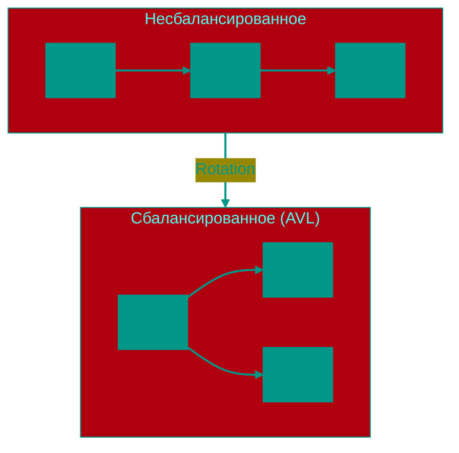

# 🔴⚫ Красно-черное дерево

**Описание**: 
Сбалансированные деревья (такие как AVL или Красно-черные) — это "умные" версии деревьев поиска. Они автоматически следят за своей формой, чтобы дерево всегда оставалось низким и ветвистым, а не превращалось в длинный список.

- **Как это устроено внутри**: При каждой вставке или удалении дерево проверяет свою высоту. Если одна ветка стала слишком длинной, дерево выполняет **"повороты"** — перекидывает узлы так, чтобы восстановить баланс. 
  - *AVL-дерево*: Очень строгое, разница высот не больше 1. Дорого перестраивать, но очень быстро искать.
  - *Красно-черное*: Более гибкое. Использует цвета узлов для контроля баланса. Быстрее при частых изменениях данных.
- **Аналогия**: Представьте садовода, который подрезает ветки дерева так, чтобы оно росло вширь и оставалось пушистым, а не вытягивалось в одну тонкую и слабую ветку до самого неба.


### Преимущества и недостатки
✅ **Плюсы**:
1. **Гарантированная скорость**: В отличие от обычного BST, здесь поиск всегда будет занимать **O(log n)**, даже если данные приходят в "плохом" порядке.
2. **Предсказуемость**: Вы всегда знаете худшее время работы алгоритма.

❌ **Минусы**:
1. **Высокая сложность**: Реализовать повороты и правила перекраски узлов вручную — одна из самых сложных задач в программировании.
2. **Накладные расходы**: На каждое изменение данных тратится дополнительное время для проверки баланса и выполнения поворотов.

---


### Визуализация балансировки




### Сложность

| Операция | Временная сложность (O) | Пространственная сложность (O) |
|:---|:---:|:---:|
| Вставка | O(log n) | O(log n) (рекурсия) |
| Поиск | O(log n) | O(log n) (рекурсия) |
| Удаление | O(log n) | O(log n) (рекурсия) |
| Хранение | — | O(n) |

> [!IMPORTANT]
> Гарантируют O(log n) за счёт поворотов (AVL) или перекрашивания/поворотов (красно-черное). AVL быстрее для поиска, красно-черное — для вставки/удаления.

---


## 💻 Реализация

```go
package red_black_tree

import "fmt"

// Цвет узла
type Color bool

const (
	RED   Color = true
	BLACK Color = false
)

// RBTNode представляет узел красно-черного дерева
type RBTNode struct {
	Value  int
	Color  Color
	Left   *RBTNode
	Right  *RBTNode
	Parent *RBTNode
}

// RBTree - красно-черное дерево
type RBTree struct {
	Root *RBTNode
	Nil  *RBTNode // Листовой узел (всегда черный)
}

// NewRBTree создает новое красно-черное дерево
func NewRBTree() *RBTree {
	nilNode := &RBTNode{Color: BLACK}
	return &RBTree{
		Root: nilNode,
		Nil:  nilNode,
	}
}

// LeftRotate выполняет левый поворот относительно узла x
func (t *RBTree) LeftRotate(x *RBTNode) {
	y := x.Right
	x.Right = y.Left
	if y.Left != t.Nil {
		y.Left.Parent = x
	}
	y.Parent = x.Parent
	if x.Parent == nil {
		t.Root = y
	} else if x == x.Parent.Left {
		x.Parent.Left = y
	} else {
		x.Parent.Right = y
	}
	y.Left = x
	x.Parent = y
}

// RightRotate выполняет правый поворот относительно узла y
func (t *RBTree) RightRotate(y *RBTNode) {
	x := y.Left
	y.Left = x.Right
	if x.Right != t.Nil {
		x.Right.Parent = y
	}
	x.Parent = y.Parent
	if y.Parent == nil {
		t.Root = x
	} else if y == y.Parent.Right {
		y.Parent.Right = x
	} else {
		y.Parent.Left = x
	}
	x.Right = y
	y.Parent = x
}

// Insert вставляет новое значение и восстанавливает баланс
func (t *RBTree) Insert(val int) {
	node := &RBTNode{
		Value: val,
		Color: RED,
		Left:  t.Nil,
		Right: t.Nil,
	}

	var y *RBTNode = nil
	x := t.Root

	for x != t.Nil {
		y = x
		if node.Value < x.Value {
			x = x.Left
		} else {
			x = x.Right
		}
	}

	node.Parent = y
	if y == nil {
		t.Root = node
	} else if node.Value < y.Value {
		y.Left = node
	} else {
		y.Right = node
	}

	if node.Parent == nil {
		node.Color = BLACK
		return
	}

	if node.Parent.Parent == nil {
		return
	}

	t.fixInsert(node)
}

// fixInsert восстанавливает свойства красно-черного дерева после вставки
func (t *RBTree) fixInsert(k *RBTNode) {
	for k.Parent.Color == RED {
		if k.Parent == k.Parent.Parent.Right {
			u := k.Parent.Parent.Left // дядя
			if u.Color == RED {
				u.Color = BLACK
				k.Parent.Color = BLACK
				k.Parent.Parent.Color = RED
				k = k.Parent.Parent
			} else {
				if k == k.Parent.Left {
					k = k.Parent
					t.RightRotate(k)
				}
				k.Parent.Color = BLACK
				k.Parent.Parent.Color = RED
				t.LeftRotate(k.Parent.Parent)
			}
		} else {
			u := k.Parent.Parent.Right // дядя
			if u.Color == RED {
				u.Color = BLACK
				k.Parent.Color = BLACK
				k.Parent.Parent.Color = RED
				k = k.Parent.Parent
			} else {
				if k == k.Parent.Right {
					k = k.Parent
					t.LeftRotate(k)
				}
				k.Parent.Color = BLACK
				k.Parent.Parent.Color = RED
				t.RightRotate(k.Parent.Parent)
			}
		}
		if k == t.Root {
			break
		}
	}
	t.Root.Color = BLACK
}

// Search ищет значение в дереве
func (t *RBTree) Search(val int) bool {
	node := t.Root
	for node != t.Nil {
		if val == node.Value {
			return true
		}
		if val < node.Value {
			node = node.Left
		} else {
			node = node.Right
		}
	}
	return false
}

// PrintTree выводит структуру дерева (рекурсивно)
func (t *RBTree) PrintTree(node *RBTNode, indent string) {
	if node != t.Nil {
		color := "RED"
		if node.Color == BLACK {
			color = "BLACK"
		}
		fmt.Printf("%s%d (%s)\n", indent, node.Value, color)
		t.PrintTree(node.Left, indent+"  L: ")
		t.PrintTree(node.Right, indent+"  R: ")
	}
}
```

```javascript
// Цвет узла
const RED = 'RED';
const BLACK = 'BLACK';

class RBTNode {
  constructor(value, color = RED) {
    this.value = value;
    this.color = color;
    this.left = null;
    this.right = null;
    this.parent = null;
  }
}

class RBTree {
  constructor() {
    this.TNULL = new RBTNode(0, BLACK); // Листовой узел
    this.root = this.TNULL;
  }

  // Левый поворот
  leftRotate(x) {
    let y = x.right;
    x.right = y.left;
    if (y.left !== this.TNULL) {
      y.left.parent = x;
    }
    y.parent = x.parent;
    if (x.parent === null) {
      this.root = y;
    } else if (x === x.parent.left) {
      x.parent.left = y;
    } else {
      x.parent.right = y;
    }
    y.left = x;
    x.parent = y;
  }

  // Правый поворот
  rightRotate(y) {
    let x = y.left;
    y.left = x.right;
    if (x.right !== this.TNULL) {
      x.right.parent = y;
    }
    x.parent = y.parent;
    if (y.parent === null) {
      this.root = x;
    } else if (y === y.parent.right) {
      y.parent.right = x;
    } else {
      y.parent.left = x;
    }
    x.right = y;
    y.parent = x;
  }

  // Вставка и восстановление баланса
  insert(value) {
    let node = new RBTNode(value);
    node.left = this.TNULL;
    node.right = this.TNULL;

    let y = null;
    let x = this.root;

    while (x !== this.TNULL) {
      y = x;
      if (node.value < x.value) {
        x = x.left;
      } else {
        x = x.right;
      }
    }

    node.parent = y;
    if (y === null) {
      this.root = node;
    } else if (node.value < y.value) {
      y.left = node;
    } else {
      y.right = node;
    }

    if (node.parent === null) {
      node.color = BLACK;
      return;
    }

    if (node.parent.parent === null) {
      return;
    }

    this._fixInsert(node);
  }

  _fixInsert(k) {
    while (k.parent.color === RED) {
      if (k.parent === k.parent.parent.right) {
        let u = k.parent.parent.left; // дядя
        if (u.color === RED) {
          u.color = BLACK;
          k.parent.color = BLACK;
          k.parent.parent.color = RED;
          k = k.parent.parent;
        } else {
          if (k === k.parent.left) {
            k = k.parent;
            this.rightRotate(k);
          }
          k.parent.color = BLACK;
          k.parent.parent.color = RED;
          this.leftRotate(k.parent.parent);
        }
      } else {
        let u = k.parent.parent.right; // дядя
        if (u.color === RED) {
          u.color = BLACK;
          k.parent.color = BLACK;
          k.parent.parent.color = RED;
          k = k.parent.parent;
        } else {
          if (k === k.parent.right) {
            k = k.parent;
            this.leftRotate(k);
          }
          k.parent.color = BLACK;
          k.parent.parent.color = RED;
          this.rightRotate(k.parent.parent);
        }
      }
      if (k === this.root) break;
    }
    this.root.color = BLACK;
  }

  search(value) {
    let current = this.root;
    while (current !== this.TNULL) {
      if (value === current.value) return true;
      current = value < current.value ? current.left : current.right;
    }
    return false;
  }

  printTree(node = this.root, indent = "") {
    if (node !== this.TNULL) {
      console.log(`${indent}${node.value} (${node.color})`);
      this.printTree(node.left, indent + "  L: ");
      this.printTree(node.right, indent + "  R: ");
    }
  }
}

// Пример использования
const rbt = new RBTree();
[10, 20, 30, 15].forEach(v => rbt.insert(v));
rbt.printTree();
```


## 🚀 Практические задачи
```go
package red_black_tree

import "fmt"

// Example демонстрирует использование красно-черного дерева
func Example() {
	rbt := &RBTree{}

	fmt.Println("Вставка элементов: 10, 20, 30, 15")
	rbt.Insert(10)
	rbt.Insert(20)
	rbt.Insert(30)
	rbt.Insert(15)

	fmt.Println("Структура дерева (Val Color):")
	// Примечание: полноценная балансировка еще не реализована в red_black_tree.go
	if rbt.Root != nil {
		rbt.PrintTree(rbt.Root, "")
	} else {
		fmt.Println("Дерево пусто")
	}
}

<!-- QUIZ_START 
[
    {
        "question": "Что является главной целью самобалансирующихся деревьев (AVL, Красно-черные)?",
        "options": ["Сделать код как можно длиннее", "Гарантировать высоту дерева O(log n) для поддержания высокой скорости операций", "Запретить удаление данных", "Снизить потребление электроэнергии"],
        "correctIndex": 1
    },
    {
        "question": "Какую операцию выполняет сбалансированное дерево, чтобы восстановить свою форму при вставке узла?",
        "options": ["Перезагрузка программы", "Поворот (Rotation) вокруг определенных узлов", "Удаление случайных данных", "Сортировка пузырьком"],
        "correctIndex": 1
    },
    {
        "question": "В чем основное различие между AVL-деревом и Красно-черным деревом?",
        "options": ["AVL — это массив, а Красно-черное — список", "AVL более строго сбалансировано (быстрее поиск), а Красно-черное — более гибкое (быстрее вставка/удаление)", "Разницы нет", "Красно-черное дерево работает только с цветами"],
        "correctIndex": 1
    }
]
QUIZ_END -->

```
