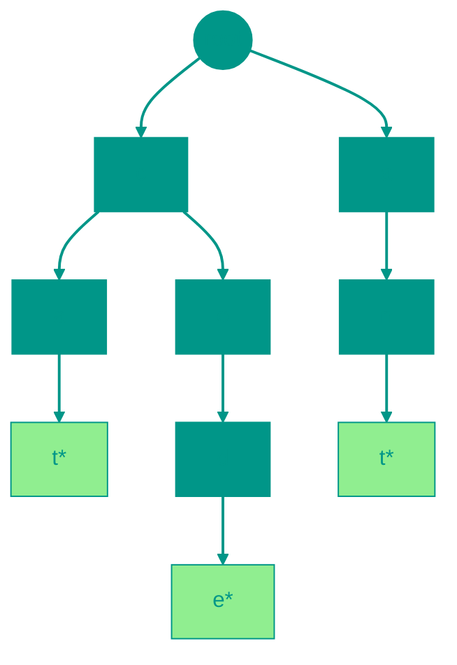

# 🌲 Префиксное дерево (Trie)

**Описание**: 
Префиксное дерево (Trie) — это специализированная древовидная структура данных, предназначенная для максимально эффективного хранения и поиска строк. Его главная "фишка" в том, что слова с одинаковыми началами разделяют одни и те же узлы.

- **Как это устроено внутри**: Каждый узел — это один символ. Путь от корня до узла формирует префикс или целое слово. В конце каждого слова ставится специальная метка (`isEnd`). Главное преимущество: время поиска слова не зависит от того, сколько миллионов слов в дереве, оно зависит только от **длины самого слова (O(m))**.
- **Аналогия**: Представьте Т9 в старых телефонах или автодополнение в поисковике Google. Когда вы набираете "прог", дерево уже знает все возможные продолжения: "программа", "прогулка", "прогноз". Оно не перебирает весь словарь, а просто идет по готовым веткам.


### Преимущества и недостатки
✅ **Плюсы**:
1. **Мгновенный поиск префиксов**: Лучшая структура для задач типа "найди все слова на букву А".
2. **Экономия памяти на общих началах**: Если у вас тысячи слов, начинающихся на "пре-", этот префикс будет храниться в памяти только один раз.
3. **Отсутствие коллизий**: В отличие от хэш-таблиц, здесь нет проблем с совпадением ключей.

❌ **Минусы**:
1. **Расход памяти**: Если слова совсем разные и не имеют общих префиксов, дерево может раздуться и занимать намного больше места, чем простой список строк.
2. **Сложность реализации**: Требует больше кода по сравнению с хэш-таблицей.

---


### Визуализация




### Сложность

| Операция | Временная сложность (O) | Пространственная сложность (O) |
|:---|:---:|:---:|
| Вставка | O(m) | O(m) |
| Поиск (слово) | O(m) | O(1) |
| Поиск (префикс) | O(m) | O(1) |
| Удаление | O(m) | O(1) |
| Хранение | — | O(ALPHABET_SIZE × N × M) |

> [!NOTE]
> **m** — длина строки. Память зависит от размера алфавита и числа строк.


---


## 💻 Реализация

```go
package trie

// TrieNode представляет узел префиксного дерева
type TrieNode struct {
	children map[rune]*TrieNode // Потомки (символ -> узел)
	isEnd    bool               // Конец слова
}

// Trie - префиксное дерево
type Trie struct {
	root *TrieNode
}

// NewTrie создает новое префиксное дерево
func NewTrie() *Trie {
	return &Trie{
		root: &TrieNode{
			children: make(map[rune]*TrieNode),
			isEnd:    false,
		},
	}
}

// Insert вставляет слово в дерево
func (t *Trie) Insert(word string) {
	node := t.root
	
	for _, char := range word {
		if _, exists := node.children[char]; !exists {
			node.children[char] = &TrieNode{
				children: make(map[rune]*TrieNode),
				isEnd:    false,
			}
		}
		node = node.children[char]
	}
	
	node.isEnd = true
}

// Search проверяет, существует ли слово в дереве
func (t *Trie) Search(word string) bool {
	node := t.root
	
	for _, char := range word {
		if _, exists := node.children[char]; !exists {
			return false
		}
		node = node.children[char]
	}
	
	return node.isEnd
}

// StartsWith проверяет, есть ли слова с данным префиксом
func (t *Trie) StartsWith(prefix string) bool {
	node := t.root
	
	for _, char := range prefix {
		if _, exists := node.children[char]; !exists {
			return false
		}
		node = node.children[char]
	}
	
	return true
}

// Delete удаляет слово из дерева
func (t *Trie) Delete(word string) bool {
	return deleteHelper(t.root, word, 0)
}

func deleteHelper(node *TrieNode, word string, index int) bool {
	if node == nil {
		return false
	}
	
	runes := []rune(word)
	
	// Достигли конца слова
	if index == len(runes) {
		if !node.isEnd {
			return false // Слово не существует
		}
		
		node.isEnd = false
		
		// Если у узла нет детей, он может быть удален
		return len(node.children) == 0
	}
	
	char := runes[index]
	child, exists := node.children[char]
	
	if !exists {
		return false
	}
	
	shouldDeleteChild := deleteHelper(child, word, index+1)
	
	if shouldDeleteChild {
		delete(node.children, char)
		// Возвращаем true, если текущий узел тоже может быть удален
		return !node.isEnd && len(node.children) == 0
	}
	
	return false
}

// GetAllWords возвращает все слова в дереве
func (t *Trie) GetAllWords() []string {
	result := []string{}
	getAllWordsHelper(t.root, "", &result)
	return result
}

func getAllWordsHelper(node *TrieNode, currentWord string, result *[]string) {
	if node.isEnd {
		*result = append(*result, currentWord)
	}
	
	for char, child := range node.children {
		getAllWordsHelper(child, currentWord+string(char), result)
	}
}

// GetWordsWithPrefix возвращает все слова с данным префиксом
func (t *Trie) GetWordsWithPrefix(prefix string) []string {
	node := t.root
	
	// Находим узел префикса
	for _, char := range prefix {
		if _, exists := node.children[char]; !exists {
			return []string{} // Префикс не найден
		}
		node = node.children[char]
	}
	
	// Собираем все слова от этого узла
	result := []string{}
	getAllWordsHelper(node, prefix, &result)
	return result
}

// CountWords возвращает количество слов в дереве
func (t *Trie) CountWords() int {
	return countWordsHelper(t.root)
}

func countWordsHelper(node *TrieNode) int {
	count := 0
	
	if node.isEnd {
		count = 1
	}
	
	for _, child := range node.children {
		count += countWordsHelper(child)
	}
	
	return count
}

```

```javascript
// TrieNode - узел префиксного дерева
class TrieNode {
  constructor() {
    this.children = {}; // Объект для хранения потомков
    this.isEnd = false; // Маркер конца слова
  }
}

// Trie - префиксное дерево
class Trie {
  constructor() {
    this.root = new TrieNode();
  }

  // Вставка слова
  insert(word) {
    let node = this.root;
    
    for (const char of word) {
      if (!node.children[char]) {
        node.children[char] = new TrieNode();
      }
      node = node.children[char];
    }
    
    node.isEnd = true;
  }

  // Поиск слова
  search(word) {
    let node = this.root;
    
    for (const char of word) {
      if (!node.children[char]) {
        return false;
      }
      node = node.children[char];
    }
    
    return node.isEnd;
  }

  // Проверка наличия префикса
  startsWith(prefix) {
    let node = this.root;
    
    for (const char of prefix) {
      if (!node.children[char]) {
        return false;
      }
      node = node.children[char];
    }
    
    return true;
  }

  // Удаление слова
  delete(word) {
    return this._deleteHelper(this.root, word, 0);
  }

  _deleteHelper(node, word, index) {
    if (!node) return false;

    // Достигли конца слова
    if (index === word.length) {
      if (!node.isEnd) {
        return false; // Слово не существует
      }
      
      node.isEnd = false;
      
      // Если у узла нет детей, он может быть удален
      return Object.keys(node.children).length === 0;
    }

    const char = word[index];
    const child = node.children[char];
    
    if (!child) {
      return false;
    }

    const shouldDeleteChild = this._deleteHelper(child, word, index + 1);

    if (shouldDeleteChild) {
      delete node.children[char];
      // Возвращаем true, если текущий узел тоже может быть удален
      return !node.isEnd && Object.keys(node.children).length === 0;
    }

    return false;
  }

  // Получить все слова
  getAllWords() {
    const result = [];
    this._getAllWordsHelper(this.root, '', result);
    return result;
  }

  _getAllWordsHelper(node, currentWord, result) {
    if (node.isEnd) {
      result.push(currentWord);
    }

    for (const char in node.children) {
      this._getAllWordsHelper(
        node.children[char],
        currentWord + char,
        result
      );
    }
  }

  // Получить все слова с префиксом
  getWordsWithPrefix(prefix) {
    let node = this.root;
    
    // Находим узел префикса
    for (const char of prefix) {
      if (!node.children[char]) {
        return []; // Префикс не найден
      }
      node = node.children[char];
    }

    // Собираем все слова от этого узла
    const result = [];
    this._getAllWordsHelper(node, prefix, result);
    return result;
  }

  // Подсчитать количество слов
  countWords() {
    return this._countWordsHelper(this.root);
  }

  _countWordsHelper(node) {
    let count = node.isEnd ? 1 : 0;

    for (const char in node.children) {
      count += this._countWordsHelper(node.children[char]);
    }

    return count;
  }

  // Автодополнение (возвращает первые N слов с префиксом)
  autocomplete(prefix, limit = 5) {
    const words = this.getWordsWithPrefix(prefix);
    return words.slice(0, limit);
  }
}

// Пример использования
const trie = new Trie();

trie.insert("apple");
trie.insert("app");
trie.insert("application");
trie.insert("apply");
trie.insert("banana");

console.log(trie.search("app"));           // true
console.log(trie.search("appl"));          // false
console.log(trie.startsWith("app"));       // true
console.log(trie.getWordsWithPrefix("app")); // ["apple", "app", "application", "apply"]
console.log(trie.countWords());            // 5

```


## 🚀 Практические задачи
```go
package trie

import "fmt"

// Example демонстрирует использование Trie
func Example() {
	// Создаем новое префиксное дерево
	trie := NewTrie()

	// Вставляем слова
	words := []string{"apple", "app", "application", "banana"}
	for _, word := range words {
		trie.Insert(word)
	}

	// Проверяем наличие слов
	tests := []string{"apple", "app", "appl", "banana", "orange"}
	for _, word := range tests {
		exists := trie.Search(word)
		fmt.Printf("Слово '%s' существует? %t\n", word, exists)
	}

	// Проверяем префиксы
	prefixes := []string{"app", "ban", "ora"}
	for _, prefix := range prefixes {
		startsWith := trie.StartsWith(prefix)
		fmt.Printf("Есть слова с префиксом '%s'? %t\n", prefix, startsWith)
	}
}

// Задача: Самое длинное слово в словаре
// Дан массив строк words, представляющий словарь.
// Найти самое длинное слово в словаре, которое может быть построено по одной букве за раз,
// где каждая следующая часть также должна быть словом в словаре.
//
// Пример: words = ["w","wo","wor","worl","world"] => "world"
// Примечание: Для решения этой задачи можно использовать Trie, где каждый узел будет хранить информацию, является ли он концом какого-либо слова.
func LongestWord(words []string) string {
	trie := NewTrie()
	for _, word := range words {
		trie.Insert(word)
	}

	longest := ""

	var dfs func(node *TrieNode, currentWord string)
	dfs = func(node *TrieNode, currentWord string) {
		if len(currentWord) > len(longest) || (len(currentWord) == len(longest) && currentWord < longest) {
			longest = currentWord
		}

		for char, child := range node.children {
			// Продолжаем только если текущий узел является концом слова (т.е. слово построено по одной букве)
			if child.isEnd {
				dfs(child, currentWord+string(char))
			}
		}
	}

	// Запускаем DFS от корня. Но в текущей реализации Trie root не является концом слова.
	// Нам нужно модифицировать подход, так как root пустой.
	// Пройдемся по детям корня, которые являются словами.

	for char, child := range trie.root.children {
		if child.isEnd {
			dfs(child, string(char))
		}
	}

	return longest
}

<!-- QUIZ_START 
[
    {
        "question": "В чем заключается главная особенность хранения слов в Префиксном дереве (Trie)?",
        "options": ["Все слова хранятся в зашифрованном виде", "Слова с одинаковыми префиксами (началами) разделяют общие узлы", "Слова хранятся в обратном порядке", "Каждое слово занимает отдельный массив"],
        "correctIndex": 1
    },
    {
        "question": "От чего зависит время поиска слова в Trie?",
        "options": ["От общего количества слов в дереве", "От длины искомого слова (O(m))", "От объема оперативной памяти", "От скорости интернет-соединения"],
        "correctIndex": 1
    },
    {
        "question": "Для какой задачи Trie подходит лучше всего?",
        "options": ["Сортировка чисел", "Автодополнение (autocomplete) и поиск по префиксу", "Вычисление суммы элементов в массиве", "Обработка запросов к базе данных по ID"],
        "correctIndex": 1
    }
]
QUIZ_END -->

```
