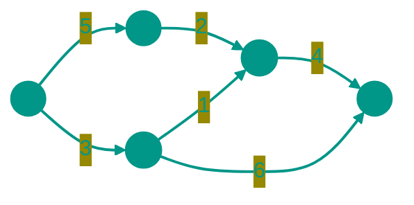

# 🕸️ Граф

**Описание**: 
Граф — это самая универсальная структура данных, способная описать практически любую систему в реальном мире. Он состоит из **вершин** (узлов) и **ребер**, которые их соединяют. Если деревья — это строгая иерархия, то графы — это полная свобода связей.

- **Как это устроено внутри**: 
  - *Список смежности*: Каждая вершина хранит список своих "друзей". Это экономно для памяти (O(V+E)).
  - *Матрица смежности*: Таблица "все со всеми", где 1 означает связь, а 0 — ее отсутствие. Удобно для быстрой проверки конкретной связи (O(1)).
- **Аналогия**: Идеальный пример — социальная сеть. Вершины — это люди, а ребра — это дружба между ними. Или карта метро: станции — это вершины, а перегоны между ними — ребра.


### Виды графов
- **Направленный**: Связь работает только в одну сторону (как подписка в соцсетях: я на вас подписан, вы на меня — нет).
- **Взвешенный**: У ребер есть "цена" (например, расстояние в км между городами).
- **Связный**: Из любой точки можно добраться в любую другую.


### Преимущества и недостатки
✅ **Плюсы**:
1. **Моделирование реальности**: Позволяет решать задачи навигации, логистики, анализа связей и даже рекомендаций товаров.
2. **Гибкость**: Нет ограничений на количество связей или структуру.

❌ **Минусы**:
1. **Сложность алгоритмов**: Многие задачи на графах (например, поиск кратчайшего пути или задача коммивояжера) требуют серьезных вычислительных мощностей.
2. **Расход памяти**: Хранение всех связей в плотном графе может занимать очень много места (O(V²)).

---


### Визуализация




### Сложность

| Операция | Список смежности (O) | Матрица смежности (O) | Пространственная сложность |
|:---|:---:|:---:|:---:|
| Добавление вершины | O(1) | O(V²) | O(V) / O(V²) |
| Добавление ребра | O(1) | O(1) | O(1) |
| Проверка ребра | O(V) | O(1) | O(1) |
| Перечисление соседей | O(degree) | O(V) | O(1) |
| Хранение | — | — | O(V + E) / O(V²) |

> [!TIP]
> **V** — число вершин, **E** — число рёбер. Список смежности экономит память для разреженных графов. Матрица удобна для плотных графов.


---


# ⚙️ Алгоритмы

Алгоритмы — это последовательности шагов для решения конкретных задач.

```mermaid
%%{init: { 'theme': 'base', 'themeVariables': { 'lineColor': '#009688', 'primaryColor': '#009688', 'primaryTextColor': '#009688', 'attributeBkg': '#009688', 'attributeTextColor': '#009688', 'signalColor': '#009688', 'actorLineColor': '#009688', 'nodeBorder': '#009688', 'clusterBorder': '#009688', 'textColor': '#009688', 'fontSize': '16px' } } }%%
graph TD
    Algo[Алгоритмы] --> Search[Поиск]
    Algo --> Sort[Сортировка]
    
    Search --> Linear[Линейный]
    Search --> Binary[Бинарный]
    
    Sort --> Simple[Простые O&#40;n²&#41;]
    Sort --> Advanced[Продвинутые O&#40;n log n&#41;]
    
    Simple --> Bubble[Пузырьковая]
    Simple --> Selection[Выбором]
    Simple --> Insertion[Вставками]
    
    Advanced --> Quick[Быстрая]
    Advanced --> Merge[Слиянием]



linkStyle default stroke:#009688,stroke-width:2px;




```



---


## 💻 Реализация
```go

package graph

import "fmt"

// Graph представляет граф через список смежности (Adjacency List)
// Это наиболее универсальный способ представления для большинства алгоритмических задач.
type Graph struct {
	adjList map[int][]int
}

// NewGraph создает новый граф
func NewGraph() *Graph {
	return &Graph{adjList: make(map[int][]int)}
}

// AddVertex добавляет вершину в граф
func (g *Graph) AddVertex(v int) {
	if _, exists := g.adjList[v]; !exists {
		g.adjList[v] = []int{}
	}
}

// AddEdge добавляет ребро (u, v)
// Для ненаправленного графа ребро добавляется в обе стороны.
func (g *Graph) AddEdge(u, v int) {
	// Добавляем v в список смежности u
	g.adjList[u] = append(g.adjList[u], v)
	// Добавляем u в список смежности v (так как граф ненаправленный)
	g.adjList[v] = append(g.adjList[v], u)
}

// AddDirectedEdge добавляет направленное ребро (u -> v)
func (g *Graph) AddDirectedEdge(u, v int) {
	g.adjList[u] = append(g.adjList[u], v)
}

// BFS - обход в ширину
func (g *Graph) BFS(start int) []int {
	visited := make(map[int]bool)
	queue := []int{start}
	result := []int{}
	visited[start] = true

	for len(queue) > 0 {
		node := queue[0]
		queue = queue[1:]
		result = append(result, node)

		for _, neighbor := range g.adjList[node] {
			if !visited[neighbor] {
				visited[neighbor] = true
				queue = append(queue, neighbor)
			}
		}
	}

	return result
}

// DFS - обход в глубину (рекурсивный)
func (g *Graph) DFS(start int) []int {
	visited := make(map[int]bool)
	result := []int{}
	g.dfsHelper(start, visited, &result)
	return result
}

func (g *Graph) dfsHelper(node int, visited map[int]bool, result *[]int) {
	visited[node] = true
	*result = append(*result, node)

	for _, neighbor := range g.adjList[node] {
		if !visited[neighbor] {
			g.dfsHelper(neighbor, visited, result)
		}
	}
}

// DFSIterative - обход в глубину (итеративный)
func (g *Graph) DFSIterative(start int) []int {
	visited := make(map[int]bool)
	stack := []int{start}
	result := []int{}

	for len(stack) > 0 {
		node := stack[len(stack)-1]
		stack = stack[:len(stack)-1]

		if !visited[node] {
			visited[node] = true
			result = append(result, node)

			// Добавляем соседей в стек (в обратном порядке для правильного обхода)
			for i := len(g.adjList[node]) - 1; i >= 0; i-- {
				neighbor := g.adjList[node][i]
				if !visited[neighbor] {
					stack = append(stack, neighbor)
				}
			}
		}
	}

	return result
}

// HasCycle проверяет наличие цикла в графе (для ненаправленного графа)
func (g *Graph) HasCycle() bool {
	visited := make(map[int]bool)

	for node := range g.adjList {
		if !visited[node] {
			if g.hasCycleDFS(node, -1, visited) {
				return true
			}
		}
	}

	return false
}

func (g *Graph) hasCycleDFS(node, parent int, visited map[int]bool) bool {
	visited[node] = true

	for _, neighbor := range g.adjList[node] {
		if !visited[neighbor] {
			if g.hasCycleDFS(neighbor, node, visited) {
				return true
			}
		} else if neighbor != parent {
			return true
		}
	}

	return false
}

// IsConnected проверяет, является ли граф связным
func (g *Graph) IsConnected() bool {
	if len(g.adjList) == 0 {
		return true
	}

	// Получаем первую вершину
	var start int
	for node := range g.adjList {
		start = node
		break
	}

	// Выполняем BFS/DFS от первой вершины
	visited := make(map[int]bool)
	queue := []int{start}
	visited[start] = true

	for len(queue) > 0 {
		node := queue[0]
		queue = queue[1:]

		for _, neighbor := range g.adjList[node] {
			if !visited[neighbor] {
				visited[neighbor] = true
				queue = append(queue, neighbor)
			}
		}
	}

	// Проверяем, посетили ли мы все вершины
	return len(visited) == len(g.adjList)
}

// GetVertices возвращает все вершины графа
func (g *Graph) GetVertices() []int {
	vertices := []int{}
	for v := range g.adjList {
		vertices = append(vertices, v)
	}
	return vertices
}

// Print выводит структуру графа
func (g *Graph) Print() {
	for node, neighbors := range g.adjList {
		fmt.Printf("%d -> %v\n", node, neighbors)
	}
}

```

```javascript
// Graph - представление графа через список смежности
class Graph {
  constructor() {
    this.adjList = new Map(); // Map<vertex, neighbors[]>
  }

  // Добавить вершину
  addVertex(vertex) {
    if (!this.adjList.has(vertex)) {
      this.adjList.set(vertex, []);
    }
  }

  // Добавить ребро (ненаправленный граф)
  addEdge(u, v) {
    // Убеждаемся, что вершины существуют
    this.addVertex(u);
    this.addVertex(v);
    
    // Добавляем ребро в обе стороны
    this.adjList.get(u).push(v);
    this.adjList.get(v).push(u);
  }

  // Добавить направленное ребро (u -> v)
  addDirectedEdge(u, v) {
    this.addVertex(u);
    this.addVertex(v);
    this.adjList.get(u).push(v);
  }

  // BFS - обход в ширину
  bfs(start) {
    const visited = new Set();
    const queue = [start];
    const result = [];
    visited.add(start);

    while (queue.length > 0) {
      const node = queue.shift();
      result.push(node);

      const neighbors = this.adjList.get(node) || [];
      for (const neighbor of neighbors) {
        if (!visited.has(neighbor)) {
          visited.add(neighbor);
          queue.push(neighbor);
        }
      }
    }

    return result;
  }

  // DFS - обход в глубину (рекурсивный)
  dfs(start) {
    const visited = new Set();
    const result = [];
    this._dfsHelper(start, visited, result);
    return result;
  }

  _dfsHelper(node, visited, result) {
    visited.add(node);
    result.push(node);

    const neighbors = this.adjList.get(node) || [];
    for (const neighbor of neighbors) {
      if (!visited.has(neighbor)) {
        this._dfsHelper(neighbor, visited, result);
      }
    }
  }

  // DFS - обход в глубину (итеративный)
  dfsIterative(start) {
    const visited = new Set();
    const stack = [start];
    const result = [];

    while (stack.length > 0) {
      const node = stack.pop();

      if (!visited.has(node)) {
        visited.add(node);
        result.push(node);

        const neighbors = this.adjList.get(node) || [];
        // Добавляем соседей в стек (в обратном порядке для правильного обхода)
        for (let i = neighbors.length - 1; i >= 0; i--) {
          if (!visited.has(neighbors[i])) {
            stack.push(neighbors[i]);
          }
        }
      }
    }

    return result;
  }

  // Проверка на наличие цикла (для ненаправленного графа)
  hasCycle() {
    const visited = new Set();

    for (const node of this.adjList.keys()) {
      if (!visited.has(node)) {
        if (this._hasCycleDFS(node, null, visited)) {
          return true;
        }
      }
    }

    return false;
  }

  _hasCycleDFS(node, parent, visited) {
    visited.add(node);

    const neighbors = this.adjList.get(node) || [];
    for (const neighbor of neighbors) {
      if (!visited.has(neighbor)) {
        if (this._hasCycleDFS(neighbor, node, visited)) {
          return true;
        }
      } else if (neighbor !== parent) {
        return true;
      }
    }

    return false;
  }

  // Проверка на связность
  isConnected() {
    if (this.adjList.size === 0) return true;

    // Получаем первую вершину
    const start = this.adjList.keys().next().value;

    // Выполняем BFS
    const visited = new Set();
    const queue = [start];
    visited.add(start);

    while (queue.length > 0) {
      const node = queue.shift();
      const neighbors = this.adjList.get(node) || [];

      for (const neighbor of neighbors) {
        if (!visited.has(neighbor)) {
          visited.add(neighbor);
          queue.push(neighbor);
        }
      }
    }

    // Проверяем, посетили ли мы все вершины
    return visited.size === this.adjList.size;
  }

  // Получить все вершины
  getVertices() {
    return Array.from(this.adjList.keys());
  }

  // Вывести граф
  print() {
    for (const [node, neighbors] of this.adjList) {
      console.log(`${node} -> ${neighbors.join(', ')}`);
    }
  }
}

// Пример использования
const graph = new Graph();
graph.addEdge(0, 1);
graph.addEdge(0, 2);
graph.addEdge(1, 3);
graph.addEdge(2, 3);

console.log("BFS от 0:", graph.bfs(0));      // [0, 1, 2, 3]
console.log("DFS от 0:", graph.dfs(0));      // [0, 1, 3, 2]
console.log("Есть цикл?", graph.hasCycle()); // true
console.log("Связный?", graph.isConnected()); // true

```


## 🚀 Практические задачи
```go
package graph

import (
	"fmt"
)

// Example демонстрирует использование графа
func Example() {
	// Создаем граф
	g := NewGraph()

	// Добавляем ребра
	g.AddEdge(0, 1)
	g.AddEdge(0, 2)
	g.AddEdge(1, 3)
	g.AddEdge(2, 3)

	fmt.Println("Структура графа:")
	g.Print()

	// Задача: Найти существует ли путь
	start, end := 0, 3
	exists := ValidPath(4, [][]int{{0, 1}, {0, 2}, {1, 3}, {2, 3}}, start, end)
	fmt.Printf("Существует путь от %d к %d? %t\n", start, end, exists)
}

// Задача: Существует ли путь в графе
// Дано n вершин и массив ребер. Определить, существует ли валидный путь от source к destination.
// Использует BFS.
func ValidPath(n int, edges [][]int, source int, destination int) bool {
	if source == destination {
		return true
	}

	// Строим список смежности (локально, используя слайс слайсов для int вершин)
	adj := make([][]int, n)
	for _, edge := range edges {
		u, v := edge[0], edge[1]
		adj[u] = append(adj[u], v)
		adj[v] = append(adj[v], u)
	}

	visited := make([]bool, n)
	visited[source] = true
	queue := []int{source}

	for len(queue) > 0 {
		node := queue[0]
		queue = queue[1:]

		if node == destination {
			return true
		}

		for _, neighbor := range adj[node] {
			if !visited[neighbor] {
				visited[neighbor] = true
				queue = append(queue, neighbor)
			}
		}
	}

	return false
}

// Задача: Количество провинций (Связные компоненты)
// isConnected[i][j] = 1, если города i и j соединены.
// Вернуть количество провинций. Использует DFS.
func FindCircleNum(isConnected [][]int) int {
	n := len(isConnected)
	visited := make([]bool, n)
	count := 0

	var dfs func(int)
	dfs = func(i int) {
		for j := 0; j < n; j++ {
			if isConnected[i][j] == 1 && !visited[j] {
				visited[j] = true
				dfs(j)
			}
		}
	}

	for i := 0; i < n; i++ {
		if !visited[i] {
			dfs(i)
			count++
		}
	}

	return count
}
```

```javascript
// Задача: Существует ли путь в графе (BFS)
function validPath(n, edges, source, destination) {
    if (source === destination) return true;
    
    const adj = Array.from({ length: n }, () => []);
    for (const [u, v] of edges) {
        adj[u].push(v);
        adj[v].push(u);
    }

    const visited = new Set();
    visited.add(source);
    const queue = [source];

    while (queue.length > 0) {
        const node = queue.shift();
        if (node === destination) return true;

        for (const neighbor of adj[node]) {
            if (!visited.has(neighbor)) {
                visited.add(neighbor);
                queue.push(neighbor);
            }
        }
    }
    return false;
}

// Задача: Количество провинций (DFS)
function findCircleNum(isConnected) {
    const n = isConnected.length;
    const visited = new Set();
    let count = 0;

    function dfs(i) {
        for (let j = 0; j < n; j++) {
            if (isConnected[i][j] === 1 && !visited.has(j)) {
                visited.add(j);
                dfs(j);
            }
        }
    }

    for (let i = 0; i < n; i++) {
        if (!visited.has(i)) {
            visited.add(i);
            dfs(i);
            count++;
        }
    }
    return count;
}
```
<!-- QUIZ_START 
[
    {
        "question": "В чем главное отличие Графа от Дерева?",
        "options": ["В графе не может быть циклов", "Граф — это иерархия, а дерево — свободная сеть", "Граф допускает любые связи между вершинами, включая циклы и произвольную структуру, в то время как дерево является строгой иерархией", "В графе всегда только две вершины"],
        "correctIndex": 2
    },
    {
        "question": "Для каких типов графов (по плотности связей) наиболее эффективно использовать 'Список смежности'?",
        "options": ["Для полных графов (где каждая вершина соединена со всеми)", "Для разреженных графов (где связей относительно немного) для экономии памяти", "Для графов без вершин", "Разницы нет"],
        "correctIndex": 1
    },
    {
        "question": "Что представляет собой 'Матрица смежности'?",
        "options": ["Список всех имен вершин", "Таблица 'все со всеми', где на пересечении строк и столбцов стоит 1 (есть связь) или 0 (нет связи)", "Цветовая схема графа", "Специальная база данных"],
        "correctIndex": 1
    }
]
QUIZ_END -->

```
