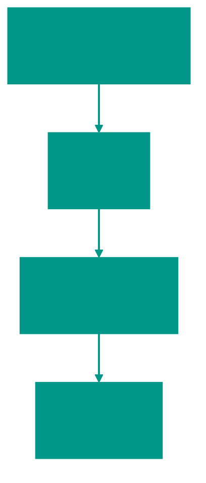

# 🔎 Бинарный поиск

**Описание**: 
Бинарный (двоичный) поиск — это один из самых эффективных алгоритмов поиска, который работает по принципу "разделяй и властвуй". Вместо того чтобы просматривать каждый элемент, он на каждом шаге отсекает ровно половину данных.

- **Как это устроено внутри**: Алгоритм работает только на **отсортированных** данных. Он сравнивает искомое значение со средним элементом массива:
  - Если значения совпали — поиск окончен.
  - Если искомое больше среднего — мы отбрасываем левую половину и ищем в правой.
  - Если искомое меньше — отбрасываем правую половину.
  Этот процесс продолжается, пока элемент не будет найден или пока область поиска не станет пустой. Это дает невероятную скорость **O(log n)**.
- **Аналогия**: Представьте, что вы ищете слово в бумажном словаре. Вы открываете его посередине. Если ваше слово начинается на "П", а вы открыли на "М", вы не будете смотреть страницы до "М", вы сразу перейдете к правой части. Вы не листаете словарь по одной странице — это и есть бинарный поиск.


### Преимущества и недостатки
✅ **Плюсы**:
1. **Экстремальная скорость**: В массиве из миллиона элементов бинарный поиск найдет нужное число максимум за 20 шагов.
2. **Эффективность**: Минимальное количество обращений к памяти по сравнению с линейным поиском.

❌ **Минусы**:
1. **Требование сортировки**: Если данные не отсортированы, алгоритм бесполезен. Сортировка сама по себе занимает время, поэтому бинарный поиск выгоден, если вы сортируете один раз, а ищете много раз.
2. **Только для массивов**: Алгоритму нужен "произвольный доступ" к элементам (по индексу), поэтому он плохо работает с обычными связными списками.

---

**Визуализация**:



**Сложность**:

| Метрика | Сложность (O) |
|:---|:---:|
| Временная (средняя/худшая) | O(log n) |
| Пространственная | O(1) итеративный, O(log n) рекурсивный |

**Когда использовать**: Отсортированные данные, быстрый поиск в больших массивах.

---


## 💻 Реализация

```go
package binary_search

import "fmt"

// BinarySearch реализует итеративный алгоритм бинарного поиска.
// Возвращает индекс найденного элемента или -1, если элемент не найден.
func BinarySearch(arr []int, target int) int {
	left, right := 0, len(arr)-1

	for left <= right {
		// Используем эту формулу, чтобы избежать переполнения для больших индексов
		mid := left + (right-left)/2

		if arr[mid] == target {
			return mid
		}
		if arr[mid] < target {
			left = mid + 1
		} else {
			right = mid - 1
		}
	}

	return -1
}

func main() {
	arr := []int{1, 3, 5, 7, 9, 11, 13, 15}
	target := 7
	result := BinarySearch(arr, target)
	fmt.Printf("Элемент %d найден на индексе: %d\n", target, result)
}
```

```javascript
/**
 * Итеративный бинарный поиск.
 */
function binarySearch(arr, target) {
  let left = 0;
  let right = arr.length - 1;

  while (left <= right) {
    const mid = Math.floor(left + (right - left) / 2);

    if (arr[mid] === target) return mid;
    if (arr[mid] < target) {
      left = mid + 1;
    } else {
      right = mid - 1;
    }
  }

  return -1;
}

/**
 * Пример: Поиск квадратного корня целого числа.
 */
function mySqrt(x) {
  if (x < 2) return x;
  let left = 2, right = Math.floor(x / 2);

  while (left <= right) {
    let mid = Math.floor(left + (right - left) / 2);
    let num = mid * mid;
    if (num === x) return mid;
    if (num > x) right = mid - 1;
    else left = mid + 1;
  }

  return right;
}

// Пример использования
const arr = [1, 2, 3, 4, 5, 6, 7, 8, 9, 10];
console.log(binarySearch(arr, 7)); // 6
console.log(mySqrt(16)); // 4
```


## 🚀 Практические задачи

```go
package binary_search

// Задача 1: Найти пиковый элемент (Peak Element)
// Пиковый элемент — это элемент, который больше своих соседей.
func FindPeakElement(nums []int) int {
	left, right := 0, len(nums)-1
	for left < right {
		mid := left + (right-left)/2
		if nums[mid] > nums[mid+1] {
			right = mid
		} else {
			left = mid + 1
		}
	}
	return left
}

// Задача 2: Поиск во вращающемся отсортированном массиве (Rotated Sorted Array)
func SearchInRotated(nums []int, target int) int {
	left, right := 0, len(nums)-1
	for left <= right {
		mid := left + (right-left)/2
		if nums[mid] == target {
			return mid
		}

		if nums[left] <= nums[mid] {
			if nums[left] <= target && target < nums[mid] {
				right = mid - 1
			} else {
				left = mid + 1
			}
		} else {
			if nums[mid] < target && target <= nums[right] {
				left = mid + 1
			} else {
				right = mid - 1
			}
		}
	}
	return -1
}
```

```javascript
/**
 * Задача 1: Найти пиковый элемент.
 */
function findPeakElement(nums) {
  let left = 0, right = nums.length - 1;
  while (left < right) {
    const mid = Math.floor(left + (right - left) / 2);
    if (nums[mid] > nums[mid + 1]) {
      right = mid;
    } else {
      left = mid + 1;
    }
  }
  return left;
}

/**
 * Задача 2: Поиск во вращающемся отсортированном массиве.
 */
function searchInRotated(nums, target) {
  let left = 0, right = nums.length - 1;
  while (left <= right) {
    const mid = Math.floor(left + (right - left) / 2);
    if (nums[mid] === target) return mid;

    // Левая часть отсортирована
    if (nums[left] <= nums[mid]) {
      if (nums[left] <= target && target < nums[mid]) {
        right = mid - 1;
      } else {
        left = mid + 1;
      }
    } else {
      // Правая часть отсортирована
      if (nums[mid] < target && target <= nums[right]) {
        left = mid + 1;
      } else {
        right = mid - 1;
      }
    }
  }
  return -1;
}
```

<!-- QUIZ_START 
[
    {
        "question": "Какое обязательное условие должно быть выполнено для массива, чтобы в нем можно было использовать бинарный поиск?",
        "options": ["Массив должен быть большого размера", "Массив должен состоять только из положительных чисел", "Массив должен быть отсортирован", "Массив не должен содержать дубликатов"],
        "correctIndex": 2
    },
    {
        "question": "Какую временную сложность (в среднем и худшем случае) имеет алгоритм бинарного поиска?",
        "options": ["O(n)", "O(log n)", "O(n log n)", "O(1)"],
        "correctIndex": 1
    },
    {
        "question": "На сколько частей (в идеале) бинарный поиск делит область поиска на каждом шаге?",
        "options": ["На 2 равные части", "На 3 равные части", "На 10 частей", "Всегда на части по 100 элементов"],
        "correctIndex": 0
    }
]
QUIZ_END -->

