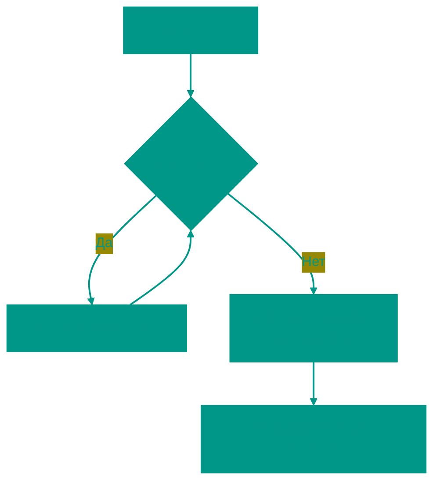

# 🚀 Экспоненциальный поиск

**Описание**: 
Экспоненциальный поиск — это алгоритм, который сочетает в себе агрессивное расширение границ и точность бинарного поиска. Он идеально подходит для ситуаций, когда мы не знаем точно, где кончается массив, или когда искомый элемент, скорее всего, находится в самом начале.

- **Как это устроено внутри**: Алгоритм работает в два такта. 
  1. *Прыжки*: Мы начинаем с индекса 1 и постоянно удваиваем его (1, 2, 4, 8...), пока не найдем элемент, который больше искомого, или не упремся в конец массива. Это позволяет нам экспоненциально быстро ограничить область поиска.
  2. *Бинарный поиск*: Как только диапазон `[2^(k-1), 2^k]` найден, мы запускаем в нем классический бинарный поиск.
- **Аналогия**: Представьте, что вы живете в огромном доме, и вам нужно найти 25-ю квартиру. Вы не заходите в каждую дверь. Сначала вы пробегаете мимо 1-й, 2-й, 4-й, 8-й, 16-й, 32-й квартиры. Поняв, что 32-я уже дальше, чем нужно, вы возвращаетесь к 16-й и начинаете искать нужную дверь в промежутке между 16 и 32.


### Преимущества и недостатки
✅ **Плюсы**:
1. **Скорость на близких элементах**: Если элемент стоит в начале массива из миллиона записей, этот поиск найдет его за считанные шаги, не "прощупывая" весь массив.
2. **Работа с бесконечностью**: Это лучший выбор для поиска в потоках данных или массивах, размер которых заранее неизвестен.

❌ **Минусы**:
1. **Ограниченность**: Как и бинарный поиск, он требует, чтобы данные были строго отсортированы.
2. **Лишние проверки**: Если искомый элемент в самом конце массива, алгоритм будет чуть менее эффективен, чем обычный бинарный поиск, из-за первого этапа "прыжков".

---

**Визуализация**:



**Сложность**:

| Метрика | Сложность (O) |
|:---|:---:|
| Временная | O(log i), где i — индекс элемента |
| Пространственная | O(1) итеративный |

**Когда использовать**: 
- Когда массив бесконечен или его размер неизвестен.
- Когда искомый элемент, вероятно, находится близко к началу.

---


## 💻 Реализация

```go
package exponential_search

import (
	"fmt"
	"math"
)

// ExponentialSearch реализует алгоритм экспоненциального поиска.
func ExponentialSearch(arr []int, target int) int {
	if len(arr) == 0 {
		return -1
	}

	if arr[0] == target {
		return 0
	}

	// 1. Поиск диапазона
	bound := 1
	for bound < len(arr) && arr[bound] <= target {
		bound *= 2
	}

	// 2. Бинарный поиск во фрагменте
	left := bound / 2
	right := int(math.Min(float64(bound), float64(len(arr)-1)))

	return binarySearch(arr, left, right, target)
}

func binarySearch(arr []int, left, right, target int) int {
	for left <= right {
		mid := left + (right-left)/2
		if arr[mid] == target {
			return mid
		}
		if arr[mid] < target {
			left = mid + 1
		} else {
			right = mid - 1
		}
	}
	return -1
}

func main() {
	arr := []int{1, 2, 4, 8, 16, 32, 64, 128}
	target := 32
	result := ExponentialSearch(arr, target)
	fmt.Printf("Элемент %d найден на позиции: %d\n", target, result)
}
```

```javascript
/**
 * Экспоненциальный поиск.
 */
function exponentialSearch(arr, target) {
  if (arr.length === 0) return -1;
  if (arr[0] === target) return 0;

  // 1. Удваиваем границы, пока не найдем верхнюю
  let bound = 1;
  while (bound < arr.length && arr[bound] <= target) {
    bound *= 2;
  }

  // 2. Классический бинарный поиск в диапазоне
  return binarySearch(
    arr, 
    Math.floor(bound / 2), 
    Math.min(bound, arr.length - 1), 
    target
  );
}

function binarySearch(arr, left, right, target) {
  while (left <= right) {
    const mid = Math.floor(left + (right - left) / 2);
    if (arr[mid] === target) return mid;
    if (arr[mid] < target) {
      left = mid + 1;
    } else {
      right = mid - 1;
    }
  }
  return -1;
}

// Пример использования
const arr = [1, 3, 5, 7, 9, 11, 13, 15, 17, 19];
console.log(exponentialSearch(arr, 13)); // 6
```


## 🚀 Практические задачи
```go
package exponential_search

import "fmt"

func Example() {
	// Пример 1: Поиск в обычном массиве
	arr := []int{1, 2, 3, 4, 5, 6, 7, 8, 9, 10, 12, 15, 20}
	target := 12
	idx := ExponentialSearch(arr, target)
	
	if idx != -1 {
		fmt.Printf("Элемент %d найден на индексе %d\n", target, idx)
	} else {
		fmt.Printf("Элемент %d не найден\n", target)
	}
	
	// Пример 2: Имитация поиска в "бесконечном" массиве
	// В Go нет бесконечных массивов, но мы можем представить
	// считыватель потока данных (ArrayReader), который не знает длины.
	reader := &ArrayReader{arr: []int{1, 3, 5, 7, 9, 11, 13, 15, 17, 19, 21}}
	fmt.Printf("Поиск в бесконечном массиве: %d\n", SearchInInfiniteArray(reader, 9))
}

// Интерфейс для имитации доступа к "бесконечному" массиву
type ArrayReader struct {
	arr []int
}

// Get возвращает значение по индексу или MaxInt, если индекс выходит за границы
func (r *ArrayReader) Get(index int) int {
	if index >= len(r.arr) {
		return math.MaxInt64 // Возвращаем "бесконечность", если вышли за пределы
	}
	return r.arr[index]
}

// Задача: Поиск в отсортированном массиве неизвестной длины
// Тот самый случай, когда экспоненциальный поиск незаменим.
// Мы не можем использовать arr.length, поэтому ищем границы "вслепую".
func SearchInInfiniteArray(reader *ArrayReader, target int) int {
	// 1. Проверяем первый элемент
	if reader.Get(0) == target {
		return 0
	}

	// 2. Ищем правую границу экспоненциально
	right := 1
	for reader.Get(right) < target {
		right *= 2
	}

	// 3. Бинарный поиск в найденном диапазоне
	// Левая граница - это предыдущий "прыжок" (right / 2)
	left := right / 2
	
	// Классический бинарный поиск, но через reader.Get()
	for left <= right {
		mid := left + (right-left)/2
		val := reader.Get(mid)
		
		if val == target {
			return mid
		}
		if val < target {
			left = mid + 1
		} else {
			right = mid - 1
		}
	}
	
	return -1
}
```

```javascript
// Задача: Поиск в бесконечном массиве (JS)
function searchInInfiniteArray(reader, target) {
    if (reader.get(0) === target) return 0;

    let right = 1;
    while (reader.get(right) < target) {
        right *= 2;
    }

    let left = Math.floor(right / 2);
    while (left <= right) {
        const mid = Math.floor((left + right) / 2);
        const val = reader.get(mid);
        if (val === target) return mid;
        if (val < target) left = mid + 1;
        else right = mid - 1;
    }
    return -1;
}
```
<!-- QUIZ_START 
[
    {
        "question": "Из каких двух основных этапов состоит алгоритм экспоненциального поиска?",
        "options": ["Сортировка и поиск", "Экспоненциальное расширение границ (прыжки) и бинарный поиск", "Линейный поиск и проверка", "Прыжки и тернарный поиск"],
        "correctIndex": 1
    },
    {
        "question": "В каких ситуациях экспоненциальный поиск может быть более эффективен, чем обычный бинарный?",
        "options": ["В не отсортированных массивах", "Когда искомый элемент находится в самом конце массива", "Когда искомый элемент находится близко к началу или размер массива заранее неизвестен", "Только для очень маленьких массивов"],
        "correctIndex": 2
    },
    {
        "question": "До какого момента продолжается этап 'прыжков' (удвоения индекса) в экспоненциальном поиске?",
        "options": ["Пока не пройдем весь массив", "Пока не найдем элемент, который больше или равен искомому", "Ровно 10 итераций", "Пока не найдем сам элемент"],
        "correctIndex": 1
  }
]
QUIZ_END -->

