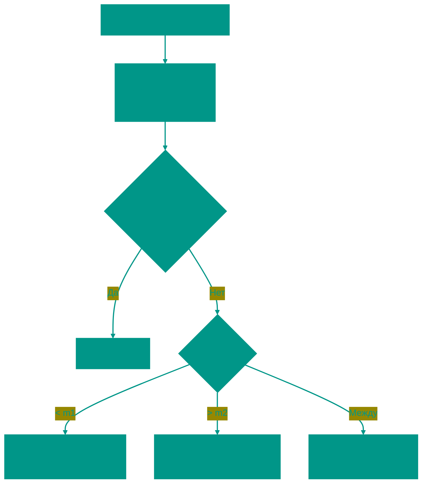

# 3️⃣ Тернарный поиск

**Описание**: 
Тернарный поиск — это "младший брат" бинарного поиска, который делит область поиска не на две, а на три равные части. Хотя он кажется более мощным, на практике он чаще используется не для поиска элементов в массиве, а для поиска максимумов и минимумов функций (унимодальных функций).

- **Как это устроено внутри**: Алгоритм выбирает две точки деления, `m1` (1/3 диапазона) и `m2` (2/3 диапазона). 
  - В массиве: мы сравниваем target с элементами по этим индексам и сужаем поиск до одной из трех частей.
  - В функциях: мы сравниваем значения `f(m1)` и `f(m2)`. Если мы ищем пик (максимум) и `f(m1) < f(m2)`, значит пик точно не в первой трети, и мы ее отбрасываем.
- **Аналогия**: Представьте, что вы ищете самое глубокое место в бассейне. Вы проверяете глубину в двух точках (на 1/3 и 2/3 длины). Если в правой точке глубже, чем в левой, вы понимаете, что мелководье слева вам не интересно, и продолжаете поиски только в правой части.


### Преимущества и недостатки
✅ **Плюсы**:
1. **Поиск экстремумов**: Это один из самых простых и надежных способов найти пик унимодальной функции (которая сначала растет, а потом падает).
2. **Меньше итераций**: Теоретически количество шагов меньше, чем в бинарном поиске (Log3 против Log2), хотя это нивелируется сложностью шага.

❌ **Минусы**:
1. **Больше сравнений**: На каждом шаге мы делаем два сравнения вместо одного. В итоге для обычных массивов бинарный поиск оказывается быстрее тернарного.
2. **Узкая ниша**: Для поиска в массивах он практически не используется, оставаясь инструментом для математических вычислений.

---

**Визуализация**:



**Сложность**:

| Метрика | Сложность (O) |
|:---|:---:|
| Временная | O(log3 n), что эквивалентно O(log n) |
| Пространственная | O(1) |

**Когда использовать**: 
- Поиск максимума/минимума у параболической или унимодальной функции.
- В редких случаях для массивов, когда стоимость сравнения очень мала по сравнению со сдвигом границ (почти никогда).

---


## 💻 Реализация

```go
package ternary

import "fmt"

// TernarySearch реализует алгоритм тернарного поиска для нахождения элемента в массиве.
func TernarySearch(arr []int, target int) int {
	left, right := 0, len(arr)-1

	for left <= right {
		m1 := left + (right-left)/3
		m2 := right - (right-left)/3

		if arr[m1] == target {
			return m1
		}
		if arr[m2] == target {
			return m2
		}

		if target < arr[m1] {
			right = m1 - 1
		} else if target > arr[m2] {
			left = m2 + 1
		} else {
			left = m1 + 1
			right = m2 - 1
		}
	}

	return -1
}

// TernarySearchPeak находит пик (максимум) в унимодальном массиве.
func TernarySearchPeak(arr []int) int {
	left, right := 0, len(arr)-1
	for right-left > 2 {
		m1 := left + (right-left)/3
		m2 := right - (right-left)/3
		if arr[m1] < arr[m2] {
			left = m1
		} else {
			right = m2
		}
	}
	// В маленьком диапазоне находим максимум простым сравнением
	max := arr[left]
	for i := left + 1; i <= right; i++ {
		if arr[i] > max {
			max = arr[i]
		}
	}
	return max
}

func main() {
	arr := []int{1, 2, 3, 4, 5, 6, 7, 8, 9, 10}
	fmt.Printf("Поиск 7: %d\n", TernarySearch(arr, 7))

	mountain := []int{1, 3, 8, 12, 4, 2}
	fmt.Printf("Пик горы: %d\n", TernarySearchPeak(mountain))
}
```

```javascript
/**
 * Тернарный поиск элемента в отсортированном массиве.
 */
function ternarySearch(arr, target) {
  let left = 0;
  let right = arr.length - 1;

  while (left <= right) {
    const m1 = left + Math.floor((right - left) / 3);
    const m2 = right - Math.floor((right - left) / 3);

    if (arr[m1] === target) return m1;
    if (arr[m2] === target) return m2;

    if (target < arr[m1]) {
      right = m1 - 1;
    } else if (target > arr[m2]) {
      left = m2 + 1;
    } else {
      left = m1 + 1;
      right = m2 - 1;
    }
  }
  return -1;
}

/**
 * Поиск пика (максимума) в унимодальном массиве.
 */
function ternarySearchPeak(arr) {
  let left = 0, right = arr.length - 1;
  while (right - left > 2) {
    const m1 = left + Math.floor((right - left) / 3);
    const m2 = right - Math.floor((right - left) / 3);
    if (arr[m1] < arr[m2]) {
      left = m1;
    } else {
      right = m2;
    }
  }
  let max = arr[left];
  for (let i = left + 1; i <= right; i++) {
    if (arr[i] > max) max = arr[i];
  }
  return max;
}

// Примеры использования
const data = [1, 2, 3, 4, 5, 6, 7, 8, 9];
console.log(ternarySearch(data, 5)); // 4
console.log(ternarySearchPeak([1, 5, 10, 8, 3])); // 10
```


## 🚀 Практические задачи
```go
package ternary

import "fmt"

func Example() {
	// Пример 1: Поиск в массиве
	data := []int{1, 2, 3, 4, 5, 6, 7, 8, 9, 10}
	target := 7
	result := TernarySearch(data, target)
	fmt.Printf("Элемент %d найден на позиции %d (Ternary Search)\n", target, result)

	// Пример 2: Поиск пика функции (Максимума)
	// Представим массив значений унимодальной функции
	mountain := []int{1, 3, 8, 12, 20, 15, 10, 5, 2} 
	peak := TernarySearchPeak(mountain)
	fmt.Printf("Пик горы (максимальное значение): %d\n", peak)
}

// Задача: Пик в горном массиве (Peak Index in a Mountain Array)
// Дан массив, который является "горой": элементы возрастают до пика, а потом убывают.
// Нужно найти индекс пика. Хотя это решается и бинарным поиском, тернарный здесь очень нагляден.
func PeakIndexInMountainArray(arr []int) int {
	left := 0
	right := len(arr) - 1
	
	for left < right {
		m1 := left + (right-left)/3
		m2 := right - (right-left)/3
		
		if arr[m1] < arr[m2] {
			// Мы на восходящем склоне или перевалили, но m2 выше. Пик точно справа от m1.
			left = m1 + 1
		} else {
			// m1 >= m2. Пик либо между ними, либо слева. Правая часть от m2 нам не нужна.
			right = m2 - 1
		}
	}
	// В конце left и right сойдутся где-то у пика
	// Примечание: Для гарантированной точности часто переходят на линейный поиск 
	// когда диапазон становится очень маленьким (напр. < 3), но здесь упрощенная схема.
	return left
}
```

```javascript
// Задача: Пик в горном массиве (JS)
function peakIndexInMountainArray(arr) {
    let left = 0, right = arr.length - 1;
    while (left < right) {
        const m1 = left + Math.floor((right - left) / 3);
        const m2 = right - Math.floor((right - left) / 3);
        if (arr[m1] < arr[m2]) left = m1 + 1;
        else right = m2 - 1;
    }
    return left;
}
```

<!-- QUIZ_START 
[
    {
        "question": "На сколько равных частей тернарный поиск делит область поиска на каждой итерации?",
        "options": ["На 2 части", "На 3 части", "На 4 части", "На n частей"],
        "correctIndex": 1
    },
    {
        "question": "Для какой задачи тернарный поиск используется чаще всего на практике?",
        "options": ["Для поиска элемента в массиве строк", "Для сортировки данных", "Для поиска максимума или минимума унимодальной функции", "Для обхода графа"],
        "correctIndex": 2
    },
    {
        "question": "Почему тернарный поиск чаще всего проигрывает бинарному при поиске элементов в обычном массиве?",
        "options": ["Он делает больше шагов", "В нем сложнее рекурсия", "На каждом шаге делается больше сравнений (два вместо одного)", "Он не работает с целыми числами"],
        "correctIndex": 2
    }
]
QUIZ_END -->

