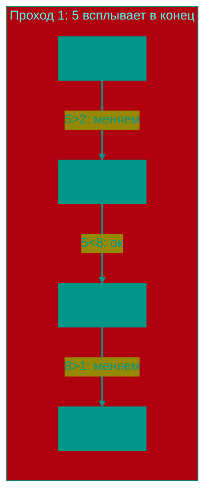

# 🫧 Пузырьковая сортировка

**Описание**: 
Пузырьковая сортировка (Bubble Sort) — это самый простой и интуитивно понятный алгоритм, с которого обычно начинают изучение программирования. Он получил свое название из-за того, что большие элементы "всплывают" к концу массива, подобно пузырькам воздуха в воде.

- **Как это устроено внутри**: Алгоритм многократно проходит по массиву, сравнивая пары соседних элементов. Если левый элемент больше правого, они меняются местами. За каждый полный проход как минимум один максимальный элемент гарантированно оказывается на своем правильном месте в конце. Сложность — **O(n²)**.
- **Аналогия**: Представьте очередь из людей разного роста. Вы идете с начала очереди и, если видите, что человек слева выше соседа справа, просите их поменяться местами. К концу вашего пути самый высокий человек точно окажется последним.


### Преимущества и недостатки
✅ **Плюсы**:
1. **Простота**: Алгоритм максимально легок для понимания и реализации.
2. **Память**: Требует O(1) дополнительной памяти (сортировка "на месте").
3. **Эффективность на почти отсортированных данных**: Если добавить проверку на наличие перестановок, алгоритм может закончить работу за O(n).

❌ **Минусы**:
1. **Низкая скорость**: Это один из самых медленных алгоритмов. На больших массивах он абсолютно непригоден.
2. **Огромное количество перестановок**: Алгоритм совершает слишком много лишних "телодвижений", что неэффективно для процессора.

---

**Визуализация**:



**Сложность**:

| Метрика | Сложность (O) |
|:---|:---:|
| Временная (Средняя/Худшая) | O(n²) |
| Временная (Лучшая) | O(n) (если уже отсортирован) |
| Пространственная | O(1) |

**Когда использовать**: 
- В учебных целях.
- Если массив крошечный.
- Если массив уже почти отсортирован (хотя Insertion Sort здесь лучше).

---


## 💻 Реализация

```go
package bubble_sort

import "fmt"

// BubbleSort реализует оптимизированный алгоритм пузырьковой сортировки.
func BubbleSort(arr []int) {
	n := len(arr)
	for i := 0; i < n-1; i++ {
		swapped := false
		for j := 0; j < n-i-1; j++ {
			if arr[j] > arr[j+1] {
				arr[j], arr[j+1] = arr[j+1], arr[j]
				swapped = true
			}
		}
		// Если за проход не было перестановок, массив уже отсортирован
		if !swapped {
			break
		}
	}
}

func main() {
	arr := []int{64, 34, 25, 12, 22, 11, 90}
	BubbleSort(arr)
	fmt.Printf("Отсортированный массив: %v\n", arr)
}
```

```javascript
/**
 * Оптимизированная пузырьковая сортировка.
 */
function bubbleSort(arr) {
  const n = arr.length;
  for (let i = 0; i < n - 1; i++) {
    let swapped = false;
    for (let j = 0; j < n - i - 1; j++) {
      if (arr[j] > arr[j + 1]) {
        // Деструктурирующее присваивание для обмена значений
        [arr[j], arr[j + 1]] = [arr[j + 1], arr[j]];
        swapped = true;
      }
    }
    if (!swapped) break;
  }
  return arr;
}

// Пример использования
const data = [5, 1, 4, 2, 8];
console.log(bubbleSort(data)); // [1, 2, 4, 5, 8]
```


## 🚀 Практические задачи
```go
package bubble_sort

import "fmt"

// Example демонстрирует использование пузырьковой сортировки с различными примерами
func Example() {
	// Пример 1: Базовая пузырьковая сортировка
	arr1 := []int{64, 34, 25, 12, 22, 11, 90}
	fmt.Printf("Исходный массив: %v\n", arr1)
	BubbleSort(arr1)
	fmt.Printf("Отсортированный массив: %v\n", arr1)

	// Пример 2: Перемещение нулей
	arrZeros := []int{0, 1, 0, 3, 12}
	MoveZeroes(arrZeros)
	fmt.Printf("Move Zeroes: %v\n", arrZeros)
}

// Задача: Перемещение нулей (Move Zeroes)
// Дан целочисленный массив nums, переместить все 0 в конец, сохраняя относительный порядок ненулевых элементов.
// Сделать это in-place.
// (Эта задача - отличный пример, где интуитивно хочется использовать Bubble Sort, 
// чтобы "всплыть" нули, но это будет O(n^2). Оптимально - Two Pointers O(n)).
/*
func MoveZeroes(nums []int) {
    // См. реализацию выше
}
*/

// Задача: Сортировка массива по четности (Sort Array By Parity)
// Дан массив nums, переместить все четные элементы в начало, а нечетные - в конец.
// Порядок внутри групп не важен.
func SortArrayByParity(nums []int) []int {
    i, j := 0, len(nums)-1
    for i < j {
        if nums[i]%2 > nums[j]%2 {
            // nums[i] нечетное (1), nums[j] четное (0) -> меняем
            nums[i], nums[j] = nums[j], nums[i]
        }
        
        if nums[i]%2 == 0 { i++ }
        if nums[j]%2 == 1 { j-- }
    }
    return nums
}
```

```javascript
// Задача: Сортировка по четности (JS)
function sortArrayByParity(nums) {
    let i = 0, j = nums.length - 1;
    while (i < j) {
        if (nums[i] % 2 > nums[j] % 2) {
            [nums[i], nums[j]] = [nums[j], nums[i]];
        }
        if (nums[i] % 2 === 0) i++;
        if (nums[j] % 2 === 1) j--;
    }
    return nums;
}
```

<!-- QUIZ_START 
[
    {
        "question": "Какую временную сложность в худшем случае (на полностью перемешанных данных) имеет пузырьковая сортировка?",
        "options": ["O(n log n)", "O(n)", "O(n²)", "O(1)"],
        "correctIndex": 2
    },
    {
        "question": "Почему этот алгоритм получил название 'пузырьковый'?",
        "options": ["Потому что он занимает много памяти", "Потому что большие элементы последовательно 'всплывают' к концу массива", "В честь его создателя - Джона Пузырька", "Из-за структуры данных 'пузырь'"],
        "correctIndex": 1
    },
    {
        "question": "В каком случае (при наличии оптимизации) пузырьковая сортировка может отработать за линейное время O(n)?",
        "options": ["Если массив отсортирован в обратном порядке", "Если в массиве всего 2 элемента", "Если массив уже отсортирован", "Никогда, сложность всегда O(n²)"],
        "correctIndex": 2
    }
]
QUIZ_END -->

