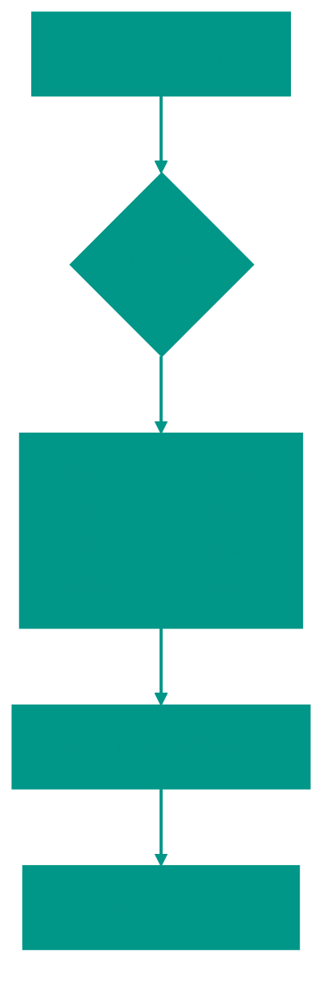

# 📊 Сортировка подсчетом

**Описание**: 
Сортировка подсчетом (Counting Sort) — это "читерский" алгоритм, который обходит математический предел скорости обычных сортировок. Он не сравнивает элементы друг с другом, а просто пересчитывает их количество.

- **Как это устроено внутри**: Алгоритм создает вспомогательный массив ("счетчик"), где индекс соответствует значению элемента, а значение в ячейке — тому, сколько раз это число встретилось. Затем он просто "выписывает" числа обратно в массив в нужном количестве. Это дает феноменальную скорость **O(n + k)**.
- **Аналогия**: Представьте, что вы проводите опрос в классе: "Кто любит яблоки, кто — груши, а кто — бананы?". Вместо того чтобы выстраивать детей в очередь по алфавиту их любимых фруктов, вы просто ставите галочки в три колонки. В конце вы говорите: "Сначала выходят трое любителей яблок, потом двое — груш, и в конце один — бананов".


### Преимущества и недостатки
✅ **Плюсы**:
1. **Безумная скорость**: На подходящих данных он работает быстрее, чем любая сортировка сравнением. O(n + k), где k - диапазон значений.
2. **Устойчивость**: В полной реализации он сохраняет взаимный порядок одинаковых элементов.

❌ **Минусы**:
1. **Жадность до памяти**: Если у вас массив из двух чисел — `1` и `1,000,000`, алгоритму придется создать массив размером в миллион ячеек. Это крайне неэффективно.
2. **Узкая специализация**: Работает только с целыми числами (или объектами, которые можно отобразить в map/array) в ограниченном диапазоне.

---

**Визуализация**:



**Сложность**:

| Метрика | Сложность (O) |
|:---|:---:|
| Временная | O(n + k) |
| Пространственная | O(k) |

**Когда использовать**: 
- Когда диапазон значений (k) невелик и сопоставим с размером массива (n).
- Для сортировки по небольшим ключам (например, возраст людей, дни месяца, оценки).

---


## 💻 Реализация

```go
package counting_sort

import (
	"fmt"
)

// CountingSort реализует алгоритм сортировки подсчетом.
// Работает для неотрицательных целых чисел.
func CountingSort(arr []int) []int {
	if len(arr) == 0 {
		return arr
	}

	// 1. Находим максимум для определения размера вспомогательного массива
	max := arr[0]
	for _, num := range arr {
		if num > max {
			max = num
		}
	}

	// 2. Создаем массив счетчиков
	count := make([]int, max+1)
	for _, num := range arr {
		count[num]++
	}

	// 3. Восстанавливаем отсортированный массив
	sortedIndex := 0
	for num, freq := range count {
		for i := 0; i < freq; i++ {
			arr[sortedIndex] = num
			sortedIndex++
		}
	}

	return arr
}

func main() {
	arr := []int{4, 2, 2, 8, 3, 3, 1}
	CountingSort(arr)
	fmt.Printf("Отсортированный массив: %v\n", arr)
}
```

```javascript
/**
 * Сортировка подсчетом (для целых чисел).
 */
function countingSort(arr) {
  if (arr.length === 0) return arr;

  const min = Math.min(...arr);
  const max = Math.max(...arr);
  const counts = new Array(max - min + 1).fill(0);

  // 1. Считаем количество вхождений каждого числа
  for (let num of arr) {
    counts[num - min]++;
  }

  // 2. Перезаписываем исходный массив (in-place)
  let sortedIndex = 0;
  for (let i = 0; i < counts.length; i++) {
    while (counts[i] > 0) {
      arr[sortedIndex++] = i + min;
      counts[i]--;
    }
  }

  return arr;
}

// Пример использования
const data = [10, 5, 2, 5, 3, 10];
console.log(countingSort(data)); // [2, 3, 5, 5, 10, 10]
```


## 🚀 Практические задачи
```go
package counting_sort

import "fmt"

func Example() {
	// Пример 1: Сортировка массива
	arr := []int{4, 2, 2, 8, 3, 3, 1}
	fmt.Printf("Original: %v\n", arr)
	sorted := CountingSort(arr)
	fmt.Printf("Sorted:   %v\n", sorted)

	// Пример 2: Сортировка цветов (Sort Colors)
	colors := []int{2, 0, 2, 1, 1, 0}
	SortColors(colors)
	fmt.Printf("Colors:   %v\n", colors)
}

// Задача: Сортировка цветов (Sort Colors)
// Дан массив с n объектами красного, белого или синего цвета (0, 1, 2).
// Отсортируйте их in-place так, чтобы объекты одного цвета шли подряд.
// Counting sort здесь идеален, так как диапазон значений всего 3.
func SortColors(nums []int) {
	// Вариант 1: Counting Sort (два прохода)
	counts := [3]int{} // Всего 3 цвета
	for _, num := range nums {
		counts[num]++
	}
	
	index := 0
	for color := 0; color < 3; color++ {
		for i := 0; i < counts[color]; i++ {
			nums[index] = color
			index++
		}
	}
}

// Задача: H-Index
// Дан массив цитирований ученого. Найдите h-индекс.
// h-индекс равен h, если у ученого есть h статей, каждая из которых 
// имеет как минимум h цитирований.
// Можно решить сортировкой O(n log n) или Counting Sort O(n).
func HIndex(citations []int) int {
	n := len(citations)
	buckets := make([]int, n+1) // Частотный массив для количества цитат
	
	for _, c := range citations {
		if c >= n {
			buckets[n]++
		} else {
			buckets[c]++
		}
	}
	
	count := 0
	for i := n; i >= 0; i-- {
		count += buckets[i]
		if count >= i {
			return i
		}
	}
	return 0
}
```

```javascript
// Задачи на Counting Sort (JS)

function example() {
    // Пример 1: Сортировка массива
    let arr = [4, 2, 2, 8, 3, 3, 1];
    console.log("Original:", arr);
    let sorted = countingSort([...arr]); // Use spread to avoid modifying original
    console.log("Sorted:  ", sorted);

    // Пример 2: Сортировка цветов (Sort Colors)
    let colors = [2, 0, 2, 1, 1, 0];
    console.log("Original Colors:", colors);
    sortColors(colors); // This modifies in-place
    console.log("Colors:  ", colors);

    // Пример 3: H-Index
    let citations1 = [3,0,6,1,5];
    console.log("H-Index for [3,0,6,1,5]:", hIndex(citations1)); // Expected: 3

    let citations2 = [1,3,1];
    console.log("H-Index for [1,3,1]:", hIndex(citations2)); // Expected: 1
}

// Call the example function to demonstrate
example();

// Задача: Сортировка цветов
function sortColors(nums) {
    const counts = [0, 0, 0];
    for (let num of nums) counts[num]++;
    
    let index = 0;
    for (let color = 0; color < 3; color++) {
        while (counts[color] > 0) {
            nums[index++] = color;
            counts[color]--;
        }
    }
}

// Задача: H-Index
function hIndex(citations) {
    const n = citations.length;
    const buckets = new Array(n + 1).fill(0);
    
    for (let c of citations) {
        if (c >= n) buckets[n]++;
        else buckets[c]++;
    }
    
    let count = 0;
    for (let i = n; i >= 0; i--) {
        count += buckets[i];
        if (count >= i) return i;
    }
    return 0;
}
```

<!-- QUIZ_START 
[
    {
        "question": "Что является главным преимуществом сортировки подсчетом (Counting Sort)?",
        "options": ["Минимальный расход памяти", "Феноменальная скорость O(n + k), так как это сортировка без сравнений", "Возможность сортировать любые типы данных", "Простота реализации"],
        "correctIndex": 1
    },
    {
        "question": "В чем заключается основной недостаток (ограничение) алгоритма сортировки подсчетом?",
        "options": ["Он очень медленный", "Он работает только на отсортированных данных", "Большой расход памяти, если диапазон значений данных слишком велик", "Он нестабилен"],
        "correctIndex": 2
    },
    {
        "question": "Для каких типов данных лучше всего подходит сортировка подсчетом?",
        "options": ["Для строк алфавита", "Для дробных чисел с высокой точностью", "Для целых чисел в относительно небольшом диапазоне", "Для объектов сложной структуры"],
        "correctIndex": 2
    }
]
QUIZ_END -->

