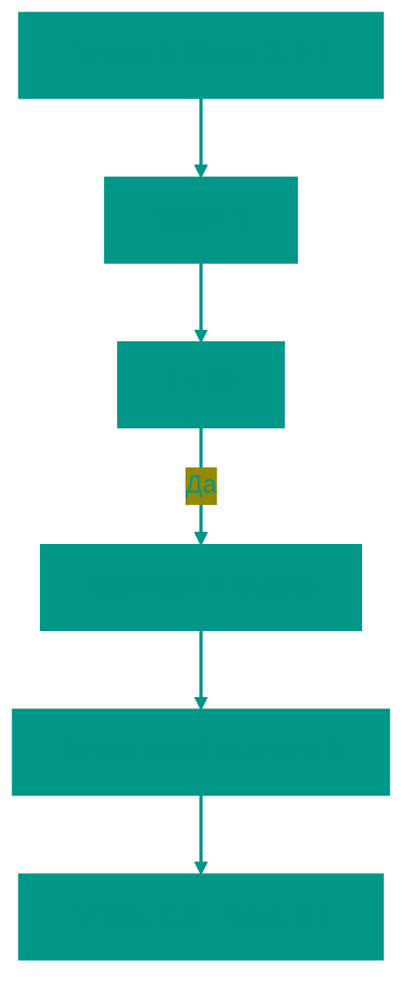

# 🃏 Сортировка вставками

**Описание**: 
Сортировка вставками (Insertion Sort) — это алгоритм, который наиболее естественен для человека. Именно так мы обычно раскладываем карты в руке или книги на полке.

- **Как это устроено внутри**: Мы делим массив на две части: отсортированную (слева) и неотсортированную (справа). На каждом шаге мы берем первый элемент из "хаоса" и вставляем его на правильное место в уже "упорядоченную" часть, раздвигая остальные элементы. Сложность — **O(n²)**.
- **Аналогия**: Представьте, что вы играете в карты. Вы берете новую карту из колоды и ищете ей место в руке, перебирая уже имеющиеся карты, пока не найдете подходящий промежуток.


### Преимущества и недостатки
✅ **Плюсы**:
1. **Эффективность на малых данных**: Для массивов из 10-20 элементов он может работать даже быстрее, чем Quick Sort.
2. **Стабильность**: Сохраняет порядок одинаковых элементов.
3. **Адаптивность**: Показывает отличную скорость (**O(n)**) на уже частично отсортированных данных.
4. **Online-алгоритм**: Может сортировать данные по мере их поступления.

❌ **Минусы**:
1. **Плохая масштабируемость**: Как и пузырек, он крайне медленный на больших объемах данных.
2. **Много копирований**: Требует постоянного сдвига элементов массива в памяти.

---

**Визуализация**:



**Сложность**:

| Метрика | Сложность (O) |
|:---|:---:|
| Временная (Средняя/Худшая) | O(n²) |
| Временная (Лучшая) | O(n) (если уже отсортирован) |
| Пространственная | O(1) |

**Когда использовать**: 
- Когда элементов мало (меньше 50).
- Когда массив уже почти отсортирован (добавить пару новых элементов).
- Когда данные приходят по одному (Online Sorting).

---


## 💻 Реализация

```go
package insertion_sort

import "fmt"

// InsertionSort реализует классический алгоритм сортировки вставками.
func InsertionSort(arr []int) {
	for i := 1; i < len(arr); i++ {
		j := i

		for j > 0 {
			if arr[j-1] > arr[j] {
				arr[j-1], arr[j] = arr[j], arr[j-1]
			}
			j--
		}
	}
}

func main() {
	arr := []int{12, 11, 13, 5, 6}
	InsertionSort(arr)
	fmt.Printf("Отсортированный массив: %v\n", arr)
}
```

```javascript
// Сортировка вставками на JS
function insertionSort(arr) {
  for (let i = 1; i < arr.length; i++) {
    let j = i;

    while (j > 0) {
      if (arr[j-1] > arr[j]) {
        [arr[j-1], arr[j]] = [arr[j], arr[j-1]];
      }
      j--;
    }
  }
}

// Сортировка вставками для связного списка (JS)
function insertionSortList(head) {
    if (!head) return null;
    const dummy = { next: null };
    let curr = head;
    while (curr) {
        const nextTemp = curr.next;
        let prev = dummy;
        while (prev.next && prev.next.val < curr.val) {
            prev = prev.next;
        }
        curr.next = prev.next;
        prev.next = curr;
        curr = nextTemp;
    }
    return dummy.next;
}
```


## 🚀 Практические задачи
```go
package insertion_sort

import "fmt"

// Задача: Сортировка списка (Insertion Sort List)
// Дан head односвязного списка. Отсортировать его, используя сортировку вставками.
type ListNode struct {
	Val  int
	Next *ListNode
}

func InsertionSortList(head *ListNode) *ListNode {
	if head == nil {
		return nil
	}
	dummy := &ListNode{}
	curr := head
	for curr != nil {
		nextTemp := curr.Next
		prev := dummy
		for prev.Next != nil && prev.Next.Val < curr.Val {
			prev = prev.Next
		}
		curr.Next = prev.Next
		prev.Next = curr
		curr = nextTemp
	}
	return dummy.Next
}

func Example() {
	// Пример 1: Сортировка массива
	arr := []int{12, 11, 13, 5, 6}
	fmt.Printf("Исходный: %v\n", arr)
	InsertionSort(arr)
	fmt.Printf("Отсортированный: %v\n", arr)

	// Пример 2: Online Sorting (имитация)
	stream := []int{10, 5, 3, 8}
	sortedBuffer := []int{}
	
	for _, val := range stream {
		sortedBuffer = append(sortedBuffer, val)
		i := len(sortedBuffer) - 1
		for i > 0 && sortedBuffer[i] < sortedBuffer[i-1] {
			sortedBuffer[i], sortedBuffer[i-1] = sortedBuffer[i-1], sortedBuffer[i]
			i--
		}
		fmt.Printf("Поступило %d -> Буфер: %v\n", val, sortedBuffer)
	}
}
```

```javascript
// Задача: Сортировка списка (Insertion Sort List)
function insertionSortList(head) {
    if (!head) return null;
    const dummy = { next: null };
    let curr = head;
    while (curr) {
        const nextTemp = curr.next;
        let prev = dummy;
        while (prev.next && prev.next.val < curr.val) {
            prev = prev.next;
        }
        curr.next = prev.next;
        prev.next = curr;
        curr = nextTemp;
    }
    return dummy.next;
}

// Online Sorting (JS)
function onlineSort(stream) {
    const buffer = [];
    for (let val of stream) {
        buffer.push(val);
        let i = buffer.length - 1;
        while (i > 0 && buffer[i] < buffer[i - 1]) {
            [buffer[i], buffer[i - 1]] = [buffer[i - 1], buffer[i]];
            i--;
        }
        console.log(`Поступило ${val} -> Буфер:`, buffer);
    }
}
```

<!-- QUIZ_START 
[
    {
        "question": "На какие две части (условно) алгоритм сортировки вставками делит массив в процессе своей работы?",
        "options": ["Четную и нечетную", "Левую и правую равные половины", "Отсортированную (слева) и неотсортированную (справа)", "Положительную и отрицательную"],
        "correctIndex": 2
    },
    {
        "question": "Для каких типов данных (входных массивов) сортировка вставками показывает наилучшую производительность?",
        "options": ["Для огромных массивов на миллионы элементов", "Для не отсортированных данных в обратном порядке", "Для маленьких массивов или почти отсортированных данных", "Для массивов со случайными числами"],
        "correctIndex": 2
    },
    {
        "question": "Какова временная сложность сортировки вставками в худшем случае?",
        "options": ["O(log n)", "O(n)", "O(n²)", "O(n!)"],
        "correctIndex": 2
    }
]
QUIZ_END -->

