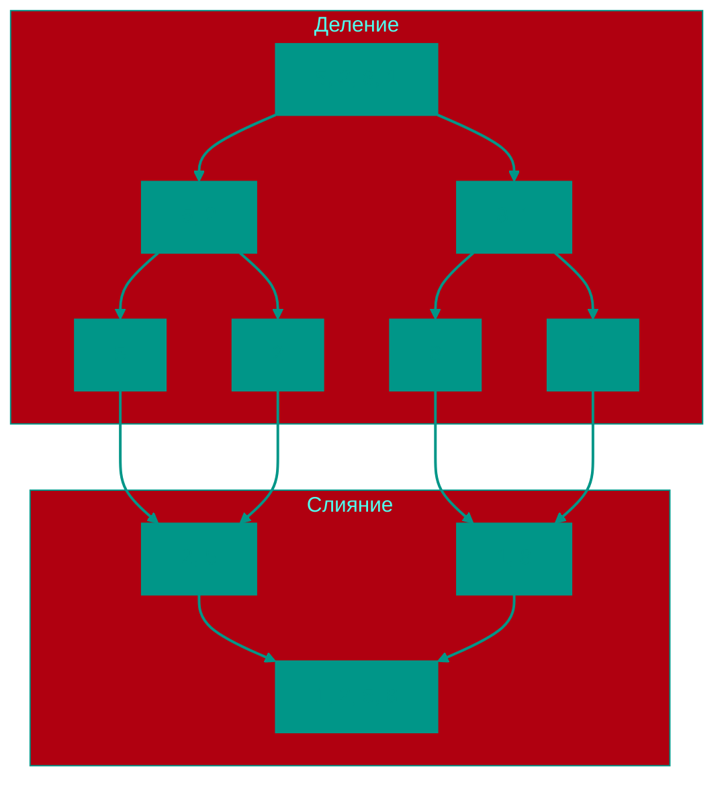

# 🤝 Сортировка слиянием

**Описание**: 
Merge Sort (Сортировка слиянием) — это "перфекционист" среди алгоритмов. Он гарантирует стабильный результат и высокую скорость в любых условиях, даже если входные данные максимально запутаны.

- **Как это устроено внутри**: Алгоритм рекурсивно делит массив пополам, пока в каждой части не останется по одному элементу (один элемент всегда "отсортирован"). Затем начинается процесс **слияния**: два маленьких отсортированных списка объединяются в один более крупный, также отсортированный. Это продолжается до тех пор, пока весь массив не будет собран воедино. Сложность всегда **O(n log n)**.
- **Аналогия**: Представьте, что у вас есть две колоды карт, каждая из которых уже отсортирована. Чтобы объединить их в одну большую отсортированную колоду, вы просто смотрите на верхние карты обеих стопок и перекладываете меньшую из них в новую стопку. Это просто и крайне эффективно.


### Преимущества и недостатки
✅ **Плюсы**:
1. **Гарантированная стабильность**: В отличие от Quick Sort, этот алгоритм никогда не замедляется до O(n²). Его скорость всегда предсказуема.
2. **Стабильная сортировка**: Одинаковые элементы сохраняют свой относительный порядок.
3. **Идеален для больших данных**: Хорошо подходит для сортировки файлов, которые не помещаются в оперативную память (внешняя сортировка).

❌ **Минусы**:
1. **Расход памяти**: Алгоритму нужен дополнительный массив того же размера для процесса слияния (O(n) по памяти).
2. **Оверхед на маленьких данных**: Из-за большого количества рекурсивных вызовов и копирования данных он может работать медленнее простых сортировок на маленьких массивах.

---

**Визуализация**:



**Сложность**:

| Метрика | Сложность (O) |
|:---|:---:|
| Временная (Все случаи) | O(n log n) |
| Пространственная | O(n) |

**Когда использовать**: 
- Когда нужна гарантированная скорость O(n log n).
- Внешняя сортировка (данные не влезают в RAM).
- Сортировка Связных Списков (Linked Lists).

---


## 💻 Реализация

```go
package merge_sort

import "fmt"

// MergeSort реализует рекурсивный алгоритм сортировки слиянием.
func MergeSort(arr []int) []int {
	if len(arr) <= 1 {
		return arr
	}

	// 1. Делим массив пополам
	mid := len(arr) / 2
	left := MergeSort(arr[:mid])
	right := MergeSort(arr[mid:])

	// 2. Сливаем отсортированные половины
	return merge(left, right)
}

// merge объединяет два отсортированных слайса в один.
func merge(left, right []int) []int {
	result := make([]int, 0, len(left)+len(right))
	i, j := 0, 0

	for i < len(left) && j < len(right) {
		if left[i] <= right[j] {
			result = append(result, left[i])
			i++
		} else {
			result = append(result, right[j])
			j++
		}
	}

	// Добавляем оставшиеся элементы
	result = append(result, left[i:]...)
	result = append(result, right[j:]...)

	return result
}

func main() {
	arr := []int{38, 27, 43, 3, 9, 82, 10}
	sorted := MergeSort(arr)
	fmt.Printf("Отсортированный массив: %v\n", sorted)
}
```

```javascript
/**
 * Рекурсивный алгоритм Merge Sort.
 */
function mergeSort(arr) {
  if (arr.length <= 1) return arr;

  const mid = Math.floor(arr.length / 2);
  const left = mergeSort(arr.slice(0, mid));
  const right = mergeSort(arr.slice(mid));

  return merge(left, right);
}

/**
 * Вспомогательная функция для слияния двух отсортированных массивов.
 */
function merge(left, right) {
  const result = [];
  let i = 0, j = 0;

  while (i < left.length && j < right.length) {
    if (left[i] <= right[j]) {
      result.push(left[i++]);
    } else {
      result.push(right[j++]);
    }
  }

  // Добавляем остатки (slice возвращает новый массив, spread объединяет)
  return [...result, ...left.slice(i), ...right.slice(j)];
}

// Пример использования
const data = [38, 27, 43, 3, 9, 82, 10];
console.log(mergeSort(data));
```


## 🚀 Практические задачи
```go
package merge_sort

import "fmt"

func Example() {
	// Пример 1: Обычная сортировка
	arr := []int{38, 27, 43, 3, 9, 82, 10}
	fmt.Printf("Original: %v\n", arr)

	sorted := MergeSort(arr)
	fmt.Printf("Sorted:   %v\n", sorted)

	// Пример 2: Слияние отсортированных массивов
	a := []int{1, 3, 5}
	b := []int{2, 4, 6}
	merged := merge(a, b) // Используем вспомогательную функцию merge
	fmt.Printf("Merged:   %v\n", merged)
}

// Задача: Объединить два отсортированных массива (Merge Sorted Array)
// Вам даны два целочисленных массива nums1 и nums2, отсортированных в неубывающем порядке.
// Нужно объединить их в один отсортированный массив.
// Это и есть сердце Merge Sort.
/*
func MergeTwoSortedArrays(nums1, nums2 []int) []int {
	// См. реализацию функции merge выше - это оно и есть.
	return merge(nums1, nums2)
}
*/

// Задача: Сортировка списка (Sort List)
// Дан head связного списка. Вернуть список, отсортированный в порядке возрастания.
// Merge Sort идеально подходит для связных списков, так как слияние можно делать без 
// доп. массива (меняя ссылки), что дает O(1) space (кроме стека рекурсии).
/*
type ListNode struct {
    Val int
    Next *ListNode
}
func SortList(head *ListNode) *ListNode {
    // 1. Найти середину (slow/fast pointers)
    // 2. Рекурсивно вызвать SortList для левой и правой половин
    // 3. Смерджить два отсортированных списка
}
*/


<!-- QUIZ_START 
[
    {
        "question": "Какую временную сложность ГАРАНТИРУЕТ сортировка слиянием в любых условиях (даже в худшем случае)?",
        "options": ["O(n²)", "O(n log n)", "O(log n)", "O(n)"],
        "correctIndex": 1
    },
    {
        "question": "Каков основной недостаток сортировки слиянием по сравнению, например, с Quick Sort?",
        "options": ["Она очень медленная", "Она нестабильна", "Она требует O(n) дополнительной памяти для процесса слияния", "Она не работает с числами"],
        "correctIndex": 2
    },
    {
        "question": "По какому принципу работает алгоритм сортировки слиянием?",
        "options": ["Жадный выбор", "Полный перебор", "Разделяй и властвуй (рекурсивное деление и слияние)", "Случайный поиск"],
        "correctIndex": 2
    }
]
QUIZ_END -->

