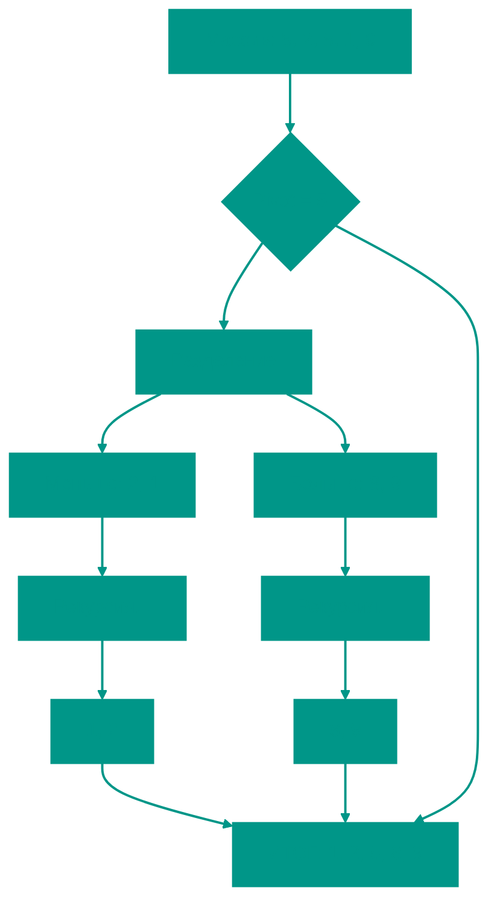

# ⚡ Быстрая сортировка

**Описание**: 
Quick Sort (Быстрая сортировка) — это, пожалуй, самый известный и часто используемый алгоритм сортировки на практике. Он работает по принципу "разделяй и властвуй", превращая хаос в идеальный порядок за счет выбора "опорного элемента" (pivot).

- **Как это устроено внутри**: Алгоритм выбирает один элемент из массива как опорный. Затем он переставляет остальные элементы так, чтобы всё, что меньше опоры, оказалось слева, а всё, что больше — справа. После этого процесс рекурсивно повторяется для левой и правой половин. Средняя скорость — **O(n log n)**, что делает его фаворитом для большинства задач.
- **Аналогия**: Представьте, что вы учитель и вам нужно построить класс по росту. Вы выбираете одного ученика (Бориса) и говорите: "Все, кто ниже Бориса — встаньте слева от него, все, кто выше — справа". Теперь Борис точно стоит на своем месте, а у вас есть две группы поменьше, с которыми нужно сделать то же самое.


### Преимущества и недостатки
✅ **Плюсы**:
1. **Высокая скорость**: В среднем работает быстрее большинства других алгоритмов с той же сложностью O(n log n) благодаря малым константам.
2. **Сортировка "на месте" (in-place)**: Не требует много дополнительной памяти (в классической реализации O(log n) на стек рекурсии).
3. **Cache-friendly**: Хорошо работает с кэшем процессора, так как последовательно проходит по данным.

❌ **Минусы**:
1. **Нестабильность**: В худшем случае (если массив уже почти отсортирован или опорный элемент выбран неудачно) скорость может упасть до O(n²). Для борьбы с этим используют выбор случайного элемента или медианы.
2. **Не сохраняет порядок**: Это "нестабильная" сортировка (одинаковые элементы могут поменяться местами).

---

**Визуализация**:



**Сложность**:

| Метрика | Сложность (O) |
|:---|:---:|
| Временная (Средняя) | O(n log n) |
| Временная (Худшая) | O(n²) |
| Пространственная | O(log n) (на стек рекурсии) |

**Когда использовать**: 
- Основной алгоритм сортировки в большинстве стандартных библиотек (`sort` в C++, Go, Java примитивах).
- Когда важна скорость и не нужна стабильность.

---


## 💻 Реализация

```go
package quick_sort

import "fmt"

// medianOfThree выбирает медиану из трех чисел и сортирует их.
func medianOfThree(arr []int, low, high int) int {
	mid := low + (high-low)/2

	// Сравнение трех элементов: первый, средний, последний для выбора медианы
	if arr[low] > arr[mid] {
		arr[low], arr[mid] = arr[mid], arr[low]
	}
	if arr[low] > arr[high] {
		arr[low], arr[high] = arr[high], arr[low]
	}
	if arr[mid] > arr[high] {
		arr[mid], arr[high] = arr[high], arr[mid]
	}

	return mid
}

// QuickSort - реализация сортировки (не in-place).
func QuickSort(arr []int) []int {
	// Базовый случай, если длина массива <= 1 он уже отсортирован
	if len(arr) <= 1 {
		return arr
	}

	// Выбираем опорный элемент (pivot)
	pivotIndex := medianOfThree(arr, 0, len(arr)-1)
	pivot := arr[pivotIndex]
	left := []int{}
	right := []int{}

	// разделяем массив на элементы меньше или больше pivot
	for i := 0; i < len(arr); i++ {
		if i == pivotIndex {
			continue
		}

		if arr[i] <= pivot {
			left = append(left, arr[i])
		} else {
			right = append(right, arr[i])
		}
	}

	sortedLeft := QuickSort(left)   // сортируем левую часть
	sortedRight := QuickSort(right) // сортируем правую часть

	// Складываем результат, левый массив + pivot + правый массив
	result := append(sortedLeft, pivot)
	result = append(result, sortedRight...)

	return result
	// Рекурсивно сортируем левую и правую части и объединяем pivot
	// return append(append(QuickSort(left), pivot), QuickSort(right)...)
}

func main() {
	arr := []int{10, 7, 8, 9, 1, 5}
	sorted := QuickSort(arr)
	fmt.Printf("Отсортированный массив: %v\n", sorted)
}
```

```javascript
/**
 * Quick Sort - реализация, повторяющая логику Go (не in-place).
 */
function medianOfThree(arr, low, high) {
  const mid = Math.floor(low + (high - low) / 2);

  // Сравнение трех элементов: первый, средний, последний для выбора медианы
  if (arr[low] > arr[mid]) [arr[low], arr[mid]] = [arr[mid], arr[low]];
  if (arr[low] > arr[high]) [arr[low], arr[high]] = [arr[high], arr[low]];
  if (arr[mid] > arr[high]) [arr[mid], arr[high]] = [arr[high], arr[mid]];

  return mid;
}

function quickSort(arr) {
  // Базовый случай, если длина массива <= 1 он уже отсортирован
  if (arr.length <= 1) return arr;

  // Выбираем опорный элемент (pivot) с помощью medianOfThree
  const pivotIndex = medianOfThree(arr, 0, arr.length - 1);
  const pivot = arr[pivotIndex];
  const left = [];
  const right = [];

  // разделяем массив на элементы меньше или больше pivot
  for (let i = 0; i < arr.length; i++) {
    if (i === pivotIndex) {
      continue;
    }

    if (arr[i] <= pivot) {
      left.push(arr[i]);
    } else {
      right.push(arr[i]);
    }
  }

  const sortedLeft = quickSort(left);   // сортируем левую часть
  const sortedRight = quickSort(right); // сортируем правую часть

  // Складываем результат, левый массив + pivot + правый массив
  const result = [...sortedLeft, pivot, ...sortedRight];
  return result;
}

// Пример использования
const data = [10, 7, 8, 9, 1, 5];
console.log("Отсортированный массив:", quickSort(data));
```


## 🚀 Практические задачи

```go
package quick_sort

import "fmt"

// Задача: K-й самый большой элемент в массиве (Kth Largest Element in an Array)
// Дан целочисленный массив nums и целое число k. Вернуть k-й наиболее крупный элемент в массиве.
// Использование QuickSelect позволяет найти его за O(n) в среднем.
func KthLargest(nums []int, k int) int {
	targetIndex := len(nums) - k
	return quickSelect(nums, 0, len(nums)-1, targetIndex)
}

func quickSelect(nums []int, left, right, k int) int {
	if left == right {
		return nums[left]
	}

	pivotIndex := partitionForSelect(nums, left, right)

	if k == pivotIndex {
		return nums[k]
	} else if k < pivotIndex {
		return quickSelect(nums, left, pivotIndex-1, k)
	} else {
		return quickSelect(nums, pivotIndex+1, right, k)
	}
}

func partitionForSelect(arr []int, low, high int) int {
	pivot := arr[high]
	i := low - 1
	for j := low; j < high; j++ {
		if arr[j] < pivot {
			i++
			arr[i], arr[j] = arr[j], arr[i]
		}
	}
	arr[i+1], arr[high] = arr[high], arr[i+1]
	return i + 1
}

func Example() {
	arr := []int{12, 7, 14, 9, 10, 11}
	fmt.Printf("Исходный: %v\n", arr)
	sorted := QuickSort(arr)
	fmt.Printf("Отсортированный: %v\n", sorted)

	nums := []int{3, 2, 1, 5, 6, 4}
	k := 2
	result := KthLargest(nums, k)
	fmt.Printf("%d-й самый большой элемент: %d\n", k, result)
}
```

```javascript
/**
 * Задача: K-й самый большой элемент в массиве (Kth Largest Element in an Array)
 * Дан целочисленный массив nums и целое число k. Вернуть k-й наиболее крупный элемент в массиве.
 * Использование QuickSelect позволяет найти его за O(n) в среднем.
 */
function kthLargest(nums, k) {
  const targetIndex = nums.length - k;
  return quickSelect([...nums], 0, nums.length - 1, targetIndex); // используем копию массива, чтобы не изменять оригинал
}

function quickSelect(nums, left, right, k) {
  if (left === right) {
    return nums[left];
  }

  const pivotIndex = partitionForSelect(nums, left, right);

  if (k === pivotIndex) {
    return nums[k];
  } else if (k < pivotIndex) {
    return quickSelect(nums, left, pivotIndex - 1, k);
  } else {
    return quickSelect(nums, pivotIndex + 1, right, k);
  }
}

function partitionForSelect(arr, low, high) {
  const pivot = arr[high];
  let i = low - 1;
  for (let j = low; j < high; j++) {
    if (arr[j] < pivot) {
      i++;
      [arr[i], arr[j]] = [arr[j], arr[i]]; // swap
    }
  }
  [arr[i + 1], arr[high]] = [arr[high], arr[i + 1]]; // swap
  return i + 1;
}
```

<!-- QUIZ_START 
[
    {
        "question": "Как называется элемент, относительно которого происходит перестановка данных в алгоритме Quick Sort?",
        "options": ["Корень", "Лист", "Опорный элемент (Pivot)", "Голова"],
        "correctIndex": 2
    },
    {
        "question": "В каком случае Quick Sort может замедлиться до временной сложности O(n²)?",
        "options": ["При очень большом массиве", "При неудачном выборе опорного элемента (например, на уже отсортированном массиве)", "Если в массиве только четные числа", "Если опорный элемент - медиана"],
        "correctIndex": 1
    },
    {
        "question": "Какое преимущество Quick Sort имеет перед Merge Sort в плане использования памяти?",
        "options": ["Он занимает больше памяти", "Он может работать 'на месте' (in-place) без выделения O(n) памяти", "Он вообще не использует память", "Он использует только кэш L1"],
        "correctIndex": 1
    }
]
QUIZ_END -->

