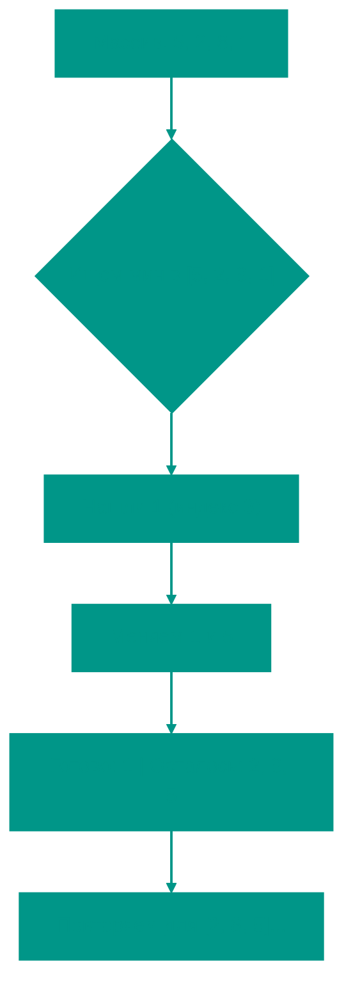

# 📘 Сортировка выбором

**Описание**: 
Сортировка выбором (Selection Sort) — это еще один простой алгоритм, идея которого заключается в последовательном поиске "самых-самых" элементов.

- **Как это устроено внутри**: Алгоритм проходит по неотсортированной части массива, находит там минимальный элемент и меняет его местами с первым элементом этой части. На следующем шаге мы ищем минимум в оставшемся "хвосте" и ставим его на второе место. И так до конца. Сложность — **O(n²)**.
- **Аналогия**: Представьте корзину с фруктами разного размера. Вы находите самый маленький фрукт и кладете его в новую пустую корзину. Затем находите самый маленький среди оставшихся и кладете следом.


### Преимущества и недостатки
✅ **Плюсы**:
1. **Минимум перестановок**: В отличие от предыдущих методов, здесь совершается ровно **n** обменов элементов. Это полезно, если запись в память — "дорогая" операция (например, при сортировке данных на Flash-памяти в микроконтроллерах).
2. **Предсказуемость**: Время работы алгоритма не зависит от того, насколько перемешаны данные — он всегда делает одно и то же количество сравнений.

❌ **Минусы**:
1. **Низкая скорость**: Всегда O(n²), без исключений. Он не умеет "заканчивать раньше", если массив уже почти готов.
2. **Нестабильность**: Одинаковые элементы могут поменяться своим относительным порядком.

---

**Визуализация**:



**Сложность**:

| Метрика | Сложность (O) |
|:---|:---:|
| Временная (Все случаи) | O(n²) |
| Пространственная | O(1) |

**Когда использовать**: 
- Когда нужно минимизировать количество записей в память (swaps).
- На маленьких массивах.
- Для поиска K минимальных элементов (частичная сортировка).

---


## 💻 Реализация

```go
package selection_sort

import "fmt"

// SelectionSort реализует классический алгоритм сортировки выбором.
func SelectionSort(arr []int) {
	for i := 0; i <= len(arr)-1; i++ {
		min := i

		for j := i + 1; j <= len(arr)-1; j++ {
			if arr[j] < arr[min] {
				min = j
			}
		}

		arr[i], arr[min] = arr[min], arr[i]
	}
}
func main() {
	arr := []int{64, 25, 12, 22, 11}
	SelectionSort(arr)
	fmt.Printf("Отсортированный массив: %v\n", arr)
}
```

```javascript
// Сортировка выбором на JS
function selectionSort(arr) {
  for (let i = 0; i < arr.length; i++) {
    let min = i;

    for (let j = i + 1; j < arr.length; j++) {
      if (arr[j] < arr[min]) {
        min = j;
      }
    }

    if (min !== i) {
      [arr[i], arr[min]] = [arr[min], arr[i]];
    }
  }
}

// Частичная сортировка: Найти K минимальных элементов (JS)
function partialSelectionSort(arr, k) {
  const n = arr.length;
  const limit = Math.min(k, n);
  for (let i = 0; i < limit; i++) {
    let minIdx = i;
    for (let j = i + 1; j < n; j++) {
      if (arr[j] < arr[minIdx]) minIdx = j;
    }
    if (minIdx !== i) {
      [arr[i], arr[minIdx]] = [arr[minIdx], arr[i]];
    }
  }
  return arr.slice(0, limit);
}
```


## 🚀 Практические задачи
```go
package selected_sort

import "fmt"

func Example() {
	// Пример 1: Обычная сортировка
	arr := []int{64, 25, 12, 22, 11}
	fmt.Printf("Original: %v\n", arr)
	SelectedSort(arr)
	fmt.Printf("Sorted:   %v\n", arr)

	// Пример 2: Найти 3 минимальных элемента
	arr2 := []int{10, 2, 30, 4, 50, 6}
	k := 3
	PartialSelectionSort(arr2, k)
	fmt.Printf("Первые %d минимальных элементов: %v\n", k, arr2[:k])
}

// Задача: K-й наименьший элемент в массиве
// Найти k-й по величине элемент в массиве (1-индексация).
// Мы можем использовать Selection Sort и выполнить k проходов.
// Элемент на индексе k-1 будет нашим ответом.
func KthSmallest(arr []int, k int) int {
	// Делаем k проходов сортировки выбором
	for i := 0; i < k; i++ {
		minIdx := i
		for j := i + 1; j < len(arr); j++ {
			if arr[j] < arr[minIdx] {
				minIdx = j
			}
		}
		arr[i], arr[minIdx] = arr[minIdx], arr[i]
	}
	
	// После k итераций, k-й элемент стоит на (k-1) индексе
	return arr[k-1]
}

// Задача: K-й наименьший элемент (JS)
function kthSmallest(arr, k) {
    for (let i = 0; i < k; i++) {
        let minIdx = i;
        for (let j = i + 1; j < arr.length; j++) {
            if (arr[j] < arr[minIdx]) minIdx = j;
        }
        if (minIdx !== i) {
            [arr[i], arr[minIdx]] = [arr[minIdx], arr[i]];
        }
    }
    return arr[k - 1];
}

// Примечание: Это обучение. В реальности для поиска K-го элемента лучше использовать
// QuickSelect (O(n) в среднем) или Heap (O(n log k)). 
// Но Selection Sort - это O(n*k), что приемлемо, если k мало.


<!-- QUIZ_START 
[
    {
        "question": "В чем заключается основная идея сортировки выбором (Selection Sort)?",
        "options": ["Сравнение всех соседних пар", "Поиск минимального элемента в хвосте и замена его с текущим первым элементом", "Разделение массива пополам", "Вставка элементов в начало"],
        "correctIndex": 1
    },
    {
        "question": "Какое важное преимущество имеет сортировка выбором, если 'запись' в память — это очень 'дорогая' операция?",
        "options": ["Она самая быстрая по времени", "Она совершает минимальное количество перестановок элементов (всего n)", "Она использует много кэша", "Она стабильна"],
        "correctIndex": 1
    },
    {
        "question": "Зависит ли время работы сортировки выбором от того, насколько перемешаны входные данные?",
        "options": ["Да, на отсортированных данных она работает за O(n)", "Нет, сложность всегда O(n²), так как алгоритм всегда делает одинаковое кол-во сравнений", "Да, чем хуже перемешаны - тем быстрее", "Зависит только от объема оперативной памяти"],
        "correctIndex": 1
    }
]
QUIZ_END -->

