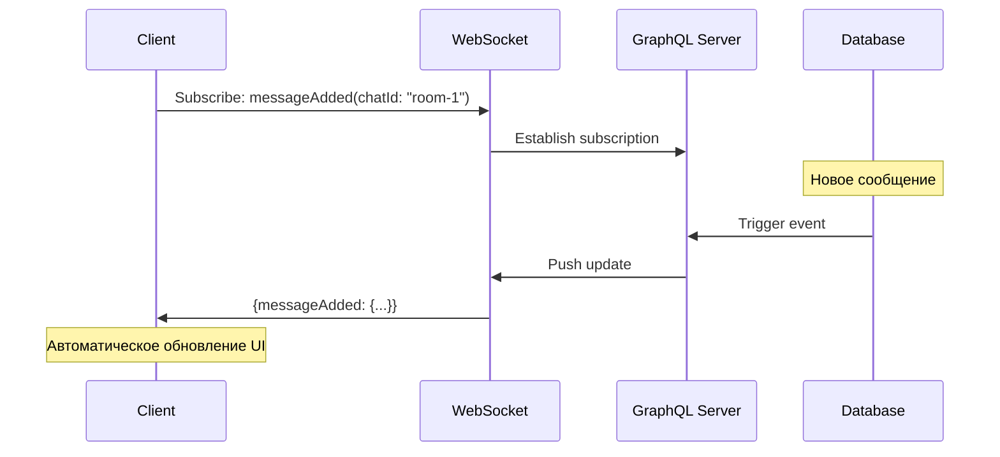
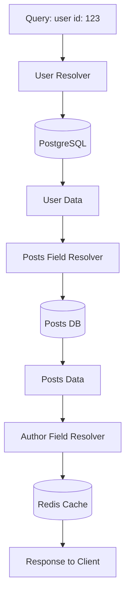
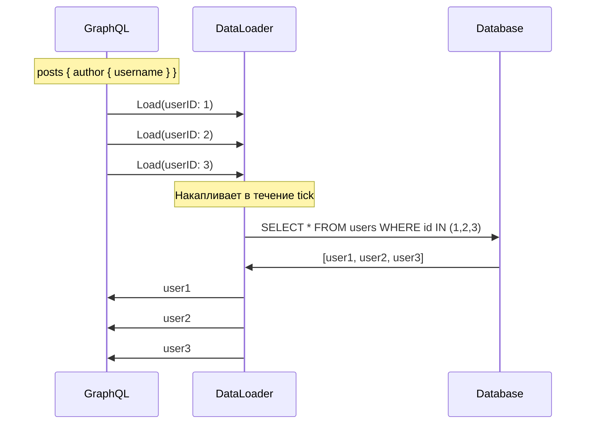
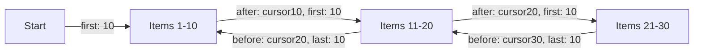

# 🕸️ GraphQL: Язык запросов нового поколения

## 📑 Содержание
1. [Философия GraphQL](#философия)
2. [Типовая Схема (Schema)](#схема)
3. [Операции: Query, Mutation, Subscription](#операции)
4. [Резолверы (Resolvers)](#резолверы)
5. [Проблема N+1 и DataLoader](#проблема-n1-и-dataloader)
6. [Проблемы REST, которые решает GraphQL](#проблемы-rest)
7. [Pagination (Пагинация)](#pagination)
8. [Обработка ошибок](#обработка-ошибок)
9. [Безопасность](#безопасность)
10. [Кэширование](#кэширование)
11. [Реализация на Go с gqlgen](#реализация-на-go-с-gqlgen)
12. [Когда НЕ стоит использовать](#минусы)

---

## 🧭 Философия

**GraphQL** — это не база данных и не замена REST. Это **язык запросов** и слой между клиентом и источниками данных. Главная идея: **"Клиент заказывает только то, что ему нужно"**.

### Ключевые отличия от REST:

| Характеристика | REST | GraphQL |
|:---|:---|:---|
| **Endpoints** | Много (`/users`, `/posts`) | Один (`/graphql`) |
| **Структура ответа** | Определяет сервер | Определяет клиент |
| **Overfetching** | Частая проблема | Нет |
| **Underfetching** | Множество запросов | Один запрос |
| **Версионирование** | `/v1/`, `/v2/` | Нет нужды (deprecation) |

> [!NOTE]
> В отличие от REST, где структура ответа определяется сервером, в GraphQL структуру определяет **клиент**.

---

## 📜 Схема (Schema)

Все данные в GraphQL строго типизированы. Схема — это контракт между клиентом и сервером.

### Базовые типы

```graphql
# Скалярные типы
type User {
  id: ID!           # ! = обязательное поле
  username: String!
  email: String
  age: Int
  rating: Float
  isActive: Boolean!
}

# Enum
enum UserRole {
  ADMIN
  MODERATOR
  USER
}

# Связи между типами
type Post {
  id: ID!
  title: String!
  content: String!
  author: User!        # Один-к-одному
  comments: [Comment!]! # Один-ко-многим
}

type Comment {
  id: ID!
  text: String!
  post: Post!
  author: User!
}

# Input type для мутаций
input CreateUserInput {
  username: String!
  email: String!
  password: String!
}

# Интерфейсы
interface Node {
  id: ID!
  createdAt: String!
}

type User implements Node {
  id: ID!
  createdAt: String!
  username: String!
}

# Union types
union SearchResult = User | Post | Comment

# Custom scalars
scalar DateTime
scalar JSON
```

---

## 🔧 Операции: Query, Mutation, Subscription

### 1. Query (Чтение данных)

```graphql
type Query {
  # Получить одного пользователя
  user(id: ID!): User
  
  # Получить список
  users(
    limit: Int = 10
    offset: Int = 0
    filter: UserFilter
  ): [User!]!
  
  # Поиск
  search(query: String!): [SearchResult!]!
  
  # Мне самому
  me: User
}

input UserFilter {
  role: UserRole
  isActive: Boolean
  minAge: Int
}
```

**Пример запроса клиента:**

```graphql
# Точно указываем, какие поля нужны
query GetUserProfile {
  user(id: "123") {
    id
    username
    email
    posts {
      id
      title
      comments {
        id
        text
      }
    }
  }
}
```

**Алиасы и фрагменты:**

```graphql
query {
  # Алиасы позволяют делать несколько запросов одного типа
  admin: user(id: "1") {
    ...UserFields
  }
  
  currentUser: user(id: "123") {
    ...UserFields
  }
}

# Fragment для переиспользования
fragment UserFields on User {
  id
  username
  email
  posts {
    title
  }
}
```

---

### 2. Mutation (Изменение данных)

```graphql
type Mutation {
  # Create
  createUser(input: CreateUserInput!): User!
  
  # Update
  updateUser(id: ID!, input: UpdateUserInput!): User!
  
  # Delete
  deleteUser(id: ID!): Boolean!
  
  # Сложная операция
  publishPost(id: ID!): Post!
}

input UpdateUserInput {
  username: String
  email: String
  # Все поля optional для partial update
}
```

**Пример мутации:**

```graphql
mutation CreateNewUser {
  createUser(input: {
    username: "john_doe"
    email: "john@example.com"
    password: "secret123"
  }) {
    id
    username
    createdAt
  }
}
```

---

### 3. Subscription (Real-time обновления)

Для WebSocket соединений, когда нужно получать обновления в реальном времени.

```graphql
type Subscription {
  # Подписка на новые сообщения в чате
  messageAdded(chatId: ID!): Message!
  
  # Подписка на изменения пользователя
  userUpdated(userId: ID!): User!
  
  # Подписка на счетчик онлайн
  onlineCount: Int!
}
```

**Пример использования:**

```graphql
subscription OnMessageAdded {
  messageAdded(chatId: "room-1") {
    id
    text
    author {
      username
    }
    createdAt
  }
}
```



---

## ⚙️ Резолверы (Resolvers)

Резолвер — это функция, которая знает, **как получить данные** для конкретного поля.

### Структура резолверов

```go
type Resolver struct {
    db *sql.DB
    cache *redis.Client
    userService *UserService
}

// Query резолверы
func (r *Resolver) User(ctx context.Context, id string) (*model.User, error) {
    // Логика получения пользователя
    return r.userService.GetByID(ctx, id)
}

// Field резолвер (для вложенных полей)
func (r *UserResolver) Posts(ctx context.Context, user *model.User) ([]*model.Post, error) {
    return r.db.GetPostsByUserID(ctx, user.ID)
}
```



> [!NOTE]
> **Главная фича**: Резолверы могут брать данные из разных источников
> - User → PostgreSQL
> - Posts → MongoDB
> - Avatar → S3
> - Comments → Microservice
>
> Для клиента это выглядит как **один запрос**.

---

## 🔥 Проблема N+1 и DataLoader

### Проблема N+1

Самая частая проблема производительности в GraphQL.

**Запрос:**
```graphql
query {
  posts {         # 1 запрос в БД → 10 постов
    title
    author {      # 10 запросов в БД (для каждого поста!)
      username
    }
  }
}
```

**Наивная реализация:**
```go
func (r *PostResolver) Author(ctx context.Context, post *model.Post) (*model.User, error) {
    // ❌ Вызывается 10 раз!
    return r.db.GetUserByID(ctx, post.AuthorID)
}
```

Результат: **1 + 10 = 11 запросов** вместо **2**.

---

### Решение: DataLoader

DataLoader группирует запросы и выполняет их батчем.

**Установка:**
```bash
go get github.com/graph-gophers/dataloader
```

**Реализация:**
```go
type Loaders struct {
    UserLoader *dataloader.Loader
}

func NewLoaders(db *sql.DB) *Loaders {
    userBatchFn := func(ctx context.Context, keys dataloader.Keys) []*dataloader.Result {
        // Преобразуем keys в IDs
        ids := make([]string, len(keys))
        for i, key := range keys {
            ids[i] = key.String()
        }
        
        // 🚀 ОДИН запрос вместо N!
        users, err := db.GetUsersByIDs(ctx, ids)
        
        // Создаем map для быстрого доступа
        userMap := make(map[string]*User)
        for _, user := range users {
            userMap[user.ID] = user
        }
        
        // Возвращаем в том же порядке, что и keys
        results := make([]*dataloader.Result, len(keys))
        for i, key := range keys {
            user, ok := userMap[key.String()]
            if ok {
                results[i] = &dataloader.Result{Data: user}
            } else {
                results[i] = &dataloader.Result{Error: fmt.Errorf("user not found")}
            }
        }
        
        return results
    }
    
    return &Loaders{
        UserLoader: dataloader.NewBatchedLoader(userBatchFn),
    }
}

// Использование в резолвере
func (r *PostResolver) Author(ctx context.Context, post *model.Post) (*model.User, error) {
    loaders := ctx.Value("loaders").(*Loaders)
    
    thunk := loaders.UserLoader.Load(ctx, dataloader.StringKey(post.AuthorID))
    result, err := thunk()
    if err != nil {
        return nil, err
    }
    
    return result.(*model.User), nil
}
```

**Результат**: Все 10 запросов группируются и выполняются **одним батчем**!



---

## 🚀 Проблемы REST, которые решает GraphQL

### 1. Overfetching (Избыточность)

**REST:**
```bash
GET /users/123
# Возвращает ВСЕ поля (50+ полей)
{
  "id": 123,
  "username": "john",
  "email": "john@example.com",
  "bio": "...",
  "location": "...",
  "website": "...",
  "avatar": "...",
  # + еще 40 полей, которые не нужны
}
```

**GraphQL:**
```graphql
query {
  user(id: 123) {
    username  # Только то, что нужно
  }
}
```

**Экономия**: На мобильных устройствах это критично для батареи и трафика!

---

### 2. Underfetching (Недостаточность)

**REST** (нужно 3 запроса):
```bash
GET /users/123           # Профиль
GET /users/123/posts     # Посты
GET /users/123/followers # Подписчики
```

**GraphQL** (один запрос):
```graphql
query {
  user(id: 123) {
    username
    posts { title }
    followers { username }
  }
}
```

---

### 3. Версионность

**REST**: Приходится плодить `/v1/`, `/v2/`, `/v3/`

**GraphQL**: Поля помечаются как `deprecated`
```graphql
type User {
  username: String!
  name: String! @deprecated(reason: "Use 'username' instead")
}
```

Старые клиенты продолжают работать, новые используют новые поля.

---

## 📄 Pagination (Пагинация)

### 1. Offset-based

```graphql
type Query {
  users(limit: Int!, offset: Int!): [User!]!
}

# Использование
query {
  users(limit: 10, offset: 20) {
    username
  }
}
```

**Проблема**: При изменении данных можно пропустить или дублировать записи.

---

### 2. Cursor-based (рекомендуется)

```graphql
type PageInfo {
  hasNextPage: Boolean!
  hasPreviousPage: Boolean!
  startCursor: String
  endCursor: String
}

type UserEdge {
  cursor: String!
  node: User!
}

type UserConnection {
  edges: [UserEdge!]!
  pageInfo: PageInfo!
  totalCount: Int!
}

type Query {
  users(first: Int, after: String): UserConnection!
}
```

**Использование:**
```graphql
query {
  users(first: 10, after: "cursor123") {
    edges {
      cursor
      node {
        username
      }
    }
    pageInfo {
      hasNextPage
      endCursor
    }
  }
}
```

---

### 3. Relay Cursor Connections (стандарт)

```graphql
type Query {
  users(
    first: Int
    after: String
    last: Int
    before: String
  ): UserConnection!
}
```



---

## ❌ Обработка ошибок

### Структура ошибок

GraphQL возвращает **частичные данные** + массив ошибок.

```json
{
  "data": {
    "user": {
      "username": "john",
      "posts": null  // Ошибка здесь
    }
  },
  "errors": [
    {
      "message": "Failed to fetch posts",
      "path": ["user", "posts"],
      "extensions": {
        "code": "DATABASE_ERROR",
        "timestamp": "2024-01-01T10:00:00Z"
      }
    }
  ]
}
```

### Типы ошибок в Go

```go
type ErrorCode string

const (
    ErrorCodeNotFound      ErrorCode = "NOT_FOUND"
    ErrorCodeUnauthorized  ErrorCode = "UNAUTHORIZED"
    ErrorCodeValidation    ErrorCode = "VALIDATION_ERROR"
    ErrorCodeInternal      ErrorCode = "INTERNAL_ERROR"
)

func (r *Resolver) User(ctx context.Context, id string) (*model.User, error) {
    user, err := r.db.GetUser(ctx, id)
    if errors.Is(err, sql.ErrNoRows) {
        return nil, &gqlerror.Error{
            Message: "User not found",
            Extensions: map[string]interface{}{
                "code": ErrorCodeNotFound,
            },
        }
    }
    
    return user, nil
}
```

---

## 🔒 Безопасность

### 1. Depth Limiting (Ограничение глубины)

Защита от вложенных запросов:
```graphql
# Атака: бесконечная вложенность
query {
  user {
    posts {
      author {
        posts {
          author {
            posts {
              # ... и так до падения сервера
            }
          }
        }
      }
    }
  }
}
```

**Решение в gqlgen:**
```go
import "github.com/99designs/gqlgen/graphql/handler/extension"

srv := handler.NewDefaultServer(generated.NewExecutableSchema(cfg))
srv.Use(extension.FixedComplexityLimit(100)) // Макс сложность
```

---

### 2. Query Cost Analysis

Каждое поле имеет "стоимость":
```go
type Post {
  id: Int          // cost: 1
  title: String    // cost: 1
  comments: [Comment]  // cost: 10 (дорогая операция)
}
```

Запрос с `limit: 1000` на comments = 10,000 единиц → отклонить.

---

### 3. Timeout и Rate Limiting

```go
func (r *Resolver) User(ctx context.Context, id string) (*model.User, error) {
    // Контекст с таймаутом
    ctx, cancel := context.WithTimeout(ctx, 5*time.Second)
    defer cancel()
    
    return r.db.GetUser(ctx, id)
}
```

---

## 💾 Кэширование

### 1. Automatic Persisted Queries (APQ)

Клиент отправляет **хеш** запроса вместо полного текста.

```bash
# Первый запрос
POST /graphql
{ "extensions": { "persistedQuery": { "sha256Hash": "abc123..." } } }

# Сервер отвечает: неизвестный хеш
# Клиент отправляет полный запрос
POST /graphql
{ "query": "query {...}", "extensions": {...} }

# Последующие запросы - только хеш
POST /graphql
{ "extensions": { "persistedQuery": { "sha256Hash": "abc123..." } } }
```

---

### 2. Response Caching

```go
srv.Use(extension.AutomaticPersistedQuery{
    Cache: lru.New(100), // LRU кеш
})
```

---

### 3. DataLoader (см. выше)

Кеширует данные на время одного запроса.

---

## 💻 Реализация на Go с gqlgen

### Установка

```bash
go get github.com/99designs/gqlgen
go run github.com/99designs/gqlgen init
```

### Структура проекта

```
project/
├── graph/
│   ├── schema.graphqls     # GraphQL схема
│   ├── generated.go        # Автогенерация
│   ├── model/
│   │   └── models_gen.go
│   └── resolver.go         # Ваши резолверы
├── server.go
└── gqlgen.yml              # Конфигурация
```

### schema.graphqls

```graphql
type User {
  id: ID!
  username: String!
  email: String!
  posts: [Post!]!
}

type Post {
  id: ID!
  title: String!
  content: String!
  author: User!
}

type Query {
  user(id: ID!): User
  users: [User!]!
}

type Mutation {
  createUser(username: String!, email: String!): User!
}

type Subscription {
  userCreated: User!
}
```

### resolver.go

```go
package graph

import (
    "context"
    "myapp/graph/model"
)

type Resolver struct {
    users map[string]*model.User
}

func (r *Resolver) Query() QueryResolver {
    return &queryResolver{r}
}

func (r *Resolver) Mutation() MutationResolver {
    return &mutationResolver{r}
}

type queryResolver struct{ *Resolver }

func (r *queryResolver) User(ctx context.Context, id string) (*model.User, error) {
    user, ok := r.users[id]
    if !ok {
        return nil, fmt.Errorf("user not found")
    }
    return user, nil
}

func (r *queryResolver) Users(ctx context.Context) ([]*model.User, error) {
    users := make([]*model.User, 0, len(r.users))
    for _, u := range r.users {
        users = append(users, u)
    }
    return users, nil
}

type mutationResolver struct{ *Resolver }

func (r *mutationResolver) CreateUser(ctx context.Context, username, email string) (*model.User, error) {
    user := &model.User{
        ID:       generateID(),
        Username: username,
        Email:    email,
    }
    r.users[user.ID] = user
    return user, nil
}
```

### server.go

```go
package main

import (
    "log"
    "net/http"
    
    "github.com/99designs/gqlgen/graphql/handler"
    "github.com/99designs/gqlgen/graphql/playground"
    "myapp/graph"
    "myapp/graph/generated"
)

func main() {
    srv := handler.NewDefaultServer(
        generated.NewExecutableSchema(
            generated.Config{
                Resolvers: &graph.Resolver{
                    users: make(map[string]*model.User),
                },
            },
        ),
    )
    
    http.Handle("/", playground.Handler("GraphQL", "/query"))
    http.Handle("/query", srv)
    
    log.Println("Server started at http://localhost:8080")
    log.Fatal(http.ListenAndServe(":8080", nil))
}
```

---

## ⚠️ Когда НЕ стоит использовать GraphQL

| Сценарий | Почему НЕ GraphQL |
|:---|:---|
| **Простые CRUD** | Overhead не оправдан для 2-3 таблиц |
| **Публичное API без контроля клиентов** | Сложно предсказать нагрузку |
| **Файловые операции** | REST проще для upload/download |
| **HTTP кэширование критично** | В GraphQL сложнее |
| **Команда не знакома с GraphQL** | Кривая обучения высокая |

---

## 🎯 Best Practices

> [!IMPORTANT]
> **Золотые правила**:
> 1. **Всегда используйте DataLoader** для избежания N+1
> 2. **Ограничивайте сложность запросов** (depth, cost)
> 3. **Используйте cursor pagination** вместо offset
> 4. **Не возвращайте null без необходимости** (лучше `!` в схеме)
> 5. **Документируйте схему** с помощью `"""описание"""`
>
> GraphQL — это про **эффективность фронтенда**. Если у вас сложный UI с множеством связей — это ваш выбор. 📱💻🛡️
