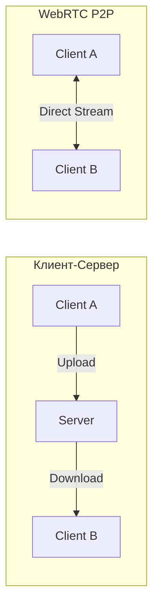
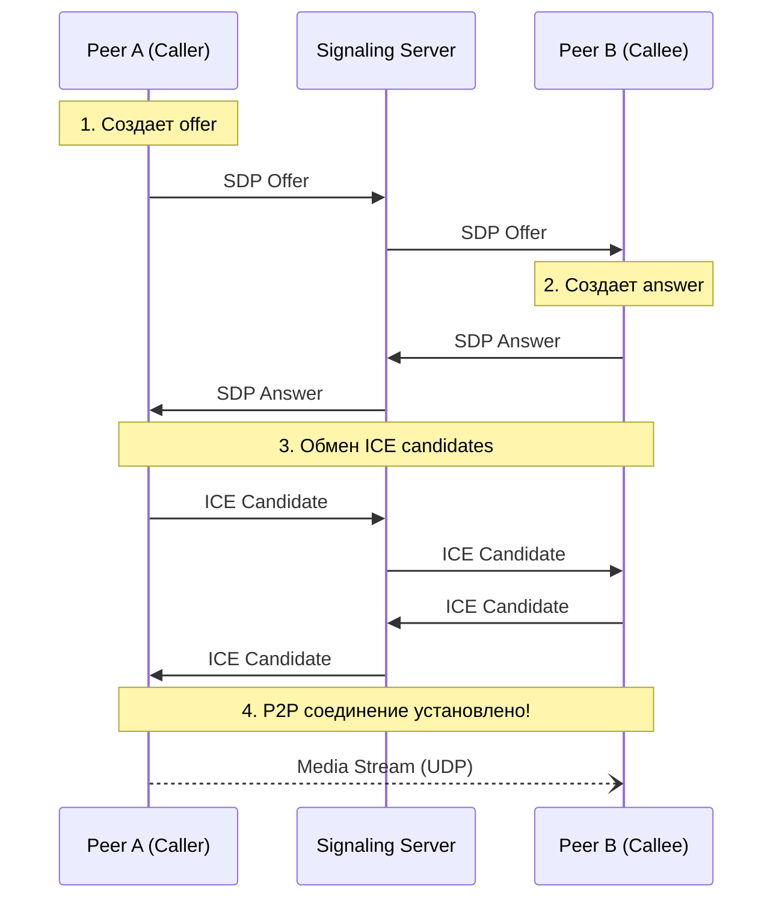
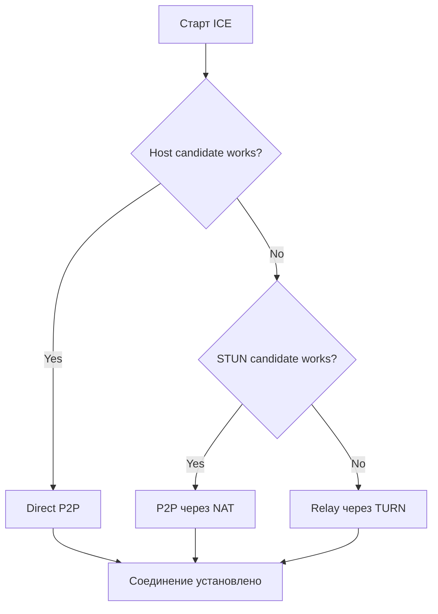
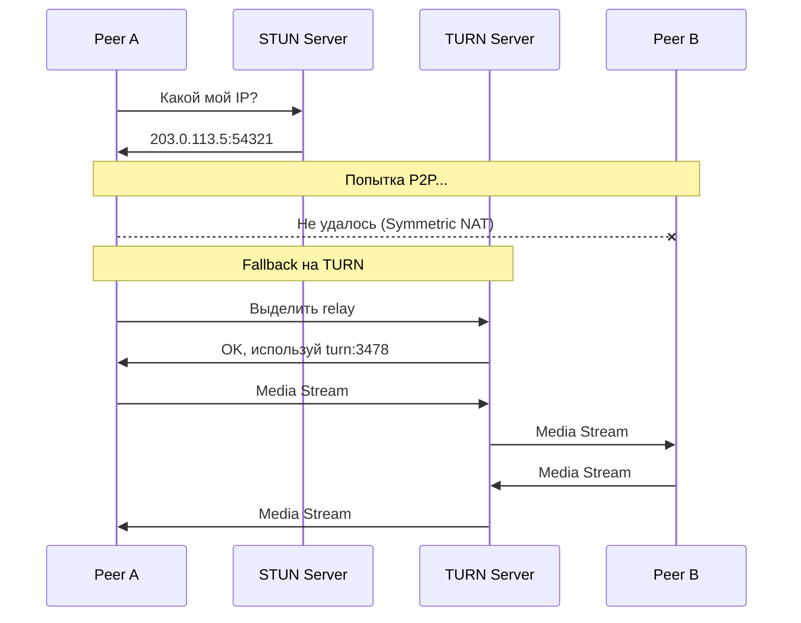

# 📞 WebRTC: Общение в реальном времени

## 📑 Содержание

1. [Что такое WebRTC?](#что-такое-webrtc)
2. [Peer-to-Peer (P2P)](#peer-to-peer-p2p)
3. [Как устанавливается связь (Signaling)](#сигналинг)
4. [SDP (Session Description Protocol)](#sdp-session-description-protocol)
5. [ICE: Поиск пути соединения](#ice-поиск-пути-соединения)
6. [STUN и TURN серверы](#stun-и-turn)
7. [PeerConnection API](#peerconnection-api)
8. [DataChannel: P2P передача данных](#datachannel-p2p-передача-данных)
9. [MediaStream и Codecs](#mediastream-и-codecs)
10. [Connection States](#connection-states)
11. [Практический пример](#практический-пример)

---

## ❓ Что такое WebRTC?

**WebRTC (Web Real-Time Communication)** — это набор открытых стандартов и технологий, которые позволяют браузерам и мобильным приложениям передавать **аудио, видео и данные напрямую друг другу** (peer-to-peer) без участия сервера в передаче медиа. 🎥💬

### Ключевые компоненты:

- **getUserMedia**: Доступ к камере и микрофону
- **RTCPeerConnection**: Установка P2P соединения
- **RTCDataChannel**: Передача произвольных данных P2P

### Используется в:

- Zoom, Google Meet, Discord (web-версии)
- Браузерные игры (P2P мультиплеер)
- Telemed (медицинские консультации)
- Screensharing и удаленный доступ

> [!NOTE]
> WebRTC работает **в браузере** без плагинов! Поддерживается во всех современных браузерах (Chrome, Firefox, Safari, Edge).

---

## 🤝 Peer-to-Peer (P2P)

В обычной клиент-серверной архитектуре данные идут:

```
Клиент A → Сервер → Клиент B
```

В WebRTC данные идут **напрямую**:

```
Клиент A ⟷ Клиент B
```

### Преимущества P2P:

✅ **Низкая задержка**: Нет промежуточного сервера  
✅ **Масштабируемость**: Сервер не передает медиа  
✅ **Приватность**: Данные не проходят через сервер (end-to-end)

### Недостатки:

❌ **NAT traversal**: Нужны STUN/TURN серверы  
❌ **Сложность**: Требуется signaling сервер для установки соединения  
❌ **Качество**: Зависит от качества соединения обоих клиентов



---

## 🗺️ Как устанавливается связь (Signaling)

Хотя **медиа** передаются напрямую, клиентам нужен **signaling server** для обмена метаданными (SDP, ICE candidates).

> [!IMPORTANT]
> **Signaling НЕ стандартизирован** в WebRTC! Вы можете использовать WebSocket, HTTP long polling, Socket.IO и т.д.



---

## 📋 SDP (Session Description Protocol)

**SDP** — это текстовый формат, описывающий параметры сессии:

- Какие кодеки поддерживаются (VP8, H.264, Opus)
- IP адреса и порты
- Типы медиа (audio, video, data)
- Параметры шифрования (DTLS, SRTP)

### Пример SDP Offer:

```
v=0
o=- 4611731400430051336 2 IN IP4 127.0.0.1
s=-
t=0 0
a=group:BUNDLE 0 1
a=msid-semantic: WMS stream

m=audio 9 UDP/TLS/RTP/SAVPF 111 103 104
c=IN IP4 0.0.0.0
a=rtcp:9 IN IP4 0.0.0.0
a=ice-ufrag:xyz123
a=ice-pwd:abc456def789
a=fingerprint:sha-256 AA:BB:CC:DD:...
a=rtpmap:111 opus/48000/2
a=rtpmap:103 ISAC/16000

m=video 9 UDP/TLS/RTP/SAVPF 96 97
c=IN IP4 0.0.0.0
a=rtcp:9 IN IP4 0.0.0.0
a=rtpmap:96 VP8/90000
a=rtpmap:97 H264/90000
a=fmtp:97 profile-level-id=42e01f
```

### Offer/Answer модель:

```javascript
// Peer A создает offer
const offer = await peerConnection.createOffer();
await peerConnection.setLocalDescription(offer);

// Отправка offer через signaling
signalingChannel.send({ type: "offer", sdp: offer });

// Peer B получает offer и создает answer
await peerConnection.setRemoteDescription(offer);
const answer = await peerConnection.createAnswer();
await peerConnection.setLocalDescription(answer);

// Отправка answer обратно
signalingChannel.send({ type: "answer", sdp: answer });

// Peer A получает answer
await peerConnection.setRemoteDescription(answer);
```

> [!TIP]
> **SDP Munging** — ручное редактирование SDP для принудительного использования определенного кодека или настройки битрейта. НЕ рекомендуется!

---

## 🧊 ICE: Поиск пути соединения

**ICE (Interactive Connectivity Establishment)** — протокол для поиска лучшего пути соединения между пирами.

### Типы ICE кандидатов:

1. **Host candidate** (локальный IP)

   ```
   192.168.1.5:54321
   ```

   Работает только в локальной сети.

2. **Server Reflexive candidate** (публичный IP через STUN)

   ```
   203.0.113.5:54321
   ```

   Получен от STUN сервера. Работает для большинства NAT.

3. **Relay candidate** (через TURN сервер)
   ```
   turn.example.com:3478
   ```
   Медиа проходят через TURN сервер. Используется, когда P2P невозможен.

### Приоритет кандидатов:

```
Host > Server Reflexive > Relay
(быстрее)              (медленнее, но надежнее)
```



### процесс сбора кандидатов ICE:

```javascript
peerConnection.onicecandidate = (event) => {
  if (event.candidate) {
    // Отправка кандидата другому пиру
    signalingChannel.send({
      type: "ice-candidate",
      candidate: event.candidate,
    });
  } else {
    console.log("ICE gathering completed");
  }
};

// Получение кандидатов от другого пира
signalingChannel.onmessage = async (message) => {
  if (message.type === "ice-candidate") {
    await peerConnection.addIceCandidate(message.candidate);
  }
};
```

---

## 🧱 STUN и TURN серверы

### STUN (Session Traversal Utilities for NAT)

**Назначение**: Помогает клиенту узнать свой **публичный IP адрес** и порт.

```javascript
const configuration = {
  iceServers: [
    { urls: "stun:stun.l.google.com:19302" },
    { urls: "stun:stun.example.com:3478" },
  ],
};

const pc = new RTCPeerConnection(configuration);
```

**Как работает:**

1. Клиент отправляет запрос на STUN сервер
2. STUN сервер видит запрос с IP `203.0.113.5:54321` (внешний IP NAT)
3. STUN отвечает: "Я вижу тебя как `203.0.113.5:54321`"
4. Клиент использует этот IP как ICE кандидат

**Ограничение**: НЕ работает для **Symmetric NAT** (строгий firewall).

---

### TURN (Traversal Using Relays around NAT)

**Назначение**: Когда P2P невозможен, медиа **ретранслируются через сервер**.

```javascript
const configuration = {
  iceServers: [
    { urls: "stun:stun.l.google.com:19302" },
    {
      urls: "turn:turn.example.com:3478",
      username: "user",
      credential: "password",
    },
  ],
};
```

**Сценарии использования TURN**:

- Оба пира за Symmetric NAT
- Корпоративные firewall блокируют UDP
- Proxy(Private Network) с строгими правилами

> [!WARNING]
> **TURN — дорого!** Весь трафик идет через ваш сервер.
>
> - Нужна большая полоса пропускания
> - ~10-20% соединений требуют TURN
> - Рассмотрите использование облачных TURN (Twilio, Agora)



---

## 🔌 PeerConnection API

`RTCPeerConnection` — главный объект WebRTC для управления соединением.

### Основной workflow:

```javascript
// 1. Создание PeerConnection
const pc = new RTCPeerConnection({
  iceServers: [{ urls: "stun:stun.l.google.com:19302" }],
});

// 2. Добавление локального медиа
const stream = await navigator.mediaDevices.getUserMedia({
  video: true,
  audio: true,
});

stream.getTracks().forEach((track) => {
  pc.addTrack(track, stream);
});

// 3. Обработка входящего медиа
pc.ontrack = (event) => {
  const remoteVideo = document.getElementById("remoteVideo");
  remoteVideo.srcObject = event.streams[0];
};

// 4. ICE кандидаты
pc.onicecandidate = (event) => {
  if (event.candidate) {
    signalingChannel.send({
      type: "ice-candidate",
      candidate: event.candidate,
    });
  }
};

// 5. Создание offer
const offer = await pc.createOffer();
await pc.setLocalDescription(offer);
signalingChannel.send({ type: "offer", sdp: offer });
```

---

## 📡 DataChannel: P2P передача данных

`RTCDataChannel` позволяет передавать произвольные данные между пирами (не только медиа).

### Создание DataChannel:

```javascript
// Peer A создает канал
const dataChannel = pc.createDataChannel("chat", {
  ordered: true, // Гарантированный порядок
  maxRetransmits: 3, // Макс. попытки отправки
});

dataChannel.onopen = () => {
  console.log("DataChannel opened");
  dataChannel.send("Hello, Peer B!");
};

dataChannel.onmessage = (event) => {
  console.log("Received:", event.data);
};
```

```javascript
// Peer B получает канал
pc.ondatachannel = (event) => {
  const dataChannel = event.channel;

  dataChannel.onmessage = (event) => {
    console.log("Received:", event.data);

    // Echo back
    dataChannel.send(`Echo: ${event.data}`);
  };
};
```

### Типы данных:

```javascript
// Текст
dataChannel.send("Hello");

// Blob (файлы)
const blob = new Blob(["file content"], { type: "text/plain" });
dataChannel.send(blob);

// ArrayBuffer (бинарные данные)
const buffer = new Uint8Array([1, 2, 3, 4]);
dataChannel.send(buffer);
```

### Настройки надежности:

```javascript
// Гарантированная доставка (как TCP)
const reliable = pc.createDataChannel("reliable", {
  ordered: true,
  maxRetransmits: null, // Бесконечные повторы
});

// Негарантированная доставка (как UDP, для игр)
const unreliable = pc.createDataChannel("unreliable", {
  ordered: false,
  maxRetransmits: 0, // Без повторов
});
```

**Use cases**:

- Чаты (текстовые сообщения)
- Передача файлов P2P
- Онлайн игры (позиции игроков)
- Коллаборативное редактирование

---

## 🎬 MediaStream и Codecs

### Захват медиа:

```javascript
// Камера + микрофон
const stream = await navigator.mediaDevices.getUserMedia({
  video: {
    width: { ideal: 1920 },
    height: { ideal: 1080 },
    frameRate: { ideal: 30 },
  },
  audio: {
    echoCancellation: true,
    noiseSuppression: true,
    autoGainControl: true,
  },
});

// Скриншеринг
const screenStream = await navigator.mediaDevices.getDisplayMedia({
  video: { cursor: "always" },
  audio: true, // Звук системы
});
```

### Кодеки:

| Тип       | Кодек | Характеристика                           |
| :-------- | :---- | :--------------------------------------- |
| **Аудио** | Opus  | Лучший для голоса, низкая задержка       |
| **Аудио** | G.711 | Устаревший, широкая совместимость        |
| **Видео** | VP8   | Открытый, хорошее качество               |
| **Видео** | VP9   | Лучше VP8, но требует больше CPU         |
| **Видео** | H.264 | Стандарт индустрии, аппаратное ускорение |
| **Видео** | AV1   | Новейший, лучшее сжатие, медленный       |

### Управление битрейтом:

```javascript
const sender = pc.getSenders().find((s) => s.track.kind === "video");

const parameters = sender.getParameters();
if (!parameters.encodings) {
  parameters.encodings = [{}];
}

// Ограничение битрейта до 500 kbps
parameters.encodings[0].maxBitrate = 500_000;

await sender.setParameters(parameters);
```

---

## 🚦 Connection States

WebRTC имеет несколько state машин:

### ICE Connection State:

```javascript
pc.oniceconnectionstatechange = () => {
  console.log("ICE State:", pc.iceConnectionState);
};
```

| State          | Описание                         |
| :------------- | :------------------------------- |
| `new`          | Начальное состояние              |
| `checking`     | Проверка ICE кандидатов          |
| `connected`    | Хотя бы один кандидат работает   |
| `completed`    | Все кандидаты проверены          |
| `failed`       | Не удалось установить соединение |
| `disconnected` | Временная потеря связи           |
| `closed`       | Соединение закрыто               |

### Connection State:

```javascript
pc.onconnectionstatechange = () => {
  console.log("Connection State:", pc.connectionState);

  if (pc.connectionState === "failed") {
    // Попытка переподключения
    pc.restartIce();
  }
};
```

---

## 💻 Практический пример

### Простой видеозвонок:

```html
<!DOCTYPE html>
<html>
  <body>
    <video id="localVideo" autoplay muted></video>
    <video id="remoteVideo" autoplay></video>

    <button onclick="startCall()">Start Call</button>

    <script>
      let pc;
      let localStream;

      async function startCall() {
        // 1. Получаем доступ к камере
        localStream = await navigator.mediaDevices.getUserMedia({
          video: true,
          audio: true,
        });

        document.getElementById("localVideo").srcObject = localStream;

        // 2. Создаем PeerConnection
        pc = new RTCPeerConnection({
          iceServers: [{ urls: "stun:stun.l.google.com:19302" }],
        });

        // 3. Добавляем треки
        localStream.getTracks().forEach((track) => {
          pc.addTrack(track, localStream);
        });

        // 4. Обработка входящего медиа
        pc.ontrack = (event) => {
          document.getElementById("remoteVideo").srcObject = event.streams[0];
        };

        // 5. ICE кандидаты
        pc.onicecandidate = (event) => {
          if (event.candidate) {
            // Отправить через signaling
            sendToSignaling({
              type: "ice-candidate",
              candidate: event.candidate,
            });
          }
        };

        // 6. Создаем offer
        const offer = await pc.createOffer();
        await pc.setLocalDescription(offer);

        // Отправляем offer через signaling
        sendToSignaling({
          type: "offer",
          sdp: offer,
        });
      }

      // Signaling (упрощенно, используйте WebSocket в реальности)
      function sendToSignaling(message) {
        // Отправка через WebSocket/HTTP
        socket.send(JSON.stringify(message));
      }

      // Обработка сообщений от signaling
      socket.onmessage = async (event) => {
        const message = JSON.parse(event.data);

        if (message.type === "offer") {
          await pc.setRemoteDescription(message.sdp);
          const answer = await pc.createAnswer();
          await pc.setLocalDescription(answer);
          sendToSignaling({ type: "answer", sdp: answer });
        } else if (message.type === "answer") {
          await pc.setRemoteDescription(message.sdp);
        } else if (message.type === "ice-candidate") {
          await pc.addIceCandidate(message.candidate);
        }
      };
    </script>
  </body>
</html>
```

---

## 🎯 Best Practices

> [!IMPORTANT]
> **Рекомендации**:
>
> 1. **Всегда используйте HTTPS** — `getUserMedia` работает только через HTTPS
> 2. **Используйте адаптивный битрейт** — автоматически снижайте качество при плохом соединении
> 3. **Настройте TURN сервер** — ~10-20% пользователей не смогут соединиться без него
> 4. **Мониторьте качество** — используйте `getStats()` для отслеживания packet loss, jitter
> 5. **Обрабатывайте переподключения** — сеть может временно пропадать
>
> WebRTC работает по протоколу **UDP**, а не TCP. Это значит, что если пара кадров видео потеряется — ничего страшного, зато связь будет мгновенной, без "заиканий" при ожидании потерянных пакетов. ⚡
